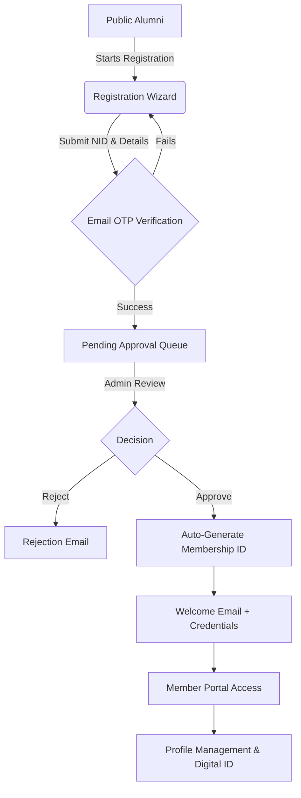
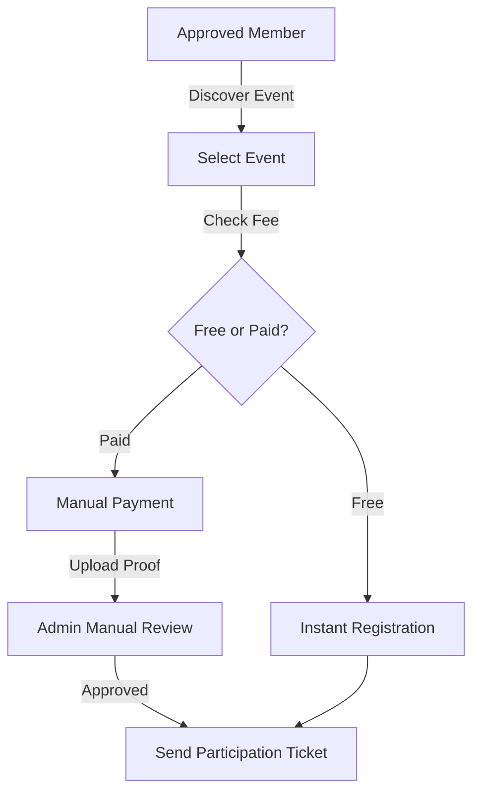
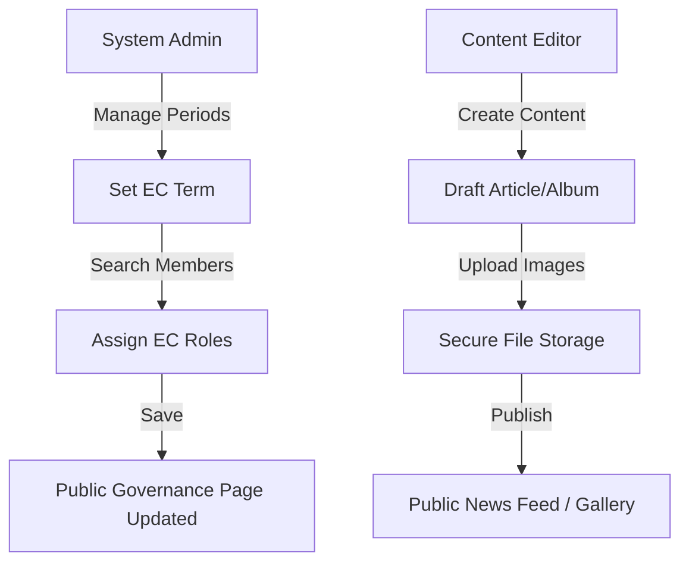
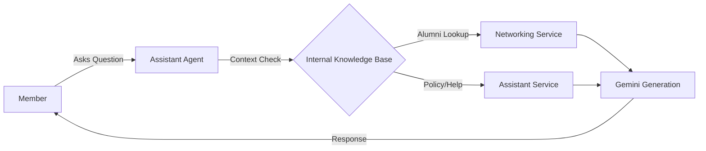

# GHCAA Alumni Association Platform

A comprehensive digital ecosystem for the Govt. Haraganga College Alumni Association (GHCAA), connecting alumni through secure membership, an intelligent directory, event participation, and transparent financial governance. The platform spans a REST API, an Angular web application, and a Flutter mobile app sharing a single backend.

## Documentation

| Document | Purpose |
| --- | --- |
| [Software Requirements Specification](docs/SRS.md) | Full functional and non-functional specification |
| [Feature Catalog](docs/FEATURES.md) | Module-by-module features with screens, endpoints, and rules |
| [Architecture & Data Flow](docs/architecture_data_flow.md) | System diagrams and data-flow blueprints |
| [Payment Workflow](docs/PAYMENT_GATEWAY_WORKFLOW.md) | Manual and gateway payment handling |
| [Config-Driven Framework](docs/CONFIG_DRIVEN_FRAMEWORK.md) | Runtime organization configuration model |
| [Render Deployment](docs/RENDER_DEPLOYMENT.md) | Combined API + web deployment guide |

---

## Technology Stack

| Layer | Technology |
| --- | --- |
| Backend | ASP.NET Core 9.0 (Clean Architecture), Entity Framework Core |
| Web frontend | Angular 21 (standalone components, signals), SCSS design system |
| Mobile | Flutter (`GHCAA.Mobile`) |
| Database | PostgreSQL (production), SQLite (local development) |
| Real-time | SignalR (chat, notifications) |
| AI assistant | Google Gemini (optional; disabled cleanly when no key is set) |
| Security | JWT (stateless), BCrypt password hashing, role-based access control |
| Reporting | ClosedXML (Excel), QuestPDF (PDF ID cards and receipts) |
| DevOps | Docker (multi-stage), GitHub Actions, PowerShell automation |

The API and Angular app are designed to run as a single combined service in production (the API serves the built SPA from `wwwroot`) or as separate origins during local development (`dotnet run` + `ng serve`).

---

## Core Modules

### Membership & Identity
- Multi-step registration wizard capturing personal, academic, and professional data, with logic that verifies institutional affiliation.
- Approval workflow: applicants start as "Applied"; administrators review documents; approval auto-generates a unique membership number used as the login ID.
- Profile control with granular privacy toggles (mask NID, phone, email, address) enforced on every directory and networking response.
- Digital ID card generation (PDF/SVG) with a scannable QR code, unlocked once a member is Active.

### Events & Participation
- Event catalog and registration hub with capacity caps and automatic waitlist handling.
- QR-based attendance: coordinators scan a member's digital ID at the venue to mark attendance.

### Financial Management
- Manual, admin-configurable payment model (see [Payments](#payments) below): members upload proof of payment and administrators review and approve.
- Immutable ledger of income and expenses, with annual membership-due generation and tracking.
- Auto-generated PDF receipts for recognized contributions.

### Networking & Community
- Infinite-scroll alumni directory with batch, department, and professional-domain filtering, governed strictly by privacy toggles.
- Job and mentorship hub for sharing and discovering opportunities.
- Peer-to-peer real-time messaging that never exposes private contact information.
- Gemini-powered assistant and an administrator communication hub for segmented bulk email.

### Governance & Administration
- Executive Committee management: terms, role assignment, and historical governance records with overlap and exclusivity rules.
- Bulk member import/export via Excel for legacy-record migration.
- Content management for news, media galleries, and special-day themes.

For the complete, structured breakdown of every feature, role, screen, endpoint, and validation rule, see the [Feature Catalog](docs/FEATURES.md); for the formal specification, see the [Software Requirements Specification](docs/SRS.md).

---

## Payments

The platform operates without live payment-gateway credentials. All payment methods are administrator-configurable and function manually:

- Administrators configure wallet, bank, and mobile-financial-service (bKash / Nagad / bank transfer) instructions from the admin panel.
- Members pay through the displayed channel and upload proof of payment.
- Administrators verify the amount and approve the corresponding membership, due, or event registration.

Automated gateway callback handling exists in the codebase and can be enabled later by supplying gateway keys, but no gateway integration is required for the platform to operate.

---

## System Workflows

### Membership Lifecycle



### Event Registration & Payment



### Governance & Content



### Assistant Interaction



---

## Architecture

The platform follows Clean Architecture (Onion) principles so business logic stays independent of frameworks and databases.

- **Domain** (`GHCAA.Domain`) — pure C# entities (`Member`, `User`, `AlumniEvent`), enums, and shared constants; no external dependencies.
- **Application** (`GHCAA.Application`) — service interfaces (`IMemberService`, `IAuthService`) and DTOs defining the business contracts.
- **Infrastructure** (`GHCAA.Infrastructure`) — EF Core persistence (multi-provider: PostgreSQL and SQLite), file storage, email/OTP, and service implementations.
- **API** (`GHCAA.API`) — ASP.NET Core controllers, middleware (security headers, rate limiting, exception handling), and JWT authentication.
- **Web** (`GHCAA.Web`) — Angular 21 single-page application with a modular, signal-based reactive architecture.

Cross-cutting guarantees:

- **Soft-delete integrity** — global EF Core query filters automatically hide `IsArchived` records from every standard query, preventing orphaned "ghost data". Records are archived, never hard-deleted.
- **Strict deduplication** — unique indexes on NID, mobile number, and email; inputs are sanitized before validation.
- **Stateless security** — JWT authentication with BCrypt-hashed passwords and granular role-based access control (Public, Member, Admin, SuperAdmin).
- **Resilient frontend** — HTTP interceptors handle authentication, 401 redirects, and partial API failures gracefully.

---

## Project Structure

```
GHCAA/
├── GHCAA.API/             # REST API controllers and web host
├── GHCAA.Application/     # Service interfaces and DTOs
├── GHCAA.Domain/          # Core entities, enums, and constants
├── GHCAA.Infrastructure/  # DbContext, EF configurations, and services
├── GHCAA.Web/             # Angular single-page application
├── GHCAA.Mobile/          # Flutter mobile application
├── GHCAA.Tests/           # xUnit unit and integration test suites
├── GHCAA.Export/          # Excel/CSV generation utilities
├── GHCAA.Tools/           # Local run/stop/config PowerShell helpers
├── docs/                  # Specification and reference documentation
├── .github/workflows/     # CI/CD (GitHub Actions)
└── Dockerfile             # Multi-stage production build (API + web)
```

---

## Getting Started

### Prerequisites

- [.NET 9 SDK](https://dotnet.microsoft.com/download/dotnet/9.0)
- [Node.js 22+](https://nodejs.org/) (required by Angular 21)
- [PostgreSQL 16+](https://www.postgresql.org/) for production-like runs (local development defaults to SQLite)

### Database Setup

The schema is created automatically at application startup via EF Core `EnsureCreated()` — there is no manual migration step to run for a first boot. On an empty database the full schema and seed data are created in one pass; on an existing database it is a no-op.

- Local development uses a SQLite file out of the box; no external database is required.
- For PostgreSQL, provide a connection string (see [Configuration](#configuration)); the same `EnsureCreated` path builds the schema on first boot.

### Running the Application

Automated (Windows / PowerShell):

```powershell
./GHCAA.Tools/run-app.ps1
```

Use `-NoWeb` or `-NoMobile` to skip a frontend. Stop and free ports with `./GHCAA.Tools/stop-app.ps1`.

Manual:

- Backend: `cd GHCAA.API && dotnet run`
- Web: `cd GHCAA.Web && npm install && npm start`

---

## Configuration

Do not commit real passwords, API keys, or production connection strings. Base settings live in [`GHCAA.API/appsettings.json`](GHCAA.API/appsettings.json) with placeholders.

### Required values

| Key | Purpose |
| --- | --- |
| `Jwt__Key` | JWT signing secret, 32+ characters. Required outside Development — the API fails fast on boot if it is unset. |
| `ConnectionStrings__PgSqlConnection` or `DATABASE_URL` | PostgreSQL connection (a `postgres://...` URL is parsed automatically). |
| `GmailSettings__Email` / `GmailSettings__AppPassword` | SMTP credentials for OTP, approval, and notification email. |
| `Gemini__ApiKey` | Optional; enables the AI assistant. The assistant degrades gracefully when absent. |
| `AppSettings__AllowedOrigins__0` | Browser origins permitted by CORS. |
| `DataProtection__KeyRingPath` | Persistent path for Data Protection keys (mount a volume in containers so auth cookies survive restarts). |

### Local development options

1. **`.env` file** — copy [`GHCAA.API/.env.example`](GHCAA.API/.env.example) to `GHCAA.API/.env` (loaded by `DotNetEnv` at startup). Run the API with the working directory set to `GHCAA.API` so the file is found.
2. **.NET User Secrets** — already wired via `UserSecretsId`:
   ```bash
   cd GHCAA.API
   dotnet user-secrets set "Jwt:Key" "YOUR_SECRET_AT_LEAST_32_CHARACTERS_LONG"
   dotnet user-secrets set "ConnectionStrings:PgSqlConnection" "Host=...;Database=...;Username=...;Password=...;SslMode=Prefer"
   dotnet user-secrets set "GmailSettings:Email" "you@example.com"
   dotnet user-secrets set "GmailSettings:AppPassword" "your-app-password"
   ```

### Production / hosted

Set the values above as environment variables in the host (Render, Docker, etc.). On each release that changes host URLs, add every browser origin (scheme + host + port) to `AppSettings:AllowedOrigins`, and confirm SignalR clients (`/hubs/chat`) use an allowed origin over HTTPS.

---

## Testing & Quality

- **Unit tests** (`GHCAA.Tests`) — business logic for member approval, membership-number generation, and financial calculations, with Moq-isolated services.
- **Integration tests** — in-memory/SQLite database tests verifying EF Core query filters, unique constraints, and seed compatibility.
- **Web tests** — headless Angular unit tests via Vitest.
- **Mobile tests** — Flutter widget and unit tests, including golden (visual) tests.

The project targets over 85% coverage on core business services. Run the backend suite with `dotnet test`.

### Continuous Integration

A sequential GitHub Actions pipeline enforces quality in order:

1. **Static analysis** — linting and type-checking for C#, TypeScript, and Dart.
2. **Backend validation** — `dotnet test` against an in-memory SQLite mirror.
3. **Web validation** — Vitest headless UI suite.
4. **Mobile validation** — `flutter test`.
5. **Integrated build** — packages the API and web SPA into a single deployment-ready artifact.

Merges to protected branches require these checks to pass.

---

## Design System

The interface uses a dark-first "Obsidian & Gold" aesthetic built on a SCSS custom-property design system. Colors, surfaces, and text are driven by semantic CSS variables that flip between fully-styled light and dark themes, so both modes remain readable throughout the application. Layouts favor glassmorphic panels, subtle micro-animations, and fast rendering of large data lists.
