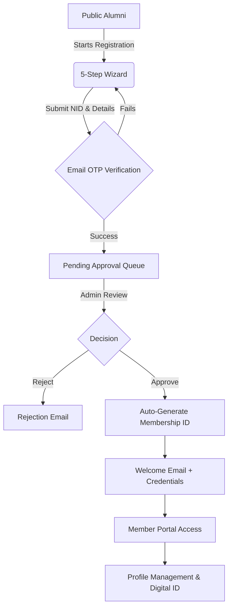
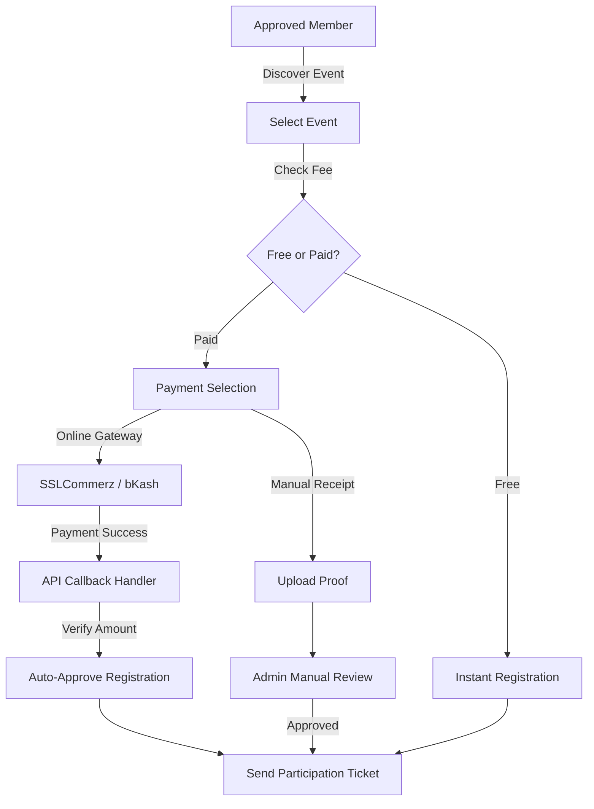
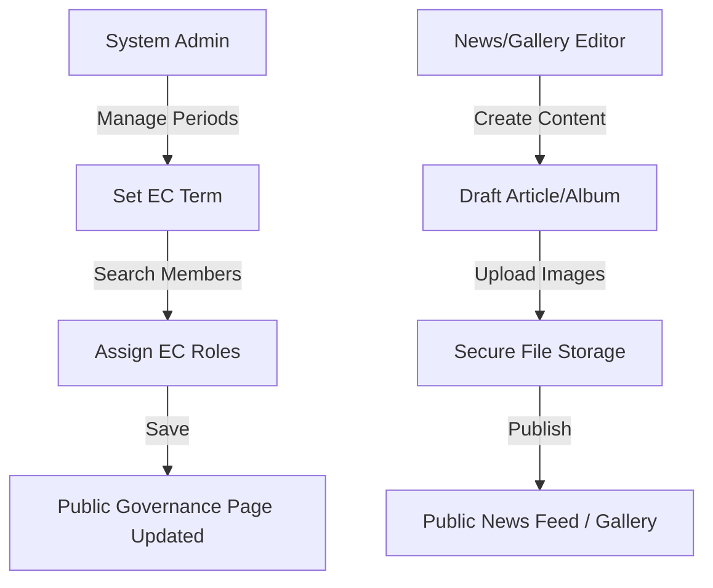
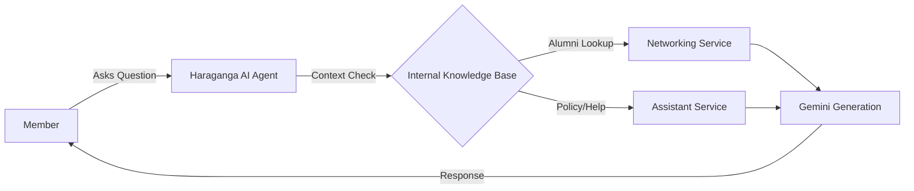

# GHCAA - Govt. Haraganga College# GHCAA Alumni Association Platform

Welcome to the GHCAA Platform. This project is a comprehensive digital ecosystem designed to connect Haraganga College Alumni through secure membership, intelligent search, and integrated financial governance.

> [!IMPORTANT]
> This document and the associated **[Software Requirements Specification (SRS)](file:///c:/Users/HabiburRahmanShalin/.gemini/antigravity/brain/bce7f8da-1836-4cec-9dcf-8854cca6d702/srs_document.md)** serve as the definitive technical handover for the development team.

---

## 🚀 Core Technology Stack
- **Backend**: ASP.NET Core 8.0 (Clean Architecture).
- **Frontend**: Angular 17+ (PrimeNG, Vanilla CSS).
- **Search & AI**: Google Gemini AI, SignalR.
- **Database**: PostgreSQL (Entity Framework Core).

---

## 📋 Functional Requirements (FR) Framework
*This project follows a professional technical framework. Detailed field-level constraints and state logic are documented in the **[Formal SRS](file:///c:/Users/HabiburRahmanShalin/.gemini/antigravity/brain/bce7f8da-1836-4cec-9dcf-8854cca6d702/srs_document.md)**.*

### 1. Identity & Profile Lifecycle
- **Multi-Step Registration**: Structured data sections for Personal, Academic, and Professional info.
- **Affiliation Logic**: Strict separation of HSC vs GHC Admission years to track students specifically joining GHC for Higher Ed.
- **Workflow State**: **Applied** → **Active** (Post-Admin Approval with Auto-ID generation) → **Archived**.
- **Login Auth**: Seamless transition where **Membership Number** becomes the primary **Login ID** post-approval.

### 2. Events & Networking
- **Intelligent Activity Feed**: Real-time tracking of member engagement and profile updates.
- **Targeted Directory**: Infinite-scroll search filtered by Batch, Profession, and Blood Group.
- **Professional Job Hub**: Alumni-exclusive board for jobs and career mentorship.
- **P2P Messaging**: Secure, SignalR-powered direct messaging with unread tracking.

### 3. Financial & Admin Governance
- **Dynamic Ledger**: Tracking Income/Expenses with categorized financial entries.
- **Annual Dues Engine**: Automated notification and fee generation for active members.
- **Communication Center**: Bulk Email/SMS engine targeting by Batch or Membership Type.
- **Audit Logging**: Comprehensive trace of all administrative "Approve/Reject/Archive" actions.

---

## 🛡️ Non-Functional Requirements (NFR)
Specifically tuned for performance and institutional integrity:

- **Security**: BCrypt password encryption, JWT stateless auth, and global NID/Email deduplication.
- **Performance**: Server-side image optimization (350KB target quality) and quick-load directory queries.
- **Privacy**: Granular field-level visibility controls (Masking Mobile/Address/NID).
- **Resilience**: "Silent load" frontend interceptors to handle partial API failures gracefully.

---

## 🛠️ Development Handover Checklist
Outgoing developers should ensure the following are transferred:
- [ ] **SSLCommerz/bKash Keys**: Sandbox and Production credentials.
- [ ] **Gemini API Key**: For the Haraganga AI Assistant.
- [ ] **SMTP Credentials**: Gmail app password for system notifications.
- [ ] **CORS Configuration**: Update `appsettings.json` with new frontend URLs.
- [ ] **NND (New Node Deployment)**: Ensure the database-on-startup migration scripts are intact.

## 💻 Powered By

| **Backend**        | .NET 9 (Web API), Entity Framework Core                                          |
| **Database**       | PostgreSQL 16+ (Dockerized in Prod)                                             |
| **Frontend**       | Angular 18 (Signals, Standalone Components)                                    |
| **Styling**        | Vanilla SCSS (Custom Design System), Glassmorphism                             |
| **Security**       | JWT, BCrypt.Net-Next, ASP.NET Core Identity (Custom Implementation)             |
| **DevOps**         | Docker, GitHub Actions, PowerShell Automation                                   |
| **Reporting**      | ClosedXML (Excel Integration)                                                   |
| **Payment**        | SSLCommerz, Nagad (Integration Ready)                                           |

## 🗺️ System Workflows & User Journeys

The following diagrams visualize the core operational flows of the GHCAA platform in detail.

### 1. Membership Lifecycle (Onboarding)



### 2. Event Registration & Automated Payment



### 3. Governance & Administrative Flow



### 4. AI Assistant Interaction



---

## 🏛️ Comprehensive Feature List (SRS/FR)

The following provides a full, structured breakdown of system features, user roles, and functional dependencies.

### 1. Membership & Identity Management

#### 1.1 Automated Member Registration
- **Business Description**: Allows alumni to apply for association membership through a guided, multi-step process.
- **User Roles**: Public (Alumni).
- **Inputs/Outputs**: 
    - **Screen**: `/register` (5-step wizard).
    - **API**: `POST /api/auth/register`, `GET /api/auth/status/:id`.
    - **Key Fields**: Full Name, NID (Cleaned), Mobile, Batch, Degree, Email (OTP Verified).
- **Validations & Rules**:
    - **Duplicate Prevention**: Global check for uniqueness of NID, Email, and Mobile No.
    - **Academic Prerequisite**: At least one academic record must be from "Govt. Haraganga College".
    - **Digital Sanitization**: Automatic removal of spaces/formatting from NID and Mobile strings.
- **Dependencies**: Email Service (OTP), ID Card Service (Metadata).

#### 1.2 Secure Authentication & Authorization
- **Business Description**: Provides secure access to the portal based on identity and role.
- **User Roles**: Public, Member, Admin, SuperAdmin.
- **Inputs/Outputs**: 
    - **Screen**: `/login`, `/verify-email`.
    - **API**: `POST /api/auth/login`, `POST /api/auth/verify-email`.
    - **Key Fields**: NID/Mobile/Email as Identifier, Password (BCrypt hashed), OTP Code.
- **Validations & Rules**:
    - **Verification Requirement**: Email must be OTP-verified before login is permitted.
    - **Role-Based Access**: Granular JWT claims for Member vs Admin vs SuperAdmin.
- **Dependencies**: JWT Token Service.

#### 1.3 Personal Profile & Privacy Control
- **Business Description**: Members can manage their personal, academic, and professional information with granular privacy toggles.
- **User Roles**: Member.
- **Inputs/Outputs**: 
    - **Screen**: `/portal/profile`.
    - **API**: `GET /api/profile`, `PUT /api/profile/update`.
    - **Key Fields**: Privacy Toggles (Mask NID, Email, Mobile, Address).
- **Validations & Rules**:
    - **PII Masking**: Sensitive fields are automatically masked for other members unless the 'Public' toggle is active.
- **Dependencies**: Profile Controller, Infrastructure Services.

#### 1.4 Digital ID Card Generation
- **Business Description**: Automatically generates a secure, downloadable digital ID card for verified members.
- **User Roles**: Approved Member.
- **Inputs/Outputs**: 
    - **Screen**: `/portal/id-card`.
    - **API**: `GET /api/idcard/generate`.
    - **Key Fields**: QR Code, Membership ID.
- **Validations & Rules**:
    - **Eligibility**: Card generation is locked until the `Active` status is achieved.
    - **Format**: Sequential 4-digit serials (e.g., GHC-2015-0001).
- **Dependencies**: ID Card Generation Service.

### 2. Events & Participation

#### 2.1 Event Listings & Catalog
- **Business Description**: A centralized hub for discovering upcoming and past alumni events.
- **User Roles**: Public, Member.
- **Inputs/Outputs**: 
    - **Screen**: `/events`.
    - **API**: `GET /api/events`.
- **Dependencies**: Events Service.

#### 2.2 Intelligent Event Registration
- **Business Description**: Allows members and guests to register for events with integrated payment tracking.
- **User Roles**: Member, Guest (if allowed).
- **Inputs/Outputs**: 
    - **Screen**: `/events/:id`.
    - **API**: `POST /api/events/register`.
    - **Key Fields**: Payment Reference, Receipt Upload, Contribution Amount.
- **Validations & Rules**:
    - **Lifecycle**: Registration permitted only for active events before the deadline.
    - **Deduplication**: Prevents multiple registrations per user/guest for the same event.
    - **Member Enforcement**: Guest entry restricted by the event's `AllowNonMembers` policy.
- **Dependencies**: Financial Service, File Storage (Receipts).

#### 2.3 Event Management (Admin)
- **Business Description**: CRUD operations for events, including registration capping and deadline management.
- **User Roles**: Admin, SuperAdmin.
- **Inputs/Outputs**: 
    - **Screen**: `/admin/events`.
    - **API**: `POST /api/events/create`, `PUT /api/events/update`.
- **Dependencies**: Admin Controller.

### 3. Financial Management & Payments

#### 3.1 Automated Payment Gateways
- **Business Description**: Secure online payment integration for subscriptions and event fees.
- **User Roles**: Member, Admin.
- **Inputs/Outputs**: 
    - **API**: `POST /api/gateways/initiate`, `POST /api/gateways/callback`.
    - **Gateways**: SSLCommerz, bKash (Ready).
- **Validations & Rules**:
    - **Verification**: Callback amount must exactly match the expected fee/due.
    - **Auto-Update**: Successful payment triggers automatic registration/due status updates.
- **Dependencies**: SSLCommerz SDK, Financial Service.

#### 3.2 Financial Ledger & Audit
- **Business Description**: Tracking all income and expenses of the association with categorized ledger entries.
- **User Roles**: Admin (Finance), SuperAdmin.
- **Inputs/Outputs**: 
    - **Screen**: `/admin/ledger`.
    - **API**: `GET /api/financialledger`.
- **Dependencies**: Financial Ledger Controller.

#### 3.3 Payment Configuration (Admin)
- **Business Description**: Managing gateway keys, transaction limits, and automated service charges.
- **User Roles**: SuperAdmin.
- **Inputs/Outputs**: 
    - **Screen**: `/admin/payments`.
    - **API**: `GET /api/finance/configs`, `POST /api/finance/configs`.
- **Validations & Rules**:
    - **Temporal Logic**: Fees applied based on the most recent `EffectiveDate` relative to the billing year.
- **Dependencies**: Payment Config Controller.

### 4. Networking & Social Features

#### 4.1 Alumni Directory (Search & Networking)
- **Business Description**: High-performance "infinite scroll" directory for finding alumni.
- **User Roles**: Public (Limited), Member (Full).
- **Inputs/Outputs**: 
    - **Screen**: `/directory`.
    - **API**: `GET /api/networking/members`.
    - **Key Fields**: Search Query, Batch Filter, Department Filter.
- **Dependencies**: Networking Service.

#### 4.2 Professional Job Hub
- **Business Description**: Internal portal for sharing and applying for job opportunities within the alumni network.
- **User Roles**: Member.
- **Inputs/Outputs**: 
    - **Screen**: `/portal/jobs`.
    - **API**: `GET /api/jobhub`.
- **Dependencies**: Job Hub Service.

#### 4.3 Direct Peer Messaging
- **Business Description**: Secure communication channel for members to network without exposing private contact data.
- **User Roles**: Member.
- **Inputs/Outputs**: 
    - **Screen**: `/portal/messages`.
    - **API**: `POST /api/messaging/send`.
- **Dependencies**: Real-time Messaging Hub.

### 5. Governance & Operations

#### 5.1 Executive Committee (EC) Management
- **Business Description**: Managing committee periods, roles, and historical records of governance.
- **User Roles**: Admin, SuperAdmin.
- **Inputs/Outputs**: 
    - **Screen**: `/admin/members/ec`.
    - **API**: `POST /api/admingovernance/assign-role`, `POST /api/admingovernance/periods`.
- **Validations & Rules**:
    - **Continuity**: Prevents temporal overlaps between EC periods.
    - **Exclusivity**: President, GS, and Treasurer roles are unique per term.
    - **Eligibility**: Restricted to 'Active' status members only.
- **Dependencies**: Governance Service.

#### 5.2 Bulk Member Import
- **Business Description**: Excel-to-Database bridging for migrating legacy records.
- **User Roles**: SuperAdmin.
- **Inputs/Outputs**: 
    - **Screen**: `/admin/members` (Import Modal).
    - **API**: `POST /api/memberimport/upload`.
- **Validations & Rules**:
    - **Deduplication**: Automatic NID/Email collision detection with graceful auto-suffixing to prevent failures.
    - **Provisioning**: Transparent creation of User accounts with NID-based credentials during import.
- **Dependencies**: ClosedXML Service.

### 6. Intelligent Assistant (AI)

#### 6.1 Haraganga AI Assistant
- **Business Description**: A Gemini-powered AI helping members find information and alumni through natural language.
- **User Roles**: Member.
- **Inputs/Outputs**: 
    - **Screen**: `/portal/assistant`.
    - **API**: `POST /api/assistant/ask`.
- **Validations & Rules**:
    - **NLP Intent**: Automatically parses natural language for years, sectors, and help topics.
- **Dependencies**: Google Gemini API, Assistant Service.

#### 6.2 Intelligent Support Chat
- **Business Description**: Real-time support for common queries and system navigation.
- **User Roles**: Public, Member.
- **Inputs/Outputs**: 
    - **Screen**: Floating Chat Widget.
    - **API**: `POST /api/chat/message`.
- **Dependencies**: Chat Service.

### 7. Global Content Management (CMS)

#### 7.1 News & Press Releases
- **Business Description**: Publishing and managing association news with image support.
- **User Roles**: Public (Read), Admin (CRUD).
- **Inputs/Outputs**: 
    - **Screen**: `/news`.
    - **API**: `POST /api/news`.
- **Dependencies**: News Service.

#### 7.2 Media Gallery & Albums
- **Business Description**: Visual records of association history categorized by events.
- **User Roles**: Public (Read), Admin (CRUD).
- **Inputs/Outputs**: 
    - **Screen**: `/gallery`.
    - **API**: `POST /api/gallery`.
- **Dependencies**: Gallery Service, File Storage.

#### 7.3 Theme Management (Special Days)
- **Business Description**: Dynamic UI transformation for special occasions (e.g., Independence Day).
- **User Roles**: Admin.
- **Inputs/Outputs**: 
    - **Screen**: `/admin/themes`.
    - **API**: `POST /api/theme/activate`.
- **Dependencies**: Theme Service.

---

## ⛩️ Portal Architecture & Scopes

The platform is divided into three distinct operational scopes, each tailored for specific user interactions.

### 🌐 1. Public Portal (The Front Gate)
*Open access for alumni and the general public.*
- **🏛️ Intelligent Landing Hub**: Royal "Midnight Gold" aesthetic with Dynamic Sections (Purpose, Symbolism, and EC Highlights).
- **📊 Real-time Stats Counter**: Live counters for total Registered Members, Batches represented, and Association Events.
- **📝 Automated Onboarding**: High-integrity 5-step registration wizard with:
  - **NID Sanitization**: Automatic space removal and duplicate checking.
  - **OTP Security**: Email-based verification before submission.
  - **Academic Validation**: Specific logic to ensure at least one GHC record exists.
- **🔍 Public Alumni Directory**: High-performance "Infinite Scroll" member list with Batch and Professional filtering.
- **📰 Press & Updates**: Real-time news feed and event calendar with archival support.

### 👤 2. Member Portal (The Alumni Hub)
*Secured area for approved alumni using NID-based credentials.*
- **📊 Personal Dashboard**: Visual overview of membership status and recent association activities.
- **🤖 Haraganga AI Assistant**: Natural Language (NLP) search bot helping members find alumni by batch, sector, or professional background.
- **🛠️ Self-Service Profile**:
  - **Dynamic Privacy**: Granular toggles to hide/show contact info (Mobile/Email/Address).
  - **History Management**: Self-updateable Academic and Professional records with document re-upload capabilities.
- **💬 Networking Engine**: 
  - **Peer Chat**: Secure messaging between members without exposing private contact data.
  - **Career Hub**: Access to Job Opportunities shared within the network.
- **💰 Financial Transparency**: 
  - Real-time tracking of Membership Dues and Payment History.
  - Manual payment proof upload for life membership upgrades.
- **🎟️ Event Participation**: Managed registration for alumni-only events with payment integration.

### ⚖️ 3. Admin Command Center (Governance & Management)
*High-privilege portal for the Executive Committee and System Admins.*
- **📈 Global Analytics**: Real-time dashboard with metrics on membership growth, financial balance, and pending workflows.
- **👨‍💼 Membership Governance**: 
  - **Side-by-Side Review**: Approval/Rejection interface with document verification.
  - **Auto-Account Creation**: Approval triggers NID-based credential generation and email dispatch.
  - **Data Retention**: Soft-delete "Archive" system with one-click restoration.
- **📂 Management Suites**:
  - **EC Management**: Track Governance periods, positions, and committee transitions.
  - **📧 Communication Hub**: Mass-messaging engine with HTML templates, batch-targeting (Passing Year), and custom email campaigns.
  - **🖼️ Media Gallery CMS**: Managed photo galleries with featured image support and event-linking.
  - **Payment Config**: UI to manage bKash/Nagad/Bank instructions and gateway settings.
- **⚡ Advanced Power Tools**:
  - **Bulk Import**: Excel-to-Database bridging with complex column mapping.
  - **Premium Export**: Automated Excel reports with formatted data labels (Blood Groups, Categories).
  - **Admin Search**: High-speed lookup using Member IDs or NIDs.

---

## 🏗️ System Architecture & Security
**Enterprise-Grade Stability**
- **FR 5.1: Soft-Delete Integrity**
  - Implementation of **Global Query Filters** across the entire database. Archiving a member automatically "hides" all related history, academic records, and communications to prevent orphans.
- **FR 5.2: Role-Based Access (RBAC)**
  - Granular permissions for SuperAdmin, Admin, Member, and Guest roles.
- **FR 5.3: Authentication Model**
  - **BCrypt** password hashing with salt-per-member security.
  - **JWT (JSON Web Tokens)** for secure, stateless session management.

## 🏗️ Developer Experience & Infrastructure

To ensure rapid development and system reliability, the project includes several specialized dev-features:

### 1. Automated Data Seeding & Transformation
- **Self-Healing Seeds**: JSON-based seed data (`members.json`, `users.json`) that can be automatically synchronized with the database during migration or startup.
- **Credential Transformation Utilities**: Custom C# scripts to batch-update existing member data (e.g., transforming legacy usernames into NID-based credentials with BCrypt hashing).

### 2. Technical Infrastructure
- **Global Data Persistence**: 
  - Centralized **soft-delete architecture** using EF Core query filters. Developers don't need to manually check `IsArchived` in every query; the system handles it at the model level.
- **Clean Architecture Implementation**:
  - Clear separation of concerns between **Domain Models**, **Application DTOs**, and **Infrastructure Services**.
- **Modern Styling System**:
  - A comprehensive **SCSS Design System** with CSS variables for colors, spacing, and glassmorphism tokens, allowing for instant global UI changes.

### 3. API & Tooling
- **Swagger/OpenAPI Integration**: Auto-generated interactive API documentation for testing and integration.
- **Member Import Utility**: Dynamic Excel-to-Database bridging service with column mapping and auto-generation of missing data for legacy records.
- **File Storage Abstraction**: Pluggable storage service for handling photos and certificates, currently supporting Local Storage with an interface for Cloud (S3/Azure) expansion.

---

## 📂 Project Structure

```bash
GHCAA/
├── GHCAA.API/             # REST API Controllers & Web Host
├── GHCAA.Application/     # Logic Contracts (Interfaces) & Data Transfer Objects (DTOs)
├── GHCAA.Domain/          # Core Entities, Enums, and Shared Constants
├── GHCAA.Infrastructure/  # DB Context, Migrations, Repositories, and Services
├── GHCAA.Web/             # Angular SPA (Frontend)
├── GHCAA.Tests/           # XUnit & Integration Test Suites
├── GHCAA.Export/          # Excel/CSV Generation Utilities
├── .github/workflows/    # CI/CD (GitHub Actions)
├── Dockerfile            # Production Orchestration
└── run-app.ps1           # Developer Bootstrapper
```

---

## 🏗️ Technical Architecture

The platform is built using **Clean Architecture** (Onion Architecture) principles, ensuring that the business logic is independent of external frameworks and databases.

### Layered Structure
- **Core (Domain)**: Pure C# project containing Entities (`Member`, `User`, `AlumniEvent`), Enums, and Core Constants. No external dependencies.
- **Application**: Defines interfaces (`IMemberService`, `IAuthService`) and Data Transfer Objects (DTOs). Contains the contract for the business logic.
- **Infrastructure**: Implementation of persistent storage (PostgreSQL via Entity Framework Core), File Storage (Local/Cloud), and external services (Email, OTP).
- **API (Web)**: ASP.NET Core RESTful controllers, Middleware (Rate Limiting, Exception Handling), and JWT Authentication.
- **Web (Frontend)**: Angular 18 Single Page Application (SPA) with a modular architecture and reactive state management.

### Data Flow & Persistence
- **Repository Pattern**: Centralized data access logic.
- **Global Filters**: Every database query is automatically intercepted to filter out `IsArchived` records, providing safety against "Ghost Data".
- **Database**: PostgreSQL with complex unique indexing on NID, Mobile, and Email to ensure zero-duplicate integrity.

---

## 🧪 Testing & Quality Assurance

The project maintains a rigorous quality standard organized into three distinct layers:

### 1. Unit Testing (`GHCAA.Tests`)
- **Business Logic**: Comprehensive tests for Member Approval, Membership Number Generation, and Financial calculations.
- **Service Mocking**: Utilization of Moq to isolate services and ensure deterministic test results.

### 2. Integration Testing
- **Persistence Testing**: In-memory database tests to verify that complex EF Core Query Filters and Unique Constraints are working as expected.
- **Schema Validation**: Automated migration testing to ensure seed data (`users.json`, `members.json`) remains compatible with the current schema.

### 3. API & UI Validation
- **Swagger UI**: Interactive playground for manual API verification.
- **Frontend Interceptors**: Automated error handling and token injection validation on the Angular side.

---

## 🚀 Deployment & Operations

### Containerization & CI/CD
- **Dockerized Environment**: Multi-stage `Dockerfile` for streamlined production builds and environment consistency.
- **CI/CD Pipeline**: 
  - **GitHub Actions**: Automated build, test, and linting on every push.
  - **PowerShell Automation**: `CI-Deploy.ps1` script for automated deployment workflows.
- **Environment Management**: `.env` and `appsettings.json` driven configuration for local, staging, and production secrecy.

### System Management
- **Process Control**: Dedicated `run-app.ps1` and `stop-app.ps1` scripts for managing local/server environments.
- **Logging**: Integrated `ILogger` with tiered severity levels (Information, Warning, Error) for real-time monitoring.
- **Database Maintenance**: SQL utilities included for periodic cleanup (`delete_imported_members.sql`) and password resetting (`reset_superadmin_password.sql`).

---

## 🛠️ Getting Started

### 1. Prerequisites
- [.NET 9 SDK](https://dotnet.microsoft.com/download/dotnet/9.0)
- [Node.js v20+](https://nodejs.org/)
- [PostgreSQL 16+](https://www.postgresql.org/)

### 2. Database Setup
1. Create a database named `GHCAA_DB`.
2. Update the connection string in `GHCAA.API/appsettings.json`.
3. Apply migrations:
   ```bash
   dotnet ef database update --project GHCAA.Infrastructure --startup-project GHCAA.API
   ```

### 3. Running the Application
**Option A: Automated (Win/PowerShell)**
```powershell
./run-app.ps1
```

**Option B: Manual**
- **Backend**: `cd GHCAA.API && dotnet run`
- **Frontend**: `cd GHCAA.Web && npm install && npm start`

---

## 🧪 Testing Coverage
The repository targets **>85% code coverage** on core business services.
- Run all tests: `dotnet test`
- View results: `test_results.txt` (generated automatically in CI)

---

## 🎨 Design Philosophy: "Midnight Gold"
The application adheres to a premium aesthetic designed to evoke prestige and legacy:
- **Visuals**: Dark mode base with royal gold highlights and glassmorphic panels.
- **Micro-animations**: Subtle hover transitions and container entry animations.
- **Performance**: Optimized for fast LCP (Largest Contentful Paint) and smooth rendering of large data lists.
