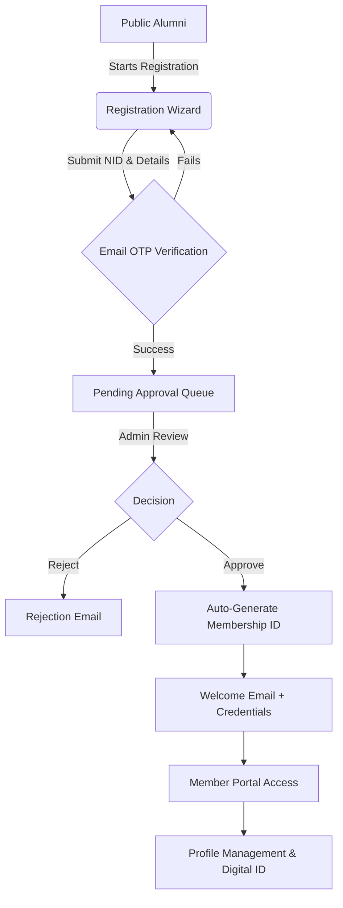
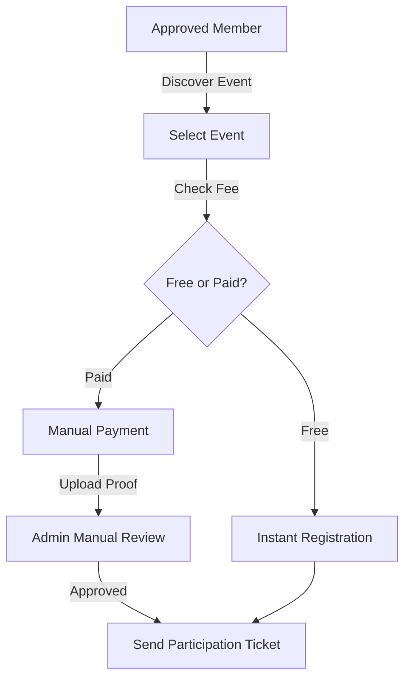
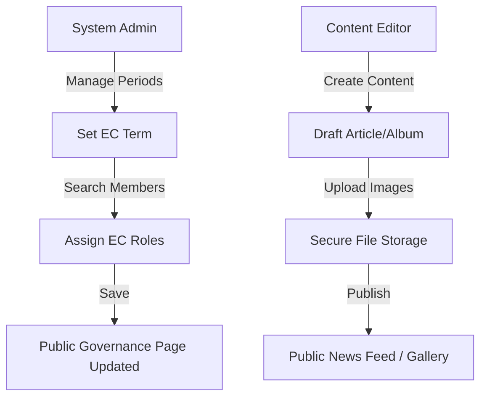
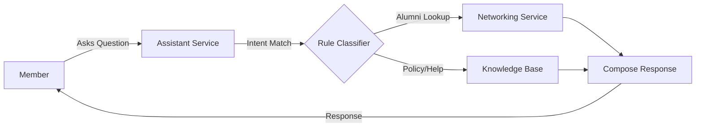

# GHCAA Alumni Association Platform

A digital platform for the Govt. Haraganga College Alumni Association (GHCAA), connecting alumni through secure membership, a searchable directory, event participation, and transparent financial governance. It spans a REST API, an Angular web application, and a Flutter mobile app sharing a single backend.

## Documentation

| Document | Purpose |
| --- | --- |
| [Software Requirements Specification](docs/SRS.md) | Full functional and non-functional specification |
| [Feature Catalog](docs/FEATURES.md) | Module-by-module features with screens, endpoints, and rules |
| [Architecture & Data Flow](docs/architecture_data_flow.md) | System diagrams and data-flow blueprints |
| [Payment Workflow](docs/PAYMENT_GATEWAY_WORKFLOW.md) | Manual and gateway payment handling |
| [Config-Driven Framework](docs/CONFIG_DRIVEN_FRAMEWORK.md) | Runtime organization configuration model |
| [Render Deployment](docs/RENDER_DEPLOYMENT.md) | Combined API + web deployment guide |
| [Task Backlog](docs/TODO.md) | Delivered and planned work, tracked by area |
| [Execution Plans](docs/PLAN.md) | Phased implementation plans |

---

## Technology Stack

| Layer | Technology |
| --- | --- |
| Backend | ASP.NET Core 9.0 (Clean Architecture), Entity Framework Core |
| Web frontend | Angular 21 (standalone components, signals), SCSS design system |
| Mobile | Flutter (Riverpod state management, go_router, Dio HTTP) |
| Database | PostgreSQL (production), SQLite (local development) |
| Real-time | SignalR (chat, notifications) |
| In-app assistant | Rule-based intent/keyword matching over internal data (no external LLM dependency) |
| Security | JWT (stateless), BCrypt password hashing, role-based access control |
| Reporting | ClosedXML (Excel), QuestPDF (PDF ID cards and receipts) |
| DevOps | Docker (multi-stage), GitHub Actions, PowerShell automation |

The API and Angular app are designed to run as a single combined service in production (the API serves the built SPA from `wwwroot`) or as separate origins during local development (`dotnet run` + `ng serve`).

---

## Core Modules

### Membership & Identity
- Multi-step registration wizard capturing personal, academic, and professional data, with logic that verifies institutional affiliation.
- Approval workflow: applicants start as "Applied"; administrators review documents; approval auto-generates a unique membership number used as the login ID.
- Profile control with granular privacy toggles (mask NID, phone, email, address) enforced on every directory and networking response.
- Digital ID card generation (PDF/SVG) with a scannable QR code, unlocked once a member is Active.

### Events & Participation
- Event catalog and registration hub with capacity caps and automatic waitlist handling.
- QR-based attendance: coordinators scan a member's digital ID at the venue to mark attendance.

### Financial Management
- Manual, admin-configurable payment model (see [Payments](#payments) below): members upload proof of payment and administrators review and approve.
- Immutable ledger of income and expenses, with annual membership-due generation and tracking.
- Auto-generated PDF receipts for recognized contributions.

### Networking & Community
- Infinite-scroll alumni directory with batch, department, and professional-domain filtering, governed strictly by privacy toggles.
- Job and mentorship hub for sharing and discovering opportunities.
- Peer-to-peer real-time messaging that never exposes private contact information.
- A rule-based in-app assistant that answers directory and policy questions from internal data, plus an administrator communication hub for segmented bulk email.

### Governance & Administration
- Executive Committee management: terms, role assignment, and historical governance records with overlap and exclusivity rules.
- Bulk member import/export via Excel for legacy-record migration.
- Content management for news, media galleries, and special-day themes.

For the complete, structured breakdown of every feature, role, screen, endpoint, and validation rule, see the [Feature Catalog](docs/FEATURES.md); for the formal specification, see the [Software Requirements Specification](docs/SRS.md).

---

## Payments

The platform operates without live payment-gateway credentials. All payment methods are administrator-configurable and function manually:

- Administrators configure wallet, bank, and mobile-financial-service (bKash / Nagad / bank transfer) instructions from the admin panel.
- Members pay through the displayed channel and upload proof of payment.
- Administrators verify the amount and approve the corresponding membership, due, or event registration.

Automated gateway callback handling exists in the codebase and can be enabled later by supplying gateway keys, but no gateway integration is required for the platform to operate.

---

## System Workflows

### Membership Lifecycle



### Event Registration & Payment



### Governance & Content



### Assistant Interaction



---

## Architecture

The platform follows Clean Architecture (Onion) principles so business logic stays independent of frameworks and databases. Dependencies point inward only: `Domain` ← `Application` ← `Infrastructure` / `API`.

### Backend (.NET 9)

- **Domain** (`GHCAA.Domain`) — pure C# entities (`Member`, `User`, `AlumniEvent`, ~45 entities), enums, and shared constants; no external dependencies.
- **Application** (`GHCAA.Application`) — service interfaces (`IMemberService`, `IAuthService`), DTOs, FluentValidation validators, and security primitives (JWT key resolution); defines the business contracts.
- **Infrastructure** (`GHCAA.Infrastructure`) — ~37 service implementations, EF Core persistence with a multi-provider `ApplicationDbContext` (PostgreSQL + SQLite), per-entity `IEntityTypeConfiguration` mappings, payment gateways, and integrations (email, OTP, SMS, file storage). Services auto-register by convention.
- **API** (`GHCAA.API`) — ~36 REST controllers, a 7-component middleware pipeline (exception handling, security headers, audit logging, login rate limiting, security-stamp invalidation, XSRF), two SignalR hubs (`ChatHub`, `NotificationHub`), and JWT authentication. Hosts the built Angular SPA from `wwwroot` in production.

### Web frontend (Angular 21)

A standalone-component SPA under `GHCAA.Web/src/app`, organized by access scope: `core/` (services, guards, interceptors), `public/`, `member/`, `admin/`, `common/` (shared UI), and `layouts/`. State is signal-based; a single HTTP interceptor chain handles auth, error notification, and single-flight 401 refresh. Styling is a SCSS custom-property design system (see [Design System](#design-system)).

### Mobile (Flutter)

`GHCAA.Mobile` is a Flutter app using Riverpod for state, `go_router` for navigation, and Dio for HTTP against the same REST API, organized feature-first (~18 feature areas) with SignalR (`signalr_netcore`) for real-time chat and notifications.

### Supporting services

Cross-cutting capabilities live in Infrastructure: transactional email (SMTP), OTP generation/verification, SMS, local file storage with image compression, QuestPDF (PDF ID cards and receipts), and ClosedXML (Excel import/export) — the last two isolated in `GHCAA.Export`.

Cross-cutting guarantees:

- **Soft-delete integrity** — global EF Core query filters automatically hide `IsArchived` records from every standard query, preventing orphaned "ghost data". Records are archived, never hard-deleted.
- **Strict deduplication** — unique indexes on NID, mobile number, and email; inputs are sanitized before validation.
- **Stateless security** — JWT authentication with BCrypt-hashed passwords and granular role-based access control (Public, Member, Admin, SuperAdmin).
- **Resilient frontend** — HTTP interceptors handle authentication, 401 redirects, and partial API failures gracefully.

---

## Design Patterns & Techniques

The patterns below are the ones actually implemented, with their locations. Where a common pattern is deliberately not used, that is noted too.

### Backend (.NET)

| Pattern / technique | How and where it is implemented |
| --- | --- |
| Clean Architecture (Onion) | Four projects with inward-only dependencies: `GHCAA.Domain` → `GHCAA.Application` → `GHCAA.Infrastructure` / `GHCAA.API`. |
| Dependency Injection (per-layer extensions) | Each layer exposes a registration method — [`AddApplication()`](GHCAA.Application/DependencyInjection.cs), [`AddInfrastructure()`](GHCAA.Infrastructure/DependencyInjection.cs), and JWT/auth wiring in [`ServiceExtensions.cs`](GHCAA.API/Extensions/ServiceExtensions.cs). |
| Convention-based service registration | [`AddInfrastructure()`](GHCAA.Infrastructure/DependencyInjection.cs) reflects over the `.Services` namespace and auto-binds each implementation to its `GHCAA.Application.Interfaces` interface, so new services need no manual wiring. |
| Strategy | Payment channels implement a common [`IPaymentGatewayService`](GHCAA.Application/Interfaces/IPaymentGatewayService.cs) with swappable implementations (SSLCommerz, bKash, Nagad, DGePay) in [`GHCAA.Infrastructure/Gateways/`](GHCAA.Infrastructure/Gateways/). The database provider (SQLite / PostgreSQL) is selected by the same approach in [`AddInfrastructure()`](GHCAA.Infrastructure/DependencyInjection.cs). |
| Factory | [`PaymentGatewayFactory`](GHCAA.Infrastructure/Gateways/PaymentGatewayFactory.cs) takes the injected set of gateway strategies and returns the one matching the requested gateway type. |
| Middleware pipeline | Seven custom middleware components in [`GHCAA.API/Middleware/`](GHCAA.API/Middleware/) — global exception handling, security headers, audit logging, login rate limiting, security-stamp session invalidation, and XSRF protection — composed in [`Program.cs`](GHCAA.API/Program.cs). |
| Global query filters (soft delete) | Per-entity `IEntityTypeConfiguration` classes in [`GHCAA.Infrastructure/Data/Configurations/`](GHCAA.Infrastructure/Data/Configurations/) apply `HasQueryFilter(!IsArchived)`, registered via `ApplyConfigurationsFromAssembly` in [`ApplicationDbContext`](GHCAA.Infrastructure/Data/ApplicationDbContext.cs). |
| DTOs (manual mapping) | Request/response DTOs live in [`GHCAA.Application/DTOs/`](GHCAA.Application/DTOs/); mapping is done explicitly in services (no AutoMapper, keeping mappings visible and dependency-free). |
| Observer (real-time) | SignalR hubs [`ChatHub`](GHCAA.API/Hubs/ChatHub.cs) and [`NotificationHub`](GHCAA.API/Hubs/NotificationHub.cs) push messages and notifications to connected clients. |
| Validation | FluentValidation validators registered by [`AddApplication()`](GHCAA.Application/DependencyInjection.cs). |

Deliberate non-choices: there is **no** generic repository/Unit-of-Work layer — services use the EF Core `DbContext` directly, and `SaveChanges` serves as the unit of work. (A single [`FileUploadRepository`](GHCAA.Infrastructure/Repositories/FileUploadRepository.cs) exists for file uploads only.) Settings are bound directly from `IConfiguration` rather than the `IOptions<T>` pattern, and there is no CQRS/Mediator layer. These keep the codebase lightweight and easy to trace.

### Frontend (Angular)

| Pattern / technique | How and where it is implemented |
| --- | --- |
| Signal-based reactive state | Core services and components use `signal()` / `computed()` / `effect()` — for example [`auth.service.ts`](GHCAA.Web/src/app/core/services/auth.service.ts), [`theme.service.ts`](GHCAA.Web/src/app/core/services/theme.service.ts), and [`org-config.service.ts`](GHCAA.Web/src/app/core/services/org-config.service.ts). |
| HTTP interceptor chain | [`global-http.interceptor.ts`](GHCAA.Web/src/app/core/interceptors/global-http.interceptor.ts) injects credentials/bearer tokens, centralizes error notification, and performs single-flight 401 token refresh with queued request retries. |
| Functional route guards | [`auth.guard.ts`](GHCAA.Web/src/app/core/guards/auth.guard.ts) (`authGuard` / `adminGuard` / `superAdminGuard`) and a feature-flag [`feature.guard.ts`](GHCAA.Web/src/app/core/guards/feature.guard.ts) driven by `OrgConfigService`. |
| Standalone components | Components declare their own imports (no NgModules), wired through [`app.config.ts`](GHCAA.Web/src/app/app.config.ts) and [`app.routes.ts`](GHCAA.Web/src/app/app.routes.ts). |

---

## Project Structure

```
GHCAA/
├── GHCAA.API/             # REST API controllers and web host
├── GHCAA.Application/     # Service interfaces and DTOs
├── GHCAA.Domain/          # Core entities, enums, and constants
├── GHCAA.Infrastructure/  # DbContext, EF configurations, and services
├── GHCAA.Web/             # Angular single-page application
├── GHCAA.Mobile/          # Flutter mobile application
├── GHCAA.Tests/           # NUnit unit and integration test suites
├── GHCAA.Export/          # Excel/CSV generation utilities
├── GHCAA.Tools/           # Local run/stop/config PowerShell helpers
├── docs/                  # Specification and reference documentation
├── .github/workflows/     # CI/CD (GitHub Actions)
└── Dockerfile             # Multi-stage production build (API + web)
```

---

## Getting Started

### Prerequisites

- [.NET 9 SDK](https://dotnet.microsoft.com/download/dotnet/9.0)
- [Node.js 22+](https://nodejs.org/) (required by Angular 21)
- [PostgreSQL 16+](https://www.postgresql.org/) for production-like runs (local development defaults to SQLite)

### Database Setup

The schema is created automatically at application startup via EF Core `EnsureCreated()` — there is no manual migration step to run for a first boot. On an empty database the full schema and seed data are created in one pass; on an existing database it is a no-op.

- Local development uses a SQLite file out of the box; no external database is required.
- For PostgreSQL, provide a connection string (see [Configuration](#configuration)); the same `EnsureCreated` path builds the schema on first boot.

### Running the Application

Automated (Windows / PowerShell):

```powershell
./GHCAA.Tools/run-app.ps1
```

Use `-NoWeb` or `-NoMobile` to skip a frontend. Stop and free ports with `./GHCAA.Tools/stop-app.ps1`.

Manual:

- Backend: `cd GHCAA.API && dotnet run`
- Web: `cd GHCAA.Web && npm install && npm start`

---

## Configuration

Do not commit real passwords, API keys, or production connection strings. Base settings live in [`GHCAA.API/appsettings.json`](GHCAA.API/appsettings.json) with placeholders.

### Required values

| Key | Purpose |
| --- | --- |
| `Jwt__Key` | JWT signing secret, 32+ characters. Required outside Development — the API fails fast on boot if it is unset. |
| `ConnectionStrings__PgSqlConnection` or `DATABASE_URL` | PostgreSQL connection (a `postgres://...` URL is parsed automatically). |
| `GmailSettings__Email` / `GmailSettings__AppPassword` | SMTP credentials for OTP, approval, and notification email. |
| `AppSettings__AllowedOrigins__0` | Browser origins permitted by CORS. |
| `DataProtection__KeyRingPath` | Persistent path for Data Protection keys (mount a volume in containers so auth cookies survive restarts). |

### Local development options

1. **`.env` file** — copy [`GHCAA.API/.env.example`](GHCAA.API/.env.example) to `GHCAA.API/.env` (loaded by `DotNetEnv` at startup). Run the API with the working directory set to `GHCAA.API` so the file is found.
2. **.NET User Secrets** — already wired via `UserSecretsId`:
   ```bash
   cd GHCAA.API
   dotnet user-secrets set "Jwt:Key" "YOUR_SECRET_AT_LEAST_32_CHARACTERS_LONG"
   dotnet user-secrets set "ConnectionStrings:PgSqlConnection" "Host=...;Database=...;Username=...;Password=...;SslMode=Prefer"
   dotnet user-secrets set "GmailSettings:Email" "you@example.com"
   dotnet user-secrets set "GmailSettings:AppPassword" "your-app-password"
   ```

### Production / hosted

Set the values above as environment variables in the host (Render, Docker, etc.). On each release that changes host URLs, add every browser origin (scheme + host + port) to `AppSettings:AllowedOrigins`, and confirm SignalR clients (`/hubs/chat`) use an allowed origin over HTTPS.

---

## Testing & Quality

Each layer has its own suite and toolchain:

| Layer | Technology | Scope |
| --- | --- | --- |
| Backend (`GHCAA.Tests`) | NUnit 4, Moq, FluentAssertions; EF Core InMemory + SQLite | Service logic (member approval, membership-number generation, financial calculations), controllers, validators, and integration tests over query filters, unique constraints, and seed compatibility. |
| Web (`GHCAA.Web`) | Vitest (headless), plus Playwright end-to-end specs | Component, service, guard, and interceptor unit tests. |
| Mobile (`GHCAA.Mobile`) | `flutter_test`, `integration_test`, Mockito, `golden_toolkit` | Widget/unit tests and golden (visual regression) tests. |

Run the suites with `dotnet test` (backend), `npm test` (web), and `flutter test` (mobile).

**On coverage:** CI runs every suite as a pass/fail gate rather than publishing a single headline coverage number — no authoritative figure is tracked in the repo, so none is claimed here. Coverage can be measured locally on the backend via the bundled `coverlet.collector` (`dotnet test --collect:"XPlat Code Coverage"`).

### Continuous Integration

CI/CD runs on GitHub Actions (`.github/workflows/`). The main pipeline (`ghcaa-ci-standard.yml`, and `ghcaa-ci-preprod.yml` for the `preprod` branch) runs a strict, ordered sequence — a failure at any stage stops the run:

1. **Backend analysis** — C# build and analyzers.
2. **Frontend analysis** — Angular lint and TypeScript type-check.
3. **Mobile analysis** — Dart analyzer.
4. **API tests** — `dotnet test` against an SQLite mirror.
5. **Web tests** — Vitest headless suite.
6. **Mobile tests** — `flutter test`.
7. **Integrated build** — packages the API and built SPA into a single deployment-ready image.

Additional workflows handle release and infrastructure: `main.yml` (build/package), `mobile_deployment.yml` (Android AAB + iOS IPA artifacts), and `neon_workflow.yml` (a Neon Postgres preview branch per pull request). On a push to `preprod`, the pipeline finishes by calling a Render deploy hook, which builds the multi-stage `Dockerfile` and rolls out the combined API + web service. See [Render Deployment](docs/RENDER_DEPLOYMENT.md) for the full flow.

---

## Maintenance & Operations

- **Local tooling** — `GHCAA.Tools/run-app.ps1` starts the API, web, and mobile together (`-NoWeb` / `-NoMobile` to skip a frontend); `stop-app.ps1` stops them and frees the ports.
- **Logging** — tiered `ILogger` throughout the backend, with audit-logging middleware recording sensitive operations.
- **Data Protection keys** — persisted to `DataProtection__KeyRingPath`; mount a volume to this path in containers so antiforgery tokens and auth cookies survive restarts and redeploys.
- **Schema** — created and seeded at startup via EF Core `EnsureCreated()` (not migrations); safe to re-run against an existing database.
- **Operational SQL** — maintenance scripts (e.g. resetting the super-admin password, removing bulk-imported members) live alongside the tooling for recovery tasks.

---

## Roadmap & Task Tracking

Delivered and planned work is tracked in the repository:

- **[Task Backlog](docs/TODO.md)** — the master tracker. Completed areas are marked done; open items capture the remaining full-stack review findings and enhancements.
- **[Execution Plans](docs/PLAN.md)** — phased implementation plans mapping backlog items to concrete steps.

At a glance:

| Status | Area |
| --- | --- |
| Done | Membership lifecycle, events, manual payments, networking, governance/CMS, security hardening, config-driven branding, combined API + web deployment |
| Planned | Remaining review-remediation items and incremental enhancements tracked in [docs/TODO.md](docs/TODO.md) |

---

## Design System

The interface uses a dark-first "Obsidian & Gold" aesthetic built on a SCSS custom-property design system. Colors, surfaces, and text are driven by semantic CSS variables that flip between fully-styled light and dark themes, so both modes remain readable throughout the application. Layouts favor glassmorphic panels, subtle micro-animations, and fast rendering of large data lists.
