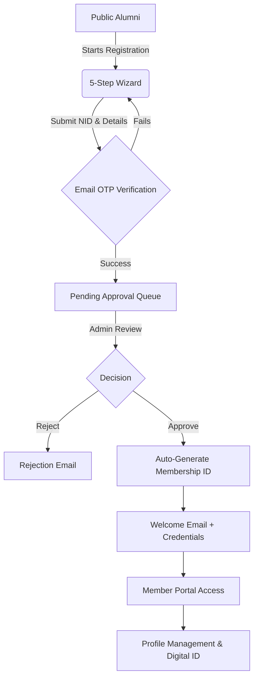
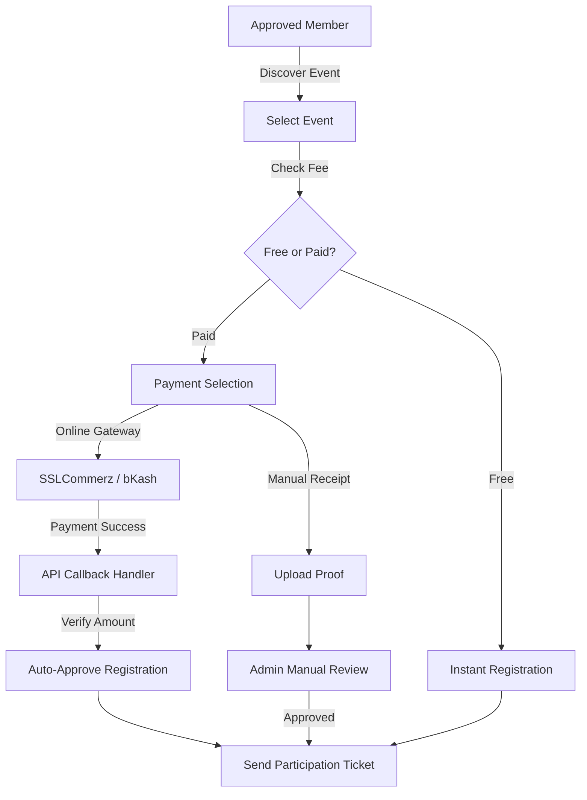
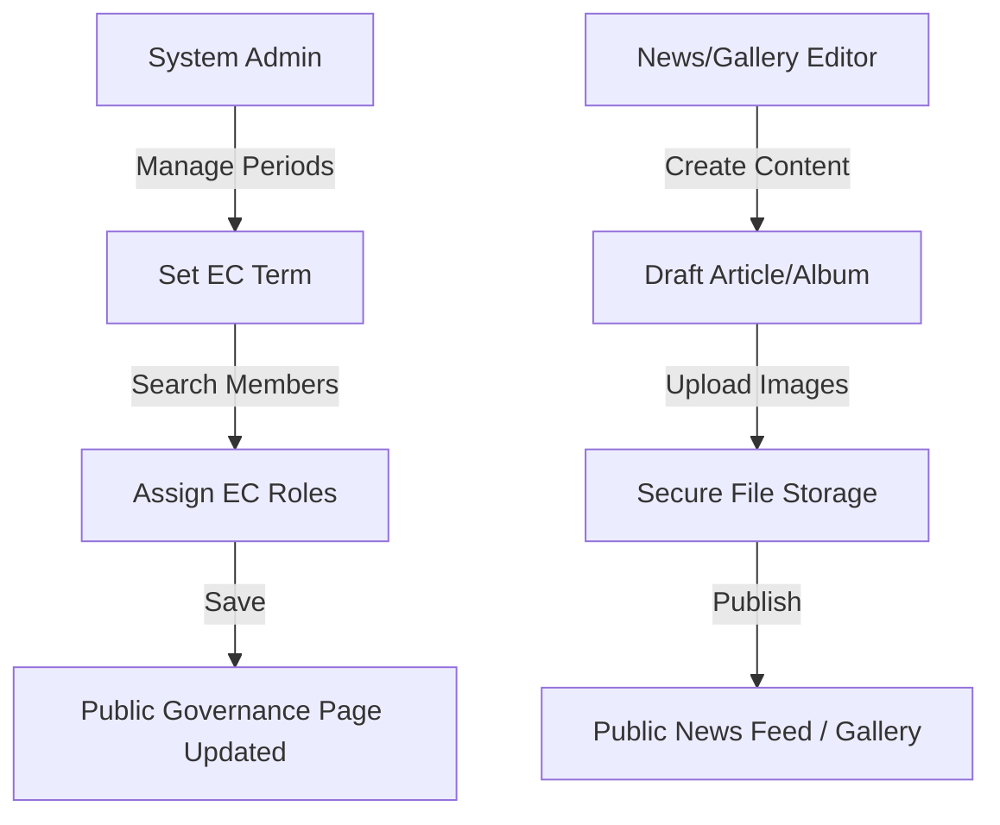
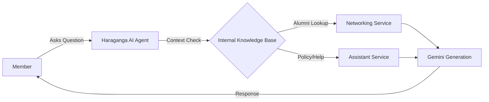

# GHCAA - Govt. Haraganga College# GHCAA Alumni Association Platform

Welcome to the GHCAA Platform. This project is a comprehensive digital ecosystem designed to connect Haraganga College Alumni through secure membership, intelligent search, and integrated financial governance.

> [!IMPORTANT]
> This document and the associated **[Software Requirements Specification (SRS)](SRS.md)** serve as the definitive technical handover for the development team.
> Detailed system diagrams can be found in the **[Architecture &amp; Data Flow](docs/architecture_data_flow.md)** guide.

---

## 🚀 Core Technology Stack

- **Backend**: ASP.NET Core 9.0 (Clean Architecture).
- **Frontend**: Angular 17+ (PrimeNG, Vanilla CSS).
- **Search & AI**: Google Gemini AI, SignalR.
- **Database**: PostgreSQL (Entity Framework Core).

---

## 📋 Project Development Brief

This project serves as a highly structured digital ecosystem. The following outlines the Core Modules (Functional Requirements) and System Constraints (Non-Functional Requirements) that dictate its architecture.

### Functional Requirements (FRs) by Module

**A. Membership & Identity Management**

- **Registration Wizard:** A 5-step form capturing Personal, Academic, and Professional data, separating college vs higher-degree admission years to verify institutional affiliation.
- **Approval Workflow:** Users start as "Applied". Admins review documents. Upon approval, the system auto-generates a unique `MembershipNumber` (the Login ID). Includes **Member Verification "Blue Tick"** capabilities.
- **Profile Control & Family Add-ons:** Granular privacy toggles to hide Phone/Email. System handles standard members with future support for Family/Spouse linkings.
- **Digital ID:** Auto-generates a downloadable SVG/PDF ID card with a scannable QR code.

**B. Events & Participation**

- **Catalog & Registration:** A secure hub for event discovery. Members can pay and register.
- **Waitlist & Caps:** Events enforce maximum capacities and handle waitlisted statuses automatically.
- **Attendance Tracking:** Coordinators can scan a member's QR ID card at the venue to mark them as "Attended".

**C. Financial & Admin Governance**

- **Automated Payments:** Webhook-driven integration with local gateways (SSLCommerz, bKash). Successful callbacks auto-approve memberships or registrations.
- **Ledger & Dues:** Immutable ledger of all income/expenses. Auto-generation and tracking of "Annual Membership Dues".
- **Tax Receipts:** Auto-generation of PDF receipts for recognized donations.
- **EC Management & Import:** SuperAdmin tools to manage Executive Committee terms and a bulk Excel importer for legacy member migration.

**D. Networking, Social, & Support**

- **Smart Directory:** Infinite-scroll member directory heavily governed by privacy toggles. Includes search by batch, department, and professional domain.
- **Job & Mentorship Hub:** Job board for alumni to post and discover opportunities. Supports career-focused networking.
- **Haraganga AI & Communications:** Gemini-powered chat agent for queries. Bulk email and **Communication Hub** for administrators to message specific segments (e.g., specific batches).
- **Direct Messaging:** Peer-to-peer real-time chat between members without exposing private contact info.

---

## 🛡️ System Constraints & Non-Functional Requirements (NFRs)

- **NFR 1: Zero "Ghost Data" (Soft Delete Architecture)**: The database context (EF Core) MUST use Global Query Filters to automatically hide `IsArchived` records from ALL standard queries. Never explicitly `DELETE` a user. Includes cascading archiver jobs.
- **NFR 2: Strict Deduplication**: NID, Mobile Number, and Email must have unique database indexes. The API auto-sanitizes strings before validation.
- **NFR 3: Security & Authorization**: Completely stateless JWT authentication. Passwords hashed with BCrypt. Granular Role-Based Access Control (Public, Member, Admin, SuperAdmin).
- **NFR 4: Performance & Resiliency**: Server-side image optimization (< 350KB). Frontend "silent interceptors" gracefully handle partial API failures without crashing the UI.

## 🚀 Development Roadmap & Identified Gaps

The following features and integrations have been prioritized for the next phase of development:

**1. Membership & Identity Lifecycle**

- [X] **Family/Spouse Add-ons**: Extend the `Member` model to support linking family members or associate spouse accounts.
- [X] **Member Verification "Blue Tick"**: Implement a visual distinction for highly verified members in the public directory.
- [X] **IsArchived Cascading**: Create a dedicated background worker for bulk-archiving inactive users and natively cascading the soft-delete property.
- [ ] **Social Auth (OAuth2)**: Allow "Link with LinkedIn/Google" for streamlined login sessions after initial NID-based manual registration.

**2. Events & Participation**

- [X] **Waitlist Management**: Explicitly handle "Waitlist" status for `AlumniEvent` registrations when capacity caps are reached.
- [X] **QR Attendance Tracking**: Add a scanner endpoint to mark an `EventRegistration` as "Attended" via the digital ID card's QR code.

**3. Financial & Admin Governance**

- [X] **Automated Tax Receipts**: Auto-generate PDF receipts for recognized donations and integrate them into the `PaymentHistory`.

**4. Networking & Engagement**

- [X] **Granular Privacy Strictness**: Tightly bind the `NetworkingController` Search endpoint to privacy toggles, ensuring DTOs never leak masked fields.
- [X] **Improved Peer Chat**: Enhance the messaging flow with read receipts and persistent history.
- [X] **Haraganga AI Context Extension**: Feed more institutional policy data to the Gemini agent for more accurate support responses.

**5. Deployment & Security Integrations**

- [X] **SMS Gateway**: Implement an SMS provider (e.g., Twilio, SSLWireless/Banglalink) for OTP verification and time-sensitive notifications.
- [X] **Automatic Session Invalidation**: Real-time invalidation of all JWT tokens for a user if their status changes to "Terminated" or "Inactive".
- [X] **Real-time Notifications**: SignalR integration for instant alerts on approvals, messages, and event updates.
- [X] **FR 5.4: Automated Session Governance**: Integration of global interceptors (Web/Mobile) to detect `401 Unauthorized` and trigger immediate redirections. Includes a platform-wide **10-minute inactivity logout** policy.
- **FR 5.5: Comprehensive Sitemap & Documentation**: Integrated categorical public sitemap in the Angular footer and established the **[Architecture &amp; Data Flow](docs/architecture_data_flow.md)** blueprint.

**6. Mobile App (Flutter) Development**

- [X] **Phase 1: Project Setup & Architecture**
  - [X] Initialize new Flutter project (`GHCAA.Mobile`).
  - [X] Configure Android and iOS native settings (set logo as app icon, bundle IDs).
  - [X] Setup state management (e.g., Riverpod or Provider), routing (e.g., go_router), and HTTP client (e.g., Dio).
  - [X] Create base aesthetic and theme ("Midnight Gold": dark base, royal gold highlights, glassmorphic panels, fast list rendering).
- [X] **Phase 2: Authentication & Onboarding Strategy**
  - [X] Design App Home Screen as the initial launch point before login.
  - [X] Implement the 3-step registration wizard accessible directly from the App Home screen.
  - [X] Implement secure login screen accessible from the App Home (with Member/Admin context selection).
  - [X] Implement JWT token storage using secure storage.
- [X] **Phase 3: Member Portal Features (Full Feature Parity)**
  - [X] Develop Personal Dashboard (Status, Notifications, Stats).
  - [X] Build profile management, privacy toggles, and digital ID card (SVG/PDF/QR with local cache).
  - [X] Implement Alumni Directory with "Infinite Scroll" and filtering functionality.
  - [X] Develop Event listing, detail, and registration screens (with payment gateway hooks).
  - [X] Real-time tracking of Membership Dues and Payment History.
  - [X] Native Image/Document pickers for Gallery and Article contributions.
- [X] **Phase 4: Admin Command Center (Full Feature Parity)**
  - [X] Develop Admin Dashboard (Global Analytics).
  - [X] Implement Membership Governance screen (Approve/Reject requests).
  - [X] Create UI for EC Management, Event Management, and Payment Config.
  - [X] Implement Communication Hub (mass-messaging) and Media Gallery CMS capabilities.
  - [X] Gatekeeper functionality (QR Scanning for physical verification).
- [X] **Phase 5: Networking & Advanced Features**
  - [X] Integrate Peer-to-Peer messaging feature.
  - [X] Integrate Job & Mentorship Hub.
  - [X] Integrate Haraganga AI Assistant chat UI.
- [X] **Phase 6: Quality Assurance & Polish**
  - [X] End-to-end stabilization of Member and Admin flows.
  - [X] Implementation of Session Expiry Redirection (401 handler).
  - [X] Implementation of Platform-wide Inactivity Logout (10-min threshold).
  - [X] Synchronized Administrative Member Management (Mobile Update Parity).
  - [X] Integrated Automated Sequential CI (API -> UI -> MOBILE).
  - [X] Establish Platform Quality Governance (PR Checklists).
  - [X] Finalize build for Android (APK/AAB) and iOS (IPA).

---

## 🛠️ Development Handover Checklist

Outgoing developers should ensure the following are transferred:

- [ ] **SSLCommerz/bKash Keys**: Sandbox and Production credentials (store in environment variables or a secret manager, not in committed configuration).
- [ ] **Gemini API Key**: For the Haraganga AI Assistant.
- [ ] **SMTP Credentials**: Gmail app password for system notifications (`GmailSettings__Email`, `GmailSettings__AppPassword`).
- [ ] **JWT signing key**: Set `Jwt__Key` to a random string of at least 32 characters in every non-Development environment.
- [ ] **CORS Configuration**: See [CORS and deployment checklist](#cors-and-deployment-checklist) below.
- [ ] **NND (New Node Deployment)**: Ensure the database-on-startup migration scripts are intact.

### Secrets and configuration

Do not commit real passwords, API keys, or production connection strings. Base settings live in [`GHCAA.API/appsettings.json`](GHCAA.API/appsettings.json) with placeholders.

#### Local development (pick one or combine)

1. **`.env` in the API project** (loaded by `DotNetEnv` at startup — see [`Program.cs`](GHCAA.API/Program.cs)):

   - Copy [`GHCAA.API/.env.example`](GHCAA.API/.env.example) to `GHCAA.API/.env`.
   - Fill in `Jwt__Key` (≥32 characters), database, and Gmail fields as needed.
   - Run the API with **working directory = `GHCAA.API`** (e.g. `dotnet run` from that folder) so `.env` is found; or set the same variables in your IDE launch profile / system environment.
2. **.NET User Secrets** (already wired via `UserSecretsId` in [`GHCAA.API.csproj`](GHCAA.API/GHCAA.API.csproj)):

   ```bash
   cd GHCAA.API
   dotnet user-secrets set "Jwt:Key" "YOUR_SECRET_AT_LEAST_32_CHARACTERS_LONG"
   dotnet user-secrets set "ConnectionStrings:PgSqlConnection" "Host=...;Database=...;Username=...;Password=...;SslMode=Prefer"
   dotnet user-secrets set "GmailSettings:Email" "you@gmail.com"
   dotnet user-secrets set "GmailSettings:AppPassword" "your-gmail-app-password"
   ```

   List what is stored: `dotnet user-secrets list`
3. **[`appsettings.Development.json`](GHCAA.API/appsettings.Development.json)** — non-secret defaults only; avoid committing real production passwords here if the repo is shared.

#### Production / hosted (Render, Docker, etc.)

Set **environment variables** in the host UI or compose file, for example: `Jwt__Key`, `ConnectionStrings__PgSqlConnection` or `DATABASE_URL` (`postgres://...` is parsed in [`DependencyInjection`](GHCAA.Infrastructure/DependencyInjection.cs)), `GmailSettings__Email`, `GmailSettings__AppPassword`, `AppSettings__AllowedOrigins__0`, `DataProtection__KeyRingPath` (with a persistent volume).

Optional: run [`GHCAA.Tools/configure-local-env.ps1`](GHCAA.Tools/configure-local-env.ps1) once to copy `.env.example` to `.env` under `GHCAA.API`.

### Local tooling (`GHCAA.Tools`)

| Script                                                                                | Purpose                                                                                                                                                                         |
| ------------------------------------------------------------------------------------- | ------------------------------------------------------------------------------------------------------------------------------------------------------------------------------- |
| [`run-app.ps1`](GHCAA.Tools/run-app.ps1) / [`run-app.bat`](GHCAA.Tools/run-app.bat)     | Migrate DB, optionally test, start API (**cwd `GHCAA.API`** for `.env`), Angular, mobile helper; use **`-NoWeb`** / **`-NoMobile`** to skip frontends |
| [`stop-app.ps1`](GHCAA.Tools/stop-app.ps1) / [`stop-app.bat`](GHCAA.Tools/stop-app.bat) | Stop processes and free ports**7214**, **5087**, **4200**                                                                                                     |
| [`configure-local-env.ps1`](GHCAA.Tools/configure-local-env.ps1)                       | Create `GHCAA.API/.env` from `.env.example`                                                                                                                                 |

Full parameters and notes: **[`GHCAA.Tools/README.md`](GHCAA.Tools/README.md)**.

### ASP.NET Data Protection (production)

When the API runs in containers without a persistent disk, DataProtection keys default to an ephemeral path and cookies or protected payloads may break after redeploys. Set `DataProtection:KeyRingPath` to a **mounted volume** path (see [`appsettings.Production.json`](GHCAA.API/appsettings.Production.json)) so key material survives restarts.

### CORS and deployment checklist

On each release that changes host URLs:

1. Add every **browser origin** that will call the API (scheme + host + port) to `AppSettings:AllowedOrigins` or the `AppSettings__AllowedOrigins__*` environment variable array.
2. Deploy the **API** and **web** apps so the web app’s origin matches the allow list exactly (`https://` vs `http://`, `www` vs bare domain).
3. Confirm preflight: from the browser devtools, a login or authenticated request should not log `CORS policy execution failed`.
4. For SignalR (`/hubs/chat`), ensure clients use the same allowed origins and HTTPS where the API enforces TLS.

## 💻 Powered By

| **Backend**        | .NET 9 (Web API), Entity Framework Core                                          |
| **Database**       | PostgreSQL 16+ (Dockerized in Prod)                                             |
| **Frontend**       | Angular 18 (Signals, Standalone Components)                                    |
| **Styling**        | Vanilla SCSS (Custom Design System), Glassmorphism                             |
| **Security**       | JWT, BCrypt.Net-Next, ASP.NET Core Identity (Custom Implementation)             |
| **DevOps**         | Docker, GitHub Actions, PowerShell Automation                                   |
| **Reporting**      | ClosedXML (Excel Integration)                                                   |
| **Payment**        | SSLCommerz, Nagad (Integration Ready)                                           |

## 🗺️ System Workflows & User Journeys

The following diagrams visualize the core operational flows of the GHCAA platform in detail.

### 1. Membership Lifecycle (Onboarding)



### 2. Event Registration & Automated Payment



### 3. Governance & Administrative Flow



### 4. AI Assistant Interaction



---

## 🏛️ Comprehensive Feature List (SRS/FR)

The following provides a full, structured breakdown of system features, user roles, and functional dependencies based on the complete SRS.

### 1. Membership & Identity Management

#### 1.1 Automated Member Registration

- **Business Description**: Allows alumni to apply for association membership through a guided, multi-step process.
- **User Roles**: Public (Alumni).
- **Inputs/Outputs**:
  - **Screen**: `/register` (5-step wizard).
  - **API**: `POST /api/auth/register`, `GET /api/auth/status/:id`.
  - **Key Fields**: Full Name, NID (Cleaned), Mobile, Batch, Degree, Email (OTP Verified).
- **Validations & Rules**:
  - **Duplicate Prevention**: Global check for uniqueness of NID, Email, and Mobile No.
  - **Academic Prerequisite**: At least one academic record must be from "Govt. Haraganga College".
  - **Digital Sanitization**: Automatic removal of spaces/formatting from NID and Mobile strings.
- **Dependencies**: Email Service (OTP), ID Card Service (Metadata).

#### 1.2 Secure Authentication & Authorization

- **Business Description**: Provides secure access to the portal based on identity and role.
- **User Roles**: Public, Member, Admin, SuperAdmin.
- **Inputs/Outputs**:
  - **Screen**: `/login`, `/verify-email`.
  - **API**: `POST /api/auth/login`, `POST /api/auth/verify-email`.
  - **Key Fields**: NID/Mobile/Email as Identifier, Password (BCrypt hashed), OTP Code.
- **Validations & Rules**:
  - **Verification Requirement**: Email must be OTP-verified before login is permitted.
  - **Role-Based Access**: Granular JWT claims for Member vs Admin vs SuperAdmin.
- **Dependencies**: JWT Token Service.

#### 1.3 Personal Profile & Privacy Control

- **Business Description**: Members can manage their personal, academic, and professional information with granular privacy toggles.
- **User Roles**: Member.
- **Inputs/Outputs**:
  - **Screen**: `/portal/profile`.
  - **API**: `GET /api/profile`, `PUT /api/profile/update`.
  - **Key Fields**: Privacy Toggles (Mask NID, Email, Mobile, Address).
- **Validations & Rules**:
  - **PII Masking**: Sensitive fields are automatically masked for other members unless the 'Public' toggle is active.
- **Dependencies**: Profile Controller, Infrastructure Services.

#### 1.4 Digital ID Card & Certificate

- **Business Description**: Automatically generates secure, downloadable digital ID cards and certificates for verified members.
- **User Roles**: Approved Member.
- **Inputs/Outputs**:
  - **Screen**: `/portal/profile` (Download buttons).
  - **API**: `GET /api/profile/id-card`, `GET /api/profile/certificate`.
  - **Key Fields**: QR Code Data Stream, Membership ID.
- **Validations & Rules**:
  - **Eligibility**: Generation locked until `MembershipStatus == Active`.
  - **Format**: Auto-generated sequential serials during approval.
- **Dependencies**: ID Card Generation Service.

### 2. Events & Participation

#### 2.1 Event Listings & Catalog

- **Business Description**: A centralized hub for discovering upcoming and past alumni events.
- **User Roles**: Public, Member.
- **Inputs/Outputs**:
  - **Screen**: `/events`.
  - **API**: `GET /api/events`.
- **Dependencies**: Events Service.

#### 2.2 Intelligent Event Registration

- **Business Description**: Allows members and guests to register for events with integrated payment tracking.
- **User Roles**: Member, Guest (if allowed).
- **Inputs/Outputs**:
  - **Screen**: `/events/:id`.
  - **API**: `POST /api/events/register`.
  - **Key Fields**: Payment Reference, Receipt Upload, Contribution Amount.
- **Validations & Rules**:
  - **Lifecycle**: Registration permitted only for active events before the deadline.
  - **Deduplication**: Prevents multiple registrations per user/guest for the same event.
  - **Member Enforcement**: Guest entry restricted by the event's `AllowNonMembers` policy.
- **Dependencies**: Financial Service, File Storage (Receipts).

#### 2.3 Event Management (Admin)

- **Business Description**: CRUD operations for events, including registration capping and deadline management.
- **User Roles**: Admin, SuperAdmin.
- **Inputs/Outputs**:
  - **Screen**: `/admin/events`.
  - **API**: `POST /api/events/create`, `PUT /api/events/update`.
- **Dependencies**: Admin Controller.

### 3. Financial Management & Payments

#### 3.1 Automated Payment Gateways

- **Business Description**: Secure online payment integration for subscriptions and event fees.
- **User Roles**: Member, Admin.
- **Inputs/Outputs**:
  - **API**: `POST /api/gateways/initiate`, `POST /api/gateways/callback`.
  - **Gateways**: SSLCommerz, bKash (Ready).
- **Validations & Rules**:
  - **Verification**: Callback amount must exactly match the expected fee/due.
  - **Auto-Update**: Successful payment triggers automatic registration/due status updates.
- **Dependencies**: SSLCommerz SDK, Financial Service.

#### 3.2 Financial Ledger & Audit

- **Business Description**: Tracking all income and expenses of the association with categorized ledger entries.
- **User Roles**: Admin (Finance), SuperAdmin.
- **Inputs/Outputs**:
  - **Screen**: `/admin/ledger`.
  - **API**: `GET /api/financialledger`.
- **Dependencies**: Financial Ledger Controller.

#### 3.3 Payment & Fee Configuration (Admin)

- **Business Description**: Managing membership fees, registration costs, and gateway settings.
- **User Roles**: SuperAdmin.
- **Inputs/Outputs**:
  - **Screen**: `/admin/fee-configs`.
  - **API**: `GET /api/financials/fees/config`, `POST /api/financials/fees/config`, `PUT /api/financials/fees/config`.
- **Validations & Rules**:
  - **Temporal Logic**: Fees applied based on the most recent `EffectiveDate` relative to the current year.
- **Dependencies**: Financials Controller.

### 4. Networking & Social Features

#### 4.1 Alumni Directory (Search & Networking)

- **Business Description**: High-performance "infinite scroll" directory for finding alumni.
- **User Roles**: Public (Limited), Member (Full).
- **Inputs/Outputs**:
  - **Screen**: `/directory`.
  - **API**: `GET /api/networking/search`, `GET /api/networking/member/{id}`.
  - **Key Fields**: Search Query, Batch/Department Filters.
- **Dependencies**: Networking Service.

#### 4.2 Professional Job Hub

- **Business Description**: Internal portal for sharing and applying for job opportunities within the alumni network.
- **User Roles**: Member.
- **Inputs/Outputs**:
  - **Screen**: `/portal/jobs`.
  - **API**: `GET /api/jobs`, `POST /api/jobs`.
- **Dependencies**: Job Hub Service.

#### 4.3 Direct Peer Messaging

- **Business Description**: Secure communication channel for members to network without exposing private contact data.
- **User Roles**: Member.
- **Inputs/Outputs**:
  - **Screen**: Chat overlay or `/portal/chat`.
  - **API**: `POST /api/chat/send`, `GET /api/chat/history/{otherId}`.
- **Dependencies**: Chat Service, Real-time Hub.

#### 4.4 Gamification & Member Standing

- **Business Description**: Rewards member engagement with contribution points, ranks, and category badges.
- **User Roles**: Member.
- **Inputs/Outputs**:
  - **API**: `GET /api/profile` (includes points/rank).
  - **Logic**: Points awarded for `PROFILE_VERIFIED` (50 pts) and `EVENT_ATTENDANCE` (100 pts).
- **Validations & Rules**:
  - **Category Thresholds**: Legend (1000+), Elite (500+), Active (200+).
- **Dependencies**: Gamification Service.

### 5. Governance & Operations

#### 5.1 Executive Committee (EC) Management & Governance

- **Business Description**: Managing committee periods, roles, and historical records of governance.
- **User Roles**: Admin, SuperAdmin.
- **Inputs/Outputs**:
  - **Screen**: `/admin/governance`.
  - **API**: `POST /api/admin/governance/periods`, `POST /api/admin/governance/periods/{id}/members`.
- **Validations & Rules**:
  - **Continuity**: Prevents temporal overlaps between EC periods.
  - **Exclusivity**: Core roles (President, GS, Treasurer) must be unique per term.
  - **Eligibility**: Restricted to Members with 'Active' status.
- **Dependencies**: Governance Service.

#### 5.2 Bulk Member Import & Export

- **Business Description**: Excel-to-Database bridging for migrating legacy records and exporting registry data.
- **User Roles**: SuperAdmin.
- **Inputs/Outputs**:
  - **Screen**: `/admin/members`.
  - **API**: `POST /api/admin/members/import`, `GET /api/admin/members/import/export`.
- **Validations & Rules**:
  - **Deduplication**: Automatic NID/Email collision detection.
  - **Auto-Provisioning**: Creation of User accounts with NID-based credentials during import.
- **Dependencies**: Member Import Service.

### 6. Intelligent Assistant (AI)

#### 6.1 Haraganga AI Assistant

- **Business Description**: A Gemini-powered AI helping members find information and alumni through natural language.
- **User Roles**: Member.
- **Inputs/Outputs**:
  - **Screen**: `/portal/assistant`.
  - **API**: `POST /api/assistant/ask`.
- **Validations & Rules**:
  - **NLP Intent**: Automatically parses natural language for years, sectors, and help topics.
- **Dependencies**: Google Gemini API, Assistant Service.

#### 6.2 Intelligent Support Chat

- **Business Description**: Real-time support for common queries and system navigation.
- **User Roles**: Public, Member.
- **Inputs/Outputs**:
  - **Screen**: Floating Chat Widget.
  - **API**: `POST /api/chat/message`.
- **Dependencies**: Chat Service.

### 7. Global Content Management (CMS)

#### 7.1 News & Press Releases

- **Business Description**: Publishing and managing association news with image support.
- **User Roles**: Public (Read), Admin (CRUD).
- **Inputs/Outputs**:
  - **Screen**: `/news`.
  - **API**: `POST /api/news`.
- **Dependencies**: News Service.

#### 7.2 Media Gallery & Albums

- **Business Description**: Visual records of association history categorized by events.
- **User Roles**: Public (Read), Admin (CRUD).
- **Inputs/Outputs**:
  - **Screen**: `/gallery`.
  - **API**: `POST /api/gallery`.
- **Dependencies**: Gallery Service, File Storage.

#### 7.3 Theme Management (Special Days)

- **Business Description**: Dynamic UI transformation for special occasions (e.g., Independence Day).
- **User Roles**: Admin.
- **Inputs/Outputs**:
  - **Screen**: `/admin/themes`.
  - **API**: `POST /api/theme/activate`.
- **Dependencies**: Theme Service.

---

## ⛩️ Portal Architecture & Scopes

The platform is divided into three distinct operational scopes, each tailored for specific user interactions.

### 🌐 1. Public Portal (The Front Gate)

*Open access for alumni and the general public.*

- **🏛️ Intelligent Landing Hub**: Royal "Midnight Gold" aesthetic with Dynamic Sections (Purpose, Symbolism, and EC Highlights).
- **📊 Real-time Stats Counter**: Live counters for total Registered Members, Batches represented, and Association Events.
- **📝 Automated Onboarding**: High-integrity 5-step registration wizard with:
  - **NID Sanitization**: Automatic space removal and duplicate checking.
  - **OTP Security**: Email-based verification before submission.
  - **Academic Validation**: Specific logic to ensure at least one GHC record exists.
- **🔍 Public Alumni Directory**: High-performance "Infinite Scroll" member list with Batch and Professional filtering.
- **📰 Press & Updates**: Real-time news feed and event calendar with archival support.

### 👤 2. Member Portal (The Alumni Hub)

*Secured area for approved alumni using NID-based credentials.*

- **📊 Personal Dashboard**: Visual overview of membership status and recent association activities.
- **🤖 Haraganga AI Assistant**: Natural Language (NLP) search bot helping members find alumni by batch, sector, or professional background.
- **🛠️ Self-Service Profile**:
  - **Dynamic Privacy**: Granular toggles to hide/show contact info (Mobile/Email/Address).
  - **History Management**: Self-updateable Academic and Professional records with document re-upload capabilities.
- **💬 Networking Engine**:
  - **Peer Chat**: Secure messaging between members without exposing private contact data.
  - **Career Hub**: Access to Job Opportunities shared within the network.
- **💰 Financial Transparency**:
  - Real-time tracking of Membership Dues and Payment History.
  - Manual payment proof upload for life membership upgrades.
- **🎟️ Event Participation**: Managed registration for alumni-only events with payment integration.

### ⚖️ 3. Admin Command Center (Governance & Management)

*High-privilege portal for the Executive Committee and System Admins.*

- **📈 Global Analytics**: Real-time dashboard with metrics on membership growth, financial balance, and pending workflows.
- **👨‍💼 Membership Governance**:
  - **Side-by-Side Review**: Approval/Rejection interface with document verification.
  - **Auto-Account Creation**: Approval triggers NID-based credential generation and email dispatch.
  - **Data Retention**: Soft-delete "Archive" system with one-click restoration.
- **📂 Management Suites**:
  - **EC Management**: Track Governance periods, positions, and committee transitions.
  - **📧 Communication Hub**: Mass-messaging engine with HTML templates, batch-targeting (Passing Year), and custom email campaigns.
  - **🖼️ Media Gallery CMS**: Managed photo galleries with featured image support and event-linking.
  - **Payment Config**: UI to manage bKash/Nagad/Bank instructions and gateway settings.
- **⚡ Advanced Power Tools**:
  - **Bulk Import**: Excel-to-Database bridging with complex column mapping.
  - **Premium Export**: Automated Excel reports with formatted data labels (Blood Groups, Categories).
  - **Admin Search**: High-speed lookup using Member IDs or NIDs.

---

## 🏗️ System Architecture & Security

**Enterprise-Grade Stability**

- **FR 5.1: Soft-Delete Integrity**
  - Implementation of **Global Query Filters** across the entire database. Archiving a member automatically "hides" all related history, academic records, and communications to prevent orphans.
- **FR 5.2: Role-Based Access (RBAC)**
  - Granular permissions for SuperAdmin, Admin, Member, and Guest roles.
- **FR 5.3: Authentication Model**
  - **BCrypt** password hashing with salt-per-member security.
  - **JWT (JSON Web Tokens)** for secure, stateless session management.

## 🏗️ Developer Experience & Infrastructure

To ensure rapid development and system reliability, the project includes several specialized dev-features:

### 1. Automated Data Seeding & Transformation

- **Self-Healing Seeds**: JSON-based seed data (`members.json`, `users.json`) that can be automatically synchronized with the database during migration or startup.
- **Credential Transformation Utilities**: Custom C# scripts to batch-update existing member data (e.g., transforming legacy usernames into NID-based credentials with BCrypt hashing).

### 2. Technical Infrastructure

- **Global Data Persistence**:
  - Centralized **soft-delete architecture** using EF Core query filters. Developers don't need to manually check `IsArchived` in every query; the system handles it at the model level.
- **Clean Architecture Implementation**:
  - Clear separation of concerns between **Domain Models**, **Application DTOs**, and **Infrastructure Services**.
- **Modern Styling System**:
  - A comprehensive **SCSS Design System** with CSS variables for colors, spacing, and glassmorphism tokens, allowing for instant global UI changes.

### 3. API & Tooling

- **Swagger/OpenAPI Integration**: Auto-generated interactive API documentation for testing and integration.
- **Member Import Utility**: Dynamic Excel-to-Database bridging service with column mapping and auto-generation of missing data for legacy records.
- **File Storage Abstraction**: Pluggable storage service for handling photos and certificates, currently supporting Local Storage with an interface for Cloud (S3/Azure) expansion.

---

## 📂 Project Structure

```bash
GHCAA/
├── GHCAA.API/             # REST API Controllers & Web Host
├── GHCAA.Application/     # Logic Contracts (Interfaces) & Data Transfer Objects (DTOs)
├── GHCAA.Domain/          # Core Entities, Enums, and Shared Constants
├── GHCAA.Infrastructure/  # DB Context, Migrations, Repositories, and Services
├── GHCAA.Web/             # Angular SPA (Frontend)
├── GHCAA.Tests/           # XUnit & Integration Test Suites
├── GHCAA.Export/          # Excel/CSV Generation Utilities
├── .github/workflows/    # CI/CD (GitHub Actions)
├── Dockerfile            # Production Orchestration
└── run-app.ps1           # Developer Bootstrapper
```

---

## 🏗️ Technical Architecture

The platform is built using **Clean Architecture** (Onion Architecture) principles, ensuring that the business logic is independent of external frameworks and databases.

### Layered Structure

- **Core (Domain)**: Pure C# project containing Entities (`Member`, `User`, `AlumniEvent`), Enums, and Core Constants. No external dependencies.
- **Application**: Defines interfaces (`IMemberService`, `IAuthService`) and Data Transfer Objects (DTOs). Contains the contract for the business logic.
- **Infrastructure**: Implementation of persistent storage (PostgreSQL via Entity Framework Core), File Storage (Local/Cloud), and external services (Email, OTP).
- **API (Web)**: ASP.NET Core RESTful controllers, Middleware (Rate Limiting, Exception Handling), and JWT Authentication.
- **Web (Frontend)**: Angular 18 Single Page Application (SPA) with a modular architecture and reactive state management.

### Data Flow & Persistence

- **Repository Pattern**: Centralized data access logic.
- **Global Filters**: Every database query is automatically intercepted to filter out `IsArchived` records, providing safety against "Ghost Data".
- **Database**: PostgreSQL with complex unique indexing on NID, Mobile, and Email to ensure zero-duplicate integrity.

---

## 🧪 Testing & Quality Assurance

The project maintains a rigorous quality standard organized into three distinct layers:

### 1. Unit Testing (`GHCAA.Tests`)

- **Business Logic**: Comprehensive tests for Member Approval, Membership Number Generation, and Financial calculations.
- **Service Mocking**: Utilization of Moq to isolate services and ensure deterministic test results.

### 2. Integration Testing

- **Persistence Testing**: In-memory database tests to verify that complex EF Core Query Filters and Unique Constraints are working as expected.
- **Schema Validation**: Automated migration testing to ensure seed data (`users.json`, `members.json`) remains compatible with the current schema.

### 3. API & UI Validation

- **Swagger UI**: Interactive playground for manual API verification.
- **Frontend Interceptors**: Automated error handling and token injection validation on the Angular side.

### 4. Automated CI/CD & Visual Quality Suite

- **Sequential Validation**: A five-stage GitHub Actions pipeline enforcing quality in order: `Analysis -> API Tests -> Web UI Tests -> Mobile Tests -> Integrated Build`.
- **Visual Freeze**: Unified `visual-check.ps1` runner executing Playwright visual tests (Web) and Flutter Golden tests (Mobile) to ensure pixel-perfect UI consistency.
- **E2E Journeys**: Automated functional testing of core user journeys (Registration, Approval, Payment, ID Generation) across all platforms.
- **Governed Merges**: PR templates and mandatory status checks ensure no regression in any project layer.

---

## 🔄 CI/CD & Quality Control

The GHCAA platform enforces strict quality governance through an automated **Sequential CI Pipeline** (GHCAA Standard CI):

1. **Static Analysis**: Parallel linting and type-checking for C# (.NET 9), TypeScript (Angular 21), and Dart (Flutter).
2. **Backend Validation**: `dotnet test` executes the unit and integration suite using an in-memory SQLite mirror.
3. **Frontend Validation**: `vitest` executes the headless UI unit test suite.
4. **Mobile Validation**: `flutter test` executes widget and unit tests for the mobile application.
5. **Integrated Build**: Cross-platform verification that packages the API and Web SPA into a single deployment-ready artifact.

Deployments and merges to `dev` and `main` branches are protected by these status checks.

### Containerization & CI/CD

- **Dockerized Environment**: Multi-stage `Dockerfile` for streamlined production builds and environment consistency.
- **CI/CD Pipeline**:
  - **GitHub Actions**: Automated build, test, and linting on every push.
  - **PowerShell Automation**: `CI-Deploy.ps1` script for automated deployment workflows.
- **Environment Management**: `.env` and `appsettings.json` driven configuration for local, staging, and production secrecy.

### System Management

- **Process Control**: Dedicated `run-app.ps1` and `stop-app.ps1` scripts for managing local/server environments.
- **Logging**: Integrated `ILogger` with tiered severity levels (Information, Warning, Error) for real-time monitoring.
- **Database Maintenance**: SQL utilities included for periodic cleanup (`delete_imported_members.sql`) and password resetting (`reset_superadmin_password.sql`).

---

## 🛠️ Getting Started

### 1. Prerequisites

- [.NET 9 SDK](https://dotnet.microsoft.com/download/dotnet/9.0)
- [Node.js v20+](https://nodejs.org/)
- [PostgreSQL 16+](https://www.postgresql.org/)

### 2. Database Setup

1. Create a database named `GHCAA_DB`.
2. Update the connection string in `GHCAA.API/appsettings.json`.
3. Apply migrations:
   ```bash
   dotnet ef database update --project GHCAA.Infrastructure --startup-project GHCAA.API
   ```

### 3. Running the Application

**Option A: Automated (Win/PowerShell)**

```powershell
./run-app.ps1
```

**Option B: Manual**

- **Backend**: `cd GHCAA.API && dotnet run`
- **Frontend**: `cd GHCAA.Web && npm install && npm start`

---

## 🧪 Testing Coverage

The repository targets **>85% code coverage** on core business services.

- Run all tests: `dotnet test`
- View results: `test_results.txt` (generated automatically in CI)

---

## 🎨 Design Philosophy: "Midnight Gold"

The application adheres to a premium aesthetic designed to evoke prestige and legacy:

- **Visuals**: Dark mode base with royal gold highlights and glassmorphic panels.
- **Micro-animations**: Subtle hover transitions and container entry animations.
- **Performance**: Optimized for fast LCP (Largest Contentful Paint) and smooth rendering of large data lists.
