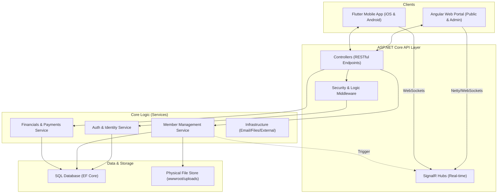

# GHCAA architecture and data flow

This document outlines the architectural blueprint and data interaction patterns of the GHCAA (Govt. Haraganga College Alumni Association) platform.

## 1. System Overview Diagram



## 2. Key Data Flows

### A. Member Lifecycle
1.  **Registration**: Public Client (Web/Mobile) → `RegistrationController` → `MemberService`.
    - Profile status set to `Applied`.
    - Verification email sent via `NotificationService`.
2.  **Approval**: Admin Client → `AdminController` → `ApproveMemberAsync`.
    - Status changes to `Active`.
    - Membership Number assigned (Sequential Pattern).
    - Financial Ledger initialized with 'Admission' and 'Yearly' dues.
3.  **Active Status**: Member Login → JWT Issued with appropriate Claims (`IsVerified`, `Role`).

### B. Security & Permissions
- **AdminOnly Policy**: Enforces `UserRole == Admin` or `SuperAdmin`.
- **Masking Protocol**: Public directory masks PII (Phone/NID) unless `isPublic` flag is set by member. Admins receive fully unmasked data via privileged endpoints (`/api/admin/members/{id}`).
- **Session Control**: `SecurityStampMiddleware` invalidates all active sessions (Web/Mobile) if an Admin terminates or suspends a member record.

### C. Real-time Communication
- **Negotiate**: Client sends `POST` request to `/api/hubs/chat/negotiate`.
- **Connections**: Persistent WebSocket established. 
- **Delivery**: Backend triggers `Clients.Group(memberId).SendAsync()` for instant notification delivery.

### D. Public Content Delivery
- **Site content (About / Contact intro)**: Public Client → `GET /api/site-content?group=about` (anonymous) → `SiteContentService` → active `SiteContent` blocks ordered by `DisplayOrder`, rendered as trusted HTML. Writes go the other way — Admin Client → `SiteContentController` (`AdminOnly`) → `SiteContentService`, which passes `BodyHtml` through `HtmlSanitizer` **before** persistence, so the public read path never has to sanitize. If the read returns nothing, the Angular page renders its static fallback markup rather than an empty page.
- **News & Notices**: one `NewsPost` table serves both, discriminated by `PostType`. Public Client → `GET /api/news?postType=` → `NewsService` filters on `IsActive` + `PostType`; the Angular feed additionally filters client-side between tabs so switching tabs costs no request. Admin Client → `POST /api/news` / `POST /api/news/upload-document` (both `AdminOnly`) → `FileValidationService` (PDF, 10 MB) → `FileStorageService` (`FileUploadType.NoticeDocument`). The member-facing `POST /api/news/submit` path is the one place a non-admin can create a post, and it rejects `PostType.Notice` with `Forbid()` — this is the single enforcement point for "notices are admin-post-only".
- **Contact details**: served from `OrgConfig.Contact` (campus address, phone list, support email, social links, map embed URL) to web and mobile alike; SuperAdmin edits them via `PUT /api/config`. The map embed URL is admin-supplied, so the Angular client allow-list checks it before `bypassSecurityTrustResourceUrl` and renders no iframe at all when the check fails.

- **Constitution (always the latest ratified version)**: Public Client → `GET /api/governance/constitution` (anonymous) → `GovernanceService` → the single `IsActive` row; `GET /api/governance/constitution/history` returns superseded rows, each keeping its own `PdfUrl`. No page pins a version — the landing hero routes to `/constitution` rather than to a file, the in-page ToC is rebuilt from the `Article N:` headings in the stored `Content`, the last-resort constant in code (`CONSTITUTION_PDF_FALLBACK`) only fires if both the active row and the institution profile pack (`Branding.ConstitutionPdfUrl`) have no PDF set. Publication itself does not go through the API: `Database.EnsureCreated()` is a no-op on a non-empty database, so `ConstitutionSeeder.SyncAsync` runs at boot from `Program.cs`, inserting an unknown version, refreshing changed text in place and superseding (never deleting) prior versions so `AmendmentVote` rows survive. See `docs/CONSTITUTION_PUBLISHING.md`.
- **Election documents and forms (no API in the path)**: `docs/Elections/*.md` is the source of truth. `GHCAA.Web/scripts/sync-election-docs.mjs` copies it into `public/assets/elections/` on `npm start`, `npm run build` and in the Dockerfile web stage; `ElectionsPage` fetches the static asset and renders it client-side through `core/utils/markdown.util.ts`. The forms handbook is split on `# FORM ER-nn` and each form is rendered by `renderFormMarkdown` as a print-ready A4 sheet. The **only** dynamic input is organisation configuration: the letterhead reads `branding.*` (including `establishedOn`) from `OrgConfigService`, i.e. from `GET /api/config`. Nothing about a form is persisted — a filled-in form is paper, not a database row.

### E. Which Institution the App Is Running For

`OrgConfig` (branding, contact, currency, locale) has two sources, not one. An admin's saved row in
`OrganizationConfigs` always wins once it exists. Before that row exists — a fresh deployment, or a
database `OrganizationConfigs` still empty — the fallback comes from an institution profile pack:
`profiles/<name>/org-config.json`, picked by the `ORG_PROFILE` environment variable. Left unset,
the app keeps the same hardcoded GHC values it always had, so this app running today is unaffected
either way. A second institution supplies its own `profiles/<its-name>/` folder instead of editing
this codebase. See `docs/INSTITUTION_ONBOARDING.md` and Work Package 62 in `docs/TODO.md`.

## 3. Integrated Quality Governance

The platform employs a **Sequential CI Pipeline** that ensures every code change adheres to the following quality gates:

1. **Static Analysis**: Linting and type-checking across C#, TypeScript, and Dart.
2. **Backend Validation**: Execution of unit and integration tests (NUnit).
3. **Visual & E2E Freeze**: Unified execution of Playwright (Web) and Flutter Integration (Mobile) tests to verify functional journeys and visual regression.
4. **Integrated Build**: Cross-platform verification packaging the API and Web SPA into a deployment-ready artifact.

---

> [!TIP]
> **Data Integrity Constraint**: All member updates (including Admin updates) are governed by the `BaseMemberDto` validation. At least one `AcademicRecord` from the college is mandatory for any record to persist.

> [!IMPORTANT]
> **Mobile Connectivity**: Ensure `AppConfig.apiBaseUrl` in Flutter matches the Unified API Prefix configured in `Program.cs`.

---

## 4. Which entities carry audit fields

Written down in Work Package 82.16, after the 2026-09 architecture audit found audit fields had been
added wherever a specific bug forced them rather than by any rule. Apply this when adding an entity to
`GHCAA.Domain/Models/`.

An entity falls in **Class A** if a row of it is evidence: money received or spent, a governance
decision, a membership status, or anything a member could later dispute. Class A entities carry all
five fields, and are never hard-deleted:

```csharp
public DateTime? UpdatedAt { get; set; }
public int? UpdatedByAdminId { get; set; }
public bool IsArchived { get; set; }
public DateTime? DeletedAt { get; set; }
public int? DeletedByAdminId { get; set; }
```

Class A entities also get `HasQueryFilter(x => !x.IsArchived)` in their EF configuration, so ordinary
reads keep the meaning they had before soft delete was introduced. Callers that genuinely need the
deleted rows ask for them with `IgnoreQueryFilters()`. A service method that deletes a Class A row
takes the acting admin's id as a required argument, and the controller returns `Unauthorized()` rather
than attributing the act to admin 0 when it cannot identify the caller.

82.30: `IsArchived` is the one name for this flag across every Class A entity. It used to be
`IsDeleted` on `FinancialRecord`, `PaymentHistory` and `ECMember` while `Member`, `User`, `Poll` and
`Campaign` already used `IsArchived` — same idea under two names. `IsArchived` won because it was
already load-bearing on `Member` (the `Member(Status, IsArchived)` composite index, WP 24.37), so
renaming the smaller group cost less than rebuilding that index.

Class A today: `FinancialRecord`, `PaymentHistory`, `MembershipDue`, `MembershipHistory`, `Member`,
`User`, `ECMember`, `Constitution`, `Poll`.

Everything else is **Class B** — content and configuration that can be recreated if lost (news, gallery
photos, site content, job posts, notifications, lookups). Class B carries `CreatedAt` and nothing more,
and a hard delete is fine.

One known gap this rule names that 82.16 did not close, tracked separately: `ECMember` has two
removal semantics side by side (`GovernanceService.DeleteECMemberAsync` hard-removes while
`RemoveMemberFromCommitteeAsync` end-dates). The other gap 82.16 named — `FinancialRecord`/
`PaymentHistory`/`ECMember` using `IsDeleted` instead of `IsArchived` — was closed by 82.30 (see above).

---

## 5. Schema migration at boot (TODO 37.0)

`GHCAA.Infrastructure/Data/MigrationBootstrapper.EnsureMigratedAsync`, called from `Program.cs` for
every non-Visual profile, runs before any data seed/sync step. It is what makes a schema change
committed to `preprod` reach the Render deployment with no manual database step.

The problem it solves: preprod's database was first built with `Database.EnsureCreated()`, which
creates the schema straight from the current model and never touches `__EFMigrationsHistory`. A
plain `MigrateAsync()` against that database tries to `CREATE TABLE` on tables that already exist and
fails. `MigrationBootstrapper` baselines a legacy database first — walking every migration in order
and marking one applied without re-running it whenever Postgres reports its target object already
exists — then calls `MigrateAsync()` for anything genuinely still pending. It also self-heals a
migration whose "applied" history row is a false positive (a same-transaction seed insert that rolled
back partway through a migration that otherwise succeeded). Any unhandled failure during bootstrap
falls back to `EnsureCreated()` rather than crash the app, so a bug here degrades to the old status
quo instead of taking preprod down.

`ConfigureWarnings(w => w.Ignore(RelationalEventId.PendingModelChangesWarning))` is set on every
context. That warning is non-deterministic `HasData` seed churn (see `gotcha_pending_model_changes_seed`
in memory), not real schema drift — scaffolding a migration to silence it would apply spurious
`UpdateData` operations against live rows.
