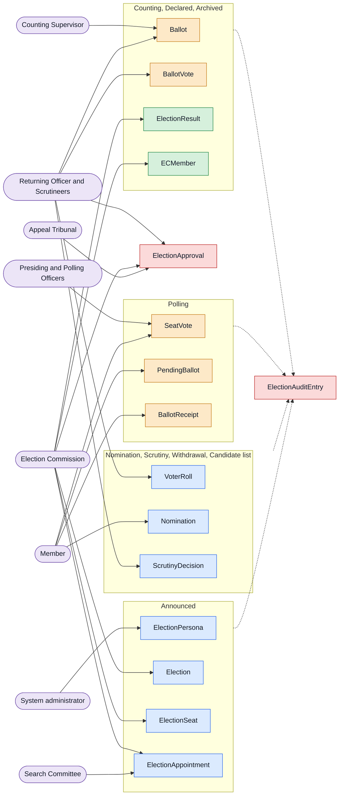
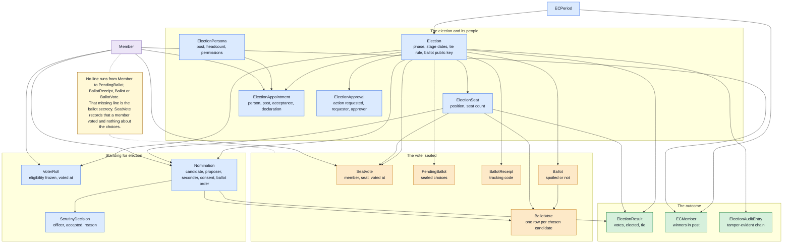

# Election feature

This document is the single reference for the election feature: the whole process from before an
election is announced to after it's archived, everyone involved, what each portal does at each
step, and how roles, secrecy and approvals are managed. It's written so the whole feature can be
pictured end to end, without needing any other document open alongside it.

## 1. The portals

Three surfaces take part, and each step below says which of them is involved.

- **Admin web** — where an election is set up and configured, where the Commission and officials
  are appointed and managed, where the ballot-sealing key is generated, and where the small number
  of setup-only screens live (defining posts, editing election settings). This is the only portal
  used for the parts of the process that are pure configuration rather than something officials do
  routinely.
- **Officials area (web and mobile)** — where an appointed person accepts their post, signs their
  declaration, and carries out whatever their post is responsible for: reviewing nominations,
  approving a sensitive action as the second signer, running the count, watching for problems. Any
  official can do this from either the website or the mobile app.
- **Member web and mobile** — where an ordinary member nominates, seconds, campaigns, votes, gets
  their receipt, checks the public board of officials, and reads the published results.

## 2. Roles and personas

A **persona** is a named post in an election — Chief Commissioner, Commissioner, Returning
Officer, Assistant Returning Officer, Presiding Officer, Polling Officer, Scrutineer, Counting
Supervisor, Technical Administrator, Cybersecurity Auditor, Security Officer, Observer, Appeal
Tribunal Member, and ECSC (Search Committee) Member. Each persona carries:

- **A purpose** — what the post is for, described in section 3 as it comes up.
- **A recommended headcount** — for example, one Chief Commissioner, a handful of Commissioners, a
  small Search Committee, a small Appeal Tribunal. This is a guideline shown to whoever is
  appointing people; it doesn't block an appointment if the number is off.
- **Eligibility rules** — some posts can only be held by existing members, some can also be filled
  by an outside specialist brought in for the election alone (for example, a Technical
  Administrator or Cybersecurity Auditor with no other tie to the organisation).
- **A permission set** — the specific actions that post is allowed to take: approve a nomination,
  hold the ballot key, open or close polling, approve a sensitive action as the second signer,
  view but never act (Observer), and so on. A person only ever gets the permissions their current
  post carries, for this one election, and nothing else.

**How a post is filled and secured:**

1. The Commission (or an administrator, before a Commission exists) appoints someone to a post, on
   the admin web portal.
2. The appointee is invited, and the post is not active until they accept it and sign a neutrality
   declaration, in the officials area on web or mobile.
3. From acceptance onward, the person carries exactly the permissions their post needs, tied to
   this one election only. It is never a standing role that carries over automatically to the next
   election — every election reappoints its own Commission and officials from scratch.
4. The Commission and every accepted official are listed on a public board, visible to every
   member, so it's always clear who's running the election and in what capacity. Personal contact
   details are never shown publicly.
5. Access is automatically withdrawn once the election is archived (see stage I). A member who
   held a post keeps their ordinary membership access throughout; someone with no other tie to the
   organisation loses system access entirely at that point.
6. Someone can hold a post at all only if they aren't also a candidate in the same election, and
   in the case of whoever accepts or rejects nominations, only if they didn't nominate or second
   the candidate they're deciding on.

## 3. The full workflow, step by step

Each step names who acts, on which portal, what has to be true before it happens, and what
safeguard applies.

### Stage A — Before the election is announced

1. **The Search Committee is convened**, made up of existing members or outside specialists.
   *Admin web, to record the appointment.*
2. **The Search Committee identifies who should sit on the Election Commission** — a Chief
   Commissioner and a small number of Commissioners — and puts them forward.
3. **Each proposed Commission member is appointed and invited to accept.** *Admin web to appoint;
   officials area to respond.*
4. **Each appointee accepts and signs a neutrality declaration.** Only from this moment is the
   appointment live. Declining or ignoring the invitation means the post is never taken up.
5. **Once the Chief Commissioner's appointment is live, the Commission is officially in place**, and
   day-to-day running of the election moves from ordinary administrators to the Commission. An
   organisation can choose, as a setting fixed in advance, whether its administrators keep full
   control even after a Commission exists, or step back to a safety-net level of access.
6. **The Commission and every official are published on the public board.** *Member web and
   mobile.*

### Stage B — Setting up the election

7. **The Commission announces the election**: what's being elected, how many seats each position
   carries, and the dates for every later stage — nomination open/close, scrutiny, withdrawal
   close, and so on. *Admin web.*
8. **The Commission appoints the remaining officials it needs**: Returning Officer, assistants,
   Presiding and Polling Officers, Scrutineers, a Counting Supervisor, Technical Administrator,
   Cybersecurity Auditor, Security Officer, Observers, and the Appeal Tribunal. Each follows the
   same accept-and-declare rule as step 4.
9. **Publishing the election setup needs two people to agree.** Whoever configured it cannot also
   be the one who approves it — a second, appropriately authorised person has to sign off before
   nominations can open. This two-person pattern applies at every sensitive moment in the process;
   see section 5 for the full list and how it works.
10. **Eligibility judgement calls** — whether someone's been a member long enough to stand, or is
    disqualified for some other reason — are made by hand by whoever's running the election. This
    is deliberately a human decision, not an automated one.

### Stage C — Nomination and scrutiny

11. **Nominations open**, on member web and mobile. Only members eligible at the moment nominations
    opened may nominate or second — a status change afterwards can't be used to challenge a
    nomination later.
12. **A candidate cannot nominate or second themselves.**
13. **Each nomination is reviewed and accepted or rejected**, in the officials area, normally by the
    Returning Officer or a Scrutineer. That person can never be a candidate themselves, and can
    never rule on a nomination they proposed or seconded.
14. **A nomination isn't accepted without the candidate's own written consent.**

### Stage D — Withdrawal and the candidate list

15. **A candidate may withdraw** any time up to the withdrawal closing date from step 7.
16. **Once withdrawal closes, the candidate list is locked** until results are declared.
17. **The candidate list is published**, member web and mobile, with the display order for
    candidates fixed at this exact moment — randomised, or alphabetical if the organisation
    configures it that way — so the order can never be used to send a signal, and stays the same
    for every voter.

### Stage E — Campaign

18. **Candidates campaign.** No system control applies here; conduct is governed by the election
    code of conduct rather than anything the software enforces.

### Stage F — Polling

19. **Polling opens.** This needs the ballot-sealing key in place, and — like every sensitive moment
    — needs two people to agree before it starts. *Admin web to generate the key; officials area for
    the two-person approval.*
20. **A member logs in and confirms their identity with a one-time code** sent to them at the point
    of voting. *Member web and mobile.*
21. **The member is shown every seat up for election, with every candidate's name and photo**, and
    chooses a candidate or abstains, seat by seat.
22. **The member reviews their full set of choices once, then casts the whole ballot in one action.**
    There's no way to submit part of a ballot, or submit it before reviewing it.
23. **The member receives a receipt**: their marked ballot plus a personal tracking code, theirs to
    keep privately. It can never be looked up, reissued or handed back out by anyone else
    afterwards — which is exactly what stops it being used later to prove or sell a vote.
24. **No results, running totals or partial counts are visible to anyone while polling is open.**

### Stage G — Counting

25. **Polling closes**, needing two people to agree, the same as opening it.
26. **The Returning Officer opens the ballot-sealing key** to begin the count. *Officials area.*
27. **Every ballot is opened and counted together, in one pass, in a random order** — never the order
    they were cast — so nobody can work backwards from sequence to guess who voted which way.
28. **An election with very few ballots is counted by hand instead**, because a tiny automated count
    could itself reveal who voted which way just from how few there are.
29. **A seat-by-seat breakdown of the opened ballots is published in shuffled order** after
    counting, so anyone can independently check the count adds up, without it revealing who cast
    which one. *Member web and mobile.*

### Stage H — Declaration and afterwards

30. **Declaring the result needs two people to agree**, the same as every other sensitive moment.
31. **Full results are published**: winners, vote counts for every candidate including zero-vote
    candidates, abstentions, and spoiled ballots. *Member web and mobile.*
32. **Winners take up their positions.**
33. **A recount can be requested** through a defined window if there's a dispute.
34. **Anyone with an appeal can raise it with the Appeal Tribunal**, which decides independently of
    the Commission.
35. **From declaration onward, every official's access starts winding down on a fixed schedule** —
    normally an appeal window, plus extra time for the Tribunal to finish any appeal it's handling.

### Stage I — Archiving

36. **Once the appeal window and any tribunal work are finished, the election is archived.**
37. **Every official's access ends at once**, automatically, with nobody switching it off by hand.
38. **A member who held a post keeps their normal membership access; an outsider with no other tie**
    loses system access entirely.
39. **The ballot-sealing key is destroyed**, following a documented procedure, once the appeal
    window closes.
40. **The cycle starts again from Stage A for the next election.**

## 4. Election phase flow

### 4.1 The status the election sits in

Each box is one election status, with the roles that act in it and the portal they act on. Each
arrow is the gate that moves the election on. Observers may look at every status and act in none
of them, so they are left off the boxes rather than repeated in all ten.

```mermaid
flowchart TD
    A["ANNOUNCED<br/>Who: Search Committee, Election Commission, System administrator<br/>Portal: Admin web"]
    B["NOMINATION<br/>Who: Members, Returning Officer<br/>Portal: Member web and mobile"]
    C["SCRUTINY<br/>Who: Returning Officer, Scrutineers<br/>Portal: Officials area"]
    D["WITHDRAWAL<br/>Who: Candidates, Returning Officer<br/>Portal: Member web and mobile"]
    E["CANDIDATE LIST<br/>Who: Election Commission, Returning Officer<br/>Portal: Public pages"]
    F["CAMPAIGN<br/>Who: Candidates, Election Commission<br/>Portal: Public pages"]
    G["POLLING<br/>Who: Members, Presiding and Polling Officers, Returning Officer<br/>Portal: Member web and mobile, Officials area"]
    H["COUNTING<br/>Who: Returning Officer, Counting Supervisor, Scrutineers<br/>Portal: Officials area"]
    I["DECLARED<br/>Who: Election Commission, Returning Officer, Appeal Tribunal<br/>Portal: Public pages, Officials area"]
    J["ARCHIVED<br/>Who: Election Commission, System administrator<br/>Portal: Admin web"]

    A -->|"Setup published. Two-person approval"| B
    B -->|"Nomination closing date passes"| C
    C -->|"Every nomination ruled on"| D
    D -->|"Withdrawal closing date passes"| E
    E -->|"List published. Order fixed for every voter"| F
    F -->|"Ballot key in place. Two-person approval opens polling"| G
    G -->|"Two-person approval closes polling"| H
    H -->|"Ballots opened together in random order. Two-person approval declares"| I
    I -->|"Appeal window closed. Two-person approval archives"| J
    J -.->|"Next election starts again from the Search Committee"| A

    classDef setup fill:#dbeafe,stroke:#2563eb,stroke-width:1px,color:#111827
    classDef live fill:#fde9c8,stroke:#c2740b,stroke-width:1px,color:#111827
    classDef closed fill:#d6f0dc,stroke:#15803d,stroke-width:1px,color:#111827

    class A,B,C,D,E,F setup
    class G,H live
    class I,J closed
```

Every colour is a light fill with dark text, so the diagram reads the same whether the page around
it is light or dark. Blue is the run-up to the vote, amber is the part where real ballots exist,
green is everything after the result is fixed.

### 4.2 Which role writes which record, and when

Same ten statuses, now showing what each role puts on record while the election sits there. The
audit trail is left off every group because every action in every status writes to it.

`ElectionApproval` is drawn on its own because it is not tied to one status. It is written six
times across the election, once for each gated action, and each time by two different people.

### 4.3 How the records relate to each other

This is the same set of records, now showing how they hang together. The important part of this
diagram is the line that is missing.

### 4.4 What each record holds

| Record | What it is for | Deliberately does not hold |
| --- | --- | --- |
| `ECPeriod` | The term of office an election fills | |
| `Election` | The election itself: title, phase, every stage date, the tie rule, and the returning officer's public ballot key with its fingerprint | The private key, which never reaches the server |
| `ElectionSeat` | One position being elected and how many places it carries | |
| `ElectionPersona` | A named post, its recommended headcount, who may hold it, and the permissions it carries | |
| `ElectionAppointment` | One person appointed to one post for one election, with their acceptance and neutrality declaration | Any standing role that survives the election |
| `ElectionApproval` | One of the six gated actions, who asked for it and who approved it | An approval by the same person who asked |
| `VoterRoll` | Who was eligible at the moment voting opened, and why anyone was not | |
| `Nomination` | A candidate, their proposer and seconder, their statement and photo, their consent, their published ballot order | |
| `ScrutinyDecision` | Who ruled on a nomination, the outcome, and the reason | |
| `SeatVote` | That a member voted for a given seat, so nobody votes twice | Anything about the choices made |
| `PendingBallot` | A sealed ballot waiting for the count, holding the election and the sealed choices | No member, no timestamp |
| `BallotReceipt` | A tracking code a voter can check against the published list | No link to any ballot row |
| `Ballot` | One opened ballot after counting, and whether it was spoiled | No member, no time of casting |
| `BallotVote` | One row per chosen candidate. A seat with no row is an abstention | No member |
| `ElectionResult` | The stored, published outcome per seat, with vote counts and ties | |
| `ECMember` | The winners taking up their positions | |
| `ElectionAuditEntry` | A tamper-evident chain of every significant action | For a vote: no seat, no time of day |

### 4.5 Where the records are defined

Every record is declared once, in the domain layer, as a plain class with no database or transport
concerns on it. Mapping, storage, transport and display are each added in their own layer on top.
No entity class ever leaves the server: the clients only ever see the request and response shapes.

| Layer | Where it lives | What is defined there |
| --- | --- | --- |
| The records themselves | `GHCAA.Domain/Models/Election.cs` | Every election record as a plain class. `ECMember` and `ECPeriod` sit in their own files beside it |
| Fixed value sets | `GHCAA.Domain/Enums.cs` | `ElectionPhase`, `ElectionTieRule`, `NominationStatus`, `ElectionRole`, `ECPosition`, and the election permission flags |
| Table mapping | `GHCAA.Infrastructure/Data/Configurations/ElectionConfigurations.cs` | One configuration class per record: keys, relationships, indexes, delete behaviour, column limits |
| Registration | `GHCAA.Infrastructure/Data/ApplicationDbContext.cs` | One `DbSet` per record, which is what makes it a table |
| Schema changes | `GHCAA.Infrastructure/Data/Migrations/PgSql` | Every table and column change, in order. The only place the schema actually changes |
| Shapes crossing the wire | `GHCAA.Application/DTOs/ElectionDtos.cs` | The request and response shapes for every endpoint, kept separate from the records so a stored column is never exposed by accident |
| Input checks | `GHCAA.Application/Validators/ElectionValidators.cs` | What a request must contain before the rules run |
| The rules | `GHCAA.Application/Interfaces/IElectionService.cs`, `GHCAA.Infrastructure/Services/ElectionService.cs` | Phase guards, nomination and scrutiny, sealing a ballot, counting, ties, declaring, archiving. This is where the process in section 3 is actually enforced |
| Access and approvals | The election access service and the permission attribute beside `ElectionService` | Which post may take which action, and the two-person rule |
| Filled forms | `GHCAA.Application/Interfaces/IElectionDocumentService.cs`, `GHCAA.Infrastructure/Services/ElectionDocumentService.cs` | The ER forms, filled from the stored records |
| Endpoints | `GHCAA.API/Controllers/ElectionsController.cs` for members and public pages, `GHCAA.API/Controllers/AdminElectionsController.cs` for the Commission and officials | The only way in from outside |
| Web types | `GHCAA.Web/src/app/core/models/election.models.ts` | The client's mirror of the transport shapes |
| Web calls | `GHCAA.Web/src/app/core/services/elections.service.ts` | Every call the website makes |
| Web screens | `GHCAA.Web/src/app/admin/elections`, `member/election`, `public/elections` | Setup and officials, the ballot, the public pages |
| Mobile | `GHCAA.Mobile/lib/features/elections/election_service.dart`, `lib/screens/member/election_screen.dart`, `lib/screens/admin/election_management_screen.dart` | The same three surfaces on the app |
| Tests | `GHCAA.Tests/Services/ElectionServiceTests.cs`, the two controller test files, the web `.spec.ts` files, `GHCAA.Mobile/test/election_service_test.dart` | Every rule above pinned to a test |

## 5. The two-person rule

Six moments in the process are sensitive enough that no single person should trigger them alone:
publishing the election setup (step 9), opening polling (step 19), replacing the ballot-sealing key
if it's ever needed, closing polling (step 25), declaring the result (step 30), and archiving the
election (step 36).

For each of these, one person requests the action and a different, appropriately authorised person
has to approve it before it happens. The same person can never request and approve the same
action. This applies by default even to the most senior system administrator; an organisation can
switch on an emergency setting that lets the top administrator act alone, but that's off unless
turned on deliberately.

## 6. Secrecy and security, by design

- **Secrecy.** Nobody — not an administrator, not the people running the election — can work out
  how a specific person voted. A ballot is sealed the moment it's cast and only opened, all at
  once, at the counting stage.
- **Unlinkable receipts.** A member's tracking code can never be looked up, reissued, or matched
  back to a stored ballot by anyone else — which is what stops a receipt being used to prove or
  sell a vote.
- **One member, one vote**, checked against a list frozen before voting opens.
- **Nobody counting or judging can be a candidate**, or be tied to a candidate through having
  nominated or seconded them.
- **A tamper-evident history** of every significant action, so altering a past record after the
  fact is detectable.
- **A rehearsal mode** to run a full test election that never counts for real, so the process can
  be practised safely.
- **Randomised order everywhere it matters** — the candidate list at publication, and the ballots
  at counting — so no sequence can ever be read as a signal.
- **A documented key procedure**: who holds the ballot-sealing key, how it's generated, and how
  it's destroyed after each election.
- **A disclosed limit, on purpose, not hidden:** someone holding both a full system backup taken
  while voting was open and the private ballot-sealing key could, in theory, work out roughly when
  someone voted relative to others. That's why the key is destroyed after every election and
  backups taken during voting are handled with extra care. No system is completely proof against
  someone holding both at once — that's an accepted, disclosed risk.

## 7. Decisions on record

- **Vote receipt** shows the member's marked ballot plus their tracking code.
- **Tie-breaking rule** is chosen for each election when it's set up, from a short list of options
  (drawing lots, a run-off, or the chair having the casting vote), each with a plain description.
- **The two key dates** — when scrutiny happens and when withdrawal closes — are set at election
  setup, not fixed in the system.
- **Can the top administrator skip the two-person rule?** No, by default; switchable for genuine
  emergencies only.
- **How outside officials are invited**: the same kind of email link used for a password reset,
  reusing existing wording rather than a brand-new invitation flow.
- **Officials get access on both the website and the mobile app**, not just one or the other; only
  the screen used to define or edit the posts themselves stays on the website.

## 8. Everything else, in one place

**The outside rulebook this design satisfies.** European and American guidelines for electronic
voting, information-security and privacy standards for handling members' data, and accessibility
standards for the voting screens. Five design principles run through everything above: ballot
secrecy, one member getting exactly one vote, being able to prove after the fact that nothing was
tampered with, transparency about how the process works, and never letting one person control the
whole thing alone. Full detail: the standards and requirements document in this same folder.

**The written regulations.** Formal definitions and principles, plus a day-by-day countdown
timeline from 120 days before an election down to polling day, naming what has to be done by each
milestone. The regulations document in this same folder.

**The operations manual.** Each role in procedural detail, and the election walked through phase by
phase — initiation, forming the Commission, planning, the voter roll, nomination, campaign, poll
preparation. The operational manual in this same folder.

**The code of conduct.** Separate conduct rules for the Commission, candidates, campaigning,
members, observers, polling officials, and technical administrators, plus media and social-media
conduct, conflicts of interest, gifts and hospitality, confidentiality, complaints, and violations.
The code of conduct document in this same folder.

**The paper-ballot fallback procedure.** The full manual process for running a polling station by
hand if a paper vote is ever needed: polling team, materials, station setup, voting procedure,
special cases (missing name, duplicate attempt, damaged ballot, assisted voting, disorder),
incident handling, closing, sealing the ballot box, hand counting. The manual-ballot document in
this same folder.

**The forms.** The paper forms backing every sensitive moment: election notice and calendar,
commissioner acceptance and neutrality declaration, conflict-of-interest declaration, ballot-box
sealing and poll-integrity certificate, vote-counting authorisation certificate, ballot-box opening
certificate, ballot reconciliation sheet, counting sheet, independent tally sheet, rejected-ballot
register, plus appendices on required signatures, chain of custody, and record retention. The forms
documents in this same folder.

**The specification, implementation plan, and officials implementation plan.** The numbered
software requirements and the exact technical design behind every role, appointment, permission
and approval described above.

**The task tracker.** Every piece of this process as a numbered, prioritised task.

## 9. How this design compares with the standards

The design answers to five outside references: the Council of Europe's e-voting recommendation
CM/Rec(2017)5, the American voting-system guidelines VVSG 2.0, the information-security standard
ISO/IEC 27001, the cloud-privacy standard ISO/IEC 27018, and the web accessibility guidelines
WCAG 2.2. None of them is law for this organisation. They are used as design baselines, and
nothing here should be read as a claim of certification — certification is a separate exercise
against an auditor, not something a design earns by adopting controls from a standard.

The comparison below is honest in both directions: where the design meets the expectation, and
where it deliberately stops short.

### Council of Europe CM/Rec(2017)5

| What the recommendation expects | How this design answers it |
| --- | --- |
| Secrecy of the vote | Ballots are sealed at the moment of casting and opened only together, in random order, at the count. No stored record links a member to how they voted. |
| Equal and free suffrage | One member, one ballot, checked against a roll frozen before voting opens. Candidate order is randomised at publication so no candidate gains from position. |
| Voter authentication and eligibility | Members sign in and confirm identity with a one-time code at the point of voting. Eligibility is judged against the frozen roll. |
| Transparency | The Commission and every official are published on a public board. Full results, including zero-vote candidates, abstentions and spoiled ballots, are published after declaration. |
| Verifiability | Each voter gets a tracking code they can check against the published list. A shuffled, seat-by-seat breakdown of opened ballots is published so anyone can re-add the count. |
| Auditability | A tamper-evident history of every significant action, so a later alteration is detectable. |
| Accessibility | The voting screens target WCAG 2.2 Level AA and work on both web and mobile. |
| Oversight and administration | An independent Election Commission, appointed by a Search Committee, with an Appeal Tribunal that decides separately from the Commission. |
| Protection against unauthorised intervention | Two people must agree before any of the six sensitive actions happens, and the ballot-sealing key sits with the Returning Officer, not with administrators. |

**Where it stops short.** The recommendation contemplates full end-to-end verifiability, where a
voter can prove their own ballot was counted as cast without trusting the system at all. This
design gives individual verification that a ballot was recorded, and universal verification that
the published ballots add up to the published result, but not a cryptographic proof tying one to
the other. Closing that gap would mean a verifiable mixnet or a homomorphic tally, judged out of
proportion to a members' association election.

### VVSG 2.0

| What the guidelines benchmark | How this design answers it |
| --- | --- |
| Ballot secrecy and integrity | Sealed ballots, padded so their length reveals nothing, opened in one pass in random order. |
| Controlled access, separation of duties | Permissions come from the post a person holds, for one election only, and no post carries over automatically. Nobody counting or ruling on nominations may be a candidate or have nominated one. |
| Software integrity | Every sensitive action is tamper-evident and recorded; changes to a live election need a second approver. |
| Usability | The voter sees every seat with names and photos, reviews the whole ballot once, then casts it in a single action — no partial submission, no submission before review. |
| Robust error handling | A ballot with any invalid seat writes nothing at all. A failure after a vote is committed still returns the voter their tracking code. |
| Reliable election records | Results, receipts and the shuffled ballot breakdown are all retained and publishable. |
| Accessibility | WCAG 2.2 Level AA on the voter-facing screens. |
| Independent assessment | A rehearsal mode, so a full test election can be run without it counting for real. |

**Where it stops short.** VVSG assumes supervised polling equipment with physical controls, much
of which has no equivalent in a remote online election. There is no independent hardware audit
trail, no voter-verified paper record, and no formal certification testing. Load and resilience
testing at scale is not part of the design either. The paper-ballot fallback procedure exists
precisely because the software route cannot offer these.

### ISO/IEC 27001

| What the standard expects | How this design answers it |
| --- | --- |
| Identity and access management | Access is tied to an accepted post, scoped to one election, and withdrawn automatically at archive with nobody switching it off by hand. |
| Cryptographic controls | Sealed ballots under a key generated by and held by the Returning Officer, with a documented procedure for generating and destroying it after each election. |
| Separation of duties | The two-person rule on publishing, opening and closing polling, replacing the key, declaring and archiving — binding even on the most senior administrator unless an emergency setting is deliberately switched on. |
| Logging and monitoring | A tamper-evident history of significant actions, with vote entries carrying no seat and no time of day, so the log itself cannot leak how someone voted. |
| Incident management | A documented incident-response procedure for the election period. |
| Risk assessment | The residual risk in section 6 is written down and disclosed rather than left unstated. |

**Where it stops short.** ISO 27001 is a management system, not a set of software features. The
governance side — the risk register, supplier management, continual improvement, business
continuity, the audit itself — sits with the organisation, not with this design. Nothing here
amounts to an information-security management system on its own.

### ISO/IEC 27018

| What the standard expects | How this design answers it |
| --- | --- |
| Data minimisation | Deliberately so: a sealed ballot carries no member reference and no timestamp. The only record of who voted is the fact of having voted, held separately from any ballot. |
| Access restriction | Officials see only what their post needs; Observers can look and never act. |
| Retention and deletion | The ballot-sealing key is destroyed once the appeal window closes. Retention rules for election records are set out in the forms appendices. |
| Secure transmission and storage | Ballots are sealed before they leave the voter's device and stay sealed at rest until the count. |
| Clear responsibilities | The design separates what the organisation is responsible for from what the hosting provider is. |

**Where it stops short.** Sub-processor management, cloud-provider contract terms and the
provider's own assessment are organisational matters outside this design.

### WCAG 2.2 Level AA

Level AA is a deliberate project target, not something WCAG itself imposes. The voting screens are
built to support keyboard navigation, screen readers, sufficient contrast, visible focus,
accessible form controls, clear instructions, error recovery, and an accessible review-and-confirm
step, on both web and mobile. Verification is by automated checking plus manual evaluation, since
automated tools alone cannot confirm a ballot is genuinely usable with a screen reader.

**Where it stops short.** There is no assisted-voting equivalent in the online route for a member
who cannot use a device at all. That case is handled by the paper-ballot procedure, which has its
own assisted-voting rules.

### Left out on purpose, and why

- **Splitting the ballot-sealing key across several people.** It would remove the single point of
  trust in the Returning Officer, but it also means an election cannot be counted if any one key
  holder is unavailable. For an association of this size, not being able to count was judged the
  worse risk.
- **Sealing the ballot on the mobile device itself.** The ballot is sealed at the server boundary
  rather than inside the app, which leaves a narrow window the web route does not have.
- **A formal objection window against the voter roll.** Eligibility disputes are handled by the
  Commission as they arise rather than through a defined pre-poll objection process.
- **Performance and load testing at scale.** The expected turnout does not justify it.
- **Formal certification against any of these standards.** They are design baselines. Claiming
  compliance would need an independent assessor, and no such claim is made here.
