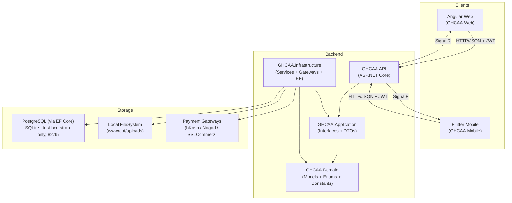

# GHCAA Platform — Complete Project Class Map
> **Version:** 2.5 · **Date:** 2026-04-24 · **Maintainer:** Update this file whenever a class/interface changes.

---

## Table of Contents
1. [Architecture Overview](#architecture-overview)
2. [Domain Layer — Models](#domain-layer--models)
3. [Domain Layer — Enums & Constants](#domain-layer--enums--constants)
4. [Application Layer — Interfaces](#application-layer--interfaces)
5. [Application Layer — DTOs (summary)](#application-layer--dtos-summary)
6. [Infrastructure Layer — Services (DI Map)](#infrastructure-layer--services-di-map)
7. [Infrastructure Layer — Payment Gateways](#infrastructure-layer--payment-gateways)
8. [Infrastructure Layer — Data / EF Context](#infrastructure-layer--data--ef-context)
9. [API Layer — Controllers](#api-layer--controllers)
10. [API Layer — Hubs (SignalR)](#api-layer--hubs-signalr)
11. [API Layer — Middleware Pipeline](#api-layer--middleware-pipeline)
12. [Web (Angular) — TypeScript Models](#web-angular--typescript-models)
13. [Web (Angular) — Service Classes (detailed)](#web-angular--service-classes-detailed)
14. [Web (Angular) — Component Inventory](#web-angular--component-inventory)
15. [Web (Angular) — Routes & Guards](#web-angular--routes--guards)
16. [Mobile (Flutter) — Core Infrastructure](#mobile-flutter--core-infrastructure)
17. [Mobile (Flutter) — Feature Service Classes (detailed)](#mobile-flutter--feature-service-classes-detailed)
18. [Mobile (Flutter) — Screens Inventory](#mobile-flutter--screens-inventory)
19. [Test Project — GHCAA.Tests](#test-project--ghcaatests)
20. [Web (Angular) — Test Specs](#web-angular--test-specs)
21. [Cross-Layer Dependency Matrix](#cross-layer-dependency-matrix)
22. [Cross-Layer Event Form Controls](#cross-layer-event-form-controls)
23. [Comprehensive Form Controls Map](#comprehensive-form-controls-map)
24. [Update Protocol (Mandatory)](#update-protocol-mandatory)

---

## Architecture Overview

**Rate Limits (Program.cs):**
| Policy | Window | Limit |
|---|---|---|
| `auth` | 1 min | 5 req |
| `registration` | 5 min | 10 req |
| `api` | 1 min | 100 req |

### Institution Profile Packs (Work Package 62)

Added 2026-09. `profiles/<name>/` (e.g. `profiles/ghc/`, `profiles/default/`) holds
`org-config.json`, `demo-data/*.json`, `site-content.json`, `seo.json`, and `assets/` for one
institution. `IInstitutionProfileProvider`/`InstitutionProfileProvider` in Infrastructure read the
`ORG_PROFILE` environment variable and pick the matching folder, falling back file by file to
`profiles/default/` for anything missing. Four things read from this:

- `OrgConfigService.BuildDefaults()`. The pack only drives config once `ORG_PROFILE` is explicitly
  set. Left unset, the service keeps the hardcoded GHC defaults it always had (see
  `OrgConfigDto`/`OrgConfigService` further down, in Infrastructure Layer — Services).
- `ApplicationDbContext.LoadSeed`. Sends Class 1/2/3 seed files (see
  `docs/SEED_CLASSIFICATION.md`) to the active profile's `demo-data/` folder or root, falling back
  to `Data/Seed/` if nothing profile-specific exists.
- `GHCAA.Web`'s `scripts/apply-brand.mjs`, `generate-org-config-fallback.mjs`, and
  `generate-site-content.mjs`. Run at build time. They rewrite `index.html`, the sitemap, and the
  favicons, and generate the Angular boot fallback from the pack.
- `GHCAA.Mobile/tool/apply_profile.dart`. Also build time, syncs the app label, icons, and splash
  screen per flavor.

`scripts/brand-lint.mjs` scans API/Web/Mobile source for GHC-specific literals and warns (it does
not block a build yet). For the full mechanism and where it stands, see
`docs/WHITE_LABEL_PLAN.md`, `docs/INSTITUTION_ONBOARDING.md`, and Work Package 62 in
`docs/TODO.md`.

### Environments & Pipelines

| Environment | API Config | Mobile Config | Pipeline Config | Purpose |
|---|---|---|---|---|
| **Development** | `appsettings.Development.json` | `.env` | Local / Manual | Daily development & local database testing |
| **Pre-Production** | `appsettings.Preprod.json` | `.env.preprod` | `.github/workflows/ghcaa-ci-preprod.yml` | Full-stack CI/CD validation on the `preprod` branch |
| **Production** | `appsettings.json` (w/ Env Vars) | Managed via fastlane | `.github/workflows/ghcaa-ci-standard.yml` | Live user environment |

---

## Domain Layer — Models

### `Member` _(GHCAA.Domain.Models)_
**File:** `GHCAA.Domain/Models/Member.cs`

| Property | Type | Notes |
|---|---|---|
| `Id` | `int` | PK |
| `FullName` | `string` | Required |
| `FatherName` | `string` | Required |
| `MotherName` | `string` | Required |
| `DateOfBirth` | `DateTime` | |
| `Gender` | `Gender` enum | |
| `BloodGroup` | `BloodGroup` enum | |
| `NID` | `string` | 10/13/17 digits |
| `MobileNo` | `string` | 11 digits |
| `Email` | `string` | OTP verified |
| `EmailVerified` | `bool` | |
| `PresentAddress` | `string` | |
| `PermanentAddress` | `string` | |
| `EmergencyContactName` | `string` | |
| `EmergencyContactRelation` | `string` | |
| `EmergencyContactPhone` | `string` | |
| `PhotoPath` | `string?` | |
| `SignaturePath` | `string?` | |
| `TShirtSize` | `string?` | |
| `CertificatePath` | `string?` | |
| `PaymentProofPath` | `string?` | |
| `Status` | `MembershipStatus` enum | |
| `AppliedDate` | `DateTime` | |
| `ApprovedDate` | `DateTime?` | |
| `ApprovedBy` | `int?` | Admin Member ID |
| `MembershipNumber` | `string?` | e.g. GHC-2026-0001 |
| `IsMobilePublic` | `bool` | |
| `IsEmailPublic` | `bool` | |
| `IsAddressPublic` | `bool` | |
| `IsNIDPublic` | `bool` | |
| `IsFamilyPublic` | `bool` | |
| `HasAcceptedTerms` | `bool` | |
| `HasAcceptedGdpr` | `bool` | |
| `GdprAcceptedAt` | `DateTime?` | |
| `NotifyEventCreation` | `bool` | |
| `NotifyParticipationApproval` | `bool` | |
| `NotifyRegistrationUpdate` | `bool` | |
| `NotifyRelevantUpdates` | `bool` | |
| `IsArchived` | `bool` | |
| `LastUpdateDate` | `DateTime` | |
| `MembershipType` | `MembershipType` enum | Default: General |
| `Category` | `MemberCategory` enum | |
| `MembershipChangeReason` | `string?` | |
| `ECChangeReason` | `string?` | |
| `IsVerified` | `bool` | Blue tick |
| `ContributionPoints` | `int` | Gamification |
| `IsProfileComplete` | `bool` | 100% completion flag |

**Navigation:**
- `User?` → `User`
- `ECMembers` → `ICollection<ECMember>`
- `AcademicHistory` → `ICollection<AcademicRecord>`
- `ProfessionalHistory` → `ICollection<ProfessionalRecord>`
- `PaymentHistories` → `ICollection<PaymentHistory>`
- `SentFamilyLinkRequests` / `ReceivedFamilyLinkRequests` → `ICollection<FamilyLinkRequest>`

---

### `User` _(GHCAA.Domain.Models)_
**File:** `GHCAA.Domain/Models/User.cs`

| Property | Type | Notes |
|---|---|---|
| `Id` | `int` | PK |
| `Username` | `string` | = MembershipNumber |
| `PasswordHash` | `string` | BCrypt |
| `MemberId` | `int?` | FK → Member (post-approval) |
| `CreatedAt` | `DateTime` | |
| `IsActive` | `bool` | |
| `IsArchived` | `bool` | |
| `MustChangePassword` | `bool` | |
| `ResetToken` | `string?` | |
| `ResetTokenExpiry` | `DateTime?` | |
| `SecurityStamp` | `string` | GUID — session invalidation |
| `GoogleId` | `string?` | Social identifier |
| `FacebookId` | `string?` | Social identifier |

**Navigation:** `Member?`, `ICollection<Role>`

---

### `AlumniEvent` _(GHCAA.Domain.Models)_
**File:** `GHCAA.Domain/Models/AlumniEvent.cs`

| Property | Type | Notes |
|---|---|---|
| `Id` | `int` | PK |
| `Title` | `string` | Max 200 |
| `Description` | `string` | |
| `StartDate` | `DateTime` | |
| `EndDate` | `DateTime` | |
| `Location` | `string` | Max 200 |
| `RegistrationFee` | `decimal?` | |
| `RequiresPayment` | `bool` | |
| `Status` | `EventStatus` enum | Draft/Published/Archived |
| `IsActive` | `bool` | |
| `AllowNonMembers` | `bool` | |
| `ImageUrl` | `string?` | Max 500 |
| `RegistrationStartDate` | `DateTime?` | |
| `RegistrationEndDate` | `DateTime?` | |
| `AdminNote` | `string?` | |
| `ParticipantLimit` | `int?` | |
| `HasWaitlist` | `bool` | |
| `CreatedAt` | `DateTime` | |

---

### `EventRegistration` _(GHCAA.Domain.Models)_
**File:** `GHCAA.Domain/Models/EventRegistration.cs`

| Property | Type |
|---|---|
| `Id`, `EventId`, `MemberId?` | `int` |
| `IsNonMember` | `bool` |
| `GuestName?`, `GuestEmail?`, `GuestMobile?` | `string?` |
| `PaymentReference?`, `ReceiptPath?` | `string?` |
| `ContributionAmount?` | `decimal?` |
| `PaymentMethod` | `PaymentMethod` enum |
| `Status` | `EventRegistrationStatus` enum |
| `RegisteredAt` | `DateTime` |
| `TicketCode?` | `string?` |
| `IsCheckedIn`, `CheckedInAt?` | bool / DateTime? |
| `ApprovedAt?`, `ApprovedByAdminId?` | DateTime? / int? |

**Navigation:** `AlumniEvent?`, `Member?`

---

### `NewsPost` _(GHCAA.Domain.Models)_
**File:** `GHCAA.Domain/Models/NewsPost.cs`

| Property | Type | Notes |
|---|---|---|
| `Id` | `int` | |
| `Title` | `string` | Max 200 |
| `Content` | `string` | HTML |
| `ArticleCategory` | `ArticleCategory` enum | Event/Magazine/Regular |
| `Status` | `SubmissionStatus` enum | |
| `PublishDate` | `DateTime` | |
| `IsActive` | `bool` | |
| `ImageUrl` | `string?` | |
| `AuthorId` | `int` | FK → User |
| `LastModified` | `DateTime?` | |
| `ExternalCollaborators` | `string?` | |
| `PostType` | `PostType` enum | News/Notice — discriminates the merged board; defaults to News |
| `AttachmentUrl` | `string?` | Notice PDF |
| `AttachmentFileName` | `string?` | Original filename for the download link |

**Navigation:** `User? Author`, `ICollection<NewsCollaborator>`

---

### `SiteContent` _(GHCAA.Domain.Models)_
**File:** `GHCAA.Domain/Models/SiteContent.cs`

| Property | Type | Notes |
|---|---|---|
| `Id` | `int` | |
| `Key` | `string` | Unique index; e.g. `about-origin`, `contact-intro` |
| `Title` | `string` | |
| `BodyHtml` | `string` | Sanitized server-side on every write |
| `DisplayOrder` | `int` | Public render order |
| `IsActive` | `bool` | Anonymous reads return active blocks only |
| `LastModified` | `DateTime?` | |
| `UpdatedByAdminId` | `int?` | |

---

### `JobOpportunity` _(GHCAA.Domain.Models)_
**File:** `GHCAA.Domain/Models/JobOpportunity.cs`

| Property | Type |
|---|---|
| `Id`, `PostedByMemberId` | `int` |
| `Title`, `Company`, `Location` | `string` |
| `Description`, `Requirements`, `ContactEmail` | `string` |
| `ApplicationLink?` | `string?` |
| `PostedDate` | `DateTime` |
| `ExpiryDate?` | `DateTime?` |
| `IsActive` | `bool` |
| `JobCategory` | `JobCategory` enum |

**Navigation:** `Member? PostedBy`

---

### `FinancialRecord` _(GHCAA.Domain.Models)_
**File:** `GHCAA.Domain/Models/FinancialRecord.cs`

| Property | Type |
|---|---|
| `Id`, `Year`, `CreatedByAdminId` | `int` |
| `RecordType` | `FinancialRecordType` enum |
| `FinancialCategory` | `FinancialCategory` enum |
| `Date` | `DateTime` |
| `Amount` | `decimal` |
| `Description` | `string` |
| `Reference?` | `string?` |
| `CreatedAt` | `DateTime` |

---

### `PaymentConfiguration` _(GHCAA.Domain.Models)_
**File:** `GHCAA.Domain/Models/PaymentConfiguration.cs`

| Property | Type | Notes |
|---|---|---|
| `Id` | `int` | |
| `Method` | `PaymentMethod` enum | |
| `DisplayName` | `string` | |
| `Description?`, `Icon?` | `string?` | |
| `IsEnabled` | `bool` | |
| `WalletNumber?`, `AccountHolderName?` | `string?` | Mobile wallets |
| `BankName?`, `BranchName?`, `AccountNumber?`, `RoutingNumber?` | `string?` | Bank transfer |
| `Gateway` | `PaymentGateway` enum | |
| `GatewayPublicKey?`, `GatewaySecretKey?`, `GatewayCallbackUrl?` | `string?` | |
| `IsSandbox` | `bool` | |
| `SortOrder` | `int` | |
| `Instructions?` | `string?` | |
| `RequiresReceipt`, `RequiresReference` | `bool` | |
| `CreatedAt`, `UpdatedAt?` | `DateTime` | |

---

### `FamilyLinkRequest` _(GHCAA.Domain.Models)_

| Property | Type |
|---|---|
| `Id`, `RequesterId`, `TargetMemberId` | `int` |
| `Relationship` | `RelationshipType` enum |
| `Status` | `FamilyLinkStatus` enum |
| `Note?` | `string?` |
| `RequestedAt`, `RespondedAt?` | `DateTime` |

**Navigation:** `Member? Requester`, `Member? TargetMember`

---

### `Poll` _(GHCAA.Domain.Models)_
| Property | Type | Notes |
|---|---|---|
| `Id` | `int` | PK |
| `Title`, `Description?` | `string` | |
| `AllowMultipleChoice` | `bool` | |
| `IsActive`, `IsArchived` | `bool` | |
| `CreatedAt`, `ExpiryDate?` | `DateTime` | |
| `CreatedBy` | `int` | Admin Member ID |

---

### `SocialAuthConfig` _(GHCAA.Domain.Models)_
| Property | Type | Notes |
|---|---|---|
| `Id` | `int` | PK |
| `Provider` | `SocialProvider` enum | |
| `ClientId`, `ClientSecret?` | `string` | |
| `IsEnabled` | `bool` | |

---

### `MentorshipRequest` _(GHCAA.Domain.Models)_

| Property | Type |
|---|---|
| `Id`, `RequesterId`, `MentorId` | `int` |
| `Message?`, `Domain?`, `ResponseNote?` | `string?` |
| `Status` | `MentorshipStatus` (local enum) |
| `RequestedAt`, `RespondedAt?` | `DateTime` |

**Navigation:** `Member? Requester`, `Member? Mentor`

---

### Other Domain Models (summary)

| Model | Key FKs / Notes |
|---|---|
| `AcademicRecord` | FK → Member |
| `ProfessionalRecord` | FK → Member; has `OrganizationName`, `Designation`, `StartDate` (Required) |
| `PaymentHistory` | FK → Member; has `TransactionId` (Required), `Amount`, `Status` |
| `MembershipDue` | FK → Member; annual due tracking |
| `MembershipHistory` | FK → Member; type-change audit |
| `MembershipFeeConfig` | Fee table by MembershipType + Year |
| `ActivityLog` | `MemberId?`, `Type`, `Description`, `IpAddress` |
| `Notification` | `MemberId`, `Title`, `Message`, `IsRead`, `Type` |
| `ChatMessage` | `SenderId`, `RecipientId`, `Content` |
| `EmailTemplate` | `Code`, `Subject`, `HtmlTemplate` |
| `EmailLog` | `To`, `TemplateCode`, `SentAt`, `IsSuccess` |
| `Constitution` | `Version`, `Content`, `IsActive`, `VotesFor/Against` |
| `ECPeriod` | `Title`, `StartDate`, `EndDate`, `IsActive` |
| `ECMember` | FK → Member + ECPeriod; `Position` (ECPosition enum) |
| `EventGallery` | `Title`, `EventId?`, `Photos` |
| `EventBudget` | FK → AlumniEvent; `TotalBudget`, `Expenses` |
| `EventTask` | FK → AlumniEvent; `Title`, `IsCompleted` |
| `LookupItem` | `Category`, `Value`, `Label` |
| `FileUpload` | `Path`, `Type` (FileUploadType), `Status` |
| `Role` | `Name`, FK → User (many-to-many) |
| `PollOption` | FK → Poll; `OptionText` |
| `PollVote` | FK → Poll + PollOption + Member |
| `Otp` | `Email`, `Code`, `ExpiresAt`, `Purpose` |
| `ContactMessage` | `Name`, `Email`, `Subject`, `Body`, `IsRead` |
| `SavedPaymentMethod` | FK → Member; `Method`, `AccountNumber` |
| `SpecialDayTheme` | `Name`, `Date`, `CssClass`, `IsActive` |
| `GamificationConfig` | `PointsPerAction`, Rules |

---

## Domain Layer — Enums & Constants

### Enums (`GHCAA.Domain.Enums`)

| Enum | Values |
|---|---|
| `MembershipStatus` | Applied, Active, InactivePayment, InactiveResigned, Terminated |
| `MembershipType` | Founding, Executive, General, Associate, Honorary, Advisory, Guest |
| `MemberCategory` | None, LifelongPatron, Sponsor, Advisor, Mentor, Recruiter, Active, Volunteer, Contributor, Guest, Student |
| `ECPosition` | None, President, VicePresident, GeneralSecretary, OfficeSecretary, JointSecretary1/2, Treasurer, MediaCulturalAndSportsSecretary, OrganizationalSecretary, InformationAndTechnologySecretary, Member1/2, LawSecretary, ImmediatePastPresident, InstitutionalRepresentative |
| `BloodGroup` | Unknown, APositive, ANegative, BPositive, BNegative, OPositive, ONegative, ABPositive, ABNegative |
| `Gender` | None, Male, Female, Other |
| `Degree` | HSC, Bachelor, Masters, PhD, Other |
| `FileUploadType` | Photo, Certificate, PaymentProof, Signature, GalleryPhoto, NewsImage |
| `FileUploadStatus` | Pending, Approved, Rejected |
| `OtpPurpose` | Registration, PasswordReset |
| `PaymentStatus` | Pending, Completed, Failed, Refunded |
| `FinancialRecordType` | Income, Expense |
| `FinancialCategory` | MembershipFee, RegistrationFee, Donation, Event, Maintenance, Salary, Utilities, ReunionFee, Sponsorship, Grant, Refund, Other |
| `NewsCategory` | News, OrganisationalUpdate, BusinessInformation |
| `ArticleCategory` | Event, Magazine, Regular |
| `SubmissionStatus` | Draft, Pending, Approved, Rejected |
| `JobCategory` | IT, Finance, Engineering, Marketing, Education, Health, PublicSector, Mentorship, Other |
| `EventRegistrationStatus` | Pending, Approved, Rejected, Waitlisted |
| `PaymentMethod` | ManualReceipt, BKash, Nagad, Rocket, CreditCard, BankTransfer, CashOnHand |
| `PaymentGateway` | None, Stripe, PayPal, SSLCommerz, BkashGateway, NagadGateway, RocketGateway, BankTransferGateway, Manual |
| `EventStatus` | Draft, Published, Archived |
| `FamilyLinkStatus` | Requested, Accepted, Rejected, Cancelled |
| `RelationshipType` | Spouse, Parent, Child, Sibling, Other |
| `VolunteerRole` | EventOrganizer, GuestManagement, ContentCreator, Mentor, TechnicalSupport, Other |
| `NotificationType` | EventCreation, ParticipationApproval, RegistrationUpdate, GeneralSystem, DirectMessage |
| `SocialProvider` | Google, Facebook |

### Constants (`GHCAA.Domain.Constants`)

| Class | Key Constants |
|---|---|
| `Roles` | `SuperAdmin`, `Admin`, `Member` |
| `ConfigKeys` | MaxFileSizeBytes, UploadsRelativePath, SecureRelativePath, ImageCompression keys, AllowedOrigins, ClientUrl |
| `Branding` | AppName="GHCAA", OrganizationName, Tagline, RegisteredOffice |
| `TemplateCodes` | `OTP_EMAIL`, `WELCOME_EMAIL`, `FEE_REMINDER`, `PASSWORD_RESET` |
| `EmailSubjects` | PasswordReset, OtpVerification |
| `Defaults` | MaxFileSizeBytes=50MB, ImageQuality=85, MembershipPrefix="GHC-", SupportEmail |

---

## Application Layer — Interfaces

### `IMemberService`
**Impl:** `MemberService` · **File:** `GHCAA.Infrastructure/Services/MemberService.cs`

| Method | Returns | Auth |
|---|---|---|
| `RegisterAsync(dto, photo, cert, proof, ct)` | `Task<int>` | Public |
| `VerifyEmailAsync(email, code, ct)` | `Task<bool>` | Public |
| `ResendOtpAsync(email, ct)` | `Task<bool>` | Public |
| `ApproveMemberAsync(memberId, adminId, ct)` | `Task<ApproveMemberResultDto>` | Admin (Enforces Paid+Complete) |
| `GetProfileAsync(memberId, isPrivileged, ct)` | `Task<MemberProfileDto?>` | Member |
| `UpdateProfileAsync(memberId, dto, ct)` | `Task<bool>` | Member |
| `GetDashboardStatsAsync(isPrivileged, ct)` | `Task<object>` | Auth |
| `GetStatusAsync(id, ct)` | `Task<MemberRegistrationResultDto>` | Public |
| `GetMemberDocumentsAsync(memberId, ct)` | `Task<object?>` | Member |
| `ArchiveMemberAsync(memberId, ct)` | `Task<bool>` | Admin |
| `RestoreMemberAsync(memberId, ct)` | `Task<bool>` | Admin |
| `ReactivateMemberAsync(memberId, ct)` | `Task<bool>` | Admin |
| `GetAllMembersAsync(page, pageSize, search, status, category, type, includeArchived, isSuperAdmin, ct)` | `Task<object>` | Admin |
| `AdminUpdateMemberAsync(id, dto, adminId, isPrivilegedCaller, ct)` | `Task<bool>` | Admin |
| `RejectMemberAsync(id, adminId, reason, ct)` | `Task<bool>` | Admin |
| `SendAdminPasswordResetLinkAsync(memberId, isPrivilegedCaller, ct)` | `Task<(bool, string?)>` | Admin |
| `GetPublicStatsAsync(ct)` | `Task<object>` | Public |
| `UpdateMemberDocumentsAsync(id, cert, proof, ct)` | `Task<bool>` | Admin |
| `UpdateMemberPhotoAsync(memberId, photo, ct)` | `Task<string>` | Member |
| `UpdateMemberSignatureAsync(memberId, sig, ct)` | `Task<string>` | Member |
| `BulkArchiveInactiveMembersAsync(ct)` | `Task<int>` | Admin |
| `SyncAlumniAsync(ct)` | `Task<int>` | Admin |

**Dependencies injected:** `ApplicationDbContext`, `IFileStorageService`, `IOtpService`, `ICommunicationService`, `INotificationService`, `ITokenService`, `IActivityService`

---

### `IEventService`
**Impl:** `EventService`

| Method | Returns |
|---|---|
| `GetActiveEventsAsync(ct)` | `IEnumerable<EventDto>` |
| `GetAllEventsForAdminAsync(ct)` | `IEnumerable<EventDto>` |
| `GetEventByIdAsync(id, ct)` | `EventDto?` |
| `CreateEventAsync(dto, ct)` | `AlumniEvent` |
| `UpdateEventAsync(dto, ct)` | `AlumniEvent?` |
| `DeleteEventAsync(id, ct)` | `bool` |
| `UpdateEventLogoAsync(eventId, logo, ct)` | `string` |
| `RegisterForEventAsync(dto, memberId, receipt, ct)` | `EventRegistration` |
| `GetRegistrationsByMemberAsync(memberId, ct)` | `IEnumerable<EventRegistration>` |
| `GetAllRegistrationsForAdminAsync(page, size, eventId, status, search, ct)` | `object` |
| `ApproveRegistrationAsync(regId, adminId, approve, ct)` | `bool` |
| `GetRegistrationByIdAsync(id, ct)` | `EventRegistration?` |
| `SendInvitationEmailAsync(regId, ct)` | `bool` |
| `GetPublicParticipantsAsync(eventId, ct)` | `IEnumerable<PublicParticipantDto>` |
| `GetEventTasksAsync(eventId, ct)` | `IEnumerable<EventTaskDto>` |
| `CreateEventTaskAsync(dto, ct)` | `EventTask` |
| `ToggleTaskStatusAsync(taskId, ct)` | `bool` |
| `DeleteTaskAsync(taskId, ct)` | `bool` |
| `GetEventBudgetAsync(eventId, ct)` | `EventBudgetDto?` |
| `UpdateEventBudgetAsync(dto, ct)` | `bool` |
| `AddEventExpenseAsync(dto, ct)` | `EventExpense` |
| `DeleteExpenseAsync(expId, ct)` | `bool` |
| `CheckInParticipantAsync(regId, ct)` | `bool` |
| `CheckInByTicketCodeAsync(code, ct)` | `bool` |

---

### `IFinancialService`
**Impl:** `FinancialService`

| Method | Returns |
|---|---|
| `GetMemberPaymentHistoryAsync(memberId, ct)` | `IEnumerable<PaymentHistoryDto>` |
| `RecordPaymentAsync(dto, ct)` | `PaymentHistoryDto` |
| `UpdatePaymentStatusAsync(paymentId, status, notes, ct)` | `bool` |
| `ProcessGatewayPaymentAsync(txnId, amount, notes, ct)` | `bool` |
| `GetMemberMembershipHistoryAsync(memberId, ct)` | `IEnumerable<MembershipHistoryDto>` |
| `RecordMembershipChangeAsync(memberId, from, to, adminId, reason, ct)` | `Task` |
| `GetMemberDuesAsync(memberId, ct)` | `IEnumerable<MembershipDueDto>` |
| `GenerateAnnualDuesAsync(year, ct)` | `Task` |
| `MarkDueAsPaidAsync(dueId, paymentHistoryId, ct)` | `bool` |
| `GetMembershipFeeConfigsAsync(ct)` | `IEnumerable<MembershipFeeConfigDto>` |
| `AddMembershipFeeConfigAsync(dto, adminId, ct)` | `MembershipFeeConfigDto` |
| `UpdateMembershipFeeConfigAsync(dto, adminId, ct)` | `MembershipFeeConfigDto` |
| `GetApplicableMembershipFeeAsync(type, year, ct)` | `decimal` |
| `GetApplicableFeeAsync(category, type, date, ct)` | `decimal` |
| `DeletePaymentAsync(paymentId, ct)` | `bool` |
| `GenerateTaxReceiptAsync(paymentId, ct)` | `byte[]` |
| `GetSavedPaymentMethodsAsync(memberId, ct)` | `IEnumerable<SavedPaymentMethodDto>` |
| `AddSavedPaymentMethodAsync(memberId, dto, ct)` | `SavedPaymentMethodDto` |
| `DeleteSavedPaymentMethodAsync(memberId, id, ct)` | `bool` |

---

### `IFinancialLedgerService`
**Impl:** `FinancialLedgerService`

| Method | Returns |
|---|---|
| `GetRecordsAsync(page, size, year, search, type, ct)` | `object` |
| `GetAllRecordsForExportAsync(year, ct)` | `IEnumerable<FinancialRecord>` |
| `AddRecordAsync(record, ct)` | `FinancialRecord` |
| `UpdateRecordAsync(record, ct)` | `FinancialRecord` |
| `DeleteRecordAsync(id, ct)` | `bool` |
| `GetSummaryAsync(year, ct)` | `LedgerSummaryDto` |
| `ExportRecordsAsync(year, ct)` | `byte[]` |

---

### `IGovernanceService`
**Impl:** `GovernanceService`

| Method | Returns |
|---|---|
| `GetAllPeriodsAsync(ct)` | `IEnumerable<ECPeriodDto>` |
| `GetPeriodByIdAsync(id, ct)` | `ECPeriodDto?` |
| `CreatePeriodAsync(title, start, end, ct)` | `ECPeriodDto` |
| `UpdatePeriodAsync(id, title, start, end, isActive, ct)` | `bool` |
| `ActivatePeriodAsync(id, ct)` | `bool` |
| `GetCommitteeMembersAsync(periodId, ct)` | `IEnumerable<ECMemberDto>` |
| `AssignMemberToRoleAsync(periodId, memberId, position, reason, ct)` | `bool` |
| `RemoveMemberFromCommitteeAsync(ecMemberId, ct)` | `bool` |
| `DeleteECMemberAsync(id, ct)` | `bool` |
| `GetActivePeriodAsync(ct)` | `ECPeriodDto?` |
| `GetActiveConstitutionAsync(ct)` | `Constitution?` |
| `GetConstitutionHistoryAsync(ct)` | `IEnumerable<Constitution>` |
| `CreateConstitutionVersionAsync(version, content, summary, ct)` | `bool` |
| `ActivateConstitutionAsync(id, ct)` | `bool` |
| `VoteOnConstitutionAsync(id, memberId, isFor, comments, ct)` | `bool` |

---

### `ICommunicationService`
**Impl:** `CommunicationService`

| Method | Returns |
|---|---|
| `GetAllTemplatesAsync(ct)` | `IEnumerable<EmailTemplate>` |
| `GetTemplateByCodeAsync(code, ct)` | `EmailTemplate?` |
| `UpdateTemplateAsync(template, ct)` | `EmailTemplate` |
| `CreateTemplateAsync(template, ct)` | `EmailTemplate` |
| `DeleteTemplateAsync(id, ct)` | `Task` |
| `GetRecentLogsAsync(count, ct)` | `IEnumerable<EmailLog>` |
| `SendIndividualEmailAsync(memberId, code, vars, ct)` | `Task` |
| `SendBatchEmailAsync(passingYears, code, vars, ct)` | `Task` |
| `SendTypeEmailAsync(types, code, vars, ct)` | `Task` |
| `SendCustomEmailAsync(emails, code, subject, html, vars, ct)` | `Task` |
| `SendBatchCustomEmailAsync(passingYears, subject, html, ct)` | `Task` |
| `SendTypeCustomEmailAsync(types, subject, html, ct)` | `Task` |
| `SendMemberCustomEmailAsync(memberId, subject, html, ct)` | `Task` |
| `SendEmailByCodeAsync(to, code, vars, member, ct)` | `Task` |

---

### `INotificationService`
**Impl:** `NotificationService`

| Method | Returns |
|---|---|
| `CreateNotificationAsync(memberId, title, msg, type, url, ct)` | `Task` |
| `BroadcastNotificationAsync(title, msg, type, url, ct)` | `Task` |
| `GetUserNotificationsAsync(memberId, ct)` | `IEnumerable<Notification>` |
| `MarkAsReadAsync(notifId, memberId, ct)` | `bool` |
| `MarkAllAsReadAsync(memberId, ct)` | `Task` |

---

### `INewsService`
**Impl:** `NewsService`

| Method | Returns |
|---|---|
| `GetActiveNewsAsync(articleCategory, postType, ct)` | `IEnumerable<NewsPostDto>` |
| `GetAllNewsForAdminAsync(ct)` | `IEnumerable<NewsPostDto>` |
| `GetPendingSubmissionsAsync(ct)` | `IEnumerable<NewsPostDto>` |
| `GetMySubmissionsAsync(userId, ct)` | `IEnumerable<NewsPostDto>` |
| `GetNewsByIdAsync(id, ct)` | `NewsPostDto?` |
| `CreateNewsAsync(dto, authorId, ct)` | `NewsPostDto` |
| `UpdateNewsAsync(dto, ct)` | `NewsPostDto` |
| `DeleteNewsAsync(id, ct)` | `bool` |
| `ApproveArticleAsync(id, ct)` | `bool` |
| `RejectArticleAsync(id, ct)` | `bool` |
| `AddCollaboratorAsync(newsId, userId, ct)` | `bool` |
| `RemoveCollaboratorAsync(newsId, userId, ct)` | `bool` |

---

### `IJobHubService`
**Impl:** `JobHubService`

| Method | Returns |
|---|---|
| `GetActiveJobsAsync(category, query, ct)` | `IEnumerable<JobDto>` |
| `PostJobAsync(dto, memberId, ct)` | `JobDto` |
| `GetJobByIdAsync(id, ct)` | `JobDto?` |
| `DeactivateJobAsync(id, ct)` | `bool` |
| `UpdateJobAsync(id, dto, memberId, isAdmin, ct)` | `bool` |
| `GetMemberJobsAsync(memberId, ct)` | `IEnumerable<JobDto>` |

---

### `INetworkingService`
**Impl:** `NetworkingService`

| Method | Returns |
|---|---|
| `GetMemberProfileAsync(memberId, ct)` | `MemberProfileDto?` |
| `SearchMembersAsync(filter, ct)` | `PagedResult<MemberSummaryDto>` |
| `GetExecutiveCommitteeAsync(periodId, ct)` | `IEnumerable<MemberSummaryDto>` |
| `GetECPeriodsAsync(ct)` | `IEnumerable<object>` |
| `GetLatestAlumniUpdatesAsync(count, ct)` | `IEnumerable<MemberSummaryDto>` |

**Helper Classes:** `MemberSearchFilterDto`, `PagedResult<T>`

---

### `IGalleryService`
**Impl:** `GalleryService`

| Method | Returns |
|---|---|
| `CreateEventGalleryAsync(gallery, ct)` | `EventGallery` |
| `AddPhotosToGalleryAsync(galleryId, paths, ct)` | `bool` |
| `GetAllGalleriesAsync(onlyActive, ct)` | `IEnumerable<EventGallery>` |
| `GetGalleryByIdAsync(id, ct)` | `EventGallery?` |
| `UpdateEventGalleryAsync(gallery, ct)` | `EventGallery` |
| `DeleteGalleryAsync(id, ct)` | `bool` |
| `RemovePhotoAsync(photoId, ct)` | `bool` |

---

### `IFamilyLinkService`
**Impl:** `FamilyLinkService`

| Method | Returns |
|---|---|
| `SendRequestAsync(requesterId, dto, ct)` | `FamilyLinkRequestDto` |
| `RespondAsync(respondingMemberId, dto, ct)` | `bool` |
| `CancelAsync(requesterId, requestId, ct)` | `bool` |
| `GetSentRequestsAsync(memberId, ct)` | `List<FamilyLinkRequestDto>` |
| `GetReceivedRequestsAsync(memberId, ct)` | `List<FamilyLinkRequestDto>` |
| `GetFamilyAsync(memberId, ct)` | `List<FamilyLinkRequestDto>` |
| `RemoveLinkAsync(memberId, requestId, ct)` | `bool` |

---

### `IMentorshipService`
**Impl:** `MentorshipService`

| Method | Returns |
|---|---|
| `SendRequestAsync(requesterId, mentorId, msg, domain, ct)` | `MentorshipRequest` |
| `GetSentRequestsAsync(requesterId, ct)` | `IEnumerable<object>` |
| `GetReceivedRequestsAsync(mentorId, ct)` | `IEnumerable<object>` |
| `RespondAsync(requestId, mentorId, accept, note, ct)` | `bool` |
| `MarkCompleteAsync(requestId, memberId, ct)` | `bool` |
| `GetAllForAdminAsync(ct)` | `IEnumerable<object>` |

---

### `IPollService`
**Impl:** `PollService`

| Method | Returns | Auth |
|---|---|---|
| `GetActivePollsAsync(memberId, ct)` | `List<PollDto>` | Member |
| `GetAllPollsAsync(ct)` | `List<PollDto>` | Admin |
| `GetPollByIdAsync(id, memberId, ct)` | `PollDto?` | Member |
| `CreatePollAsync(dto, adminId, ct)` | `int` | Admin |
| `VoteAsync(pollId, memberId, optionIds, ct)` | `bool` | Member |
| `TogglePollStatusAsync(id, isActive, ct)` | `bool` | Admin |
| `DeletePollAsync(id, ct)` | `bool` | Admin |

---

### Other Interfaces (summary)

| Interface | Impl | Key Methods |
|---|---|---|
| `IAuthService` | `AuthService` | `LoginAsync`, `GoogleLoginAsync`, `FacebookLoginAsync` |
| `IUserService` | `UserService` | CRUD on User entity |
| `ITokenService` | `TokenService` | `GenerateToken(user)` |
| `IRoleService` | `RoleService` | `CreateRole`, `AssignRoleToUser`, `RemoveRole`, `GetUserRoles` |
| `ILookupService` | `LookupService` | `GetByCategory(cat)`, `GetAll()`, `Add()`, `Delete()` |
| `IOtpService` | `OtpService` | `GenerateOtpAsync(email, purpose)`, `ValidateOtpAsync(email, code)` |
| `IActivityService` | `ActivityService` | `LogActivityAsync(...)`, `GetMemberActivity(...)`, `GetRecentGlobal(...)` |
| `IFileStorageService` | `LocalFileStorageService` | `SaveFileAsync(stream, name, type)`, `DeleteFileAsync(path)` |
| `IFileUploadRepository` | `FileUploadRepository` | DB CRUD for FileUpload records |
| `IChatService` | `ChatService` | `SendMessage`, `GetConversation`, `GetContacts` |
| `IContactService` | `ContactService` | `SubmitMessageAsync`, `GetAllAsync`, `MarkReadAsync` |
| `IAssistantService` | `AssistantService` | `SendMessageAsync(prompt, history)` → AI response |
| `ISmsService` | `GreenwebSmsService` | `SendSmsAsync(number, message)` |
| `IEmailService` | `GmailEmailService` | `SendAsync(to, subject, html)` |
| `IIDCardService` | `IDCardService` | `GenerateIdCardPdfAsync(memberId)` → `byte[]` |
| `IGamificationService` | `GamificationService` | `AddPoints`, `GetLeaderboard`, `GetConfig` |
| `IMemberImportService` | `MemberImportService` | `ImportFromCsvAsync(stream)` |
| `IThemeService` | `ThemeService` | `GetActiveTheme()`, `SetTheme(id)`, `CreateTheme(dto)` |
| `IInstitutionProfileProvider` | `InstitutionProfileProvider` | `ProfileName`, `OrgConfigDefaults` — reads `profiles/<ORG_PROFILE>/org-config.json`, resolved eagerly at boot. `AddSingleton`, not consumed anywhere yet (docs/TODO.md 62.1) |
| `IRealTimeService` | `RealTimeService` (API) | `NotifyUserAsync(userId, event, data)`, `BroadcastAsync(...)` |
| `IPaymentGatewayService` | `SSLCommerzGateway` | Gateways/ |
| `IPaymentGatewayService` | `BkashGateway` | Gateways/ |
| `IPaymentGatewayService` | `NagadGateway` | Gateways/ |
| `IPaymentGatewayService` | `DGePayGateway` | Gateways/ |
| `IPaymentGatewayFactory` | `PaymentGatewayFactory` | `GetGateway(gatewayType)` → `IPaymentGatewayService` |

---

## Application Layer — DTOs (summary)

| DTO | Used By |
|---|---|
| `MemberRegistrationDto` | `IMemberService.RegisterAsync` |
| `AdminMemberUpdateDto` | `IMemberService.AdminUpdateMemberAsync` |
| `UpdateProfileDto` | `IMemberService.UpdateProfileAsync` |
| `MemberProfileDto` | Profile reads (Member + Admin) |
| `MemberSummaryDto` | Directory / Networking lists |
| `ApproveMemberResultDto` | Approval response |
| `MemberRegistrationResultDto` | Status check response |
| `LoginDto` / `TokenResponseDto` | Auth flow |
| `VerifyEmailDto` / `ResendOtpDto` | OTP flow |
| `ChangePasswordDto` / `ResetPasswordDto` | Password flows |
| `EventDto` / `CreateEventDto` / `UpdateEventDto` | Event CRUD |
| `EventOperationsDto` (tasks, budget, expenses) | Admin event ops |
| `EventTaskDto` / `CreateEventTaskDto` | Event tasks |
| `EventBudgetDto` / `UpdateEventBudgetDto` | Event budget |
| `RegisterForEventDto` / `PublicParticipantDto` | Event registration |
| `NewsPostDto` / `CreateNewsDto` / `UpdateNewsDto` | News + Notice CRUD (carry `PostType` + attachment fields) |
| `SiteContentDto` / `UpsertSiteContentDto` | Site content CMS blocks |
| `JobDto` / `CreateJobDto` | Job hub |
| `FinancialDtos` (PaymentHistoryDto, MembershipDueDto, etc.) | Financials |
| `MembershipFeeConfigDto` / `LedgerSummaryDto` | Fee config + ledger |
| `GovernanceDto` (ECPeriodDto, ECMemberDto, ECHistoryDto) | EC governance |
| `FamilyLinkDto` / `FamilyLinkRequestDto` | Family linking |
| `AcademicRecordDto` / `ProfessionalRecordDto` | Profile sections |
| `ContactMessageDto` | Contact form |
| `PaymentGatewayDto` | Gateway config |
| `SavedPaymentMethodDto` | Saved methods |
| `UploadedFileDto` | File upload abstraction (avoids IFormFile in App layer) |
| `LookupDto` | Dropdown data |
| `MemberContributionDto` | Gamification |
| `BaseMemberDto` | Shared member fields |
| `MemberImportDtos` | CSV import |
| `EmailDtos` | Communication |
| `TokenResponseDto` | JWT login response |
| `PollDto` / `PollOptionDto` | Poll data |
| `CreatePollDto` / `PollVoteDto` | Poll creation / voting |

---

## Infrastructure Layer — Services (DI Map)

All services are registered as **Scoped** unless noted.

| Interface | Concrete Class | File |
|---|---|---|
| `IFileStorageService` | `LocalFileStorageService` | Services/ |
| `IFileUploadRepository` | `FileUploadRepository` | Repositories/ |
| `IEmailService` | `GmailEmailService` | Services/ |
| `IOtpService` | `OtpService` | Services/ |
| `IMemberService` | `MemberService` | Services/ |
| `IUserService` | `UserService` | Services/ |
| `ITokenService` | `TokenService` | Services/ |
| `IAuthService` | `AuthService` | Services/ |
| `IRoleService` | `RoleService` | Services/ |
| `ILookupService` | `LookupService` | Services/ |
| `INetworkingService` | `NetworkingService` | Services/ |
| `ICommunicationService` | `CommunicationService` | Services/ |
| `IFinancialService` | `FinancialService` | Services/ |
| `IFinancialLedgerService` | `FinancialLedgerService` | Services/ |
| `INewsService` | `NewsService` | Services/ |
| `ISiteContentService` | `SiteContentService` | Services/ |
| `IJobHubService` | `JobHubService` | Services/ |
| `IIDCardService` | `IDCardService` | Services/ |
| `IActivityService` | `ActivityService` | Services/ |
| `IGalleryService` | `GalleryService` | Services/ |
| `IChatService` | `ChatService` | Services/ |
| `IContactService` | `ContactService` | Services/ |
| `IAssistantService` | `AssistantService` | Services/ |
| `INotificationService` | `NotificationService` | Services/ |
| `IEventService` | `EventService` | Services/ |
| `IMemberImportService` | `MemberImportService` | Services/ |
| `IThemeService` | `ThemeService` | Services/ |
| `IInstitutionProfileProvider` | `InstitutionProfileProvider` | Services/ (Singleton, excluded from the reflection scan — see `DependencyInjection.cs`) |
| `IGovernanceService` | `GovernanceService` | Services/ |
| `IGamificationService` | `GamificationService` | Services/ |
| `IFamilyLinkService` | `FamilyLinkService` | Services/ |
| `IFamilyService` | `FamilyService` | Services/ |
| `IMentorshipService` | `MentorshipService` | Services/ |
| `IPollService` | `PollService` | Services/ |
| `ISmsService` | `GreenwebSmsService` | Services/ (**HttpClient**) |
| `IRealTimeService` | `RealTimeService` | API/Services/ |
| `IErrorLogService` | `ErrorLogService` | Services/ (WP45; called from `ExceptionMiddleware`) |
| `IDeviceTokenService` | `DeviceTokenService` | Services/ (82.53a; FCM token upsert/read for `NotificationController`) |

---

## Infrastructure Layer — Payment Gateways

All registered as **HttpClient** + **Scoped IPaymentGatewayService**.

| Gateway | Class | `GatewayType` | Notes |
|---|---|---|---|
| SSLCommerz | `SSLCommerzGateway` | `SSLCommerz` | Full webhook + callback |
| bKash | `BkashGateway` | `BkashGateway` | Token-based auth |
| Nagad | `NagadGateway` | `NagadGateway` | Signature-based |

**Factory:** `PaymentGatewayFactory` resolves gateway by `Enums.PaymentGateway` key.

---

## Infrastructure Layer — Data / EF Context

**Base:** `ApplicationDbContext` (`GHCAA.Infrastructure/Data/ApplicationDbContext.cs`)

**Providers (selected via `DatabaseProvider` config):**
| Value | Class | Connection Key |
|---|---|---|
| `PgSql` (default) | `PgSqlApplicationDbContext` | `PgSqlConnection` or `DATABASE_URL` env |
| `Sqlite` | `SqliteApplicationDbContext` | `SqliteConnection` — kept for a fast, migration-free test bootstrap path only (`EnsureCreated()` under the Visual seed profile); no migration is attributed to it. `MySql`/`MySqlApplicationDbContext` removed 2026-09-07 (82.15) — it never had a working migration tree. |

**DbSets (53 domain models mapped, plus `DataProtectionKeys` — a framework table, not a domain model —
added 2026-09-07, 82.53f):** Member, User, Role, AlumniEvent, EventRegistration, EventTask, EventBudget, EventExpense, EventGallery, EventPhoto, NewsPost, NewsCollaborator, JobOpportunity, FinancialRecord, PaymentHistory, MembershipDue, MembershipFeeConfig, MembershipHistory, AcademicRecord, ProfessionalRecord, ECPeriod, ECMember, Constitution, FamilyLinkRequest, MentorshipRequest, Poll, PollOption, PollVote, SocialAuthConfig, RefreshToken, ActivityLog, Notification, ChatMessage, EmailTemplate, EmailLog, Otp, LookupItem, FileUpload, ContactMessage, PaymentConfiguration, SavedPaymentMethod, SpecialDayTheme, GamificationConfig, Campaign, CampaignPledge, DonorRecognitionTier, AmendmentVote, ForumCategory, ForumTopic, ForumPost, OrganizationConfig, SiteContent, ErrorLog — plus `DataProtectionKeys` (`Microsoft.AspNetCore.DataProtection.EntityFrameworkCore.DataProtectionKey`, 54th DbSet total)

**Seed:** `GHCAA.Infrastructure/Data/Seed/` — test/dev data seeder. Loaded via
`ApplicationDbContext.LoadSeed<T>(fileName)` (`internal static`, so runtime syncers reuse the same
profile gate and path resolution).

**Schema migration at boot (TODO 37.0):** `GHCAA.Infrastructure/Data/MigrationBootstrapper.EnsureMigratedAsync`,
called from `Program.cs` for every non-Visual profile before any seed/sync step runs. A schema
change committed to `preprod` reaches the Render deployment through this, with no manual database
step. It handles three starting states: a brand-new database (baselines every migration as applied,
since `EnsureCreatedAsync` already built the current-model schema, then nothing further to run), a
legacy database from an earlier `EnsureCreated()` boot with no `__EFMigrationsHistory` table (walks
every migration in order, applying it for real; a Postgres "object already exists" error means that
migration's effect predates migration tracking, so it is marked applied without re-running it — any
other failure aborts), and a database with real migration history (self-heals a false-baselined
migration — one whose "applied" row is a false positive because a same-transaction seed insert rolled
back partway — then calls `Database.MigrateAsync()`). On any bootstrap failure the boot logs an error
and falls back to `EnsureCreated()` rather than crash, so a migration bug degrades to the old status
quo instead of taking the app down. `ConfigureWarnings(w => w.Ignore(RelationalEventId.PendingModelChangesWarning))`
is set everywhere a context is configured — see `gotcha_pending_model_changes_seed`, that warning is
non-deterministic `HasData` seed churn, not real schema drift, and scaffolding a migration for it is
wrong. Validated 2026-09 by a full migration-chain dry run against a throwaway database.

**Runtime data sync:** `GHCAA.Infrastructure/Data/ConstitutionSeeder.SyncAsync(context, logger, ct)` —
called from `Program.cs` at boot, after the schema migration above. `HasData` seed edits alone do not
reach an already-migrated preprod database (EF only applies a seed row's insert the first time its
owning migration runs); this syncer publishes `Seed/constitution.json` idempotently, inserts
unknown versions, refreshes changed text in place, supersedes (never deletes) prior versions so
`AmendmentVote` rows survive, and removes only vote-free placeholder versions.

**Build-time tool:** `tools/constitution/publish_constitution.py` (PyMuPDF; documentation tool, not
an application dependency). Extracts a ratified constitution PDF into the plain-text shape the
Angular reader parses, rewrites `Seed/constitution.json` as the single active record, and repoints
`CONSTITUTION_PDF_FALLBACK` in `GHCAA.Web/src/app/public/constitution/constitution.ts`. It is the
only thing allowed to hold a version-bearing PDF path — see `docs/CONSTITUTION_PUBLISHING.md`.

---

## API Layer — Controllers

All controllers at `GHCAA.API/Controllers/`. Base route: `/api/[controller]`

| Controller | Route | Key Auth | Depends On |
|---|---|---|---|
| `AuthController` | `/api/auth` | Public | `IAuthService`, `IMemberService` |
| `RegistrationController` | `/api/registration` | Public / RateLimit: registration | `IMemberService`, `IOtpService` |
| `ProfileController` | `/api/profile` | Auth | `IMemberService`, `INetworkingService` |
| `PollController` | `/api/polls` | Auth | `IPollService` |
| `AdminSocialAuthController` | `/api/admin/social-auth` | Admin | `ApplicationDbContext` |
| `AdminPollController` | `/api/admin/polls` | Admin | `IPollService` |
| `AdminController` | `/api/admin` | Admin/SuperAdmin | `IMemberService`, `IRoleService`, `IUserService` |
| `AdminGovernanceController` | `/api/admin/governance` | Admin | `IGovernanceService` |
| `EventsController` | `/api/events` | Public + Auth + Admin | `IEventService`, `IFileStorageService` |
| `NewsController` | `/api/news` | Public + Auth + Admin | `INewsService`, `IFileStorageService`, `IFileValidationService` |
| `SiteContentController` | `/api/site-content` | Public (read active) + Admin (CRUD) | `ISiteContentService` |
| `JobHubController` | `/api/jobs` | Auth (post) / Public (read) | `IJobHubService` |
| `FinancialsController` | `/api/financials` | Auth | `IFinancialService` |
| `FinancialLedgerController` | `/api/ledger` | SuperAdmin | `IFinancialLedgerService` |
| `GatewaysController` | `/api/gateways` | Auth + Webhook Public | `IPaymentGatewayFactory`, `IFinancialService` |
| `PaymentConfigController` | `/api/payment-config` | SuperAdmin (write) / Auth (read) | `ApplicationDbContext` direct |
| `GalleryController` | `/api/gallery` | Public + Admin | `IGalleryService`, `IFileStorageService` |
| `GovernanceController` | `/api/governance` | Public + Admin | `IGovernanceService` |
| `NetworkingController` | `/api/networking` | Auth | `INetworkingService` |
| `CommunicationController` | `/api/communication` | Admin | `ICommunicationService` |
| `NotificationController` | `/api/notifications` (incl. `POST /notifications/device-token`, 82.53a) | Auth | `INotificationService`, `IDeviceTokenService` |
| `MessagingController` | `/api/messaging` | Auth | `IChatService` |
| `ActivityController` | `/api/activity` | Auth | `IActivityService` |
| `FamilyLinkController` | `/api/family-links` | Auth | `IFamilyLinkService`, `IFamilyService` |
| `MentorshipController` | `/api/mentorship` | Auth | `IMentorshipService` |
| `LookupsController` | `/api/lookups` | Public + Admin | `ILookupService` |
| `RolesController` | `/api/roles` | SuperAdmin | `IRoleService` |
| `ContactController` | `/api/contact` | Public | `IContactService` |
| `AssistantController` | `/api/assistant` | Auth | `IAssistantService` |
| `SecureFilesController` | `/api/secure-files` | Auth | `IFileStorageService` |
| `ThemeController` | `/api/theme` | Public + Admin | `IThemeService` |
| `HealthController` | `/api/health` | Public | `ApplicationDbContext` |
| `MemberImportController` | `/api/import` | SuperAdmin | `IMemberImportService` |
| `AdminErrorLogsController` | `/api/admin/error-logs` (WP45) | SuperAdmin | `IErrorLogService` |

---

## API Layer — Hubs (SignalR)

| Hub | Route | Purpose |
|---|---|---|
| `NotificationHub` | `/api/hubs/notifications` | Real-time notifications; joins `User_{id}`, `Admins`, `Batch_{name}`, `Dept_{name}` groups |
| `ChatHub` | `/api/hubs/chat` | Real-time 1:1 / group chat |

**`NotificationHub` Methods:**
- `OnConnectedAsync()` — auto-join user & admin groups
- `JoinBatch(batchName)` — join `Batch_*` group
- `JoinDepartment(deptName)` — join `Dept_*` group
- `SendGeneralNotice(title, content)` — Admin-only broadcast to all clients

---

## API Layer — Middleware Pipeline & Extensions

### Service Extensions (`GHCAA.API/Extensions/`)
- `RateLimitingExtensions.cs` — `AddAppRateLimiting(...)`: Auth (per-IP), Refresh, Registration, PasswordReset, and Api policies
- `CachingAndCompressionExtensions.cs` — `AddAppCachingAndCompression(...)`: Brotli/Gzip response compression + Output Cache policies (`PublicReference`, `PublicContent`)
- `StaticFilesExtensions.cs` — `UseAppStaticFiles(...)` & `MapSpaFallback(...)`: Root static files (no-cache index.html), `/api/uploads` physical mapping, missing image placeholder fallback, and SPA deep-link catch-all
- `DatabaseBootstrapperExtensions.cs` — `BootstrapDatabaseAsync(...)`: Startup EF migrations (`MigrationBootstrapper`), OrgConfig initial seed, Constitution seeder, Visual testing DB reset, and SuperAdmin account recovery
- `ServiceExtensions.cs` — `AddJwtAuthentication(...)` & `AddAppAuthorization(...)`

### Order in `Program.cs`:
1. `ForwardedHeaders` — reverse proxy / TLS header resolution
2. `CorrelationIdMiddleware` — Assigns correlation id for distributed tracking
3. `ExceptionMiddleware` — Global exception → ProblemDetails RFC 7807 JSON
4. `Cors` (`"AngularApp"`)
5. `Swagger` / `SwaggerUI` (Development only)
6. `ResponseCompression` & `OutputCache`
7. `Hsts` / `HttpsRedirection` (Non-Development)
8. `SecurityHeadersMiddleware` — CSP, X-Frame-Options, HSTS
9. `AuditLogMiddleware` — Logs mutating requests via `IActivityService`
10. `RateLimiter`
11. `WebSockets`
12. `StaticFiles` — `wwwroot/` + `/api/uploads/` physical mapping & image placeholder fallback
13. `Authentication` (JWT Bearer / httpOnly cookie)
14. `VisualTestAuthMiddleware` (Visual profile development only)
15. `SecurityStampMiddleware` — Invalidates sessions on `SecurityStamp` change
16. `XsrfMiddleware` — CSRF token protection for cookie-based clients
17. `Authorization`
18. Endpoints: `MapControllers().RequireRateLimiting("api")`, `/health`, SignalR hubs (`/api/hubs/chat`, `/api/hubs/notifications`)
19. `MapSpaFallback` — SPA HTML5 deep-linking routing fallback
20. `BootstrapDatabaseAsync` — Async database migration & initialization on startup

---

## Web (Angular) — TypeScript Models

**File:** `GHCAA.Web/src/app/core/models/auth.models.ts`

### `LoginDto` (interface)
| Property | Type |
|---|---|
| `username` | `string` |
| `password` | `string` |

### `TokenResponseDto` (interface)
| Property | Type |
|---|---|
| `token` | `string` |
| `username` | `string` |
| `memberId?` | `number` |
| `role` | `string` |
| `fullName?` | `string` |
| `email?` | `string` |
| `mobileNo?` | `string` |
| `mustChangePassword?` | `boolean` |

### `User` (interface — auth context)
| Property | Type |
|---|---|
| `username` | `string` |
| `memberId?` | `number` |
| `token` | `string` |
| `role` | `string` |
| `fullName?` | `string` |
| `email?` | `string` |
| `mobileNo?` | `string` |
| `mustChangePassword?` | `boolean` |

---

**File:** `GHCAA.Web/src/app/core/models/business.models.ts` (478 lines)

### Type Aliases (union types mirroring C# enums)
| Type | Values |
|---|---|
| `MembershipStatus` | `'Applied' \| 'Active' \| 'InactivePayment' \| 'InactiveResigned' \| 'Terminated'` |
| `MembershipType` | `'Founding' \| 'Executive' \| 'General' \| 'Associate' \| 'Honorary' \| 'Advisory' \| 'Guest'` |
| `MemberCategory` | `'None' \| 'LifelongPatron' \| 'Sponsor' \| ... \| 'Student'` (11 values) |
| `ECPosition` | 16 values — mirrors `Enums.ECPosition` |
| `Gender` | `'Male' \| 'Female' \| 'Other'` |
| `BloodGroup` | 8 values (A± B± O± AB±) |
| `RecordType` | `'Income' \| 'Expense'` |
| `FinancialCategory` | `'MembershipFee' \| 'RegistrationFee' \| ... \| 'Other'` (8 values) |
| `PaymentStatus` | `'Pending' \| 'Completed' \| 'Failed' \| 'Refunded'` |
| `EventRegistrationStatus` | `'Pending' \| 'Approved' \| 'Rejected'` |
| `PaymentMethod` | `'ManualReceipt' \| 'BKash' \| 'Nagad' \| 'Rocket' \| 'CreditCard' \| 'BankTransfer' \| 'CashOnHand'` |
| `JobCategory` | 9 values |
| `SubmissionStatus` | `'Draft' \| 'Pending' \| 'Approved' \| 'Rejected'` |
| `ArticleCategory` | `'Event' \| 'Magazine' \| 'Regular'` |

### TS Interfaces — Core Business Models

| Interface | Key Properties | Maps To (Backend) |
|---|---|---|
| `Member` | `id, fullName, email, mobileNo, status, membershipType, category, photoPath?, signaturePath?, academicHistory?, professionalHistory?, ecHistory?, paymentHistories?, contributionPoints?, rank?, profileCompletionPercentage?` | `MemberProfileDto` |
| `MemberProfile` | All of `Member` + `fatherName, motherName, dateOfBirth, gender, bloodGroup, nid, emergencyContact*, tShirtSize, isNIDPublic, presentAddress, permanentAddress, isMobilePublic, isEmailPublic, isAddressPublic, hasAcceptedTerms, ecHistory?` | `MemberProfileDto` (full) |
| `MemberSearchFilter` | `query?, passingYear?, bloodGroup?, professionalSector?, designation?, category?` | `MemberSearchFilterDto` |
| `AcademicRecord` | `id?, institutionName, degree, subject, admissionYear?, passingYear, isGHC, result?, certificatePath?` | `AcademicRecordDto` |
| `ProfessionalRecord` | `id?, organizationName, designation, sector?, location?, startDate, endDate?, isCurrent` | `ProfessionalRecordDto` |
| `ECHistoryRecord` | `periodTitle, position, startDate, endDate?, changeReason?, isCurrent` | `ECHistoryDto` |
| `PaymentHistory` | `id, memberId, transactionId, amount, paidAt, status, financialCategory, notes?, paymentMethod, receiptPath?` | `PaymentHistoryDto` |
| `SavedPaymentMethod` | `id, memberId, displayName, method, accountNumber, icon?, isDefault, lastUsedAt?` | `SavedPaymentMethodDto` |
| `AlumniEvent` | `id, title, description, startDate, endDate, location, registrationFee?, requiresPayment, isActive, imageUrl?, registrationStartDate?, registrationEndDate?, adminNote?, allowNonMembers, participantCount?` | `EventDto` |
| `EventRegistration` | `id, eventId, eventTitle, memberId?, memberName?, isNonMember, guestName/Email/Mobile?, paymentReference, receiptPath?, paymentMethod, status, registeredAt, approvedAt?` | `EventRegistrationDto` |
| `NewsPost` | `id, title, content, articleCategory, postType, status, imageUrl?, attachmentUrl?, attachmentFileName?, isActive, authorName?, createdAt, collaborators[]` | `NewsPostDto` |
| `SiteContent` | `id, key, title, bodyHtml, displayOrder, isActive, lastModified?` | `SiteContentDto` / `UpsertSiteContentDto` |
| `CreateNewsDto` | `title, content, articleCategory, status?, imageUrl?, isActive?, collaborators?` | — |
| `UpdateNewsDto` | `extends Partial<CreateNewsDto>` + `id` | — |
| `Job` | `id, title, companyName, location, description, requirements, applicationEmail?, applicationLink?, postedDate, applicationDeadline?, jobCategory, isActive, postedByMemberId, postedByMemberName?` | `JobDto` |
| `CreateJobDto` | `title, companyName, location, description, requirements, applicationEmail?, applicationLink?, applicationDeadline?, jobCategory` | — |
| `UpdateJobDto` | `extends Partial<CreateJobDto>` + `id` | — |
| `FinancialRecord` | `id, year, recordType, financialCategory, date, amount, description, reference?, createdAt?` | `FinancialRecord` entity |
| `LedgerSummary` | `year, totalIncome, totalExpense, netBalance, details?: LedgerCategorySummary[]` | `LedgerSummaryDto` |
| `LedgerCategorySummary` | `type, financialCategory, total` | — |
| `MembershipHistory` | `id, memberId, oldType, newType, changeDate, reason?, changedByAdminId?` | `MembershipHistoryDto` |
| `MembershipFeeConfig` | `id, category, membershipType, amount, effectiveDate, effectiveTo?, isActive, description` | `MembershipFeeConfigDto` |
| `ECPeriod` | `id, title, startDate, endDate?, isActive, ecMembers?` | `ECPeriodDto` |
| `ECMember` | `id, ecPeriodId, memberId, position, startDate, endDate?, changeReason?, member?, ecPeriod?` | `ECMemberDto` |
| `EmailTemplate` | `id, code, subject, body, description, variables?, lastUpdated` | `EmailTemplate` entity |
| `SpecialDayTheme` | `id, title, startDate, endDate, backgroundColor, textColor, announcementText, animatedTexts[], animationStyle, imageUrl, sidebarColor, enableGradientFading, isActive, isEnabled` | `SpecialDayTheme` entity |
| `ChatMessage` | `id, senderId, receiverId?, groupId?, message, isAnnouncement, sentAt, senderName?` | `ChatMessage` entity |
| `ContactMessage` | `id, name, email, subject, message, submittedAt, isRead` | `ContactMessage` entity |
| `EmailLog` | `id, recipientEmail, subject, body, sentDate, status, errorMessage?, targetAudience?` | `EmailLog` entity |
| `EventGallery` | `id, title, description?, eventDate, location?, createdAt, createdByAdminId?, isActive, isFeatured, photos: EventPhoto[]` | `EventGallery` entity |
| `EventPhoto` | `id, eventGalleryId, photoPath, caption?, uploadedAt` | — |
| `ActivityLog` | `id, memberId?, action, details, ipAddress?, performedBy?, createdAt` | `ActivityLog` entity |
| `Notification` | `id, memberId, title, message, type, isRead, relatedLink?, createdAt` | `Notification` entity |
| `LookupItem` | `id, lookupGroup, code, value, order` | `LookupItem` entity |
| `Role` | `id, name, userId` | `Role` entity |
| `User` | `id, username, memberId?, isActive, createdAt, roles?` | `User` entity |

### Service-local DTOs (defined in `.service.ts` files)

| Interface | Defined In | Properties |
|---|---|---|
| `MemberApprovalRequest` | `admin.service.ts` | `id, fullName, fatherName, motherName, dateOfBirth, gender, bloodGroup, nid, email, mobileNo, presentAddress, permanentAddress, hscAdmissionYear?, highestCertificate*, ghcLastCertificate*, professionalSector, designation, emergencyContact*, membershipType, status, photoPath?, certificatePath?, academicHistory?, professionalHistory?` |
| `DashboardStats` | `admin.service.ts` | `totalMembers, applied, active, inactive, balance, lastUpdated` |
| `PaymentRecord` | `financial.service.ts` | `id, memberId, transactionId, amount, paidAt, status, financialCategory, paymentMethod, notes?` |
| `MembershipDue` | `financial.service.ts` | `id, memberId?, year, amount, isPaid, dueDate, paidAt?` |
| `PagedResult<T>` | `networking.service.ts` | `items: T[], totalItems, totalPages, page, pageSize, hasNextPage` |
| `MemberSummary` | `networking.service.ts` | `id, fullName, membershipNumber?, photoPath?, status, appliedDate, category, passingYear?, degree?, subject?, designation?, organizationName?, professionalSector?, bloodGroup?, email?, isEmailPublic?, mobileNo?, isMobilePublic?, membershipType?, ecHistory[], rank?, categoryBadge?, profileCompletionPercentage?` |
| `ChatMessage` | `chat.service.ts` | `id, senderId, receiverId, messageContent, sentAt, isRead` |
| `RecentChat` | `chat.service.ts` | `userId, fullName, photoPath?, lastMessage, lastMessageTime, isRead` |

---

## Web (Angular) — Service Classes (detailed)

All in `GHCAA.Web/src/app/core/services/`. `@Injectable({ providedIn: 'root' })`.

### `AuthService`
**File:** `auth.service.ts` · **Deps:** `HttpClient`, `Router`

| Member | Type | Notes |
|---|---|---|
| `_currentUser` | `signal<User \| null>` | Hydrated from `localStorage` |
| `currentUser` | `computed(() => ...)` | Read-only signal |
| `isAuthenticated` | `computed(() => ...)` | Derived from `_currentUser` |
| `TIMEOUT_MS` | `10 * 60 * 1000` | 10-min inactivity logout |

| Method | Signature | Notes |
|---|---|---|
| `login()` | `(credentials: LoginDto) => Observable<User>` | POST `/auth/login`, sets session |
| `logout()` | `() => void` | Clears state + localStorage, navigates `/login` |
| `getToken()` | `() => string \| null` | |
| `initActivityTracking()` | private | Binds mousemove/keydown/click/scroll |
| `resetTimer()` | private | Resets 10-min inactivity timer |
| `setSession()` | private | Saves user to signal + localStorage |
| `getUserFromStorage()` | private | Parses `user_session` from localStorage |

---

### `AdminService`
**File:** `admin.service.ts` · **Deps:** `HttpClient`

| Method | Signature | API Endpoint |
|---|---|---|
| `getPendingMembers()` | `(page, pageSize, search) => Observable<any>` | `GET /admin/members?statusFilter=Applied` |
| `getMembers()` | `(page, pageSize, search, status, category, type, includeArchived) => Observable<any>` | `GET /admin/members` |
| `getMemberById()` | `(id) => Observable<any>` | `GET /admin/members/:id` |
| `getAllForExport()` | `(search, status, category, type) => Observable<any[]>` | `GET /admin/members?pageSize=10000` |
| `approveMember()` | `(id, adminId) => Observable<any>` | `POST /admin/members/:id/approve` |
| `rejectMember()` | `(id, adminId, reason) => Observable<any>` | `POST /admin/members/:id/reject` |
| `getStats()` | `() => Observable<DashboardStats>` | `GET /admin/analytics` |
| `archiveMember()` | `(id) => Observable<any>` | `DELETE /admin/members/:id` |
| `reactivateMember()` | `(id) => Observable<any>` | `POST /admin/members/:id/reactivate` |
| `updateMember()` | `(id, data) => Observable<any>` | `PUT /admin/members/:id` |
| `updateMemberDocuments()` | `(id, cert?, proof?) => Observable<any>` | `PATCH /admin/members/:id/documents` |
| `sendPasswordResetLink()` | `(id) => Observable<any>` | `POST /admin/members/:id/reset-password-admin` |
| `updateMemberPhoto()` | `(id, photo) => Observable<any>` | `POST /admin/members/:id/photo` |
| `updateMemberSignature()` | `(id, sig) => Observable<any>` | `POST /admin/members/:id/signature` |
| `importMembers()` | `(formData) => Observable<any>` | `POST /import` |
| `getAllThemes()` | `() => Observable<any[]>` | `GET /theme/all` |
| `createTheme()` | `(theme) => Observable<any>` | `POST /theme` |
| `updateTheme()` | `(id, theme) => Observable<any>` | `PUT /theme/:id` |
| `deleteTheme()` | `(id) => Observable<any>` | `DELETE /theme/:id` |
| `deleteECMember()` | `(id) => Observable<any>` | `DELETE /admin/governance/members/:id/hard-delete` |
| `getMemberPayments()` | `(memberId) => Observable<any[]>` | `GET /financials/member/:id/history` |
| `deletePayment()` | `(id) => Observable<any>` | `DELETE /financials/payment/:id` |
| `getPeriods()` | `() => Observable<any[]>` | `GET /networking/periods` |

---

### `EventsService`
**File:** `events.service.ts` · **Deps:** `HttpClient`

| Method | Signature | API Endpoint |
|---|---|---|
| `getEvents()` | `(silent?) => Observable<AlumniEvent[]>` | `GET /events` |
| `getEventById()` | `(id) => Observable<AlumniEvent>` | `GET /events/:id` |
| `getPublicParticipants()` | `(eventId) => Observable<any[]>` | `GET /events/:id/participants` |
| `registerForEvent()` | `(dto) => Observable<any>` | `POST /events/register` (FormData) |
| `getMyRegistrations()` | `() => Observable<EventRegistration[]>` | `GET /events/my-registrations` |
| `getRegistrationForInvitation()` | `(id) => Observable<EventRegistration>` | `GET /events/registration/:id` |
| `getAllEventsForAdmin()` | `() => Observable<AlumniEvent[]>` | `GET /events/admin/all` |
| `createEvent()` | `(ev) => Observable<AlumniEvent>` | `POST /events/admin` |
| `getAllRegistrations()` | `(page, size, eventId?, status?, search?) => Observable<any>` | `GET /events/admin/registrations` |
| `approveRegistration()` | `(regId, approve) => Observable<any>` | `POST /events/admin/approve-registration` |
| `updateEvent()` | `(id, ev) => Observable<AlumniEvent>` | `PUT /events/admin/:id` |
| `deleteEvent()` | `(id) => Observable<any>` | `DELETE /events/admin/:id` |
| `uploadEventLogo()` | `(id, file) => Observable<any>` | `POST /events/admin/:id/logo` |
| `sendInvitationEmail()` | `(regId) => Observable<any>` | `POST /events/admin/registrations/:id/send-invitation` |
| `getEventTasks()` | `(eventId) => Observable<any[]>` | `GET /events/admin/:id/tasks` |
| `createTask()` | `(dto) => Observable<any>` | `POST /events/admin/tasks` |
| `toggleTask()` | `(taskId) => Observable<any>` | `POST /events/admin/tasks/:id/toggle` |
| `deleteTask()` | `(taskId) => Observable<any>` | `DELETE /events/admin/tasks/:id` |
| `getEventBudget()` | `(eventId) => Observable<any>` | `GET /events/admin/:id/budget` |
| `updateBudget()` | `(dto) => Observable<any>` | `POST /events/admin/budget` |
| `addExpense()` | `(dto) => Observable<any>` | `POST /events/admin/expenses` |
| `deleteExpense()` | `(expId) => Observable<any>` | `DELETE /events/admin/expenses/:id` |

---

### `ProfileService`
**File:** `profile.service.ts` · **Deps:** `HttpClient`, `AuthService`

| Method | Signature | API Endpoint |
|---|---|---|
| `getProfile()` | `() => Observable<MemberProfile>` | `GET /profile` (SuperAdmin returns mock) |
| `updateProfile()` | `(profile) => Observable<any>` | `PUT /profile` |
| `getIDCard()` | `() => Observable<{dataUri: string}>` | `GET /profile/id-card` |
| `uploadPhoto()` | `(file) => Observable<any>` | `POST /profile/photo` |
| `uploadSignature()` | `(file) => Observable<any>` | `POST /profile/signature` |
| `getCertificate()` | `() => Observable<{dataUri: string}>` | `GET /profile/certificate` |
| `changePassword()` | `(dto) => Observable<any>` | `POST /profile/change-password` (moved off `change-password.ts`'s direct `HttpClient` call, 82.7) |

---

### `NetworkingService`
**File:** `networking.service.ts` · **Deps:** `HttpClient`

| Method | Signature | API Endpoint |
|---|---|---|
| `getCommittee()` | `(params?, silent?) => Observable<MemberSummary[]>` | `GET /networking/committee` |
| `getPeriods()` | `() => Observable<any[]>` | `GET /networking/periods` |
| `searchMembers()` | `(filter) => Observable<PagedResult<MemberSummary>>` | `GET /networking/search` |
| `getMemberProfile()` | `(id) => Observable<any>` | `GET /networking/member/:id` (`[AllowAnonymous]`; since the 2026-08-29 security review, `NetworkingService.MapToDto` leaves `NID`/`DateOfBirth`/`FatherName`/`MotherName`/`EmergencyContact*`/`CertificatePath` unset on this path — those only populate on the authenticated owner/admin profile via `MemberService.GetProfileAsync`) |
| `getUpdates()` | `(params) => Observable<MemberSummary[]>` | `GET /networking/updates` |
| `getRecentlyJoined()` | `(limit?) => Observable<PagedResult<MemberSummary>>` | `GET /networking/search?sortBy=joinDate` |

---

### `NewsService`
**File:** `news.service.ts` · **Deps:** `HttpClient`

| Method | Signature | API Endpoint |
|---|---|---|
| `getNews()` | `(articleCategory?, silent?, postType?) => Observable<NewsPost[]>` | `GET /news` |
| `getNewsById()` | `(id) => Observable<NewsPost>` | `GET /news/:id` |
| `getNewsAdmin()` | `() => Observable<NewsPost[]>` | `GET /news/admin` |
| `createNews()` | `(dto) => Observable<NewsPost>` | `POST /news` |
| `updateNews()` | `(id, dto) => Observable<NewsPost>` | `PUT /news/:id` |
| `deleteNews()` | `(id) => Observable<any>` | `DELETE /news/:id` |
| `uploadImage()` | `(file) => Observable<{url, relativePath}>` | `POST /news/upload-image` |
| `uploadDocument()` | `(file) => Observable<{url, relativePath, fileName}>` | `POST /news/upload-document` (AdminOnly, PDF) |
| `getMySubmissions()` | `() => Observable<NewsPost[]>` | `GET /news/my-submissions` |
| `submitArticle()` | `(dto) => Observable<NewsPost>` | `POST /news/submit` |

---

### `SiteContentService`
**File:** `site-content.service.ts` · **Deps:** `HttpClient`

| Method | Signature | API Endpoint |
|---|---|---|
| `getByGroup()` | `(group, silent?) => Observable<SiteContent[]>` | `GET /site-content?group=` |
| `getAll()` | `() => Observable<SiteContent[]>` | `GET /site-content/admin` |
| `create()` | `(dto) => Observable<SiteContent>` | `POST /site-content` |
| `update()` | `(id, dto) => Observable<SiteContent>` | `PUT /site-content/:id` |
| `delete()` | `(id) => Observable<void>` | `DELETE /site-content/:id` |
| `saveDraft()` | `(dto) => Observable<NewsPost>` | `POST /news/submit` (status=Draft) |
| `getPendingSubmissions()` | `() => Observable<NewsPost[]>` | `GET /news/pending` |
| `approveSubmission()` | `(id) => Observable<any>` | `POST /news/:id/approve` |
| `rejectSubmission()` | `(id, reason) => Observable<any>` | `POST /news/:id/reject` |
| `deleteMySubmission()` | `(id) => Observable<any>` | `DELETE /news/my-submissions/:id` |

---

### `FinancialService`
**File:** `financial.service.ts` · **Deps:** `HttpClient`

| Method | Signature | API Endpoint |
|---|---|---|
| `getMyHistory()` | `() => Observable<PaymentRecord[]>` | `GET /financials/my-history` |
| `getMyDues()` | `() => Observable<MembershipDue[]>` | `GET /financials/my-dues` |
| `recordPayment()` | `(dto) => Observable<any>` | `POST /financials/record-payment` |
| `getSavedMethods()` | `() => Observable<any[]>` | `GET /financials/saved-methods` |
| `addSavedMethod()` | `(dto) => Observable<any>` | `POST /financials/saved-methods` |
| `deleteSavedMethod()` | `(id) => Observable<any>` | `DELETE /financials/saved-methods/:id` |
| `getReceiptUrl()` | `(paymentId) => string` | Returns URL string (sync) |
| `getFeeConfigs()` | `() => Observable<any[]>` | `GET /financials/fees/config` |
| `addFeeConfig()` | `(dto) => Observable<any>` | `POST /financials/fees/config` |
| `updateFeeConfig()` | `(dto) => Observable<any>` | `PUT /financials/fees/config` |
| `getApplicableFee()` | `(category, type, date?) => Observable<{amount}>` | `GET /financials/fees/applicable` |

---

### `ChatService`
**File:** `chat.service.ts` · **Deps:** `HttpClient`, `AuthService`, `signalR`

| Member | Type |
|---|---|
| `messages` | `signal<ChatMessage[]>` |
| `recentChats` | `signal<RecentChat[]>` |
| `activeThreadId` | `signal<number \| null>` |
| `hubConnection` | `signalR.HubConnection?` |

| Method | Signature | Notes |
|---|---|---|
| `initSignalR()` | private | Connects to `/hubs/chat`, listens `ReceiveMessage` |
| `loadRecentChats()` | `() => void` | `GET /messaging/recent` |
| `loadHistory()` | `(otherUserId) => void` | `GET /messaging/history/:id` |
| `sendMessage()` | `async (receiverUserId, content) => Promise<void>` | Via SignalR `SendDirectMessage` |

---

### Other Web Services (summary)

| Service | File | Methods |
|---|---|---|
| `AdminCommService` | `admin-comm.service.ts` | `getTemplates()`, `getTemplate(code)`, `updateTemplate()`, `createTemplate()`, `deleteTemplate()`, `getLogs()`, `sendEmail()`, `sendBatchEmail()`, `sendTypeEmail()`, `sendCustomEmail()`, `sendBatchCustomEmail()`, `sendTypeCustomEmail()`, `sendMemberCustomEmail()` |
| `LedgerService` | `ledger.service.ts` | `getRecords(page, size, year, search, type)`, `addRecord()`, `updateRecord()`, `deleteRecord()`, `getSummary(year)`, `exportRecords(year)` |
| `GalleryService` | `gallery.service.ts` | `getGalleries(onlyActive?)`, `getGalleryById(id)`, `createGallery()`, `updateGallery()`, `deleteGallery()`, `uploadPhotos(galleryId, files)`, `removePhoto(photoId)` |
| `JobService` | `job.service.ts` | `getJobs(category?, query?)`, `getJobById(id)`, `postJob(dto)`, `updateJob(id, dto)`, `deactivateJob(id)`, `getMyJobs()` |
| `NotificationService` | `notification.service.ts` | `getNotifications()`, `markRead(id)`, `markAllRead()` |
| `GatewaysService` | `gateways.service.ts` | `initiatePayment(amount, gateway, ref)`, `getConfigs()` |
| `PaymentConfigService` | `payment-config.service.ts` | `getConfigs()`, `updateConfig(id, dto)`, `toggleConfig(id, enabled)`, `createConfig(dto)` |
| `LookupService` | `lookup.service.ts` | `getByCategory(cat)`, `getAll()`, `add(dto)`, `delete(id)` |
| `RegistrationService` | `registration.service.ts` | `register(formData)`, `verifyEmail(email, code)`, `resendOtp(email)`, `getStatus(id)` |
| `ThemeService` | `theme.service.ts` | `getActive()`, `getAll()`, `setTheme(id)`, `createTheme(dto)`, `updateTheme(id, dto)`, `deleteTheme(id)` |
| `AssistantService` | `assistant.service.ts` | `chat(prompt, history?)` |
| `ContactService` | `contact.service.ts` | `submitMessage(dto)` |
| `AlertService` | `alert.service.ts` | `success(msg)`, `error(msg)`, `info(msg)`, `warning(msg)` — toast notifications |
| `NavService` | `nav.service.ts` | `activeRoute`, `sidebarCollapsed` — signal-based |
| `HealthService` | `health.service.ts` | `check()` — moved `common/health/health.ts` off a direct `HttpClient` call (82.7) |
| `ElectionsService` | `elections.service.ts` | moved `public/elections/elections.ts` off a direct `HttpClient` call (82.7) |
| `ConfirmDialogService` | `confirm-dialog.service.ts` | `confirm({title, message, confirmLabel?, destructive?}) => Promise<boolean>` — backs the shared `<app-confirm-dialog>`, replacing `window.confirm()` across 22 files (82.45) |

**Guards:** `auth.guard.ts` — exports `authGuard`, `adminGuard`, `superAdminGuard`

**Interceptors:**
- `global-http.interceptor.ts` — attaches the bearer token, handles 401/403 redirects, error toasting via `AlertService`, and retries a transient GET failure once or twice with backoff (82.36). `auth.interceptor.ts` was a dead, unregistered duplicate of the bearer-attach logic — deleted 2026-09-07 (82.34).

**Constants:** `app.constants.ts` — `API_ENDPOINTS` object with all endpoint URLs

---

## Web (Angular) — Component Inventory

### Public Components (`src/app/public/`)
| Component | Folder | Key Services |
|---|---|---|
| `LandingComponent` | `landing/` | `EventsService`, `NewsService`, `NetworkingService`, `ThemeService`, `GalleryService` (via `sections/gallery-preview` — renders every active album, each auto-cycling its own photos). Also `sections/recent-members-preview` (`NetworkingService.getRecentlyJoined`, added 2026-08-31, sits between Membership and Jobs). Every data-driven preview section (News/Events/Jobs/Gallery/Recently-Joined) now hides itself entirely when its result set is empty, rather than showing a placeholder message — EC preview is the one deliberate exception, since its "Vacant seat" fallback is intentional. |
| `LoginComponent` | `login/` | `AuthService`, `AlertService` |
| `RegisterComponent` | `register/` | `RegistrationService`, `LookupService` |
| `ResetPasswordComponent` | `reset-password/` | `AuthService` |
| `AboutComponent` | `about/` | — (static) |
| `ContactComponent` | `contact/` | `ContactService` |
| `DirectoryComponent` | `directory/` | `NetworkingService` |
| `MagazineComponent` | `magazine/` | `NewsService` |
| `ConstitutionPage` | `constitution/` | `GovernanceService` (public read), `markdown.util` |
| `ElectionsPage` | `elections/` | `OrgConfigService` (letterhead), `markdown.util` (`renderFormMarkdown`) |

### Common (Shared) Components (`src/app/common/`)
| Component | Folder | Key Services |
|---|---|---|
| `EventsComponent` | `events/` | `EventsService` |
| `NewsComponent` | `news/` | `NewsService` (News/Notices tab filter, `?type=` deep-link, PDF download links) |
| `JobsComponent` | `jobs/` | `JobService` |
| `GalleryComponent` | `gallery/` | `GalleryService` |
| `GovernanceComponent` | `governance/` | `NetworkingService` |
| `DirectoryComponent` | `directory/` | `NetworkingService` |
| `PaginationComponent` | `pagination/` | — (UI helper) |
| `FooterComponent` | `footer/` | — (static) |
| `ToastComponent` | `toast/` | `AlertService` |
| `ExportButtonsComponent` | `export-buttons/` | — (UI helper) |
| `PaymentMethodSelector` | `payment-method-selector/` | `PaymentConfigService` |
| `PaymentPortalComponent` | `payment-portal/` | `FinancialService`, `GatewaysService` |
| `PaymentStatusComponent` | `payment-status/` | — |
| `HealthComponent` | `health/` | `HealthService` (moved off direct `HttpClient`, 82.7) |

### Member Portal Components (`src/app/member/`)
| Component | Key Services |
|---|---|
| `DashboardComponent` | `ProfileService`, `AdminService`, `EventsService` |
| `ProfileComponent` | `ProfileService`, NetworkingService` |
| `PaymentsComponent` | `FinancialService`, `PaymentConfigService` |
| `DigitalIdComponent` | `ProfileService` |
| `ArticlesComponent` | `NewsService` |

### Admin Components (`src/app/admin/`)
| Component | Key Services |
|---|---|
| `AdminDashboardComponent` | `AdminService` |
| `MemberApprovalComponent` | `AdminService` |
| `AdminMembersComponent` | `AdminService`, `ProfileService` |
| `AdminGovernanceComponent` | `AdminService`, `NetworkingService` |
| `AdminEventsComponent` | `EventsService` |
| `AdminNewsComponent` | `NewsService` (manages News **and** Notices from one screen; PDF upload for notices) |
| `AdminSiteContentComponent` | `SiteContentService` (About/Contact CMS blocks) |
| `AdminGalleryComponent` | `GalleryService` |
| `AdminCommComponent` | `AdminCommService` |
| `AdminThemesComponent` | `AdminService` |
| `ArticleApprovalComponent` | `NewsService` |
| `ContactMessagesComponent` | `ContactService` |
| `LedgerComponent` | `LedgerService` |
| `AdminFeeConfigComponent` | `FinancialService` |
| `AdminPaymentConfigComponent` | `PaymentConfigService` |
| `AdminRolesComponent` | `AdminService` (moved off direct `HttpClient`, 82.7) |
| `AdminAuditComponent` | `AdminService` (moved off direct `HttpClient`, 82.7) |
| `AdminErrorLogs` | `AdminService.getErrorLogs()` (WP45; date/level/text filters, stack-trace row expansion, `superAdminGuard`) |

### Layout Components (`src/app/layouts/`)
| Component | Purpose |
|---|---|
| `PublicLayoutComponent` | Navbar + footer for public pages |
| `PortalLayoutComponent` | Sidebar + header for member area |
| `AdminLayoutComponent` | Admin sidebar + header |

---

## Web (Angular) — Routes & Guards

| Path | Component | Guard |
|---|---|---|
| `/` | `Landing` | — |
| `/login` | `Login` | — |
| `/register` | `Register` | — |
| `/reset-password` | `ResetPassword` | — |
| `/about`, `/contact` | `About`, `Contact` | — |
| `/gallery`, `/magazine`, `/directory` | Public components | — |
| `/constitution` | `ConstitutionPage` | — (footer link; not in the top nav) |
| `/elections` | `ElectionsPage` | — (`?doc=` selects a document or a split form) |
| `/events`, `/news`, `/jobs` | Shared components | — |
| `/payment/success`, `/payment/failed` | `PaymentStatus` | — |
| `/portal/dashboard` | `Dashboard` | `authGuard` |
| `/portal/profile` | `Profile` | `authGuard` |
| `/portal/payments` | `Payments` | `authGuard` |
| `/portal/id-card` | `DigitalId` | `authGuard` |
| `/portal/messages` | `Messages` | `authGuard` |
| `/portal/assistant` | `Assistant` | `authGuard` |
| `/portal/articles` | `MemberArticles` | `authGuard` |
| `/admin/dashboard` | `AdminDashboard` | `authGuard + adminGuard` |
| `/admin/approvals` | `MemberApproval` | `authGuard + adminGuard` |
| `/admin/members` | `AdminMembers` | `authGuard + adminGuard` |
| `/admin/members/ec` | `AdminGovernance` | `authGuard + adminGuard` |
| `/admin/events` | `AdminEvents` | `authGuard + adminGuard` |
| `/admin/news` | `AdminNews` | `authGuard + adminGuard` |
| `/admin/gallery` | `AdminGallery` | `authGuard + adminGuard` |
| `/admin/comm` | `AdminComm` | `authGuard + adminGuard` |
| `/admin/themes` | `AdminThemes` | `authGuard + adminGuard` |
| `/admin/article-approvals` | `ArticleApproval` | `authGuard + adminGuard` |
| `/admin/contact-messages` | `ContactMessages` | `authGuard + adminGuard` |
| `/admin/ledger` | `Ledger` | `authGuard + superAdminGuard` |
| `/admin/payments/fees` | `AdminFeeConfig` | `authGuard + superAdminGuard` |
| `/admin/payments` | `AdminPaymentConfig` | `authGuard + superAdminGuard` |
| `/admin/roles` | `AdminRoles` | `authGuard + superAdminGuard` |
| `/admin/audit` | `AdminAudit` | `authGuard + superAdminGuard` |
| `/admin/error-logs` | `AdminErrorLogs` | `authGuard + superAdminGuard` (WP45) |

---

## Mobile (Flutter) — Core Infrastructure

### `ApiClient` (`core/api/api_client.dart`)
**Riverpod Provider:** `dioProvider` → `Provider<Dio>`

**Configuration:**
| Setting | Value |
|---|---|
| `baseUrl` | `AppConfig.apiBaseUrl` |
| `connectTimeout` | 15 seconds |
| `receiveTimeout` | 15 seconds |

**Interceptor Logic:**
- `onRequest` — Reads JWT from `StorageService`, adds `Authorization: Bearer <token>`
- `onError` — Maps status codes to user-friendly messages; auto-clears session on 401

---

### `StorageService` (`core/storage/storage_service.dart`)
**Riverpod Provider:** `storageServiceProvider` → `Provider<StorageService>`
**Backend:** `FlutterSecureStorage` (native) / `SharedPreferences` (web fallback)

| Method | Signature | Notes |
|---|---|---|
| `saveToken()` | `(String token) => Future<void>` | SecureStorage on native, SharedPrefs on web |
| `getToken()` | `() => Future<String?>` | Cached in `_cachedToken`; migrates legacy SharedPrefs → SecureStorage |
| `removeToken()` | `() => Future<void>` | Clears from both stores |
| `saveRole()` / `getRole()` | `(String) / () => Future<String?>` | SharedPreferences |
| `saveDashboardLayout()` / `getDashboardLayout()` | `(bool) / () => Future<bool>` | Compact mode preference |
| `saveProfile()` / `getProfile()` | `(Map) / () => Future<Map?>` | JSON offline cache |
| `clearAll()` | `() => Future<void>` | Removes everything (token, creds, SharedPrefs) |
| `setBiometricEnabled()` / `isBiometricEnabled()` | `(bool) / () => Future<bool>` | Biometric fast-login opts in/out (82.40 — no password stored) |
| `purgeLegacyBiometricCredentials()` | `() => Future<void>` | Scrubs any plaintext password an older build wrote to secure storage; never writes to those keys again |

---

### Reusable Widgets (`core/widgets/`)

| Widget | File | Purpose |
|---|---|---|
| `ActionCard` | `action_card.dart` | Tappable card with icon, title, subtitle |
| `AdminActionCircle` | `admin_action_circle.dart` | Circular admin quick-action button |
| `AppDrawer` | `app_drawer.dart` | Main navigation drawer (role-aware) |
| `AppScaffold` | `app_scaffold.dart` | Standard screen wrapper with AppBar + drawer |
| `AppSearchField` | `app_search_field.dart` | Styled search input with debounce |
| `AsyncValueWidget` | `async_value_widget.dart` | Riverpod `AsyncValue` renderer (loading/error/data) |
| `CustomNetworkImage` | `custom_network_image.dart` | `CachedNetworkImage` with JWT auth header + placeholder |
| `GlassContainer` | `glass_container.dart` | Glassmorphism container |
| `GlassTile` | `glass_tile.dart` | Glassmorphism tile for dashboard stats |
| `MainShell` | `main_shell.dart` | Bottom navigation shell (role-based tabs) |
| `PasswordField` | `password_field.dart` | Toggle-visibility password input |
| `SkeletonLoader` | `skeleton_loader.dart` | Shimmer loading placeholder |

---

### Other Core Classes

| Class | File | Purpose |
|---|---|---|
| `AppConfig` | `core/config/app_config.dart` | `apiBaseUrl`, environment flags |
| `GovernanceApi` | `core/api/governance_api.dart` | EC period/constitution API wrapper |
| `BiometricService` | `core/services/biometric_service.dart` | Fingerprint/Face ID via `local_auth` |
| `DeviceInfoService` | `core/services/device_info_service.dart` | OS, model, app version |
| `RegisterWizardProvider` | `features/auth/register_wizard_provider.dart` | Multi-step registration state via `StateNotifier` |
| `PushNotificationService` | `features/notifications/push_notification_service.dart` | Firebase/local push notifications; POSTs the device token to `POST /notifications/device-token` on obtain/refresh and navigates via `go_router` on tap (82.41/82.53a) |
| `DynamicThemeService` | `features/theme/dynamic_theme_service.dart` | Runtime theme switching |
| `SessionManager` | `core/session/session_manager.dart` | Sole owner of the 15-minute inactivity timeout (82.39); expiry goes through `AuthService.logout()` for full cleanup |

---

## Mobile (Flutter) — Feature Service Classes (detailed)

All services use `Dio` via `dioProvider`. Listed with their **Riverpod providers** and every method.

### `AuthService` (`features/auth/auth_service.dart`)
**Provider:** `authServiceProvider` → `Provider<AuthService>`
**Deps:** `Dio`, `StorageService`, `Ref`

| Method | Signature | API | Notes |
|---|---|---|---|
| `login()` | `(identifier, password, {enableBiometric?}) => Future<String?>` | `POST /auth/login` | Returns `null` on success, error message on failure. Clears ALL previous session data before storing new credentials. |
| `loginWithStoredToken()` | `() => Future<String?>` | `POST /auth/refresh-mobile` | Biometric re-login (82.40) — reuses the refresh token saved from the last real login rather than a stored password |
| `register()` | `(Map data) => Future<String?>` | `POST /auth/register` | Builds `FormData` with photo, NID, paymentProof, academic history |
| `forgotPassword()` | `(identifier) => Future<bool>` | `POST /auth/forgot-password` | |
| `logout()` | `() => Future<void>` | — | Invalidates `notificationHubServiceProvider` (tears down the SignalR hub), `roleProvider`, `userProfileProvider` (82.38), then `_storage.clearAll()`. Called by `SessionManager` on inactivity expiry (82.39), not just a manual sign-out. |
| `getRole()` | `() => Future<String?>` | — | From storage |
| `updateProfile()` | `(Map data) => Future<bool>` | `PUT /profile` | |

**Associated Riverpod Providers:**
| Provider | Type | Notes |
|---|---|---|
| `roleProvider` | `FutureProvider<String?>` | Non-autoDispose; cached across navigations |
| `userProfileProvider` | `FutureProvider<Map?>` | Non-autoDispose; fetches from API, falls back to offline cache |

`lastActivityProvider`/`ActivityNotifier` (a duplicate, 10-minute inactivity-timeout mechanism that lived in `main.dart`) were deleted 2026-09-07 (82.39) — `SessionManager` (15 minutes) is now the sole owner of session-timeout.

**Utility:**
- `profileCompletenessFields` — `const List<String>` of 11 canonical field names
- `calculateProfileCompleteness(Map? profile)` → `double` (0.0–1.0)
- `UserRoleExt` on `String?` — `.isStaffAdminRole` (case-insensitive admin check)

---

### `AdminService` (`features/admin/admin_service.dart`)
**Provider:** `adminServiceProvider` → `Provider<AdminService>`

| Method | Signature | API |
|---|---|---|
| `getPendingApprovals()` | `() => Future<List>` | `GET /admin/members?statusFilter=Applied` |
| `getContactMessages()` | `() => Future<List>` | `GET /admin/contact-messages` |
| `markMessageAsRead()` | `(id) => Future<bool>` | `POST /admin/contact-messages/:id/read` |
| `resolveApproval()` | `(memberId, approve, {adminId, reason?}) => Future<bool>` | `POST /admin/members/:id/approve\|reject` |
| `getGlobalAnalytics()` | `() => Future<Map>` | `GET /admin/analytics` |
| `getECPeriods()` | `() => Future<List>` | `GET /admin/governance/periods` |
| `createECPeriod()` | `(data) => Future<bool>` | `POST /admin/governance/periods` |
| `updateECPeriod()` | `(id, data) => Future<bool>` | `PUT /admin/governance/periods/:id` |
| `getLedgerRecords()` | `({search?, page?}) => Future<List>` | `GET /ledger` |
| `getLedgerSummary()` | `(year) => Future<Map>` | `GET /ledger/summary` |
| `updateMember()` | `(id, data) => Future<bool>` | `PUT /admin/members/:id` |
| `getFeeConfigs()` | `() => Future<List>` | `GET /financials/fees/config` |
| `addFeeConfig()` | `(data) => Future<bool>` | `POST /financials/fees/config` |
| `updateFeeConfig()` | `(data) => Future<bool>` | `PUT /financials/fees/config` |
| `getCommitteeMembers()` | `(periodId) => Future<List>` | `GET /admin/governance/periods/:id/members` |
| `assignMemberToCommittee()` | `(periodId, data) => Future<bool>` | `POST /admin/governance/periods/:id/members` |
| `removeMemberFromCommittee()` | `(ecMemberId) => Future<bool>` | `DELETE /admin/governance/members/:id` |

---

### `EventsService` (`features/events/events_service.dart`)
**Provider:** `eventsServiceProvider` → `Provider<EventsService>`

| Method | Signature | API |
|---|---|---|
| `getUpcomingEvents()` | `() => Future<List>` | `GET /events` |
| `registerForEvent()` | `(eventId, {amount?, paymentRef?, receipt?}) => Future<bool>` | `POST /events/register` |
| `createEvent()` | `(Map data) => Future<bool>` | `POST /events/admin` |
| `deleteEvent()` | `(id) => Future<bool>` | `DELETE /events/admin/:id` |

---

### `NetworkingService` (`features/networking/networking_service.dart`)
**Provider:** `networkingServiceProvider` → `Provider<NetworkingService>`

| Method | Signature | API |
|---|---|---|
| `searchAlumni()` | `({query?, batch?, department?, membershipType?, category?, pageNumber?, pageSize?}) => Future<Map>` | `GET /networking/search` |
| `getProfile()` | `() => Future<Map?>` | `GET /profile` |
| `getECPeriods()` | `() => Future<List>` | `GET /networking/periods` |
| `getExecutiveCommittee()` | `({periodId?}) => Future<List>` | `GET /networking/committee` |

---

### `FamilyService` (`features/networking/family_service.dart`)
**Provider:** `familyServiceProvider` → `Provider<FamilyService>`

| Method | Signature | API |
|---|---|---|
| `getMyFamily()` | `() => Future<List>` | `GET /family-links/my-family` |
| `getSentRequests()` | `() => Future<List>` | `GET /family-links/sent` |
| `getReceivedRequests()` | `() => Future<List>` | `GET /family-links/received` |
| `sendRequest()` | `(membershipNo, relationshipType, {note?}) => Future<bool>` | `POST /family-links/send` |

Used by `screens/member/family_link_screen.dart`, the only screen with a family-linking UI. Profile
editing (`profile_edit_screen.dart`) goes through `AuthService.updateProfile()` (`PUT /profile`), not
through this class.

---

### `JobService` (`features/jobs/job_service.dart`)
**Provider:** `jobServiceProvider` → `Provider<JobService>`

| Method | Signature | API |
|---|---|---|
| `getAllJobs()` | `() => Future<List>` | `GET /jobs` |
| `postJob()` | `(Map data) => Future<bool>` | `POST /jobs` |
| `deleteJob()` | `(id) => Future<bool>` | `DELETE /jobs/:id` |

---

### `FinancialService` (`features/financials/financial_service.dart`)
**Provider:** `financialServiceProvider` → `Provider<FinancialService>`

| Method | Signature | API | Notes |
|---|---|---|---|
| `getLedger()` | `() => Future<List>` | `GET /financials/my-history` | Maps `paidAt` → `date`, `financialCategory` → `description` |
| `getOutstandingDues()` | `() => Future<double>` | `GET /financials/my-dues` | |
| `getSavedMethods()` | `() => Future<List>` | `GET /financials/saved-methods` | |
| `deleteSavedMethod()` | `(id) => Future<bool>` | `DELETE /financials/saved-methods/:id` | |
| `getReceiptUrl()` | `(paymentId) => Future<String?>` | Constructs URL | |

---

### `GatewayService` (`features/financials/gateway_service.dart`)
**Provider:** `gatewayServiceProvider` → `Provider<GatewayService>`

**Dart Model:** `PaymentInitiationResponse`
| Field | Type |
|---|---|
| `success` | `bool` |
| `gatewayUrl?` | `String?` |
| `message?` | `String?` |
| `transactionId?` | `String?` |

**Dart Enum:** `PaymentGateway` → `sslCommerz, bkash, aamarpay, stripe`

| Method | Signature | API |
|---|---|---|
| `initiate()` | `(amount, gateway, reference) => Future<PaymentInitiationResponse>` | `POST /gateways/initiate` |

---

### `NewsService` + `GalleryService` (`features/content/content_service.dart`)

**Providers:** `newsServiceProvider`, `galleryServiceProvider`

**`NewsService` Methods:**
| Method | API |
|---|---|
| `getLatestNews({postType})` | `GET /news?postType=` |
| `getNewsByCategory(cat)` | `GET /news?articleCategory=` |
| `getMySubmissions()` | `GET /news/my-submissions` |
| `deleteMySubmission(id)` | `DELETE /news/:id` |
| `getPendingSubmissions()` | `GET /news/admin/pending` |
| `resolveArticle(id, approve)` | `POST /news/admin/:id/approve\|reject` |
| `getGalleryItems()` | `GET /gallery` |
| `uploadGalleryItem(data)` | `POST /gallery` (FormData) |

**`GalleryService` Methods:**
| Method | API |
|---|---|
| `getGalleries({onlyActive?})` | `GET /gallery` or `GET /gallery/all` |
| `createGallery(data)` | `POST /gallery/admin` |
| `updateGallery(id, data)` | `PUT /gallery/admin/:id` |
| `deleteGallery(id)` | `DELETE /gallery/admin/:id` |
| `uploadPhoto(filePath)` | `POST /gallery/upload-photo` |
| `addPhotosToGallery(galleryId, paths)` | `POST /gallery/admin/:id/photos` |
| `removePhoto(photoId)` | `DELETE /gallery/admin/photos/:id` |

---

### `NotificationService` (`features/notifications/notification_service.dart`)
**Provider:** `notificationServiceProvider`

| Method | API |
|---|---|
| `getMyNotifications()` | `GET /notifications` |
| `markAsRead(id)` | `POST /notifications/:id/read` |

---

### `ChatService` (`features/messaging/chat_service.dart`)
**Provider:** `chatServiceProvider` → `Provider<ChatService>`

| Member | Type |
|---|---|
| `_hubConnection` | `HubConnection?` (SignalR) |
| `_messageController` | `StreamController<Map>.broadcast()` |
| `messageStream` | `Stream<Map>` (public getter) |

| Method | Notes |
|---|---|
| `initHub()` | Connects to `/hubs/chat` via WebSockets; listens `ReceiveMessage` |
| `sendDirectMessage(receiverUserId, message)` | Invokes `SendDirectMessage` on hub |
| `getConversations()` | `GET /chat/conversations` |
| `getChatHistory(otherUserId)` | `GET /chat/history/:id` |
| `dispose()` | Stops hub, closes stream |

**Associated Providers:**
- `conversationsProvider` → `FutureProvider.autoDispose<List>`
- `chatHistoryProvider` → `FutureProvider.family.autoDispose<List, int>`

---

### `ActivityService` (`features/activity/activity_service.dart`)
**Provider:** `activityServiceProvider`

| Method | API | Auth |
|---|---|---|
| `getMyActivity()` | `GET /activity/me` | Member |
| `getGlobalActivity()` | `GET /activity/admin/global` | Admin |
| `getMemberActivity(memberId)` | `GET /activity/admin/:id` | Admin |

---

### `MentorshipService` (`features/networking/mentorship_service.dart`)
**Provider:** `mentorshipServiceProvider`

| Method | API |
|---|---|
| `sendRequest(mentorId, message?, domain?)` | `POST /mentorship` |
| `getSentRequests()` | `GET /mentorship/sent` |
| `getReceivedRequests()` | `GET /mentorship/received` |
| `respondToRequest(requestId, accept, note?)` | `POST /mentorship/:id/respond` |
| `markComplete(requestId)` | `POST /mentorship/:id/complete` |

---

### `SupportService` (`features/support/support_service.dart`)
**Provider:** `supportServiceProvider`

| Method | API |
|---|---|
| `checkSystemHealth()` | `GET /health` |
| `contactSupport(message)` | `POST /contact` |

Family linking is handled entirely by `FamilyService` in `features/networking/family_service.dart`
(see Networking below) — two other classes of the same name were deleted 2026-09-04, both dead code
with no callers (docs/TODO.md 80.4, 44.16).

---

## Mobile (Flutter) — Screens Inventory

### Admin Screens (`lib/screens/admin/`)

| Screen | File | Key Services |
|---|---|---|
| `AdminDashboardScreen` | `admin_dashboard_screen.dart` | `adminServiceProvider`, stats |
| `ApprovalQueueScreen` | `approval_queue_screen.dart` | `adminServiceProvider` |
| `GatekeeperScreen` | `gatekeeper_screen.dart` | Event check-in QR/ticket |
| `GovernanceRegistryScreen` | `governance_registry_screen.dart` | `adminServiceProvider` (EC CRUD) |
| `PermissionsMatrixScreen` | `permissions_matrix_screen.dart` | Role management |
| `LedgerScreen` | `ledger_screen.dart` | `adminServiceProvider` (ledger) |
| `FeeConfigScreen` | `fee_config_screen.dart` | `adminServiceProvider` (fees) |
| `ArticleApprovalScreen` | `article_approval_screen.dart` | `newsServiceProvider` |
| `ContactMessagesScreen` | `contact_messages_screen.dart` | `adminServiceProvider` |
| `AuditScreen` | `audit_screen.dart` | `activityServiceProvider` |
| `ThemeManagementScreen` | `theme_management_screen.dart` | `dynamicThemeService` |
| `AdminModules` | `admin_modules.dart` | Hub tile navigator |

### Member Screens (`lib/screens/member/`)

| Screen | File | Key Services |
|---|---|---|
| `DashboardScreen` | `dashboard_screen.dart` | `userProfileProvider`, `roleProvider` |
| `ProfileScreen` | `profile_screen.dart` | `userProfileProvider` |
| `ProfileEditScreen` | `profile_edit_screen.dart` | `authServiceProvider`, `networkingServiceProvider` |
| `EventsScreen` | `events_screen.dart` | `eventsServiceProvider` |
| `EventDetailsScreen` | `event_details_screen.dart` | `eventsServiceProvider` |
| `JobsScreen` | `jobs_screen.dart` | `jobServiceProvider` |
| `JobDetailsScreen` | `job_details_screen.dart` | `jobServiceProvider` |
| `NewsScreen` | `news_screen.dart` | `newsServiceProvider` |
| `NewsDetailsScreen` | `news_details_screen.dart` | `newsServiceProvider` |
| `DirectoryScreen` | `directory_screen.dart` | `networkingServiceProvider` |
| `MemberDetailsScreen` | `member_details_screen.dart` | `networkingServiceProvider` |
| `DigitalIdScreen` | `digital_id_screen.dart` | Profile API → PDF |
| `FinancialPortalScreen` | `financial_portal_screen.dart` | `financialServiceProvider` |
| `GalleryScreen` | `gallery_screen.dart` | `galleryServiceProvider` |
| `GovernanceScreen` | `governance_screen.dart` | `networkingServiceProvider` |
| `CommitteeScreen` | `committee_screen.dart` | `networkingServiceProvider` |
| `ChatsScreen` | `chats_screen.dart` | `conversationsProvider` |
| `ChatRoomScreen` | `chat_room_screen.dart` | `chatServiceProvider`, `chatHistoryProvider` |
| `NotificationScreen` | `notification_screen.dart` | `notificationServiceProvider` |
| `ActivityLogScreen` | `activity_log_screen.dart` | `activityServiceProvider` |
| `MemberActivityHistoryScreen` | `member_activity_history_screen.dart` | `activityServiceProvider` |
| `ArticlesScreen` | `articles_screen.dart` | `newsServiceProvider` |
| `SubmitArticleScreen` | `submit_article_screen.dart` | `newsServiceProvider` |
| `MagazineScreen` | `magazine_screen.dart` | `newsServiceProvider` |
| `FamilyLinkScreen` | `family_link_screen.dart` | `familyServiceProvider`, `familyListProvider` |
| `MentorshipHubScreen` | `mentorship_hub_screen.dart` | `mentorshipServiceProvider` |
| `ProfessionalHubScreen` | `professional_hub_screen.dart` | `networkingServiceProvider` |
| `AiChatScreen` | `ai_chat_screen.dart` | `assistantServiceProvider` |
| `PollsScreen` | `polls_screen.dart` | `pollServiceProvider` |
| `SupportScreen` | `support_screen.dart` | `supportServiceProvider` |
| `AboutScreen` | `about_screen.dart` | — (static) |

### Auth Screens (`lib/screens/auth/`)
| Screen | Key Services |
|---|---|
| `RegisterScreen` | `authServiceProvider`, `RegisterWizardProvider` |
| `LoginScreen` | `authServiceProvider`, `BiometricService` |
| `VerifyEmailScreen` | `authServiceProvider` |
| `ForgotPasswordScreen` | `authServiceProvider` |

### Root
- `AppHomeScreen` (`app_home_screen.dart`) — Role-based routing: member shell vs admin modules
- `MainShell` (`core/widgets/main_shell.dart`) — Bottom nav bar with Dashboard, Events, Directory, Profile tabs

---

## Test Project — GHCAA.Tests

**Framework:** NUnit 3 + Moq · **DB:** In-memory SQLite · **File:** `GHCAA.Tests.csproj`

### Test Base Classes

#### `TestBase` (`TestBase.cs`)
| Member | Type | Purpose |
|---|---|---|
| `_context` | `ApplicationDbContext` | In-memory SQLite |
| `_connection` | `SqliteConnection` | `:memory:` connection |

| Method | Signature | Notes |
|---|---|---|
| `BaseSetup()` | `[SetUp]` | Opens connection, creates schema |
| `BaseTearDown()` | `[TearDown]` | Disposes context + connection |
| `DetachAll()` | `protected` | Detaches all EF tracked entities |
| `CreateAndSaveTestMemberAsync()` | `(name?, email?, phone?, nid?, passingYear?) => Task<Member>` | Creates a fully populated `Member` with academic history |
| `CreateAndSaveTestEventAsync()` | `(title?, fee?) => Task<AlumniEvent>` | Creates event with open registration window |
| `CreateAndSaveTestUserAsync()` | `(memberId, username, password?) => Task<User>` | BCrypt-hashed user with member FK |

#### `ControllerTestBase` (`ControllerTestBase.cs`) extends `TestBase`

| Method | Signature | Notes |
|---|---|---|
| `SetUserContext()` | `(controller, memberId?, role?, userId?)` | Creates `ClaimsPrincipal` with Role + MemberId claims |
| `SetSuperAdminContext()` | `(controller, memberId?)` | Shortcut: `SetUserContext(controller, memberId, "SuperAdmin")` |
| `SetMemberContext()` | `(controller, memberId?)` | Shortcut: `SetUserContext(controller, memberId, "Member")` |

### Controller Tests (`Controllers/`)

| Test Class | File | Tests For | Mocked Services |
|---|---|---|---|
| `AdminControllerTests` | `AdminControllerTests.cs` | `AdminController` | `IMemberService`, `IRoleService`, `IUserService` |
| `AuthControllerTests` | `AuthControllerTests.cs` | `AuthController` | `IAuthService`, `IMemberService` |
| `ContactControllerTests` | `ContactControllerTests.cs` | `ContactController` | `IContactService` |
| `EventsControllerTests` | `EventsControllerTests.cs` | `EventsController` | `IEventService`, `IFileStorageService` |
| `FinancialLedgerControllerTests` | `FinancialLedgerControllerTests.cs` | `FinancialLedgerController` | `IFinancialLedgerService` |
| `FinancialsControllerTests` | `FinancialsControllerTests.cs` | `FinancialsController` | `IFinancialService` |
| `GalleryControllerTests` | `GalleryControllerTests.cs` | `GalleryController` | `IGalleryService`, `IFileStorageService` |
| `GatewaysControllerTests` | `GatewaysControllerTests.cs` | `GatewaysController` | `IPaymentGatewayFactory`, `IFinancialService` |
| `JobHubControllerTests` | `JobHubControllerTests.cs` | `JobHubController` | `IJobHubService` |
| `MemberImportControllerTests` | `MemberImportControllerTests.cs` | `MemberImportController` | `IMemberImportService` |
| `NetworkingControllerTests` | `NetworkingControllerTests.cs` | `NetworkingController` | `INetworkingService` |
| `NewsControllerTests` | `NewsControllerTests.cs` | `NewsController` | `INewsService` |
| `PaymentConfigControllerTests` | `PaymentConfigControllerTests.cs` | `PaymentConfigController` | `ApplicationDbContext` |
| `SiteContentControllerTests` | `SiteContentControllerTests.cs` | `SiteContentController` | `ISiteContentService` |
| `ProfileControllerTests` | `ProfileControllerTests.cs` | `ProfileController` | `IMemberService`, `INetworkingService` |
| `RegistrationControllerTests` | `RegistrationControllerTests.cs` | `RegistrationController` | `IMemberService`, `IOtpService` |
| `ThemeControllerTests` | `ThemeControllerTests.cs` | `ThemeController` | `IThemeService` |

### Service Tests (`Services/`)

| Test Class | File | Tests For |
|---|---|---|
| `AuthServiceTests` | `AuthServiceTests.cs` | `AuthService` |
| `CommunicationServiceTests` | `CommunicationServiceTests.cs` | `CommunicationService` |
| `DeviceTokenServiceTests` | `DeviceTokenServiceTests.cs` | `DeviceTokenService` (82.53a) |
| `ErrorLogServiceTests` | `ErrorLogServiceTests.cs` | `ErrorLogService` (WP45) |
| `EventServiceTests` | `EventServiceTests.cs` | `EventService` |
| `FamilyLinkServiceTests` | `FamilyLinkServiceTests.cs` | `FamilyLinkService` |
| `FinancialLedgerServiceTests` | `FinancialLedgerServiceTests.cs` | `FinancialLedgerService` |
| `FinancialServiceTests` | `FinancialServiceTests.cs` | `FinancialService` |
| `GamificationServiceTests` | `GamificationServiceTests.cs` | `GamificationService` |
| `GmailEmailServiceTests` | `GmailEmailServiceTests.cs` | `GmailEmailService` |
| `GovernanceServiceTests` | `GovernanceServiceTests.cs` | `GovernanceService` |
| `JobHubServiceTests` | `JobHubServiceTests.cs` | `JobHubService` |
| `LocalFileStorageServiceTests` | `LocalFileStorageServiceTests.cs` | `LocalFileStorageService` |
| `MemberServiceTests` | `MemberServiceTests.cs` | `MemberService` (core) |
| `MemberService_EC_Tests` | `MemberService_EC_Tests.cs` | `MemberService` (EC-specific) |
| `MemberService_LinkedIn_Tests` | `MemberService_LinkedIn_Tests.cs` | `MemberService` (LinkedIn sync) |
| `MentorshipServiceTests` | `MentorshipServiceTests.cs` | `MentorshipService` |
| `NetworkingServiceTests` | `NetworkingServiceTests.cs` | `NetworkingService` |
| `NewsServiceTests` | `NewsServiceTests.cs` | `NewsService` |
| `NotificationServiceTests` | `NotificationServiceTests.cs` | `NotificationService` |
| `OtpServiceTests` | `OtpServiceTests.cs` | `OtpService` |
| `SiteContentServiceTests` | `SiteContentServiceTests.cs` | `SiteContentService` |
| `TokenServiceTests` | `TokenServiceTests.cs` | `TokenService` |
| `UserServiceTests` | `UserServiceTests.cs` | `UserService` |

### Other Tests

| Test Class | File | Category |
|---|---|---|
| `FileUploadRepositoryTests` | `Repositories/FileUploadRepositoryTests.cs` | Repository |
| `MemberRegistrationValidatorTests` | `Validators/MemberRegistrationValidatorTests.cs` | Validation |
| `VerifyEmailValidatorTests` | `Validators/VerifyEmailValidatorTests.cs` | Validation |
| `WorkflowTests` | `Workflows/WorkflowTests.cs` | E2E workflow (register → approve → login) |
| `LiveSyncTest` | `LiveSyncTest.cs` | Integration with live DB |
| `ARCH.md` | `VisualTests/ARCH.md` | Visual test architecture doc |

### Documentation Book Build (`docs/book/build/`)

| Script | Path | Purpose |
|---|---|---|
| `build.py` | `docs/book/build/build.py` | Builds the dissertation to print-ready HTML; `--pdf` also prints A4 through headless Chrome/Edge, `--audit` measures A4 fit, `--strict` fails on any defect |
| `lint.py` | `docs/book/build/lint.py` | Source checks run on every build: outline-versus-chapter drift in both directions, house tone, figure/table numbering, forward references, front-matter lists both ways, abstract length, open placeholders |
| `printer.py` | `docs/book/build/printer.py` | Browser discovery, the localhost server the page is served from, the A4 measurement pass (size, label legibility, overprinted labels, labels clipped outside the frame), and print-to-PDF |
| `renumber.py` | `docs/book/build/renumber.py` | Renumbers figures and tables into bound order, rewrites every mention, rebuilds the List of Figures and List of Tables |
| `wbs.py` | `docs/book/build/wbs.py` | Derives Chapter 11 project-management evidence from git history, the tree and `docs/TODO.md`: pre-development activities back-scheduled from the first commit, apportioned commit-days and observed span per component, critical path, task counts, arrival profile, the reuse-adjusted effort model, and the work still outstanding. `--check` fails on an unmapped area; `--sync` writes a `wbs:` marker into any area that has none |
| `folios.py` | `docs/book/build/folios.py` | Reads the printed PDF back and writes the page numbers into the contents and the lists, then the book is printed again |
| `devtools.py` | `docs/book/build/devtools.py` | A stdlib DevTools Protocol client, because Chrome's `--print-to-pdf` switch cannot add a page number and drops background graphics |
| `ieee-print.css` | `docs/book/build/ieee-print.css` | IEEE print stylesheet: A4 `@page` rules, the landscape page, caption placement, two-column option |

Rules for touching the book are in `docs/book/README.md`; the short version is in the root
`CLAUDE.md`.

### Visual & E2E Testing (Playwright / Flutter Integration)

| Test / Script | Path | Purpose |
|---|---|---|
| `visual-check.ps1` | `scripts/visual-check.ps1` | Unified 4-stage runner for Visual/E2E tests |
| `event-forms.spec.ts`| `GHCAA.Web/tests/visual/event-forms.spec.ts` | Playwright visual tests for event modules |
| `registration_visual_test.dart` | `GHCAA.Mobile/test/registration_visual_test.dart` | Flutter Golden tests for registration wizard |
| `member-journey.spec.ts` | `GHCAA.Web/tests/e2e/member-journey.spec.ts` | E2E Member login/dashboard journey |
| `admin-workflow.spec.ts` | `GHCAA.Web/tests/e2e/admin-workflow.spec.ts` | E2E Admin approval workflow |

---

## Web (Angular) — Test Specs

All test files run on **Vitest** (`npx vitest run` — 74 files / 381 tests as of 2026-09-01), not Jasmine/Karma.
File pattern: `*.spec.ts`. Note that Vitest does not resolve `templateUrl`, so component specs
assert on exported pure functions rather than rendered templates.

### Service Specs (`core/services/`)
| Spec File | Tests |
|---|---|
| `auth.service.spec.ts` | `AuthService` login/logout/session |
| `auth.spec.ts` | Auth flow integration |
| `admin.service.spec.ts` | `AdminService` CRUD |
| `admin-comm.service.spec.ts` | `AdminCommService` |
| `alert.service.spec.ts` | Toast notifications |
| `assistant.service.spec.ts` | AI chat |
| `chat.service.spec.ts` | `ChatService` + SignalR |
| `contact.service.spec.ts` | Contact form |
| `events.service.spec.ts` | Events CRUD |
| `financial.service.spec.ts` | Payments + dues |
| `gallery.service.spec.ts` | Gallery CRUD |
| `job.service.spec.ts` | Job hub |
| `ledger.service.spec.ts` | Ledger records |
| `lookup.service.spec.ts` | Lookups |
| `nav.service.spec.ts` | Navigation state |
| `networking.service.spec.ts` | Member search/EC |
| `news.service.spec.ts` | News CRUD |
| `notification.service.spec.ts` | Notifications |
| `payment-config.service.spec.ts` | Payment config |
| `profile.service.spec.ts` | Profile CRUD |
| `registration.service.spec.ts` | Registration flow |
| `theme.service.spec.ts` | Theme management |

### Guard & Interceptor Specs (`core/`)
| Spec File | Tests |
|---|---|
| `guards/auth.guard.spec.ts` | `authGuard`, `adminGuard`, `superAdminGuard` |
| `interceptors/auth-interceptor.spec.ts` | JWT injection |

### Component Specs

**Admin (`admin/`):**
`article-approval.spec.ts`, `admin-dashboard.spec.ts`, `admin-events.spec.ts`, `admin-fee-config.spec.ts`, `admin-gallery.spec.ts`, `admin-governance.spec.ts`, `ledger.spec.ts`, `member-approval.spec.ts`, `admin-members.spec.ts`, `admin-news.spec.ts`, `admin-payment-config.spec.ts`, `admin-roles.spec.ts`, `admin-themes.spec.ts`

**Common (`common/`):**
`directory.spec.ts`, `events.spec.ts`, `gallery.spec.ts`, `governance.spec.ts`, `jobs.spec.ts`, `news.spec.ts`, `payment-method-selector.component.spec.ts`, `payment-portal.component.spec.ts`

**Member (`member/`):**
`articles.spec.ts`, `dashboard.spec.ts`, `digital-id.spec.ts`, `payments.spec.ts`, `profile.spec.ts`, `polls.component.spec.ts`

**Public (`public/`):**
`landing.spec.ts`, `events-preview.spec.ts`, `login.spec.ts`, `register.spec.ts`

**Root:**
`app.spec.ts`

**Total: 54 spec files**

---

## Cross-Layer Dependency Matrix

> Read as: **Row** depends on **Column**

| | Domain | Application | Infrastructure | API | Tests |
|---|---|---|---|---|---|
| **Domain** | — | — | — | — | — |
| **Application** | Models + Enums | — | — | — | — |
| **Infrastructure** | Models + Enums | Interfaces + DTOs | — | — | — |
| **API** | Enums/Constants | Interfaces + DTOs | DI registration | — | — |
| **Web (Angular)** | — (TS types) | — | — | REST/SignalR | — |
| **Mobile (Flutter)** | — (Dart types) | — | — | REST/SignalR | — |
| **Tests** | Models + Enums | Interfaces | Services + DbContext | Controllers | — |

---

## Impact Guide — When You Change Something

| Change | Files to Update |
|---|---|
| Add a property to `Member` | `Member.cs` → DTO (`BaseMemberDto.cs` etc.) → `MemberService.cs` mapping → `business.models.ts` (TS interface) → Flutter service response handling → Add test assertion → **this map** |
| Add a new service method | Interface (`I*Service.cs`) → Implementation (`*Service.cs`) → Controller action → Web `*.service.ts` method → Mobile `*_service.dart` method → Add test in `Services/*Tests.cs` → **this map** |
| Add a new enum value | `Enums.cs` → switch statements in services → `business.models.ts` type alias → Mobile enum/string handling → **this map** |
| Add a new domain model | `Domain/Models/` → `ApplicationDbContext.cs` (DbSet) → Migration → DTO → Interface → Service impl → Controller → Web TS model + service → Mobile Dart service → `TestBase.cs` helper? → **this map** |
| Add a new API endpoint | Controller → Web `*.service.ts` → Mobile `*_service.dart` → Controller test + Service test → **this map** |
| Change payment gateway config | `PaymentConfiguration.cs` → `PaymentConfigController.cs` → `GatewaysController.cs` → `DependencyInjection.cs` → Web `payment-config.service.ts` → Mobile `gateway_service.dart` → **this map** |
| Add a SignalR event | Hub `.cs` → `IRealTimeService.cs` → `RealTimeService.cs` → Web `chat.service.ts` / `notification.service.ts` → Mobile `chat_service.dart` SignalR handler → **this map** |
| Add a new Angular route | `app.routes.ts` → New component + HTML + spec.ts → Guard (if protected) → **this map** |
| Add a new Mobile screen | `lib/screens/*/` → `MainShell` or `app_home_screen.dart` routing → Feature service if new API call → **this map** |
| Add a new test | `GHCAA.Tests/*` folder → Reference correct `TestBase` or `ControllerTestBase` → **this map** |
| Add a new TS interface | `business.models.ts` or `auth.models.ts` → Any consuming components/services → **this map** |
| Add a new Riverpod provider | Feature `*_service.dart` → Screens consuming via `ref.read/watch` → **this map** |

---

## 22. Cross-Layer Event Form Controls

### Event Creation/Edit Form (Admin)
Mapped between `AdminEvents` (Web) and `EventsScreen` (Mobile).

| Form Control | Type | Web Validator | Mobile Widget | Notes |
|---|---|---|---|---|
| `title` | string | `required` | `TextField` | |
| `description` | string | `required` | `TextField (maxLines: 3)` | |
| `location` | string | `required` | `TextField` | Primary event venue |
| `startDate` | DateTime | `required` | `showDatePicker` / `_datePickerRow` | |
| `endDate` | DateTime | `required`, `> startDate` | `_datePickerRow` | Cross-field validation |
| `requiresPayment` | boolean | - | `Switch` (Mobile uses `!isFree` toggle) | |
| `registrationFee` | number | - | `TextField (decimal)` | 0 if free |
| `registrationStartDate`| DateTime | - | `_datePickerRow` | |
| `registrationEndDate` | DateTime | `regEnd ≤ startDate` | `_datePickerRow` | Cross-field validation |
| `allowNonMembers` | boolean | - | `Switch` | |
| `participantLimit` | number | - | `TextField (number)` | Mobile calls it `capacity` |
| `imageUrl` | string | - | - | Mobile currently lacks direct logo upload in dialog |
| `adminNote` | string | - | - | Web only in existing forms |
| `isActive` | boolean | - | - | Defaults to true on creation |
| `hasWaitlist` | boolean | - | - | Web only |

### Event Registration Form (Public/Member)
Mapped in `Events` (Web). Mobile currently handles this primarily via `handleEventPayment` gateway trigger or manual flow.

| Form Control | Type | Web Validator | Notes |
|---|---|---|---|
| `paymentReference` | string | `required (min: 4)` | Truncated or prefixed in logic |
| `guestName` | string | `required` (if guest) | Map to `registrationDto.guestName` |
| `guestEmail` | string | `required`, `email` (if guest) | Map to `registrationDto.guestEmail` |
| `guestMobile` | string | `required` (if guest) | Map to `registrationDto.guestMobile` |
| `contributionAmount` | number | `required` (if fee is 0 or flexible) | Map to `contributionAmount` |
| `receiptFile` | File | `required` (if manual payment) | |

### Event Operations (Admin)
Mapped in `AdminEventOperations` (Web).

| Entity | Form Controls | Validation / Logic |
|---|---|---|
| **Task** | `title`, `description`, `assignedMemberId`, `dueDate` | `title` is required for dispatch |
| **Budget** | `estimatedTotal` | Maps to `AlumniEvent.Budget` entity |
| **Expense** | `category`, `amount`, `note`, `spentAt` | Required: `category`, `amount > 0` |

---

## 23. Comprehensive Form Controls Map

### Authentication & Authorization
| Feature | Web Module | Mobile Screen | Form Controls / Payload Keys |
|---|---|---|---|
| **Login** | `Login` | `LoginScreen` | `username` (Web) / `identifier` (Mobile), `password`, `enableBiometric` (Mobile only). |
| **Member Registration** | `Register` | `RegisterScreen` | **Personal:** `FullName`, `FatherName`, `MotherName`, `DateOfBirth`, `Gender`, `BloodGroup`, `NID`, `MobileNo`, `Email`, `PresentAddress`, `PermanentAddress`, `TShirtSize`.   **Background:** `AcademicHistory` (List: `institutionName`, `degree`, `subject`, `admissionYear`, `passingYear`, `isGHC`), `ProfessionalHistory` (List: `organizationName`, `designation`, `sector`, `location`, `startDate`, `endDate`, `isCurrent`).   **Contact:** `EmergencyContactName`, `EmergencyContactRelation`, `EmergencyContactPhone`.   **Registry:** `MembershipType`, `PaymentMethodId`, `TransactionId`, `HasAcceptedTerms`, `HasAcceptedGdpr`, `HasAffirmed`.   **Files:** `photo`, `certificate`, `paymentProof`. |
| **Email Verification** | `Register.verify()` | `AuthService` | `otpCode`. |

### Member Profile Management
| Feature | Web Module | Mobile Screen | Form Controls / Payload Keys |
|---|---|---|---|
| **Identity Particulars** | `Profile` | `ProfileEditScreen` | `fullName`, `fatherName`, `motherName`, `dateOfBirth`, `nid`, `gender`, `bloodGroup`, `presentAddress`, `permanentAddress`, `emergencyContactName`, `emergencyContactRelation`, `emergencyContactPhone`, `tShirtSize`. |
| **Academic/Pro History** | `Profile` | `ProfileEditScreen` | Lists mirrored from Registration (CRUD support in Web; Admin-assisted mapping in Mobile). |
| **Privacy Settings** | `Profile` | `ProfileEditScreen` | `isMobilePublic`, `isEmailPublic`, `isAddressPublic`, `isNIDPublic`, `isFamilyPublic`, `isprofessionalInfoPublic` (Mobile property name varies slightly from Web). |
| **Notification Protocols**| `Profile` | `ProfileEditScreen` | `notifyEventCreation`, `notifyParticipationApproval`, `notifyRegistrationUpdate`, `notifyRelevantUpdates`. |
| **Admin Overrides** | `AdminMembers` | `ProfileEditScreen` | `membershipNumber`, `role`, `status` (`UserStatus`), `category` (`MemberCategory`), `isVerified` (Boolean tick), `contributionPoints`. |

### Community & Content Hub
| Feature | Web Module | Mobile Screen | Form Controls / Payload Keys |
|---|---|---|---|
| **Job Opportunities** | `Jobs` | - | `title`, `companyName`, `location`, `jobCategory`, `description`, `requirements`, `applicationDeadline`, `applicationEmail`. |
| **News / Bulletins** | `AdminNews` | - | `title`, `content` (HTML/Text), `category`, `isActive`/`isPublished`, `imageUrl`. |
| **Mentorship** | `Mentorship` | - | `isMentor`, `expertise`, `description`, `availability`. |
| **Financial Gateways** | `PaymentPortal` | `GatewayService`| `amount`, `gateway` (`PaymentGateway`), `reference`, `baseUrl`. |

---

## 24. Update Protocol (Mandatory)

To maintain architectural integrity and prevent "documentation drift," the following protocol is **MANDATORY** for all developers:

1.  **Sync on Change:** This map MUST be updated as the final step of any task that involves:
    *   Adding or modifying **Form Controls** (Web or Mobile).
    *   Creating new **UI Screens** or **Angular Components**.
    *   Modifying **DTOs** or **Domain Models**.
    *   Changing **API Endpoints** or **Service Interfaces**.
2.  **Parity Audit:** When a form control is added to the Web portal, the developer MUST check the Mobile counterpart (and vice-versa) and document the parity status in Section 22 or 23.
3.  **Visual Consistency:** Any change to the design system (CSS/Flutter Theme) that affects core layout patterns must be noted in the "Core Infrastructure" sections.
4.  **Verification:** Automated tests (Section 20) should be referenced if a new feature is added to ensure it is covered by the visual freeze or functional journey test suites.

---

*Last updated: 2026-04-23 v2.4 — Integrated Visual Testing Suite & Production Quality Freeze.*
