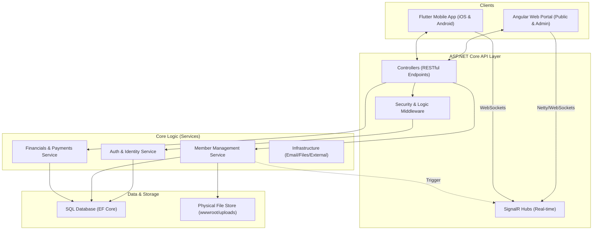

# GHCAA Platform: System Architecture & Data Flow

This document outlines the architectural blueprint and data interaction patterns of the GHCAA (Govt. Haraganga College Alumni Association) platform.

## 1. System Overview Diagram

## 2. Key Data Flows

### A. Member Lifecycle
1.  **Registration**: Public Client (Web/Mobile) → `RegistrationController` → `MemberService`.
    - Profile status set to `Applied`.
    - Verification email sent via `NotificationService`.
2.  **Approval**: Admin Client → `AdminController` → `ApproveMemberAsync`.
    - Status changes to `Active`.
    - Membership Number assigned (Sequential Pattern).
    - Financial Ledger initialized with 'Admission' and 'Yearly' dues.
3.  **Active Status**: Member Login → JWT Issued with appropriate Claims (`IsVerified`, `Role`).

### B. Security & Permissions
- **AdminOnly Policy**: Enforces `UserRole == Admin` or `SuperAdmin`.
- **Masking Protocol**: Public directory masks PII (Phone/NID) unless `isPublic` flag is set by member. Admins receive fully unmasked data via privileged endpoints (`/api/admin/members/{id}`).
- **Session Control**: `SecurityStampMiddleware` invalidates all active sessions (Web/Mobile) if an Admin terminates or suspends a member record.

### C. Real-time Communication
- **Negotiate**: Client sends `POST` request to `/api/hubs/chat/negotiate`.
- **Connections**: Persistent WebSocket established. 
- **Delivery**: Backend triggers `Clients.Group(memberId).SendAsync()` for instant notification delivery.

### D. Public Content Delivery
- **Site content (About / Contact intro)**: Public Client → `GET /api/site-content?group=about` (anonymous) → `SiteContentService` → active `SiteContent` blocks ordered by `DisplayOrder`, rendered as trusted HTML. Writes go the other way — Admin Client → `SiteContentController` (`AdminOnly`) → `SiteContentService`, which passes `BodyHtml` through `HtmlSanitizer` **before** persistence, so the public read path never has to sanitize. If the read returns nothing, the Angular page renders its static fallback markup rather than an empty page.
- **News & Notices**: one `NewsPost` table serves both, discriminated by `PostType`. Public Client → `GET /api/news?postType=` → `NewsService` filters on `IsActive` + `PostType`; the Angular feed additionally filters client-side between tabs so switching tabs costs no request. Admin Client → `POST /api/news` / `POST /api/news/upload-document` (both `AdminOnly`) → `FileValidationService` (PDF, 10 MB) → `FileStorageService` (`FileUploadType.NoticeDocument`). The member-facing `POST /api/news/submit` path is the one place a non-admin can create a post, and it rejects `PostType.Notice` with `Forbid()` — this is the single enforcement point for "notices are admin-post-only".
- **Contact details**: served from `OrgConfig.Contact` (campus address, phone list, support email, social links, map embed URL) to web and mobile alike; SuperAdmin edits them via `PUT /api/org-config`. The map embed URL is admin-supplied, so the Angular client allow-list checks it before `bypassSecurityTrustResourceUrl` and renders no iframe at all when the check fails.

- **Constitution (always the latest ratified version)**: Public Client → `GET /api/governance/constitution` (anonymous) → `GovernanceService` → the single `IsActive` row; `GET /api/governance/constitution/history` returns superseded rows, each keeping its own `PdfUrl`. No page pins a version — the landing hero routes to `/constitution` rather than to a file, the in-page ToC is rebuilt from the `Article N:` headings in the stored `Content`, and the only version-bearing constant left in code (`CONSTITUTION_PDF_FALLBACK`) is rewritten by the publishing tool. Publication itself does not go through the API: `Database.EnsureCreated()` is a no-op on a non-empty database, so `ConstitutionSeeder.SyncAsync` runs at boot from `Program.cs`, inserting an unknown version, refreshing changed text in place and superseding (never deleting) prior versions so `AmendmentVote` rows survive. See `docs/CONSTITUTION_PUBLISHING.md`.
- **Election documents and forms (no API in the path)**: `docs/Elections/*.md` is the source of truth. `GHCAA.Web/scripts/sync-election-docs.mjs` copies it into `public/assets/elections/` on `npm start`, `npm run build` and in the Dockerfile web stage; `ElectionsPage` fetches the static asset and renders it client-side through `core/utils/markdown.util.ts`. The forms handbook is split on `# FORM ER-nn` and each form is rendered by `renderFormMarkdown` as a print-ready A4 sheet. The **only** dynamic input is organisation configuration: the letterhead reads `branding.*` (including `establishedOn`) from `OrgConfigService`, i.e. from `GET /api/config`. Nothing about a form is persisted — a filled-in form is paper, not a database row.

## 3. Integrated Quality Governance

The platform employs a **Sequential CI Pipeline** that ensures every code change adheres to the following quality gates:

1. **Static Analysis**: Linting and type-checking across C#, TypeScript, and Dart.
2. **Backend Validation**: Execution of unit and integration tests (NUnit).
3. **Visual & E2E Freeze**: Unified execution of Playwright (Web) and Flutter Integration (Mobile) tests to verify functional journeys and visual regression.
4. **Integrated Build**: Cross-platform verification packaging the API and Web SPA into a deployment-ready artifact.

---

> [!TIP]
> **Data Integrity Constraint**: All member updates (including Admin updates) are governed by the `BaseMemberDto` validation. At least one `AcademicRecord` from the college is mandatory for any record to persist.

> [!IMPORTANT]
> **Mobile Connectivity**: Ensure `AppConfig.apiBaseUrl` in Flutter matches the Unified API Prefix configured in `Program.cs`.
