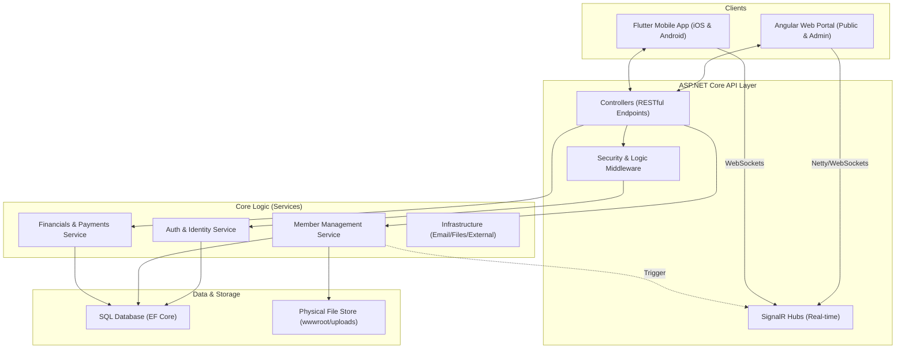

# GHCAA Platform: System Architecture & Data Flow

This document outlines the architectural blueprint and data interaction patterns of the GHCAA (Govt. Haraganga College Alumni Association) platform.

## 1. System Overview Diagram

## 2. Key Data Flows

### A. Member Lifecycle
1.  **Registration**: Public Client (Web/Mobile) → `RegistrationController` → `MemberService`.
    - Profile status set to `Applied`.
    - Verification email sent via `NotificationService`.
2.  **Approval**: Admin Client → `AdminController` → `ApproveMemberAsync`.
    - Status changes to `Active`.
    - Membership Number assigned (Sequential Pattern).
    - Financial Ledger initialized with 'Admission' and 'Yearly' dues.
3.  **Active Status**: Member Login → JWT Issued with appropriate Claims (`IsVerified`, `Role`).

### B. Security & Permissions
- **AdminOnly Policy**: Enforces `UserRole == Admin` or `SuperAdmin`.
- **Masking Protocol**: Public directory masks PII (Phone/NID) unless `isPublic` flag is set by member. Admins receive fully unmasked data via privileged endpoints (`/api/admin/members/{id}`).
- **Session Control**: `SecurityStampMiddleware` invalidates all active sessions (Web/Mobile) if an Admin terminates or suspends a member record.

### C. Real-time Communication
- **Negotiate**: Client sends `POST` request to `/api/hubs/chat/negotiate`.
- **Connections**: Persistent WebSocket established. 
- **Delivery**: Backend triggers `Clients.Group(memberId).SendAsync()` for instant notification delivery.

---

> [!TIP]
> **Data Integrity Constraint**: All member updates (including Admin updates) are governed by the `BaseMemberDto` validation. At least one `AcademicRecord` from the college is mandatory for any record to persist.

> [!IMPORTANT]
> **Mobile Connectivity**: Ensure `AppConfig.apiBaseUrl` in Flutter matches the Unified API Prefix configured in `Program.cs`.
