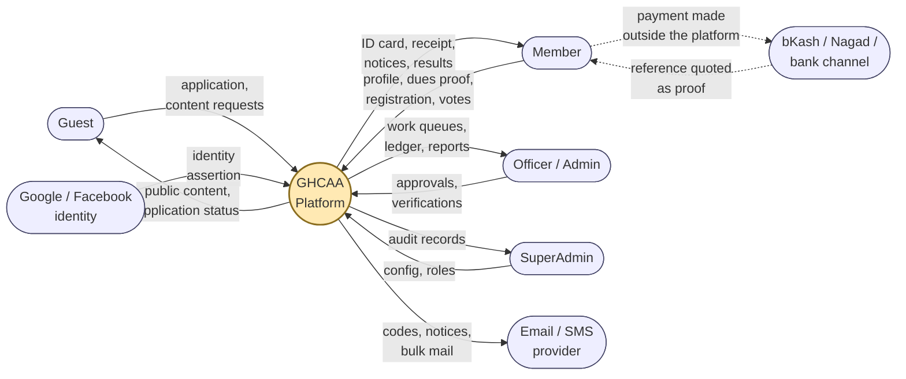
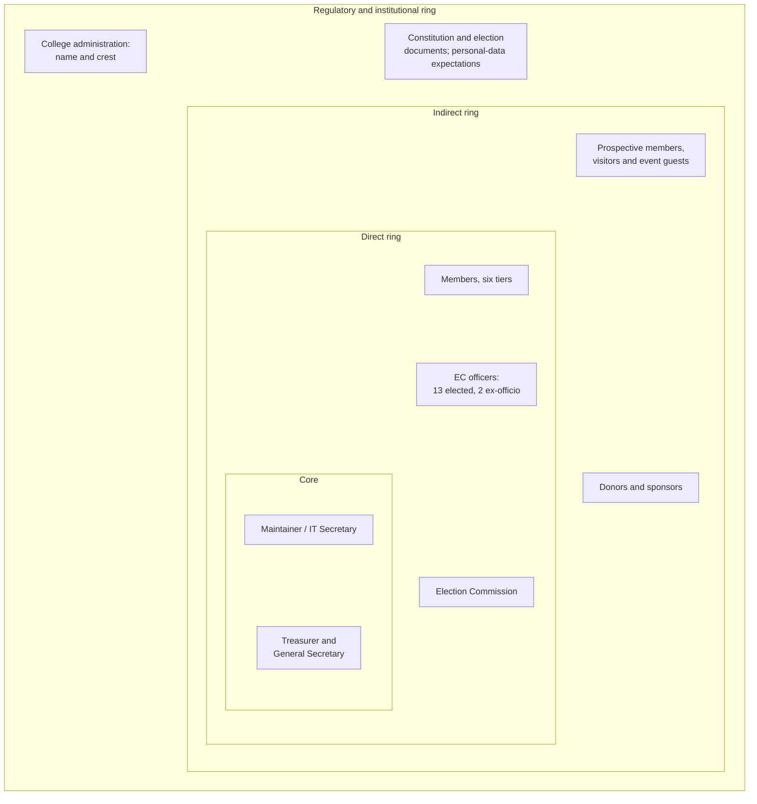
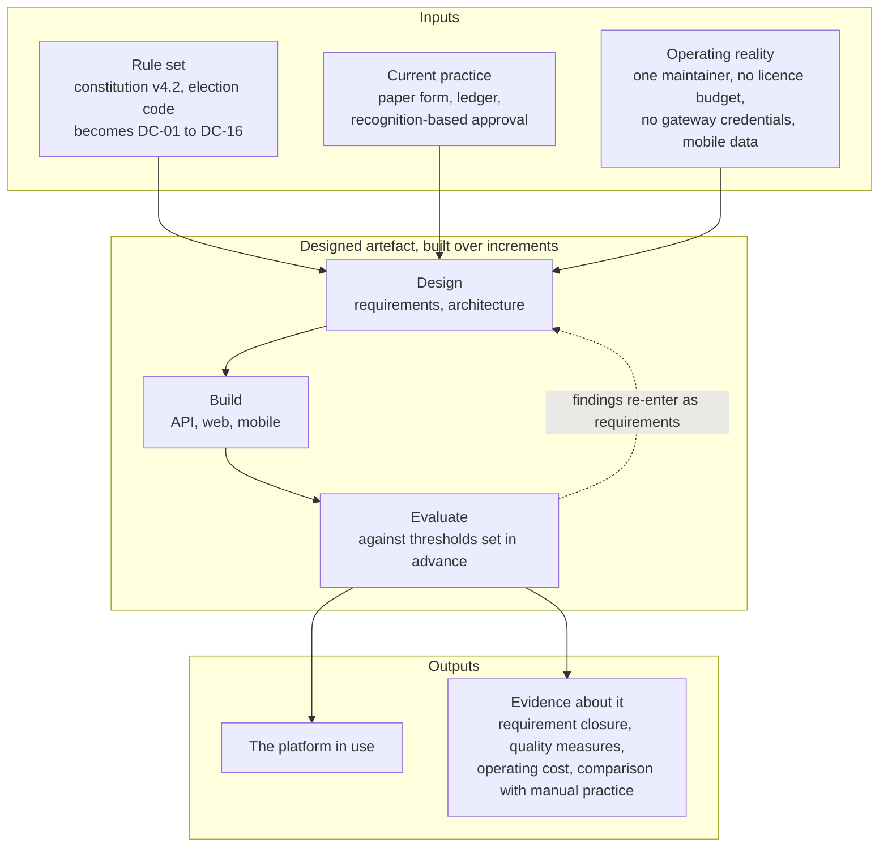
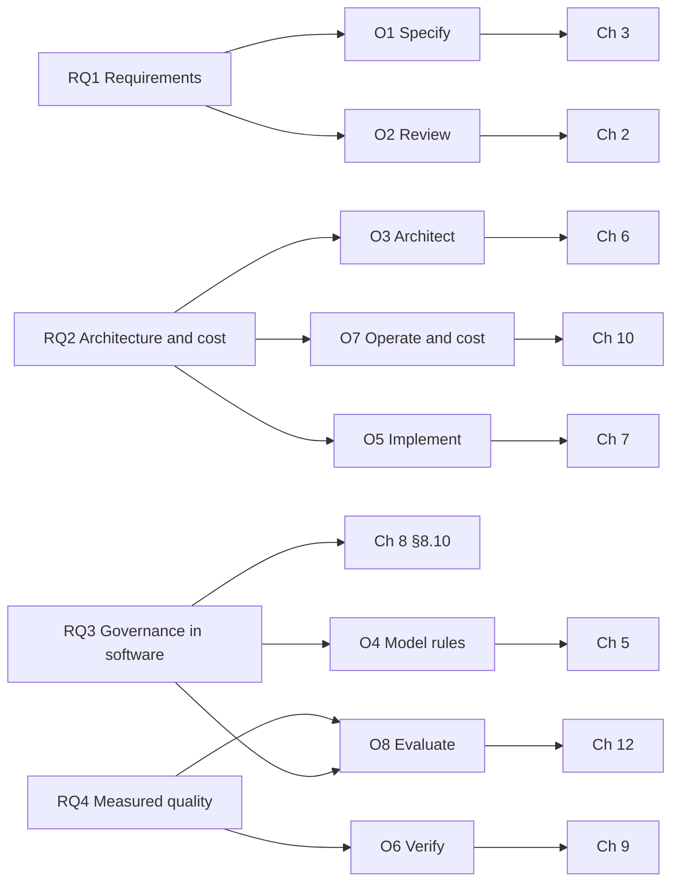

# PART I — PROBLEM AND CONTEXT

# Chapter 1 — Introduction

## 1.1 Research Context: Alumni Relations as an Institutional Function

An alumni association is an odd kind of organisation. It has members but no employees, obligations
but no revenue guarantee, elected officers but no full-time secretariat, and a membership that is
geographically scattered and only intermittently attentive. Everything it does depends on a record
of who its members are, and that record decays continuously as people move, change employers, change
telephone numbers and stop paying subscriptions they have forgotten they owe.

The higher-education literature treats alumni relations mainly as an advancement function, that is
as the front end of fundraising. Monks, studying young graduates of selective American institutions,
found that giving behaviour correlates with the quality of the undergraduate experience and with
sustained contact after graduation rather than with income alone [8]. Weerts and Ronco, separating
donors from volunteers and from those who do both, showed that the engaged alumnus is not a single
type and that the activities which predict money are not the activities which predict time [9].
Both findings point the same way for a system builder: engagement is a longitudinal record, and the
value of an alumni platform lies less in any single transaction than in whether the record survives
a decade.

That framing has an uncomfortable implication for the institution studied here. The advancement
literature is written about institutions with an advancement office, a CRM licence and staff whose
job is to maintain the record. A government college alumni association in Bangladesh has none of
those. It has volunteers, a constitution, and whatever the treasurer keeps in a notebook. If the
longitudinal record is the asset, then the practical research question is not how to build a
sophisticated engagement engine but how to get a durable, honest record in place and keep it running
on nobody's salary.

A second strand of context matters as much. The association studied here is a governed body, not
merely a mailing list. It has a written constitution of twelve articles, five distinct membership
tiers with different rights, an Executive Committee of fifteen positions with a three-year term, a
quorum rule, an amendment procedure requiring a two-thirds majority at a properly convened Annual
General Meeting, and a separate corpus of seven election documents covering regulations, an
operational manual, a code of conduct, manual balloting, forms, ballot sealing and counting
authorisation. Software that manages such a body is not free to invent rules. Its behaviour is
constrained by a document that predates it and outranks it, and any place where the code disagrees
with the constitution is a defect in the code, not a feature of the system.

## 1.2 Problem Domain: the Govt. Haraganga College Alumni Association

Govt. Haraganga College was established on 18 December 1938 and has produced several decades of
graduates. The Association, referred to in its own documents as HARAGANGIAN, records its founding
date as 29 November 2025, and adopted the constitution whose current version, v4.2, took effect on
1 July 2026.

Before this project, the Association operated as follows. Membership applications were made on
paper at reunion events or through personal contact with an officer. Verification of alumni status
meant someone looking at a certificate or testimonial and forming a judgement. Subscriptions were
collected in cash, occasionally by mobile financial service transfer to an officer's personal
wallet, and recorded in a ledger held by the treasurer. Announcements went out through Facebook
groups and word of mouth. The constitution circulated as a PDF attached to messages, which meant
that at any moment several versions were in circulation and no member could be certain which one
governed. Elections had not yet been run under the new constitution, and the election documents were
drafted in anticipation of the first cycle.

Four consequences of that arrangement drove the project.

**The roll is unknowable.** Nobody could state how many members the Association had, because
membership was defined by a payment recorded in one place and an application recorded in another.
Any question of the form "who is entitled to vote" therefore had no answerable form, which is a
serious problem for a body whose constitution ties voting to good standing.

**Money and trust are coupled.** Cash collection through officers' personal wallets is workable
among people who know each other and corrosive at any larger scale. There was no receipt a member
could keep, and no statement an officer could produce to show that what came in matched what was
recorded.

**Governance is invisible.** Members could not see the constitution that bound them, the committee
that represented them, or the amendments proposed on their behalf. Procedural legitimacy in a
voluntary association rests on visibility, and there was none.

**The institutional memory is one person deep.** The knowledge of who had paid, who was eligible
and who had been approved lived with individual officers. The three-year committee term guarantees
that this knowledge is periodically lost.

## 1.3 Problem Statement

The Association needs a system of record that (a) establishes an authoritative, auditable membership
roll with a verification step an officer can defend, (b) collects and evidences money without asking
the Association to hold payment credentials it cannot obtain or protect, (c) makes governance
documents and processes visible to the membership without letting software silently replace the
procedures the constitution mandates, and (d) can be operated and maintained indefinitely by one
volunteer maintainer with no licence budget.

Figure 1.1 draws the boundary this statement implies: who the system deals with, and what crosses
the line in each direction.

No off-the-shelf product satisfies that conjunction, as Chapter 2 argues in detail. Commercial
alumni platforms assume a recurring licence and an advancement office. Open-source membership
systems assume a payment gateway and treat governance as a plugin concern at best. General-purpose
CRM adapted to alumni use inverts the problem, offering configurable pipelines while providing
nothing for constitutional tiers, committee terms or amendment voting. The gap is not a missing
feature. It is a missing combination: deep domain governance at close to zero operating cost, with
manual payment as a first-class design position rather than a degraded fallback.

## 1.4 Conceptual Framework

The problem statement above names four needs; the chapters that follow answer them in pieces. This
section states the whole in one view, so that a reader can see what the work takes in, what it
produces and how the two are judged against each other before meeting any of it in detail. Figure 1.3
draws it.

Three kinds of input govern the work, and they are not interchangeable. The first is the
Association's own rule set: the constitution at version 4.2 and the seven documents of the election
code, whose normative clauses become the domain constraints of §3.10 and are not negotiable with any
stakeholder. The second is current practice, being the paper application form, the treasurer's
ledger and the recognition-based approval described in §1.2, which the software must either preserve
or deliberately replace. The third is the operating reality: one volunteer maintainer, no licence
budget, no payment-gateway credentials, and members reaching the system on mid-range handsets over
mobile data. The first input constrains what the artefact may do, the second what it must handle,
and the third what it can afford to be.

The artefact sits between them. It is a running platform rather than a model of one, built and
revised over increments, and the design-science position of Chapter 4 is what licenses treating its
construction as research: each increment is a designed response to a stated problem, and each is
evaluated before the next is specified. The rules do not merely inform the design; they are encoded
in it and are traceable back to the clause they came from, which is the property §3.9 and Table 9.9
exist to demonstrate.

The outputs are of two kinds, and keeping them apart matters. The artefact itself is one
contribution, deployed and in use by real members with real records. The evidence about it is the
other: requirement closure, the quality-attribute measurements against the thresholds declared in
advance in §4.6, the operating cost of §10.10, and the comparison against the manual practice it
replaced in §12.10. The thresholds are declared before measurement, in Chapter 4, precisely so that
the evaluation cannot be written to fit whatever the system turned out to do.

The feedback path is the part that a static diagram most easily loses. Evaluation did not happen once
at the end. Findings from use, from review and from deployment failures re-entered the work as new
requirements, and §11.1 reports how much of the delivered work arrived that way rather than from the
original specification. That loop is the design cycle of §4.2, and it is drawn in Figure 1.3 as a
return edge rather than left implicit.

## 1.5 Research Questions

Each question is answerable from evidence presented later in this document, and the mapping is drawn
in Figure 1.4.

**RQ1.** What functional and quality requirements characterise an alumni-management platform for a
resource-constrained institution in a low-bandwidth, mobile-first, cash-and-manual-payment context?

*Answered by:* the requirements engineering of Chapter 3, validated in §3.12 and closed against the
delivered artefact in §12.2.

**RQ2.** Which architectural approach best satisfies those requirements under a single-maintainer,
low-budget sustainability constraint, and at what cost?

*Answered by:* the alternatives assessment of §6.2, the decision records of §6.13, the operational
cost model of §10.10, and the maintainability metrics of §9.14.

**RQ3.** To what extent can institutional governance processes, meaning the constitution, elections,
committee terms and member voting, be encoded as software without loss of procedural legitimacy?

*Answered by:* the domain constraints of §3.10, the business rules catalogue of §5.6, the governance
integrity discussion of §8.10, and the argument in §12.8 that draws the boundary the project
actually settled on.

**RQ4.** What measurable quality is achieved by the resulting artefact against ISO/IEC 25010
characteristics, and what does that reveal about the approach?

*Answered by:* the evaluation plan declared in §4.5 and executed in §§12.3 to 12.7.

RQ3 is the question of genuine interest. RQ1 and RQ2 are the questions that must be answered first
in order to have an artefact against which RQ3 can be asked, and RQ4 is what makes the answers
defensible rather than anecdotal.

## 1.6 Aims and Objectives

**Aim.** To design, build and evaluate a sustainable alumni-management platform for a governed,
resource-constrained association, and from that to establish how far institutional governance can be
encoded in software before procedural legitimacy is damaged.

| # | Objective | Serves | Delivered in |
| --- | --- | --- | --- |
| O1 | Elicit and specify the requirements of the Association, including the constraints imposed by its constitution and election code, to ISO/IEC/IEEE 29148 | RQ1 | Ch. 3 |
| O2 | Review the alumni-relations, architecture, governance and security literature, and survey existing products, to establish the gap | RQ1, RQ2 | Ch. 2 |
| O3 | Select and justify an architecture against the quality-attribute scenarios and the sustainability constraint, recording the trade-offs | RQ2 | Ch. 6 |
| O4 | Model the system's behaviour and encode the constitutional rules as traceable, testable business rules | RQ3 | Ch. 5 |
| O5 | Implement the API, web and mobile clients, including membership, payments, events, communication and governance | RQ1, RQ2 | Ch. 7 |
| O6 | Verify and validate the artefact at unit, integration, system, security, performance and acceptance levels | RQ4 | Ch. 9 |
| O7 | Design and operate a deployment that a single volunteer can sustain, and cost it | RQ2 | Ch. 10 |
| O8 | Evaluate the artefact against ISO/IEC 25010, against the manual process it replaces, and against the four research questions | RQ4, RQ3 | Ch. 12 |

## 1.7 Scope, Delimitations and Assumptions

**In scope.** Member registration and the approval workflow; profile management with per-field
privacy control; authentication, including one-time password verification and social sign-in; the
membership directory; dues generation and manual payment with proof upload and administrative
verification; the financial ledger; events with registration, waitlisting, QR-coded attendance and
a member-submitted photograph gallery subject to administrative approval; news and notices; mass
communication; a member-posted job board subject to administrative approval; the constitution hub
with version history and amendment voting; Executive Committee records; member polls; digital
identity cards and certificates; site content administration; and an administration console
covering all of the above. Three clients: a
public web site, a member portal and admin console in the same Angular application, and a Flutter
mobile application for members.

**Out of scope, by decision.** Live payment gateway integration is present in the codebase but
deliberately unconfigured; §8.9 gives the reasoning. Statutory accounting and audit filing are not
attempted; the ledger is a record, not an accounting package. The platform does not run binding
Executive Committee elections. It supports the process around them, including the voter roll,
candidate information and result publication, but the ballot itself remains under the election
documents, and §8.10 explains why that separation is deliberate rather than an omission. There is
no offline-first mobile synchronisation, no native desktop client, no machine-learning
recommendation, and no external large language model; the in-app assistant is a rule-based intent
classifier over the Association's own data.

**Delimitations.** The study concerns one association. Chapter 12 argues what transfers to
comparable institutions and what does not, but the evaluation is a single case in the sense of
Runeson and Höst [10], with the external-validity limits that implies.

**Assumptions.** Members have a smartphone with intermittent connectivity and are more likely to
reach the platform on a mobile browser than a desktop one. Administrators are volunteers, not
trained operators, so administrative workflows must be forgiving and reversible. The Association
cannot commit to a recurring software licence. The constitution will be amended during the system's
life, so version handling is a requirement and not a convenience.

## 1.8 Research Method in Brief

The work is a design science research study in the sense of Hevner et al. [4], organised as the six
activities of Peffers et al. [5]: problem identification, definition of objectives for a solution,
design and development, demonstration, evaluation, and communication. The relevance cycle is the
Association's own process and documents; the rigour cycle is the architecture, requirements,
security and quality literature of Chapter 2 together with the standards listed in the front matter;
the design cycle is the increments of Chapter 7 and their verification in Chapter 9.

Delivery followed an incremental and iterative lifecycle rather than a single pass, for the reason
given in §4.4: a single unpaid maintainer working in irregular hours cannot hold a long
specification-to-integration cycle open, and needs a working system after every increment. The
evaluation plan, including the metrics, instruments and thresholds, is declared in §4.5 and §4.6
before any measurement is reported, so that Chapter 12 cannot select its own criteria after seeing
the results. Chapter 4 gives the full account.

## 1.9 Contributions of this Work

The three claims are stated in full in the front matter under Statement of Contributions and are
substantiated in §13.2. In brief: a traceable method for encoding a voluntary association's written
constitution as software business rules, with a defended boundary between what software may decide
and what must remain a human procedure; an account of a deliberately gateway-free payment design and
its consequences; and a requirements and architecture characterisation for the single-maintainer,
zero-licence case, recorded with its costs rather than presented as a best practice.

What the work does not claim is worth stating here as well. It does not claim a novel architectural
style, a new development process, or a secure electronic voting scheme. Chapter 6 uses clean
architecture as Martin describes it [1] and the enterprise patterns Fowler catalogues [2], and the
contribution lies in the recorded reasoning about their cost in this setting, not in the patterns
themselves.

## 1.10 Stakeholders and Beneficiaries

| Stakeholder | Interest | Where their requirements appear |
| --- | --- | --- |
| Ordinary member | Join, pay, be visible in the directory, attend events, see the constitution, vote where entitled | FR-01 to FR-22, FR-32 to FR-40, FR-48 to FR-54 |
| Executive Committee officer | Approve applications, verify payments, publish notices, run events, manage the committee record | FR-13, FR-23 to FR-31, FR-41 to FR-47 |
| Treasurer | An auditable ledger and evidence for every receipt | FR-19 to FR-25 |
| General Secretary | Minutes, correspondence, notices, AGM circulation | FR-26 to FR-31, FR-35 |
| Information and Technology Secretary | A platform maintainable by one person; the constitutional office responsible for it | NFR-M1 to NFR-M4 |
| Election Commission | A defensible voter roll and published results, with the ballot itself under the election documents | FR-38 to FR-40, §8.10 |
| College administration | Correct use of the institutional name and crest, per Article I Section 5 | §3.10, DC-01 |
| Prospective member and general public | Public information, a route to apply, published governance documents | FR-01, FR-32, FR-46, FR-47 |
| Maintainer as researcher | An artefact whose quality can be measured and reported honestly | Ch. 4, Ch. 12 |

The primary beneficiaries are the members, who gain a record of their own standing that does not
depend on an officer's memory, and the officers, who gain the ability to answer questions about the
roll and the money without reconstructing them by hand. Figure 1.2 places the same
stakeholders by distance from the system, from the officers who operate it daily out to the college
administration and the general public.

## 1.11 Structure of the Dissertation

Part I states the problem. Chapter 2 reviews the literature and surveys existing systems, ending
with the gap. Chapter 3 specifies the requirements, including the constitutional constraints the
software must not violate.

Part II covers method and design. Chapter 4 sets out the design science method and, importantly,
declares the evaluation plan in advance. Chapter 5 models the system's behaviour and extracts the
business rules. Chapter 6 records the architecture, the design, the patterns applied and the
decisions taken.

Part III covers construction and validation. Chapter 7 reports the implementation and the notable
problems solved along the way. Chapter 8 covers security, privacy and trust, and states the threat
model. Chapter 9 then reports verification, validation and the product metrics, including the security
testing derived from that threat model, which is why it follows Chapter 8 rather than preceding it.
Chapter 10 covers deployment and operations, including the cost model. Chapter 11 reports project
management.

Part IV closes. Chapter 12 executes the evaluation plan and answers the research questions.
Chapter 13 concludes and sets out future work.

---

## Figures

### Figure 1.1 — Context diagram (DFD Level 0): platform boundary and external entities

*Derived from `docs/architecture_data_flow.md` and the controller inventory in `GHCAA.API/Controllers`.*

The dashed path carries the design position of §8.9. Money moves between the member and the
financial channel outside the platform boundary. What crosses into the platform is a claim plus
evidence, which an officer then verifies. The platform never holds a payment credential.

### Figure 1.2 — Stakeholder onion diagram

### Figure 1.3 — Conceptual framework: inputs, the designed artefact, and how it is judged

### Figure 1.4 — Research question, objective and chapter map

