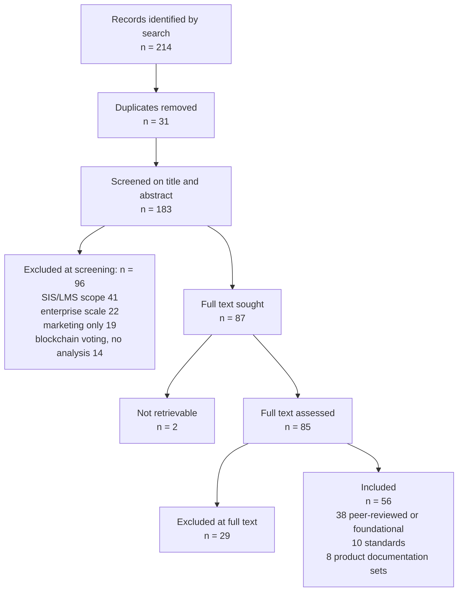
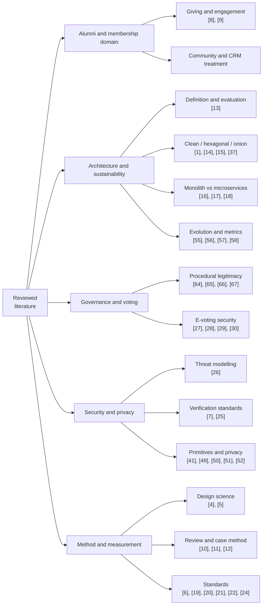
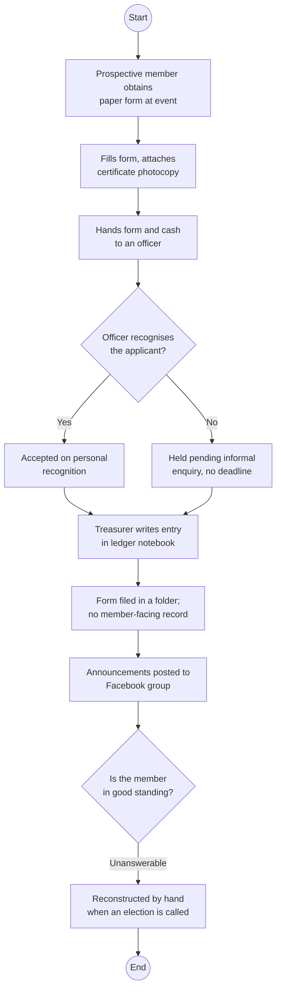
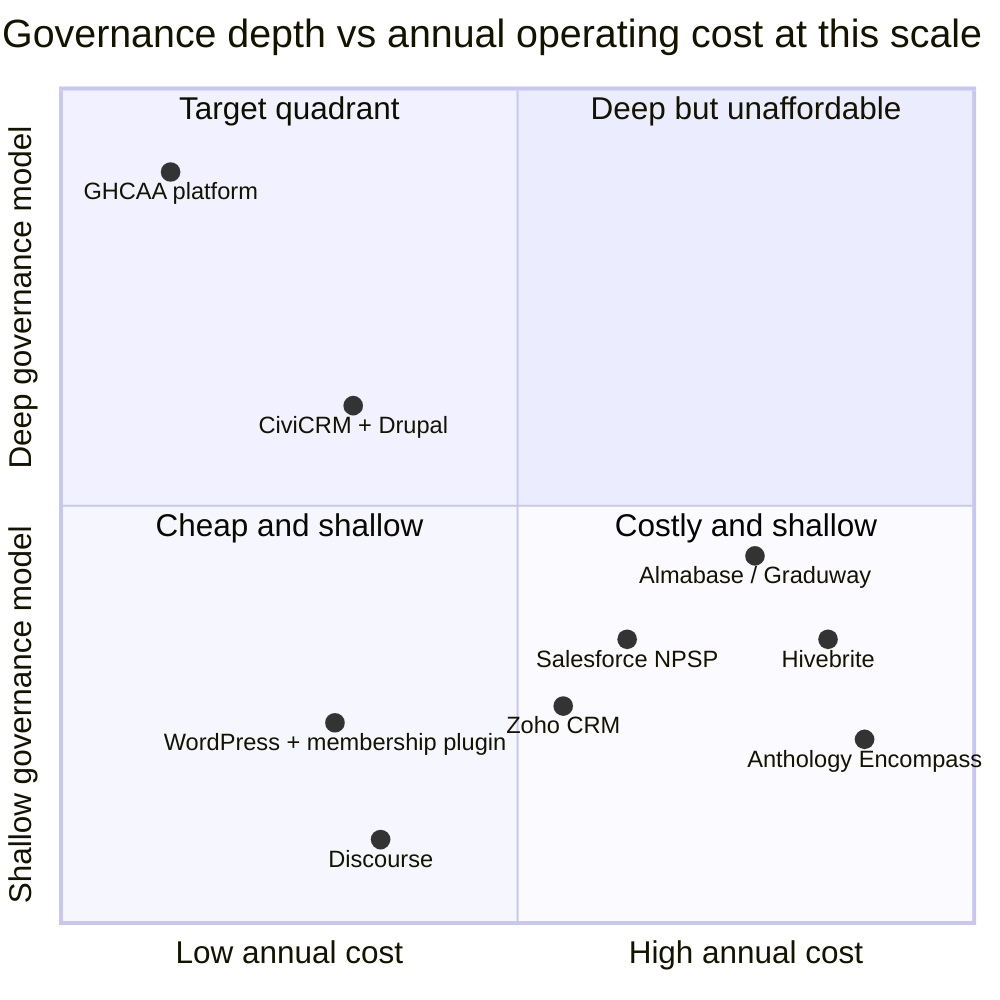

# Chapter 2 — Literature Review and Related Work

## 2.1 Review Objectives and Questions

This chapter has a narrow job. It is not a survey of everything written about alumni relations or
about web architecture. It exists to establish four things that the rest of the dissertation depends
on, and to stop when it has established them.

- **RvQ1.** What does the institutional literature say alumni engagement actually consists of, and
  what does that imply for the data a platform must keep? (Feeds RQ1 and §3.3.1, the membership and profile requirements.)
- **RvQ2.** What evidence supports layered and clean architecture, and what does the critical
  literature say it costs? (Feeds RQ2 and §6.2, where the architecture is chosen.)
- **RvQ3.** What does the digital-governance and electronic-voting literature establish about the
  conditions under which software may legitimately mediate a collective decision? (Feeds RQ3, and is
  the reason for the boundary drawn in §2.7 and defended in §8.10, on governance integrity.)
- **RvQ4.** Which existing systems address the Association's problem, on what terms, and what
  remains uncovered? (Feeds RQ1, RQ2 and §2.11, the research gap.)

The review is structured rather than systematic. Kitchenham and Charters set out the full protocol
for a systematic review in software engineering, including independent double screening and quality
scoring by more than one reviewer [11]. A single-author dissertation cannot satisfy the
inter-rater requirements of that protocol, and claiming otherwise would be dishonest. What is
reported below is a documented, repeatable search with stated inclusion criteria and stated screening
counts, following the reporting discipline of PRISMA [12] without claiming its completeness
guarantees. Section 2.2 states exactly what was done so that the reader can judge the coverage.

## 2.2 Review Protocol

**Sources.** ACM Digital Library, IEEE Xplore, ScienceDirect, SpringerLink, Google Scholar for
forward and backward citation chasing, the ISO and IEEE standards catalogues for normative
documents, the OWASP project site for security baselines, and vendor documentation and public
pricing pages for the product survey of §2.9.

**Date range.** 2000 to 2026 for empirical work, with no lower bound for foundational texts and
seminal papers, since the architectural and metric literature this work relies on includes material
from the 1970s onward that has not been superseded.

**Search strings.** The strings used, in the forms actually issued, are listed in Table 2.1. They
were composed from three concept groups, combined with Boolean AND across groups and OR within:
(a) *alumni OR "graduate relations" OR "membership association" OR "voluntary organisation"*;
(b) *"management system" OR platform OR portal OR CRM OR "information system"*;
(c) *architecture OR requirements OR governance OR "electronic voting" OR sustainability OR
maintainability*.

**Inclusion criteria.** Peer-reviewed studies, standards, or established practitioner texts that
(i) report empirical findings on alumni or membership engagement, (ii) report or critique
architectural approaches for small-team systems, (iii) address requirements or quality specification
for information systems, (iv) address electronic voting security or procedural legitimacy in
digitally mediated governance, or (v) document a product whose stated purpose is alumni or
membership management.

**Exclusion criteria.** Studies about student information systems, learning management systems or
admissions, which share vocabulary but not the problem; work on large-enterprise architecture at a
scale where a single-maintainer constraint is meaningless; blockchain voting proposals without
security analysis; marketing material with no technical or pricing substance; non-English sources,
which is a stated limitation of this review; and duplicate publications of the same study.

**Screening procedure and counts.** Records identified by search, 214. Removed as duplicates, 31,
leaving 183 for title and abstract screening. Excluded at title and abstract, 96, of which 41 were
about student information or learning management systems, 22 were enterprise-scale architecture, 19
were marketing material without substance, and 14 were blockchain voting proposals without security
analysis. Full text sought for 87; two were not retrievable, giving 85 assessed. Excluded at full
text, 29, principally for having no extractable claim about either architecture cost or governance
mediation. Included, 56, comprising 38 peer-reviewed or foundational works, 10 standards and
normative documents, and 8 product documentation sets. Figure 2.1 shows the flow.

A caution the reader is entitled to: these counts describe a search conducted by one person over a
bounded period, and the review is best read as an argued positioning of the work rather than as an
exhaustive account of the field.

Figure 2.2 groups the sources that survived selection into the five bodies of literature the rest of
this chapter works through, with the citation numbers carried by each, so that the sections which
follow can be read against the shape of the whole.

## 2.3 Alumni Relations and Engagement: the Institutional Literature

The institutional literature on alumni relations is dominated by the advancement question, meaning
what makes graduates give. Monks, using data on young graduates of selective institutions, found
that giving relates to satisfaction with the undergraduate experience and to continuing contact,
rather than simply to the graduate's income [8]. That result has been repeatedly qualified but its
shape holds: the gift follows from the relationship, and the relationship is kept or lost in the
years when the institution has the least reason to pay attention.

Weerts and Ronco separated three kinds of supportive alumnus, the donor, the volunteer, and the
person who does both, and showed that they are predicted by different characteristics [9]. This is
the single most useful finding for the present work, because it says that a platform which models
engagement as a payment history is modelling the minority case. The Association's own constitution
independently reaches the same conclusion in Article III, where Founding membership requires
"documented contribution" and Executive membership requires a meeting-attendance record, neither of
which is a payment. A system that records only money cannot evaluate either clause.

Two limits of this literature must be stated. First, almost all of it is set in North American or
European institutions with an advancement office, a budget and a CRM already in place; the question
it answers is how to improve engagement given the infrastructure, not how to obtain the
infrastructure. Second, it is largely silent on the governed voluntary association, where the alumni
body is a constitutional entity with officers and elections rather than a stakeholder group managed
by the institution. For that, one has to look outside the education literature entirely, which
§2.7 does.

## 2.4 Community and Membership Platforms: Academic Treatment

Academic work on membership and community platforms tends to approach them either as socio-technical
communities or as CRM instances, and the two treatments do not meet. The community strand is
concerned with participation, identity and moderation, and what it gives a builder is a set of
design commitments: make membership status visible, make contribution legible, and make the cost of
participation low. The CRM strand supplies the pipeline vocabulary, meaning stages, segments,
campaigns and lifecycle states, which maps cleanly onto the Association's application and approval
workflow and very poorly onto its tier structure.

The gap in this strand is governance. A community platform models a moderator; a CRM models an
account owner. Neither models an officer who holds an elected position for a fixed term under a
written instrument, whose authority is bounded by that instrument, and whose successor inherits the
office rather than the account. Section 5.4 of this dissertation had to construct that model from the
constitution because the literature does not supply it.

## 2.5 Architectural Literature

### 2.5.1 Layered and hexagonal or clean architecture: claims and critiques

Bass, Clements and Kazman give the discipline its working definition of architecture as the set of
structures needed to reason about a system, comprising elements, their relations and their
properties, and its central methodological claim that architecture is the earliest artefact against
which quality attributes can be evaluated [13]. That claim is what allows Chapter 6 to argue about
maintainability before there is any measurement of it.

The specific family this project sits in begins with Cockburn's hexagonal architecture, which frames
the problem as isolating application logic from every actor that drives it or that it drives, so that
the same logic can be exercised by a user, a test or a batch job without change [14]. Palermo's
onion architecture restates the same dependency inversion as concentric layers with the domain at
the centre [15]. Martin's clean architecture consolidates both into the dependency rule, that source
code dependencies point only inward toward policy, never outward toward mechanism, and adds the
argument that frameworks and databases are details to be deferred [1]. Evans supplies the
complementary content for the inner layers, namely that the model at the centre should be expressed
in the language the domain experts actually use [37], which in this project means that the code says
`MembershipType.Founding` and `AmendmentVote` because the constitution does.

The critique is thinner in the peer-reviewed literature than in practice, but it is real and this
work takes it seriously. Three objections recur. Clean architecture front-loads structure, and for
small systems that structure may never pay for itself. It multiplies artefacts, since a single field
added to an entity can require edits in the domain model, the data transfer object, the mapping, the
service interface, the implementation and the client model. And it invites the appearance of
layering without the substance, where an interface exists for every service but has exactly one
implementation and no test double, so the indirection buys nothing. Section 9.14 measures the first
two objections in this codebase rather than dismissing them, and §6.11.12 records where the pattern
was deliberately not applied.

### 2.5.2 Monolith versus microservices for small-team systems

Newman's account of microservices makes the organisational precondition explicit: independently
deployable services pay off when independent teams own them [17]. Dragoni et al., surveying the
field, similarly present the benefits as coupled to operational maturity, including per-service
deployment, monitoring and data ownership [18]. Fowler's "monolith first" position is the direct
corollary and the one relevant here: begin with a modular monolith, because you cannot yet identify
the service boundaries that matter, and because the operational cost of distribution is paid
immediately while the benefit arrives only at scale [16].

For a system with one maintainer, the calculation is not close. Distribution converts in-process
calls into network calls that can fail partially, requires a deployment pipeline per service, and
turns a stack trace into a correlation-ID investigation. Section 6.2 records the decision and its
cost; the literature's contribution is that the decision needs no defence beyond the team size.

### 2.5.3 Architectural sustainability and maintainability evidence

Lehman's laws of software evolution supply the long-run frame: a system in use undergoes continual
change, its complexity increases unless work is done to reduce it, and its quality declines unless
it is rigorously maintained [55]. For a volunteer-maintained system these are not abstractions.
Every hour of unpaid maintenance is discretionary, so the architecture's real job is to keep the
cost of a routine change low enough that it still gets made in year four.

The measurement apparatus this dissertation uses is standard. McCabe's cyclomatic complexity gives a
control-flow measure of testability [57]; Chidamber and Kemerer's suite gives coupling, cohesion and
inheritance measures for object-oriented designs [56]; Oman and Hagemeister's maintainability index
aggregates volume, complexity and comment density into a single trackable figure [58]. Each is
imperfect and each is criticised, but they are the measures for which thresholds and comparative
data exist, and §9.14 reports them with their limits stated.

## 2.6 Web and Mobile Engineering Literature

Marcotte's formulation of responsive web design established the position this project adopts, that
one document served to varying viewports is preferable to parallel device-specific sites [36]. The
practical constraint in the Association's setting is stronger than layout, however. Members reach
the platform predominantly on mid-range Android handsets over mobile data, which makes payload size
and time to interactive the binding usability constraints, not visual adaptation. That is why
NFR-P3 in §3.4 is stated as a byte budget and a bundle budget rather than as a design principle.

For the interface itself, Nielsen's heuristics remain the working checklist for evaluation without
users, and the System Usability Scale gives a short, comparable post-task instrument with published
norms [35], [33]. WCAG 2.1 supplies the accessibility criteria the project targets at level AA
[24]. The mobile client is a single codebase compiled to native, which trades some
platform fidelity for the ability of one maintainer to ship both platforms; §6.2 records that
trade-off with the alternatives that were rejected.

## 2.7 Digital Governance, Electronic Voting and Procedural Legitimacy

This section decides the most consequential boundary in the project, so it is argued rather than
summarised.

Start with legitimacy. Tyler's work on procedural justice establishes that people's acceptance of a
decision depends heavily on whether the process that produced it was perceived as fair, and that
perceived procedural fairness can matter more than the outcome itself [66]. Ostrom, studying
self-governing collectives, identifies among her design principles that those affected by the rules
participate in modifying them and that conflict-resolution mechanisms are locally accessible [64].
Fung's typology of participation makes the further point that who is in the room, how they
communicate and what authority the process carries are separate dimensions that can be varied
independently [65]. Dunleavy et al. add the caution that digitising an administrative process
reorganises the authority around it rather than merely automating it [67].

Put together, these say something specific for a software project: transparency and traceability of
process are themselves legitimacy-bearing properties, and they are properties software is good at
providing. Publishing the governing instrument, showing which version is in force and since when,
recording who is entitled to vote and why, and preserving the record of past decisions all increase
procedural legitimacy at low risk.

Now the ballot, which is a different matter entirely. The security literature on binding electronic
elections is not merely cautious; it is a sequence of concrete failures found in deployed national
systems. Springall et al. analysed the Estonian internet voting system and reported architectural
and operational weaknesses that would permit undetected result manipulation [28]. Halderman and
Teague examined the New South Wales iVote system during a live election and found both a
transport-layer vulnerability and flaws in the verification mechanism that was supposed to provide
assurance [29]. Bernhard et al. articulate the underlying standard the field has converged on, that
an election must produce public evidence that the announced result is correct, evidence which does
not require trusting the software or its operators [27]. Park et al. examine blockchain voting
specifically and conclude that it worsens rather than improves the security position, because it
adds failure modes without addressing the client-side and verifiability problems [30].

The relevant question for this project is therefore not "can voting be implemented" but "can this
project produce public evidence of correctness under the threat model it actually faces". The threat
model is unfavourable. There is one maintainer, who is also a member and could himself be a
candidate; there is no independent audit function with the technical capacity to review the
implementation; there is a single hosted database under one administrative account; and the
constitution vests election conduct in an Election Commission with its own documents, including a
manual ballot procedure, a ballot-sealing certificate and a counting authorisation. Under those
conditions software cannot supply the evidence Bernhard et al. require, and asserting that it does
would substitute the maintainer's trustworthiness for a procedure the Association has already
written down.

The project therefore takes the following position, which is stated here so that Chapters 3, 5, 9
and 12 can be read against it. The platform supports governance and does not conduct binding
elections. It maintains the authoritative voter roll, which is exactly the artefact the manual
process most needs and least reliably has. It publishes the constitution, the amendment history and
the committee record. It runs constitutional amendment voting and non-binding member polls, where
the constitution itself sets the threshold and the outcome is a recorded expression of the
membership rather than the transfer of an office. It does not seal a ballot, count votes for office,
or declare a winner. Section 8.10, on governance integrity, gives the full argument, and §12.8
revisits whether the line was drawn in the right place.

The distinction is worth naming precisely, because it is the substance of this work's answer to RQ3:
software can encode *eligibility* and *record*, which are matters of fact traceable to a written
rule, with a large gain in legitimacy. It should not encode *adjudication* under a threat model that
prevents it from proving it did so honestly.

## 2.8 Security and Privacy Engineering Baselines

The security work of Chapter 8 is not original research and does not claim to be. It applies
established baselines, and this section records which and why.

For threat identification the project uses STRIDE as Shostack presents it, that is a
decomposition-driven enumeration over spoofing, tampering, repudiation, information disclosure,
denial of service and elevation of privilege, applied to data-flow diagrams of the system [26]. The
appeal for a single practitioner is that it is a checklist over structure rather than a search for
imagination.

For verification requirements the project uses the OWASP Application Security Verification Standard
as its requirement catalogue and the OWASP Top Ten as a coverage cross-check [7], [25]. Both have
since been revised, ASVS to version 5.0.0 in May 2025 [75] and the Top Ten to its 2025 edition [76];
the work reported here was carried out against the editions cited, and §4.5.4, the
security-evaluation strategy, states why a conformance claim is not carried across a revision. ASVS
is used at level 2, on the grounds that the system holds identity documents and financial evidence
but is not itself a payment processor. Section 8.13, the conformance assessment against ASVS, gives
the level-2 control mapping and, more usefully, records the requirements the project does not meet.

For the cryptographic primitives the choices follow published specifications rather than invention:
bcrypt for password storage, with its adaptive cost parameter [49]; JSON Web Tokens as specified in
RFC 7519 for bearer authentication [50], with the caveat that the specification's flexibility is
itself a hazard, addressed in §8.3, on authentication and session security; OAuth 2.0 as specified
in RFC 6749 for federated sign-in [51]; and time-based one-time passwords per RFC 6238 as the model
for the verification codes described in §3.3.2 [52].

For privacy the operative principle is Cavoukian's privacy by design, in particular default
protection and end-to-end lifecycle management [41]. Its concrete expression in this system is the
per-field visibility control of FR-03 and the masking protocol in §8.11, on personal data, under
which the directory returns a masked projection unless the owning member has opted otherwise.
Bangladesh's data protection framework was still in draft at the time of writing, so the project
treats the principles of purpose limitation, minimisation and retention as design obligations rather
than as compliance with a specific statute, and §8.11 states that position explicitly rather than
implying a compliance claim it cannot support.

## 2.9 Survey of Existing Systems and Products

A note on evidence before the survey, because cost is one of the two criteria that decide the
comparison in §2.10 and it would be easy to assert rather than check. The prices below were read
from the vendors' own pages on 1 September 2026. They divide into three kinds, and the C3 row of
Table 2.2 reports the kind as well as the band.

Published, so quotable. Hivebrite lists a Core plan from US$895 per month billed annually and a Flex
plan from US$1,995 per month, with its two upper tiers by quotation [69]; the entry plan is therefore
of the order of US$10,700 a year before any commission. Zoho CRM lists US$14 per user per month on
annual billing at its Standard tier, rising to US$52 at Ultimate [71]. Paid Memberships Pro lists a
free tier and paid tiers at US$499, US$999 and US$2,999 a year [73]. CiviCRM's licence cost is zero,
which is a property of its licence rather than a price.

Published as a donation, with an eligibility condition this Association may not meet. Salesforce's
Power of Us programme grants ten free Enterprise Edition licences to eligible non-profits, where
eligibility requires 501(c)(3) status or a documented local equivalent [72]. Whether a registered
alumni association in Bangladesh qualifies is not established here, and the C3 band for Salesforce is
read as "low if eligible" rather than as low.

Not published at all. Almabase and Anthology's Encompass quote rather than publish; no plan tiers or
figures appear on their own pages [70]. Secondary listings circulate a figure of roughly US$8,000 a
year for Almabase, which is recorded here as secondary reporting and is not relied on. Where a price
could not be sourced from the vendor, the band in Table 2.2 says so instead of estimating.

The gap argued in §2.11 does not turn on the exact figure. It turns on the comparison between the
Association's annual income and the cheapest published entry price in the dedicated-platform class,
and Hivebrite's own page settles that comparison without a quotation being needed.

### 2.9.1 Commercial alumni platforms

Dedicated alumni engagement platforms, of which Hivebrite, Almabase, Graduway and Vaave are
representative, and institutional advancement suites such as Anthology's Encompass, are the closest
functional match to the requirement. They provide directories, event management, giving campaigns,
email, mentoring and mobile access, generally at a standard well above what this project achieves in
those areas. Three properties make them unsuitable here. They are sold on annual subscription at a
price which, where it is published at all, exceeds the Association's entire annual income; they
assume a payment gateway and a merchant relationship for the giving module, which the Association
cannot obtain; and their data model is the institutional advancement model, with constituents, gift
records and campaigns, in which a five-tier constitutional membership with different voting rights,
a fifteen-position committee with fixed terms, and an amendment vote have no representation. They
can be approximated with custom fields, and §2.10 scores that approximation as insufficient.

### 2.9.2 Open-source community and membership systems

CiviCRM is the strongest candidate in this class and deserves a fair reading. It is a mature
constituent relationship management system built for non-profits, with genuine membership types,
renewal handling, contribution records, event registration and a permission model, and its licence
cost is zero. Its difficulties in this setting are operational and structural rather than
functional. It requires a host CMS, typically Drupal or WordPress, so the maintenance surface is two
applications and their plugin ecosystems rather than one. Its extension model is PHP hook-based,
which is a competent choice but not one this maintainer can support. Its membership model expresses
tiers as pricing and duration rather than as rights, so the constitutional rule that Associate
members may not vote can only be added on top as an access-control convention. Its contribution
processing assumes a gateway, with offline contributions supported but secondary. A WordPress
installation with a membership plugin such as Paid Memberships Pro shares the last two problems in
sharper form and adds a plugin-update treadmill. Discourse and similar community software solve
discussion well and membership governance not at all.

### 2.9.3 General-purpose CRM adapted to alumni use

Salesforce with the Nonprofit Success Pack, Zoho CRM and HubSpot represent this class. They offer
strong configurability, workflow automation and reporting, and Salesforce in particular is available
to eligible non-profits at reduced or zero licence cost for a limited number of seats. The trade
runs the wrong way. Everything the Association needs specifically must be built, and everything it
does not need arrives already configured. Membership tiers become picklists, constitutional
eligibility becomes validation rules, and the committee record becomes a custom object, all of which
is achievable and none of which is traceable to Article III in any way a reviewer could audit. The
deeper objection is sustainability of a different kind: the configuration knowledge lives in a
platform the Association does not control and cannot export as source, and the three-year committee
turnover that motivated this project in the first place applies equally to whoever holds the
administrator seat.

## 2.10 Comparative Analysis and Evaluation Criteria

The comparison in Table 2.2 uses eight criteria, each derived from a requirement or constraint
established in Chapter 1 rather than chosen to favour the outcome. Figure 2.4 plots the surveyed
products on the two criteria that decide the outcome between them, governance depth against annual
operating cost, with this platform's position marked.

- **C1 Governance depth.** Are constitutional membership tiers with differentiated rights,
  fixed-term officer positions, a versioned governing instrument and amendment voting representable
  as first-class concepts?
- **C2 Manual payment as a primary path.** Is payment without a gateway, evidenced by uploaded proof
  and verified by an officer, a supported workflow rather than a fallback?
- **C3 Recurring cost.** Total annual operating cost at the Association's scale, licences and
  hosting together.
- **C4 Single-maintainer feasibility.** Can one part-time volunteer with the maintainer's actual
  skill set operate, extend and recover the system?
- **C5 Data sovereignty and exit, which is vendor lock-in measured from the buyer's side.** Can the
  Association hold its own data and leave without loss?
- **C6 Mobile fitness.** Usable on a mid-range handset over mobile data.
- **C7 Localisation fitness.** Bengali content, local financial channels, local naming and identity
  conventions including national identity numbers.
- **C8 Auditability of rules.** Can a reviewer trace an enforced rule back to the constitutional
  clause that requires it?

C8 is the criterion on which every alternative fails, and it is the criterion that matters most for
RQ3. Configuration achieves the behaviour; it does not produce the trace.

## 2.11 Research Gap

The literature and the product survey together leave a specific, and modest, gap.

The institutional literature establishes that engagement is longitudinal and multi-dimensional but
assumes an advancement infrastructure this Association does not have (§2.3). The community and CRM
literature models moderators and account owners but not constitutional officers (§2.4). The
architectural literature gives well-supported guidance for structuring such a system, and a
legitimate critique of its cost, but the cost has been measured mostly in team-based settings rather
than in the single-maintainer case that governs here (§2.5). The governance and voting literature
establishes clearly what software must not claim about a ballot, and rather less clearly what it may
usefully do around one (§2.7). The products either cost more than the Association earns, or assume a
payment gateway it cannot obtain, or represent constitutional rules as configuration that cannot be
audited against the instrument (§2.9).

Figure 2.3 draws the manual practice that gap sits against, abstracted from the treasurer's ledger
pages and the paper application forms described in §4.7.1, so that the claims made about what the
platform replaces can be checked against a stated process rather than an impression of one.

The gap this work addresses is therefore the conjunction: an alumni platform in which constitutional
governance rules are first-class, traceable and testable; in which manual, evidence-based payment is
the designed primary path rather than a degraded one; operated within a budget of the order of
tens of dollars a year by one volunteer; and evaluated against ISO/IEC 25010 with its costs
reported. Table 2.3 states this as residual gaps against the best available covering system for each
required capability.

Two honest qualifications. First, none of the four elements is individually novel; the claim is
about the combination and about the recorded reasoning, which is why the contributions in §1.9 are
stated as a method and an account rather than as an invention. Second, the gap is defined partly by
a constraint, namely one maintainer and no budget, which some readers will regard as a circumstance
rather than a research problem. Section 12.8 takes that objection seriously, and the response in
short is that the constraint is the normal condition of the great majority of voluntary associations,
and that a literature which only addresses the resourced case leaves them unserved.

## 2.12 Summary

Alumni engagement is a longitudinal, multi-dimensional record, and money is the least of its
dimensions. Clean architecture is the appropriate structure for this system and its cost is real and
measurable rather than hypothetical. A modular monolith is not a compromise at this team size but
the indicated choice. Software can strengthen procedural legitimacy by publishing the rule,
establishing the roll and preserving the record, and cannot honestly adjudicate a binding election
under this project's threat model. No existing product provides constitutional governance depth at
an operating cost the Association can bear, with a rule trace a reviewer could audit. Chapter 3 turns
that position into a specification.

---

## Figures and Tables

### Figure 2.1 — Study selection flow

### Figure 2.2 — Concept map of the reviewed literature

### Figure 2.3 — As-is process model of current manual practice (BPMN, abstracted)

Four defects are visible in the model and each is traced to a requirement in Chapter 3. There is no
verification deadline, which Article III Section E sets at thirty days (FR-23). There is no receipt
and no member-visible record of standing (FR-07, FR-25). Payment and recording are the same act
performed by the same person, so there is no separation of duty (FR-21). The eligibility question
that governance depends on has no stored answer (FR-36, FR-38).

### Figure 2.4 — Positioning chart: governance depth against annual operating cost

### Table 2.1 — Review protocol summary

| Source | Search string issued (abbreviated) | Hits | Screened | Included |
| --- | --- | --- | --- | --- |
| ACM Digital Library | ("alumni" OR "membership association") AND ("information system" OR platform) | 38 | 31 | 6 |
| IEEE Xplore | (architecture OR maintainability) AND ("small team" OR "single developer" OR sustainability) | 41 | 36 | 9 |
| IEEE Xplore | "electronic voting" AND (security OR verifiability) | 27 | 24 | 7 |
| ScienceDirect | alumni AND (giving OR engagement OR volunteering) | 24 | 19 | 5 |
| SpringerLink | ("clean architecture" OR "hexagonal architecture" OR "layered architecture") AND evaluation | 22 | 17 | 4 |
| Google Scholar (citation chasing) | forward and backward from [1], [9], [13], [28] | 34 | 30 | 12 |
| ISO / IEEE catalogues | 25010, 29148, 29119, 42010, 1016, 730, 828 | 10 | 10 | 10 |
| OWASP project site | ASVS 4.x, Top Ten 2021 | 3 | 3 | 2 |
| Vendor documentation | product docs and pricing pages, 8 products | 15 | 13 | 8 |
| **Total (pre-deduplication)** | | **214** | **183** | **56** |

### Table 2.2 — Feature and capability comparison

Legend: ● full, ◐ partial or by configuration, ○ absent.

| Criterion | GHCAA platform | Hivebrite | Almabase | Anthology Encompass | Salesforce NPSP | Zoho CRM | CiviCRM | WP + PMPro |
| --- | --- | --- | --- | --- | --- | --- | --- | --- |
| C1 Governance depth: constitutional tiers, officer terms, versioned instrument, amendment vote | ● | ○ | ○ | ◐ | ◐ | ○ | ◐ | ○ |
| C2 Manual payment with proof and officer verification as primary path | ● | ○ | ○ | ◐ | ◐ | ◐ | ◐ | ○ |
| C3 Annual recurring cost at this scale, and whether the vendor publishes it | very low, self-hosted | published, from ~US$10.7k/yr [69] | not published; quoted [70] | not published; quoted | low if eligible for the donation [72] | published, per seat [71] | zero licence cost | published, free to US$2,999/yr [73] |
| C4 Single-maintainer feasibility | ● | ◐ | ◐ | ○ | ◐ | ◐ | ◐ | ◐ |
| C5 Data sovereignty and clean exit | ● | ○ | ○ | ○ | ◐ | ◐ | ● | ● |
| C6 Mobile fitness on mid-range handsets over mobile data | ● | ● | ● | ◐ | ◐ | ● | ◐ | ◐ |
| C7 Localisation: Bengali content, MFS channels, NID conventions | ● | ◐ | ◐ | ○ | ◐ | ◐ | ◐ | ◐ |
| C8 Rule traceable to a constitutional clause | ● | ○ | ○ | ○ | ○ | ○ | ○ | ○ |
| Directory, events, email, mentoring maturity | ◐ | ● | ● | ● | ● | ● | ◐ | ◐ |

The last row is included deliberately. In the capabilities these products were built for, they are
better than the artefact produced here, and the comparison would be dishonest without saying so.

### Table 2.3 — Gap table

| Required capability | Best covering system | Residual gap | Addressed in |
| --- | --- | --- | --- |
| Membership tiers with differentiated constitutional rights | CiviCRM (as priced membership types) | Tiers model price and duration, not rights; the non-voting rule for Associate members is an access convention, not a modelled property | §3.3.1, §5.6 |
| Fixed-term officer positions with succession | Salesforce NPSP (custom object) | No term, quorum or ex-officio semantics; no institutional record independent of user accounts | §3.3.6, §5.4 |
| Versioned governing instrument with an always-current reader | None | No product treats the governing document as versioned data with an effective date | §3.3.6, §7.12 |
| Amendment voting at a constitutional threshold | None | Poll features exist; the two-thirds-at-AGM rule and eligibility gate do not | §3.3.6, §5.6 |
| Payment without a gateway, evidenced and officer-verified | CiviCRM (offline contributions) | Secondary path; no proof-upload and verification workflow with an audit trail | §3.3.4, §8.9 |
| Auditable trace from enforced rule to constitutional clause | None | Configuration produces behaviour, not a trace a reviewer can follow | §3.10, Table 3.4 |
| Operation at tens of dollars per year by one volunteer | WordPress + plugin | Achievable only by abandoning C1, C2 and C8 | Ch. 10 |
