# Chapter 3 — Requirements Engineering

This chapter is written to the structure of ISO/IEC/IEEE 29148 [21]. Requirements are stated in the
"shall" form, each with an identifier, a source and a priority, and each traceable forward through
the design and test artefacts in Table 3.4. Quality requirements are classified by ISO/IEC 25010
characteristic [6] and cross-referenced to FURPS+ [23], and each is restated as a quality-attribute
scenario in §3.5 so that it can be tested rather than merely asserted.

One property of this specification distinguishes it from a conventional one. A substantial part of
the requirement set is not negotiable with the stakeholders, because it is dictated by the
Association's constitution and its election documents. Those constraints are collected in §3.10 and
carry DC identifiers, and every functional requirement they govern cites the article and section
concerned. Where a stakeholder wish conflicted with a constitutional clause, the clause won; §3.2
records the three occasions on which that happened.

## 3.1 Sources of the Requirements

Requirements came from four sources: analysis of the Association's governing documents, interviews
with office holders and ordinary members, observation of current practice, and the survey of existing
products in §2.9. The Source column of §3.3 names one of the four for every requirement, and the
value R marks the few that arrived after elicitation had closed, as dated requests rather than from
any of them.

How each source was worked, who took part, how they were chosen and what instruments were used are
part of the research method, and are set out in §4.7. The ethical position, both on the people who
took part and on the live member data the platform holds, is in §4.9. This chapter takes the
elicitation output as given and specifies from it.

## 3.2 Requirements Analysis and Negotiation

Analysis produced three genuine conflicts, and the record of how each was resolved matters more than
the resolutions themselves, because it is the evidence for how the constitutional constraint was
treated in practice.

**Directory openness against member privacy.** Officers wanted a fully browsable directory with
contact details, on the reasonable argument that a directory nobody can use is not a directory.
Several members, asked directly, objected to their mobile number being visible to a membership of
several hundred people they do not all know. The resolution was a masked projection by default with
per-field opt-in disclosure controlled by the owning member, specified in FR-03 and FR-05 and
implemented as the masking protocol in §8.11, on personal data. Officers retain unmasked access for administrative
purposes, which is itself logged. This satisfies neither party completely and is recorded as such.

**Automatic termination for non-payment against Article X.** An early requirement, offered by an
officer and initially accepted, was that the system should set a member inactive and then terminate
membership automatically once dues had been outstanding for a defined period. Article X vests
disciplinary action in a procedure with notice and a right of appeal, and Article III Section E gives
an appeal window of fifteen working days. Automatic termination would have had software perform an
act the constitution reserves to a body following a procedure. The requirement was reduced: the
system computes and displays standing, flags arrears, and generates the work item, and a human
officer performs the status change with the reason recorded (FR-24, DC-07). This is the clearest
instance of the general position argued in §2.7.

**Convenience of a payment gateway against the Association's actual position.** Integrating a
gateway was requested and would have removed the verification workload entirely. The Association
does not hold a merchant account, cannot satisfy the documentation a gateway requires without a
banking relationship it has not yet established, and would in the interim have had to route
collections through an individual's personal account, which is the arrangement the project exists to
end. The resolution was to design the manual path as primary, with proof upload and officer
verification, and to leave the gateway abstraction in place but unconfigured so that adoption later
is a configuration change and not a redesign. The reasoning is set out in full in §8.9, and the
consequence, which is a permanent administrative burden of some minutes per payment, is quantified
in §12.6 rather than glossed.

Two further analysis outcomes are worth recording. Requirements arriving as solutions were rewritten
as needs; the request for "a Facebook login button" became FR-10, stated as a requirement to reduce
the credential burden at first contact, which admits other means. And several requested features
were classified as out of scope rather than deferred, so that the MoSCoW table in §3.8 does not
carry items that were never going to be built.

## 3.3 Requirements Specification

The requirement catalogue is Table 3.1 and the non-functional catalogue Table 3.2; both are set as
the tables of §3.3 and §3.4 rather than repeated at the end of the chapter.
Priorities use MoSCoW as in §3.8: M must, S should, C could, W won't in this release. The Source
column records D for document analysis with the clause cited where applicable, I for interview, O for
observation, C for competitor analysis, and R for a dated stakeholder request recorded in the project
tracker `docs/TODO.md` after the original elicitation had closed.

Figures 3.8 and 3.9 draw the analysis-level domain model these requirements imply, before any
persistence or transport concern is added to it. It is drawn in two halves, membership and money then
participation and governance, because one diagram of all seventeen classes prints too small to follow.

### 3.3.1 Membership, Registration and Profile

| ID | Requirement | Source | Pri |
| --- | --- | --- | --- |
| FR-01 | The system shall provide a public multi-step registration wizard that captures personal, academic and professional particulars, permits an applicant to save progress and resume, and validates each step before advancing. | I, C | M |
| FR-02 | The system shall create an application in status *Applied* on submission, record the submission timestamp, and expose the application state to the applicant through a status view. Statuses shall be limited to Applied, Active, Inactive by non-payment, Inactive by resignation, Terminated and Rejected. | D (Art. III §E), I | M |
| FR-03 | The system shall allow a member to maintain his own profile and to control, per field, whether that field is disclosed in the directory, with non-disclosure as the default for contact and identity fields. | I, D | M |
| FR-04 | The system shall require at least one academic record at Govt. Haraganga College before an application may be submitted, and shall permit any number of additional academic and professional records. | D (Art. III), O | M |
| FR-05 | The system shall provide a directory searchable by name, batch, academic session, subject, profession and location, returning only fields the owning member has disclosed, except to administrative users. | I, C | M |
| FR-06 | The system shall issue each active member a digital identity card bearing the membership number, photograph, tier and a machine-readable code that resolves to a verification endpoint. | I, C | S |
| FR-07 | The system shall present each member his own standing, comprising membership number, tier, status, dues raised, dues settled and outstanding balance. | I, O | M |

Registration completeness is a gate rather than advice. Thirteen particulars must be present before
an application is submissible: full name, email address, mobile number, date of birth, gender,
national identity number, father's name, mother's name, permanent address, blood group, photograph,
at least one college academic record and at least one professional record. The membership number is
allocated at approval, not at application, in the form `GHC-[Year]-[Serial]`, and thereafter serves
as the member's login identifier as well as his identity on the card and on receipts. Allocation at
approval rather than at application is deliberate: a number issued to an unverified applicant would
appear on an identity card the Association had not authorised.

### 3.3.2 Authentication, OTP and Session Management

| ID | Requirement | Source | Pri |
| --- | --- | --- | --- |
| FR-08 | The system shall authenticate members by membership number or registered email address together with a password, storing passwords only as an adaptive salted hash. | I | M |
| FR-09 | The system shall verify a registered email address and mobile number by a single-use, time-limited code, and shall reset a forgotten password by a single-use, time-limited link. | I | M |
| FR-10 | The system shall permit sign-in by a federated identity provider, associating the federated identity with exactly one member record and requiring completion of the member profile before portal access is granted. | I, C | S |
| FR-11 | The system shall issue a short-lived access token and a rotating refresh token, shall support explicit sign-out, and shall invalidate all outstanding sessions for a member when his credentials, roles or status change. | D, I | M |
| FR-12 | The system shall prevent a member whose mandatory profile particulars are incomplete from using member functions other than profile completion, and shall indicate what remains outstanding. | O | M |

FR-11 states the security-stamp requirement in requirement form. A change of role, a password reset
or a change of membership status must take effect immediately rather than at token expiry, because
the alternative is a window in which a terminated member retains the rights of an active one. The
mechanism is described in §7.4 and its threat rationale in §8.3, on authentication and session
security.

### 3.3.3 Events, Registration, Attendance and Gallery

| ID | Requirement | Source | Pri |
| --- | --- | --- | --- |
| FR-13 | The system shall allow an administrator to publish an event with title, description, venue, start and end, capacity, fee and registration deadline, and to amend or cancel it with notification to registrants. | I | M |
| FR-14 | The system shall allow a member to register for a published event, subject to capacity, deadline and any fee condition, and to cancel his registration. | I | M |
| FR-15 | The system shall place registrations beyond capacity on an ordered waiting list and shall promote from the head of that list, in order, when a place is released. | C | S |
| FR-16 | The system shall record attendance by scanning the member's identity code at the venue, and shall reject a code that does not correspond to a valid registration for that event. | I, C | S |
| FR-17 | The system shall maintain a per-event photograph gallery, uploaded by administrators, visible according to the event's publication setting. | I | C |
| FR-18 | The system shall report per event the registered count, the waitlisted count, the attended count and the fee collected. | I | S |
| FR-53 | The system shall permit a member to submit a photograph or album to an event's gallery, and shall hold the submission unpublished until an administrator approves or rejects it, with a recorded reason on rejection. | R | C |

FR-53 extends FR-17 on the same reasoning as FR-27 for news: a submission from a member is content
until an officer has looked at it, not a publication in its own right. Like FR-54 in §3.3.9, it
arrived after the elicitation closed, as the tracker request cited there.

### 3.3.4 Payments, Dues and Financial Records

| ID | Requirement | Source | Pri |
| --- | --- | --- | --- |
| FR-19 | The system shall raise the admission fee and the first annual subscription as ledger obligations at the moment a membership is approved, at the rates then configured. | D (Art. VI), O | M |
| FR-20 | The system shall raise the annual subscription for each active member on the anniversary configured for the purpose, and shall not raise it for members whose tier is exempt. | D (Art. III, Art. VI) | M |
| FR-21 | The system shall record, for every payment, the amount, the date, the channel, the member concerned, the transaction reference supplied by the member, the uploaded evidence, the verifying officer and the verification timestamp. | O | M |
| FR-22 | The system shall permit a member to declare a payment made through an external channel by supplying a transaction reference and uploading evidence, and shall hold that declaration unverified until an officer acts on it. | I, D | M |
| FR-23 | The system shall present administrators a queue of unverified payment declarations and of pending applications, ordered by age, and shall indicate any item older than thirty days. | D (Art. III §E), O | M |
| FR-24 | The system shall compute each member's standing from raised and settled obligations, shall flag arrears, and shall require an administrative act, with a recorded reason, for any change of membership status arising from arrears. | D (Art. X), I | M |
| FR-25 | The system shall issue a downloadable receipt bearing the membership number, the amount, the channel, the reference and the verifying officer, for every verified payment, and shall not permit a verified financial record to be amended or deleted; corrections shall be made by a compensating entry. | D (Art. VI), I | M |

The ledger is append-only by requirement, not by convention. FR-25's prohibition on amendment is what
allows the treasurer to answer a challenge about a historical figure, and it is the property the
paper ledger lacked.

The payment channels the Association actually uses are mobile financial services, principally bKash
and Nagad, bank transfer, and cash received by an officer. In every case the money moves outside the
platform. What the platform holds is the member's claim, the evidence and the officer's verification.
It holds no payment credential of any kind, and §8.9 argues that this is a security position and not
only a limitation.

### 3.3.5 News, Notices and Communication

| ID | Requirement | Source | Pri |
| --- | --- | --- | --- |
| FR-26 | The system shall maintain posts of two kinds, news and notice, with a common structure and differing authorship rules. | D (Art. IV), I | M |
| FR-27 | The system shall permit members to submit news items for editorial approval, and shall refuse any member submission of kind notice; notices shall be creatable only by an authorised officer. | D (Art. IV), I | M |
| FR-28 | The system shall permit an officer to publish, unpublish, pin, edit and archive posts, retaining the archived record rather than deleting it. | I | M |
| FR-29 | The system shall permit an officer to compose and dispatch a communication to a selected segment of the membership, where a segment may be defined by tier, status, batch or event participation, and shall record what was sent, to how many recipients and when. | C, I | S |
| FR-30 | The system shall deliver in-application notifications for events material to a member, including application decision, payment verification, event promotion from the waiting list, and notices. | I | S |
| FR-31 | The system shall provide member-to-member and member-to-officer messaging in real time, subject to the privacy settings of FR-03. | I, C | C |

FR-27 is a constitutional requirement wearing the clothes of an editorial policy. A notice is an
official act of the Association under Article IV; a news item is content. Allowing a member to
publish something indistinguishable from an official notice would misrepresent the Association's
voice, so the refusal is enforced at the point of submission and is not merely a permission on a
button.

### 3.3.6 Governance

| ID | Requirement | Source | Pri |
| --- | --- | --- | --- |
| FR-32 | The system shall publish the constitution to members and to the public, presenting always the version in force by effective date, and shall not require any page or link to name a version. | D (Art. VIII), I | M |
| FR-33 | The system shall retain every ratified version of the constitution with its version identifier, effective date and summary of change, shall present that history, and shall supersede rather than remove a version when a later one takes effect. | D (Art. VIII) | M |
| FR-34 | The system shall maintain the Executive Committee record, comprising the fifteen positions, the holder of each, the term start and end, and whether the position is elected or ex officio, and shall retain past committees. | D (Art. IV) | M |
| FR-35 | The system shall permit an authorised officer to open an amendment proposal for voting, recording the proposing route, the circulation date and the closing date, and shall enforce a minimum circulation period of fourteen days before the vote opens. | D (Art. VIII) | M |
| FR-36 | The system shall admit a vote on an amendment proposal only from a member who is a voting member in good standing at the time of voting, shall admit exactly one vote per eligible member, and shall record the eligibility determination together with the vote. | D (Art. III §B, Art. V) | M |
| FR-37 | The system shall report an amendment vote as the count of votes cast for and against, the number of eligible voters, and whether the two-thirds threshold was met, and shall not itself declare the amendment adopted. | D (Art. VIII) | M |
| FR-38 | The system shall maintain the roll of members eligible to vote at a forthcoming election, derived from tier and standing, and shall make that roll available to the Election Commission in a form that can be published and challenged. | D (Art. V), election regulations | M |
| FR-39 | The system shall publish candidate information and election results supplied by the Election Commission, and shall not conduct balloting or counting for elected office. | D (Art. V), election regulations | M |
| FR-40 | The system shall support non-binding member polls, open to a configurable eligibility set, reporting counts only. | I | C |

The relationship between FR-36, FR-37 and FR-39 is the substance of this project's answer to RQ3.
The system decides eligibility, which is a question of fact traceable to Article III Section B and to
the standing computation of FR-24, and it records the count. It does not declare adoption, and it
does not touch the ballot for office at all. The reasoning is in §2.7, the mechanism in §5.6, and
the defence in §8.10.

### 3.3.7 Administration, Configuration and Site Content

| ID | Requirement | Source | Pri |
| --- | --- | --- | --- |
| FR-41 | The system shall provide an administrative console covering membership, payments, events, posts, communication, governance and configuration, with functions available according to the acting user's role. | I | M |
| FR-42 | The system shall hold operational parameters as configuration rather than in code, including fee amounts, payment channel particulars and instructions, the subscription anniversary, rate limits and contact details, and shall permit an authorised administrator to change them without redeployment. | I, O | M |
| FR-43 | The system shall record every administrative act that changes a member's status, verifies a payment, or amends configuration, together with the acting user and the time. | O, D (Art. VI) | M |
| FR-44 | The system shall implement archival deletion, such that a record marked archived is excluded from ordinary retrieval while remaining recoverable, and shall not permit destructive deletion of membership or financial records through the interface. | D (Art. VI), I | M |
| FR-45 | The system shall permit an administrator to edit the text and images of public informational pages without redeployment. | I | S |
| FR-46 | The system shall present a public site giving the Association's purpose, its office holders, published news and notices, the constitution, election information, a gallery, and a route to apply for membership. | I, C | M |
| FR-47 | The system shall permit an administrator to select the presentation theme from a configured set, applying to the public site and to the member portal. | I | C |

### 3.3.8 Mobile Application Requirements

| ID | Requirement | Source | Pri |
| --- | --- | --- | --- |
| FR-48 | The mobile application shall provide sign-in, profile maintenance, the directory, events, the identity card, payment declaration and notices, from a single codebase for both major platforms. | I, C | M |
| FR-49 | The mobile application shall render the identity card and its machine-readable code without a network connection once the member has signed in at least once. | I | S |
| FR-50 | The mobile application shall capture and compress a photograph or evidence image on the device before upload, to the size limit stated in NFR-P4. | O | M |
| FR-51 | The mobile application shall discourage capture of the identity card and profile screens by screen recording or screenshot where the platform provides the means. | I | C |
| FR-52 | The mobile application shall report an unavailable or failed network operation to the member in terms of what to do next, and shall not lose entered data on failure. | O | M |

FR-49 exists because members present the card at events held in venues where mobile data is
unreliable, which was observed rather than reported. FR-52 is stated as a functional requirement
rather than a usability aspiration because the failure it addresses, namely a form cleared by a
dropped connection, was the single most common complaint about the interim tooling the Association
had tried.

### 3.3.9 Job Board

| ID | Requirement | Source | Pri |
| --- | --- | --- | --- |
| FR-54 | The system shall permit a member to post a job or career opportunity, and shall hold the posting unpublished until an administrator approves or rejects it, with a recorded reason on rejection. | R | C |

FR-54 came after the elicitation of §3.1 had closed. Its provenance is a dated stakeholder request
logged in the project tracker: `docs/TODO.md`, Work Package 40, "Member albums with admin approval,
job-posting approval, events without registration (raised by user 2026-08-26)", which is also the
origin of FR-53. That is a weaker record than an interview transcript, and it is marked R rather than
I for that reason: what survives is the request and the date, not the discussion behind it. Both
requirements were specified from the request and then implemented, rather than reconstructed from the
shipped code afterwards.

## 3.4 Non-Functional Requirements

Classified by ISO/IEC 25010:2011 characteristic [6], with the FURPS+ category in brackets for
cross-reference [23]; Figure 3.11 shows the classification as a tree, and Figure 3.12 the goal model
from which the quality requirements were derived.

The edition matters, and the choice is deliberate. ISO/IEC 25010:2023 [74] supersedes the 2011
edition and is not a cosmetic revision: it renames usability as interaction capability and
portability as flexibility, adds safety as a ninth characteristic, and reorganises several
subcharacteristics. This requirement set was classified against the 2011 edition before that revision
was consulted, and the NFR identifiers, the utility tree of Figure 3.10 and the evaluation plan of
§4.5 all carry that structure. Reclassifying against the 2023 edition would change identifiers used
throughout the book for no gain in the argument, so the 2011 edition is retained and named
explicitly wherever it is cited. A reader working from the 2023 edition should read NFR-U* as
interaction capability and NFR-Po* as flexibility; nothing in this dissertation makes a safety claim,
which is the one characteristic the older model has no place for. Every entry has a measurable acceptance criterion; entries that could not be
given one were rejected rather than weakened, which is why there is no requirement here about the
system being "intuitive".

**Functional suitability** *(Functionality)*

| ID | Requirement and acceptance criterion |
| --- | --- |
| NFR-F1 | Every functional requirement of priority M shall have at least one automated test asserting its principal behaviour. Criterion: coverage demonstrated in Table 3.4 with no M-priority requirement unmapped. |
| NFR-F2 | No enforced constitutional rule shall exist in the implementation without a corresponding DC entry, and no DC entry of priority M shall be unimplemented. Criterion: the DC column of Table 3.4 is complete in both directions. |

**Performance efficiency** *(Performance)*

| ID | Requirement and acceptance criterion |
| --- | --- |
| NFR-P1 | Read endpoints shall respond within 500 ms at the 95th percentile under a load of 50 concurrent users on the production tier. |
| NFR-P2 | Write endpoints shall respond within 1,000 ms at the 95th percentile under the same load. |
| NFR-P3 | The web client's initial route shall become interactive within 3 s on a mid-range Android handset over a 3G-class connection, with an initial transfer budget of 500 KB compressed. |
| NFR-P4 | Uploaded images shall be reduced to at most 350 KB before storage, without visible loss at the sizes at which they are displayed. |
| NFR-P5 | Directory search over the full membership shall return the first page within 800 ms at the 95th percentile. |

**Compatibility** *(Supportability)*

| ID | Requirement and acceptance criterion |
| --- | --- |
| NFR-C1 | The web client shall function on the current and preceding major versions of Chrome, Firefox, Safari and Edge. |
| NFR-C2 | The mobile application shall support Android 8.0 and above and iOS 13 and above. |
| NFR-C3 | The persistence layer shall be provider-neutral to the extent that the system runs against PostgreSQL in production and against a file-based engine for development and test without source change. |

**Usability** *(Usability)*

| ID | Requirement and acceptance criterion |
| --- | --- |
| NFR-U1 | The system shall meet WCAG 2.1 level AA for all member-facing pages [24]. Criterion: automated audit clean, plus manual keyboard and contrast checks recorded in §9.11. |
| NFR-U2 | Registration shall be completable on a handset in a single sitting by a member without assistance. Criterion: task completion rate and time reported in §12.6. |
| NFR-U3 | The system shall obtain a System Usability Scale score of at least 68, the published average, from member participants [33]. |
| NFR-U4 | Every error presented to a user shall state what happened and what to do next, and shall not expose an internal identifier, stack trace or provider message. |
| NFR-U5 | All member-facing text shall support Bengali content and shall render Bengali script correctly in all clients, including generated documents. |

**Reliability** *(Reliability)*

| ID | Requirement and acceptance criterion |
| --- | --- |
| NFR-R1 | Monthly availability of the production service shall be at least 99 percent, excluding announced maintenance. |
| NFR-R2 | A daily backup of the production database shall be taken and its restoration verified at least quarterly. Criterion: restoration drill recorded in §10.8. |
| NFR-R3 | No single user action shall be capable of destroying a membership or financial record; archival deletion per FR-44 shall be the only deletion available through the interface. |
| NFR-R4 | A failed external dependency, being mail delivery or file storage, shall degrade the affected function only and shall not prevent authentication or read access. |

**Security** *(Functionality, security sub-characteristic)*

| ID | Requirement and acceptance criterion |
| --- | --- |
| NFR-S1 | The system shall satisfy OWASP ASVS level 2 for the control families applicable to it [7], with every non-conformance recorded rather than omitted (§8.4). |
| NFR-S2 | Passwords shall be stored using an adaptive hash with a cost parameter reviewed annually [49]. |
| NFR-S3 | Authentication attempts shall be limited to 5 per minute per source, registration to 10 per 5 minutes, and general API access to 100 per minute. |
| NFR-S4 | National identity number, mobile number and email address shall each be unique across members, enforced in the database and not only in application code. |
| NFR-S5 | A change of a member's credentials, roles or status shall invalidate all outstanding sessions for that member within one request. |
| NFR-S6 | No resource shall be retrievable by a user not entitled to it by role or ownership. Criterion: the authorisation test suite of §9.9 exercises each protected endpoint with an unentitled principal. |
| NFR-S7 | Uploaded files shall be validated by declared type, actual content signature and size, stored outside the web root, and served only through an authorising endpoint. |
| NFR-S8 | Member-supplied rich text shall be sanitised on the server before storage. |

**Maintainability** *(Supportability)*

| ID | Requirement and acceptance criterion |
| --- | --- |
| NFR-M1 | The dependency rule shall hold: no compile-time dependency shall point from an inner layer to an outer one. Criterion: architecture test in §9.4 fails the build on violation. |
| NFR-M2 | A routine change of the kind catalogued in §9.14, being the addition of a field to an existing entity end to end, shall be completable by the maintainer within one working session. |
| NFR-M3 | The automated suite shall run to completion in under 10 minutes on the integration runner, so that it is actually run. |
| NFR-M4 | The system shall be operable by one maintainer with no on-call obligation, and shall require no scheduled manual intervention more often than monthly. |

**Portability** *(Supportability)*

| ID | Requirement and acceptance criterion |
| --- | --- |
| NFR-Po1 | The system shall be deployable to any container host, with no dependency on a proprietary platform service that lacks a substitutable equivalent. |
| NFR-Po2 | A complete environment shall be reproducible from the repository and a documented set of configuration values, with no undocumented manual step. |
| NFR-Po3 | The Association's data shall be exportable in full in an open format on demand. |

## 3.5 Quality-Attribute Scenarios

Each scenario is stated in the six-part form of Bass, Clements and Kazman: source, stimulus,
artefact, environment, response, response measure [13]. These are the scenarios carried into the
utility tree of Figure 3.10 and into the design verification of §6.14. Ten are given here; the
remainder are in `docs/SRS.md`.

| ID | NFR | Source | Stimulus | Artefact | Environment | Response | Response measure |
| --- | --- | --- | --- | --- | --- | --- | --- |
| QAS-01 | NFR-P1 | Member | Opens the directory listing | API and database | Production, 50 concurrent users | Returns the first page | ≤ 500 ms at p95 |
| QAS-02 | NFR-P3 | Prospective member | Requests the public home page on a mid-range handset over 3G | Web client | Cold cache | Page becomes interactive | ≤ 3 s; ≤ 500 KB transferred |
| QAS-03 | NFR-S5 | Administrator | Terminates a membership while that member holds a valid access token | API, session store | Normal operation | The member's next request is rejected | Within one request; no successful authenticated call after the act |
| QAS-04 | NFR-S6 | Authenticated member | Requests another member's payment record by identifier | API authorisation | Normal operation | Access refused, attempt recorded | 0 unauthorised disclosures across the enumerated protected endpoints |
| QAS-05 | NFR-R4 | Mail provider | Becomes unavailable for 30 minutes | Notification component | Production | Authentication and reads continue; queued mail is retried or reported | 0 failed sign-ins attributable to the outage |
| QAS-06 | NFR-M2 | Maintainer | Adds one field to an existing entity through to both clients | Whole stack | Development | Change completed with the suite green | ≤ 1 working session; file-touch count reported in §9.14 |
| QAS-07 | NFR-M1 | Maintainer | Introduces a dependency from the domain layer onto the persistence layer | Build | Continuous integration | Build fails with the violation named | Detected on the first run, before merge |
| QAS-08 | NFR-F2 | Examiner | Asks which code enforces the constitutional restriction on who may vote | Source and specification | Review | A single traced location is produced | Trace from Art. III §B to DC-03 to FR-36 to a named test |
| QAS-09 | NFR-R2 | Maintainer | Loses the production database | Backup and restore procedure | Disaster | Service restored from backup | ≤ 4 hours; ≤ 24 hours of data lost |
| QAS-10 | NFR-U1 | Member using a screen reader | Completes registration | Web client | Assistive technology | Registration completed unaided | No level AA violation on the registration route |

QAS-08 is not a conventional quality scenario and is included deliberately. Auditability of the rule
trace is treated here as a first-class quality attribute, because it is the property that
distinguishes this artefact from the configured alternatives assessed in §2.10.

## 3.6 Use-Case Modelling

The system-level model is Figure 3.1, decomposed by subsystem into membership (Figure 3.2), events
(Figure 3.3), payments (Figure 3.4), governance (Figure 3.5) and administration (Figure 3.6). The actor
hierarchy in Figure 3.7 matters because it is the model the authorisation policy implements: Guest
is unauthenticated; Member is an authenticated member in any tier; Voting Member is the subset
admitted by DC-03; EC Member holds a position under Article IV; Admin exercises administrative
functions; SuperAdmin holds configuration and role assignment. Generalisation here is genuine
inheritance of capability, with one deliberate exception noted in §5.3: an EC Member's administrative
capability derives from an assigned role and not from the position itself, so that a committee
position can exist in the record without conferring system access.

Table 3.3 gives the ten highest-value use cases in full. The remainder are in `docs/SRS.md`.

## 3.7 User Stories, Acceptance Criteria and the Definition of Done

Requirements were carried into delivery as user stories in the form Cohn describes [45], with
acceptance criteria in given-when-then form. The stories do not replace this specification; they
decompose it, and each cites the requirement it serves. Two representative examples:

> **US-14** *(FR-22, FR-23)* As a member who has paid his subscription by bKash, I want to declare
> the payment with the transaction reference and a screenshot, so that my standing is corrected
> without my having to find an officer.
>
> Given an outstanding obligation and a valid reference and image, when I submit the declaration,
> then the declaration is recorded as unverified, appears in the administrative queue, and my
> standing shows the payment as pending verification rather than as settled.

> **US-31** *(FR-36, DC-03)* As the General Secretary I want the system to admit amendment votes only
> from voting members in good standing, so that the count I report cannot be challenged on
> eligibility.
>
> Given an open proposal, when a member of Associate, Honorary or Advisory tier attempts to vote, or
> a voting member in arrears attempts to vote, then the vote is refused with the reason stated, and
> when an eligible member votes twice, then the second attempt is refused.

**Definition of done**, applied uniformly and reported against in §11.10, the record of quality-assurance activities: the acceptance criteria pass;
automated tests exist at the appropriate level and the whole suite is green; the architecture test of
NFR-M1 passes; authorisation is asserted for every new endpoint; input validation and, where
applicable, sanitisation are present; the traceability matrix is updated; user-facing text meets
NFR-U4 and NFR-U5; the change is deployed to the pre-production environment and exercised there; and
the documentation affected is updated in the same change rather than later.

## 3.8 Requirements Prioritisation

Table 3.5 records the prioritisation and what was negotiated to reach it. The counts are over
FR-01 to FR-54 as they stand at the time of writing:

| Priority | Count | Basis |
| --- | --- | --- |
| Must | 38 | Either constitutionally mandated, or the Association cannot operate without it |
| Should | 9 | Substantial value; deferrable by one increment without operational failure |
| Could | 7 | Desirable; first to be dropped under schedule pressure |
| Won't (this release) | 8 | Explicitly excluded, recorded so that the exclusion is a decision rather than an omission |

Constitutional mandate was treated as automatically Must, which removed a third of the
prioritisation argument before it began. The Won't set comprises live gateway payment, binding
election balloting, statutory accounting output, offline-first mobile synchronisation, a native
desktop client, machine-learning recommendation, an external language-model assistant, and
multi-organisation tenancy. Each is recorded with its reason in §1.7 or §13.4.

Two prioritisation decisions are worth exposing because they were contested. Real-time messaging
(FR-31) was reduced from Should to Could, on the ground that members already have working messaging
channels and the Association's need was for official communication rather than conversation.
Gamification of engagement, requested with some enthusiasm, was excluded entirely: the engagement
literature of §2.3 gives no support for points and badges as a driver of the behaviour the
Association actually wants, and the maintenance cost is permanent.

## 3.9 Requirements Traceability

Traceability here is a working obligation, not a document produced at the end. Gotel and Finkelstein
established that the traceability problem is principally one of pre-requirements-specification
traceability, meaning the ability to establish where a requirement came from and why [47]. In this
project the answer is frequently a constitutional clause, which makes the trace unusually verifiable:
a reviewer can read Article III Section B and follow it to DC-03, to FR-36, to the rule in §5.6, to
the guard in the governance service, and to the named test.

Table 3.4 records requirement to use case to design element to implementation artefact to test case.
It prints a representative extract; the full matrix is Appendix B, and §12.2 closes it by reporting
any requirement not traced to a passing test.

One limit of the chain as it currently stands has to be stated, because it bears on how far the
traceability claim can be pressed. The trace is complete in one direction only. From a constitutional
clause a reader can follow the matrix to the requirement, the rule and the test that pins it, but the
tests themselves carry no requirement or constraint identifier, so the same trace cannot be started
from the code and read back. The matrix is therefore maintained by hand and could drift from the
suite without anything failing. §9.4.5 and Table 9.9 close the governance half of that gap by naming
the test for each domain constraint; making the whole matrix machine-checkable would need the tests
tagged, which is recorded as future work in §13.4 rather than claimed here.

## 3.10 Domain Constraints

These are the rules the software may not violate, listed in Table 3.6. They derive from the
constitution at version 4.2 and from the election documents, and each cites its source. Where the wording below abbreviates the
clause, the clause governs.

Each constraint also carries a class, and the classes matter more than the individual rules. Writing
the constitution into software forces a question of every clause that reading it never asks: what is
the software allowed to do with this rule. Answering it sixteen times produced five answers, and they
are not a spectrum of how much automation is possible but five different kinds of relationship
between a rule and a program.

- **Deterministic.** The rule can be decided from data the system already holds, and deciding it is
  arithmetic or a lookup. The software enforces it outright, and a human override would be an error
  rather than a discretion.
- **State.** The rule is a standing that follows from a history of recorded events. The software
  computes and displays it, and the computation is only as good as the recording, so the failure mode
  is a gap in the record rather than a wrong rule.
- **Evidence.** The rule turns on a judgement about evidence that has no computable predicate.
  The software collects the evidence, computes whatever part of the rule is computable, and presents
  the rest to a person. Automating the judgement would convert it into an arithmetic that the
  constitution never authorised.
- **Procedural.** The rule is a sequence with notice periods, thresholds and rights attached. The
  software supports the procedure by tracking its steps and its deadlines, and does not decide its
  outcome.
- **Authority.** The rule belongs to a body other than the platform's operator. The software may
  publish, inform and record around it, and must not perform it, because performing it would move
  authority to whoever administers the server.

The classification is used again in §12.8 to answer RQ3, where the boundary it draws is the answer
rather than a preliminary to it. Its value is that the line between what software may do and what it
must leave alone stops being a matter of the designer's restraint and becomes a property of the rule,
readable from the constitution before any code is written.

| ID | Constraint | Class | Source | Enforced by |
| --- | --- | --- | --- | --- |
| DC-01 | The Association's name, crest and motto shall be used only as the constitution prescribes, and the college's institutional identity shall not be represented as the Association's own. | Deterministic | Art. I §5 | FR-46, §7.9 |
| DC-02 | The Association shall be non-political; no member shall use it for partisan purpose, and a Founding Member holding partisan office is suspended automatically. | Evidence | Art. I, Art. III, Art. VII | FR-24, §5.6 |
| DC-03 | Only Founding, Executive and General members may vote. Associate, Honorary and Advisory members may not. | Deterministic | Art. III §B | FR-36, FR-38 |
| DC-04 | Founding membership requires at least twenty years since higher secondary completion, a bachelor's degree, documented contribution to the Association or the college, no partisan office, and a signed non-political declaration. | Evidence | Art. III | Administrative, recorded; §5.6 |
| DC-05 | Executive membership requires at least ten years since completion, existing General membership in good standing, and a meeting-attendance record of at least sixty percent. | State | Art. III | Administrative, recorded; §5.6 |
| DC-06 | Every membership tier is assigned by the Association; an applicant may not select a tier, and Honorary membership requires a two-thirds decision of the Executive Committee. | Procedural | Art. III | FR-01, FR-41 |
| DC-07 | Membership shall be terminated only by the disciplinary procedure, with notice and a right of appeal exercisable within fifteen working days; false information in an application is ground for immediate termination under that procedure. | Procedural | Art. III §E, Art. X | FR-24, §3.2 |
| DC-08 | An application shall be verified within thirty days of submission. | State | Art. III §E | FR-23 |
| DC-09 | The Executive Committee comprises fifteen positions, thirteen elected and two ex officio without vote, for a term of three years. | Deterministic | Art. IV | FR-34 |
| DC-10 | For the first fifteen years, three elected positions, being President, General Secretary and Treasurer, are reserved for Founding Members. | Deterministic | Art. IV | FR-34, FR-38 |
| DC-11 | The Executive Committee shall meet at least half-yearly, with a quorum of fifty percent of elected members; Advisory members are excluded from the quorum computation. | State | Art. IV, Art. III | FR-34, §5.6 |
| DC-12 | Elections for all voting members in good standing shall be held every three years, conducted under the authority of Article V and the election documents. | Authority | Art. V | FR-38, FR-39 |
| DC-13 | An amendment may be proposed by the Executive Committee or by a petition of twenty percent of Voting Members, shall be circulated at least fourteen days before the Annual General Meeting, and requires a two-thirds majority at that meeting. | Procedural | Art. VIII | FR-35, FR-37 |
| DC-14 | Financial records shall be maintained and reported to the membership; the Treasurer is accountable for receipts and disbursements. | Deterministic | Art. VI | FR-21, FR-25, FR-44 |
| DC-15 | The conduct of a ballot, its sealing, counting and the declaration of result rest with the Election Commission under the election documents, and not with the platform. | Authority | Art. V, election regulations, ballot sealing certificate, counting authorisation | FR-39, §8.10 |
| DC-16 | The constitution in force is the latest ratified version by effective date; earlier versions are superseded and retained, not destroyed. | Deterministic | Art. VIII | FR-32, FR-33 |

DC-04 and DC-05 are the pair that shows why the classification is not a matter of degree. They read
almost identically, both being lists of qualifying conditions for a membership tier, and they fall on
opposite sides of the line. Every condition in DC-05 is recorded somewhere: years since completion,
existing membership, an attendance figure. The system computes it, which makes it State. DC-04
carries the same computable years and adds "documented contribution to the Association", which is not
a computable predicate at all, and one such term is enough to make the whole rule Evidence. The
system records the evidence, computes the elapsed years, and presents the rest to a person. A system
that scored the contribution would be converting a judgement into an arithmetic, which is the line
§2.7 drew between eligibility as fact and adjudication.

DC-12 and DC-15 are the only two constraints in the Authority class, and they are the reason the
platform stops where it does. DC-15 leaves the conduct of a ballot, its sealing, its counting and the
declaration of the result with the Election Commission. The platform publishes the election documents
and the timetable, records who is eligible under DC-03, and does nothing else. That is a deliberate
refusal rather than an unimplemented feature: a system that also counted the votes would make the
Association's most contested decision depend on the integrity of whoever holds the server
credentials, which in this deployment is one unpaid volunteer. Section 8.10 states the same boundary
as a security position, and §12.8 treats it as the substantive answer to RQ3.

DC-16 is the reason no page in this system names a constitution version. The reader always resolves
the version in force, so a page cannot become stale by pointing at a superseded document, which was
one of the observed failures of the Facebook-attachment era.

## 3.11 Feasibility Analysis

Table 3.7 summarises the four dimensions assessed below.

**Technical.** The maintainer already held working competence in the server platform, the web
framework and the mobile framework selected, which was itself a selection criterion rather than a
coincidence, and is recorded as such in §6.2. Nothing in the requirement set demands a capability
outside a conventional transactional web system: the heaviest single computation is a paginated
directory search, and the largest single artefact is a generated PDF. Feasible.

**Economic.** Development cost is the maintainer's unpaid time. Operating cost comprises a managed
database, a container host, a domain name and outbound mail, for which §10.10 gives the model and the
actual figures; the total is of the order of tens of dollars a year, against a commercial alternative
whose annual licence exceeds the Association's annual income. The economic case is not marginal.
Feasible.

**Operational.** The binding risk is not the software but the administrative workload the manual
payment path creates, and the availability of officers to discharge it. Section 12.6 measures that
workload rather than assuming it away, and §13.4 identifies it as the principal candidate for future
reduction. Feasible with a stated and quantified reservation.

**Schedule.** Delivery was incremental with a working system after each increment, so schedule risk
manifests as reduced scope rather than as no system, and the Could set of §3.8 is the declared
shock absorber. Chapter 11 reports what was actually delivered against plan, including the two
increments that slipped. Feasible.

**Legal and ethical.** The system holds national identity numbers, dates of birth, photographs and
financial evidence for real people. Bangladesh's data protection statute was in draft at the time of
writing, so the project cannot claim compliance with it and does not; instead §8.11 records the
principles applied, being purpose limitation, minimisation, default non-disclosure and stated
retention, and the front-matter declaration records the basis on which live data was handled during
development. Use of the college's name and crest is governed by DC-01. Feasible, with the
declarations made explicitly rather than implied.

## 3.12 Requirements Validation and Formal Technical Review

Validation used four means, each aimed at a defect class the others miss.

**Constitutional cross-check.** Every DC entry was checked back against the clause it claims to
derive from, and every article of the constitution was checked forward for software consequences not
yet captured. The second direction is the one that found defects: two requirements, FR-27 on notice
authorship and DC-11 on the exclusion of Advisory members from the quorum, exist because the forward
pass found clauses the earlier analysis had classified as having no software consequence and which
in fact had one.

**Formal technical review** in the sense Fagan established [48], conducted as a structured
walkthrough of the specification with an officer of the Association acting as domain reviewer.
Defect classes sought were ambiguity, omission, inconsistency, untestability and over-specification.
One session was held, on 3 July 2026, working through the specification module by module against the
implementation of the day. The record is the findings log kept in the repository at
`docs/BUSINESS_FINDINGS.md`, supplemented by the consolidation report at
`docs/BACKEND_REVIEW_2026-07-03.md`. The log has not grown since: its row count is unchanged in every
commit that has touched the file after 3 July, which is itself the evidence that no later session
added findings to it. Most entries belong
to the implementation rather than to the specification, and are reported in that character in
Chapter 11. Five are attributable to the specification itself, and those are the ones this section is
answerable for.

Table 3.8 gives them by defect class. The pattern is worth naming: not one of the five was an
outright error of fact. Four were places where the specification was silent on something a reader had
to decide anyway, and the reader — the author, writing the code weeks later — decided differently
each time. That is the failure mode a walkthrough catches and a reading does not.

Three outcomes changed the specification materially: the automatic termination
requirement was reduced as recorded in §3.2; the membership number was moved from allocation at
application to allocation at approval; and the directory default was inverted from disclose to
withhold.

**Testability audit.** Each non-functional requirement was read with the single question of what
measurement would falsify it. Four candidate requirements failed that test and were either restated
measurably, which produced NFR-P3 and NFR-U3, or removed. Nothing survives in §3.4 that cannot be
checked.

**Prototype validation.** The registration wizard and the payment declaration path were built early
and put in front of members, on the reasoning that these are the two flows where a requirement error
is most expensive and least likely to be caught by inspection. The staged-save behaviour in FR-01
and the plain-language failure requirement in FR-52 both come from that exercise rather than from
the interviews.

One finding was recorded and deliberately not resolved. Entry P3-F2 observes that both clients
enforce a ten-minute idle timeout while the API enforces none, so a captured token remains valid
until it expires on its own schedule. The specification never stated an idle-expiry requirement, and
adding one at this stage would have meant server-side session state that the stateless token design
of §8.3 was chosen to avoid. It is carried as a known gap rather than closed, and it is the reason
NFR-S5 is worded around credential change rather than around inactivity.

Residual risks carried forward: the participant sample is small and purposive, so the requirement
set reflects the officers' view of the membership more strongly than the membership's own; the
Association has not yet run an election under the new constitution, so the election-adjacent
requirements FR-38 and FR-39 are validated against documents rather than against practice; and the
volume assumptions behind NFR-P1 and NFR-P5 are estimates, since the true membership size was
unknown at specification time, which was itself one of the problems the project set out to solve.

## 3.13 Summary

Fifty-four functional requirements, thirty-four non-functional requirements across the eight ISO/IEC
25010 characteristics, sixteen domain constraints traced to constitutional and electoral sources, and
ten quality-attribute scenarios carried forward for architectural evaluation. Thirty-eight
requirements are Must, of which a substantial proportion are constitutionally mandated and were therefore not open to
negotiation. Three stakeholder conflicts were resolved and recorded, in each case against the
convenient option and in favour of the constitution or the member. The line the specification draws
between what the software decides and what a human must decide, visible in DC-04, DC-07 and DC-15,
is the specification's principal contribution to the answer to RQ3, and Chapter 5 turns it into
modelled rules.

---

## Figures and Tables

### Figure 3.1 — System-level use-case diagram, packaged

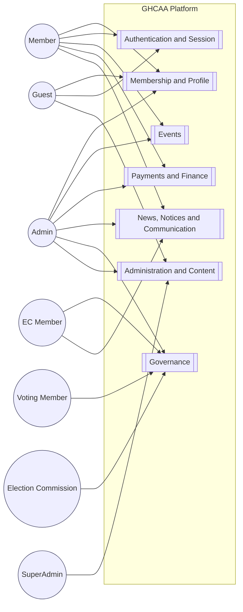

### Figure 3.2 — Membership subsystem use cases

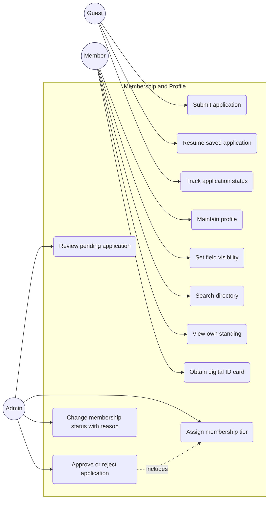

### Figure 3.3 — Events subsystem use cases

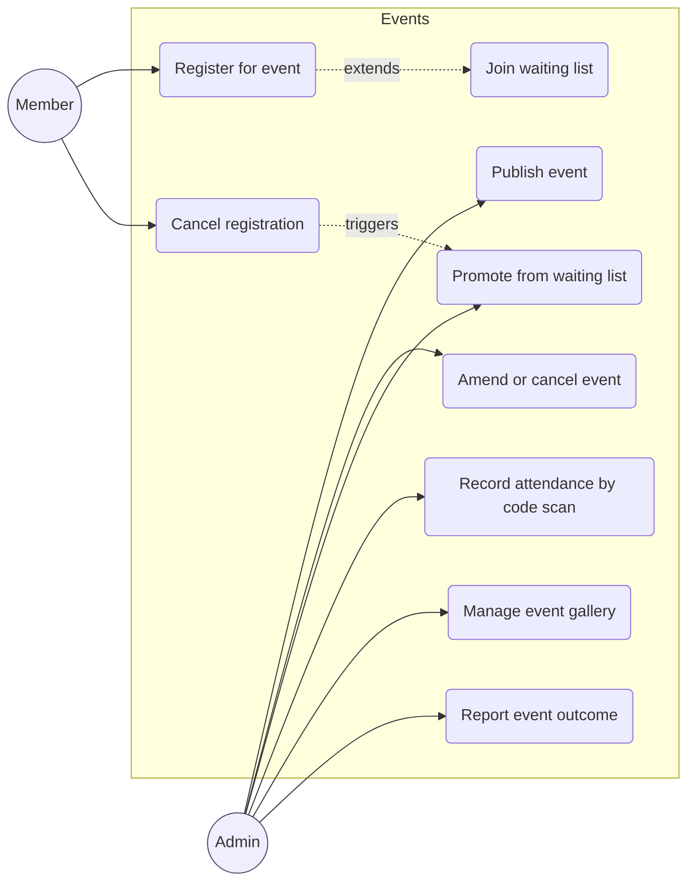

### Figure 3.4 — Payments subsystem use cases

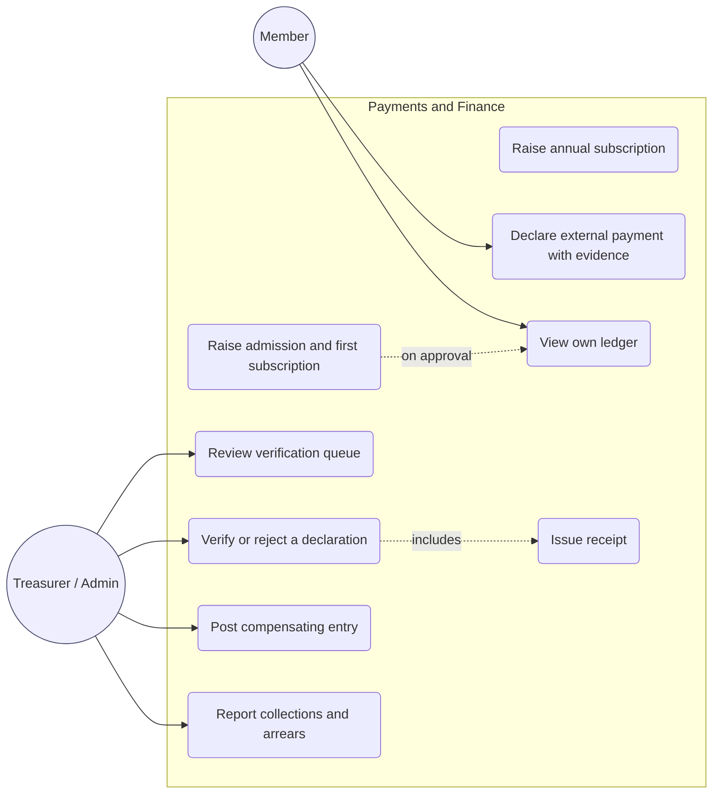

### Figure 3.5 — Governance subsystem use cases

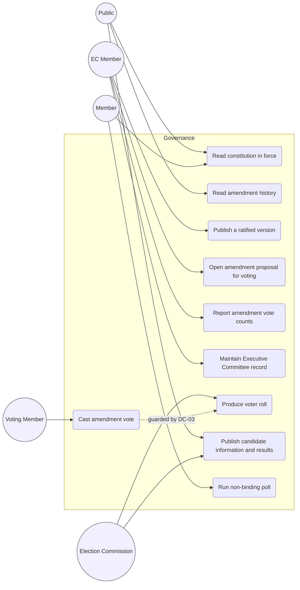

### Figure 3.6 — Administration subsystem use cases

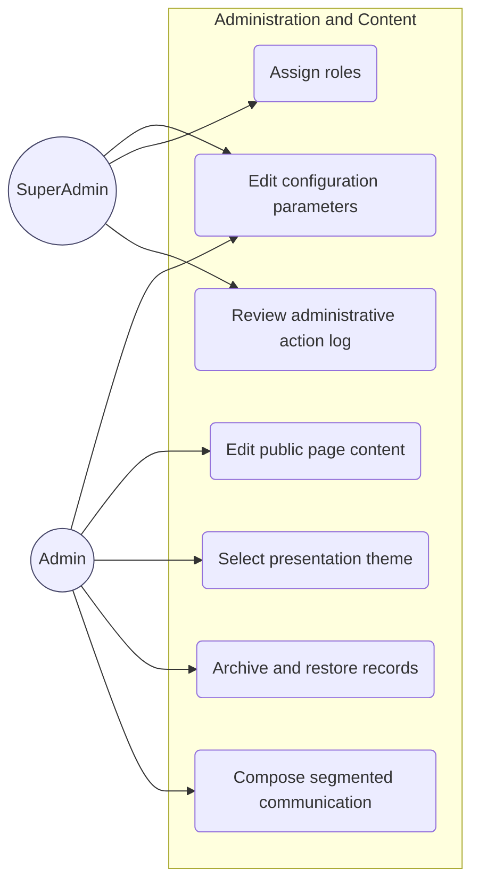

### Figure 3.7 — Actor generalisation hierarchy

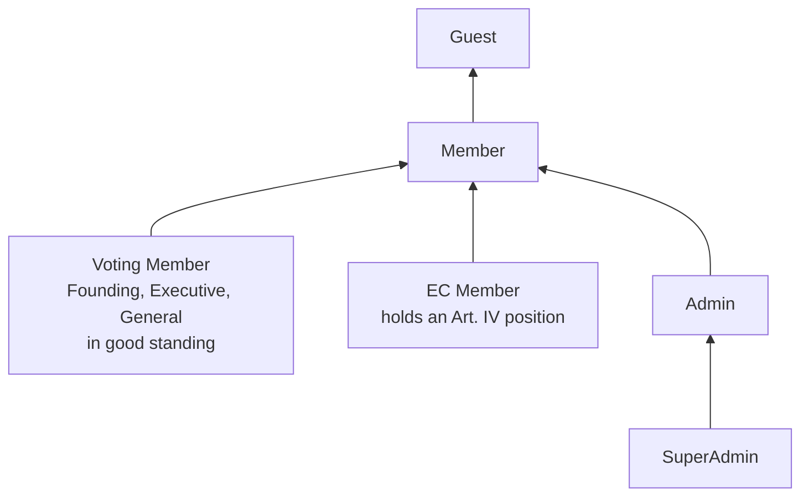

Administrative capability attaches to Admin by role assignment, not to EC Member by virtue of
position. The two are drawn as separate specialisations of Member for exactly that reason.

### Figure 3.8 — Domain model, analysis level: membership, obligations and payment

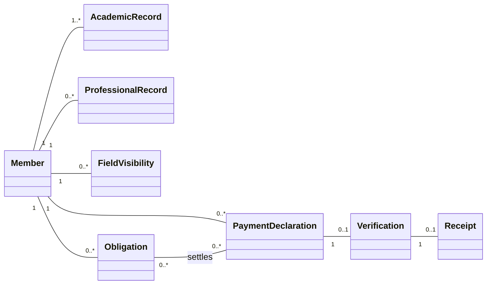

### Figure 3.9 — Domain model, analysis level: participation, governance and content

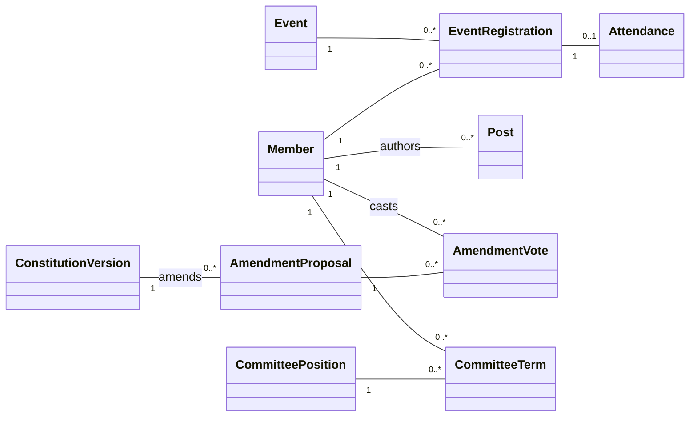

Attributes are omitted from both halves so the classes and their multiplicities print legibly; they are
given per class in the data dictionary of Table 6.2 and, for the classes that survive into the design
model, in Figure 6.8.

This is an analysis model and deliberately omits identity, authentication, notification,
configuration and content concerns, all of which appear in the design class diagram of Chapter 6. Two
modelling decisions are worth stating. `Obligation` and `PaymentDeclaration` are separate classes
related many to many, because a single payment may settle more than one obligation and an obligation
may be settled in parts, and collapsing them, as the paper ledger effectively did, is what made
arrears unanswerable. `AmendmentVote` carries `eligibilityBasis`, recording why the voter was
admitted at the moment of voting, so that a later change in the member's standing cannot retroactively
call the count into question.

### Figure 3.10 — Quality-attribute utility tree

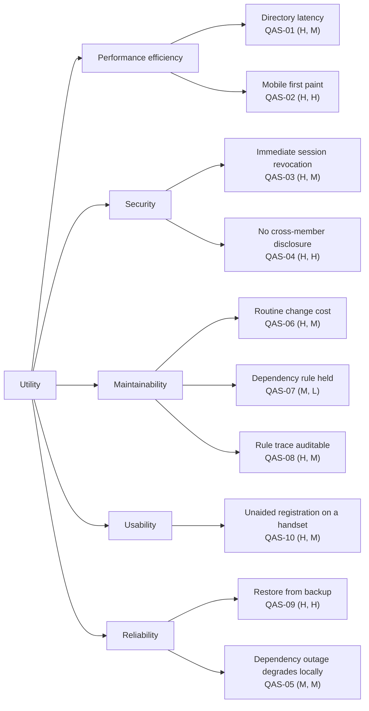

Annotations are (business value, technical risk) on a high, medium, low scale, in the ATAM convention
[34]. The four (H, H) and (H, M) items with highest combined weight, being QAS-02, QAS-04, QAS-08 and
QAS-09, are the scenarios the architectural evaluation of §6.12 examines in detail.

### Figure 3.11 — Requirements classification, FURPS+

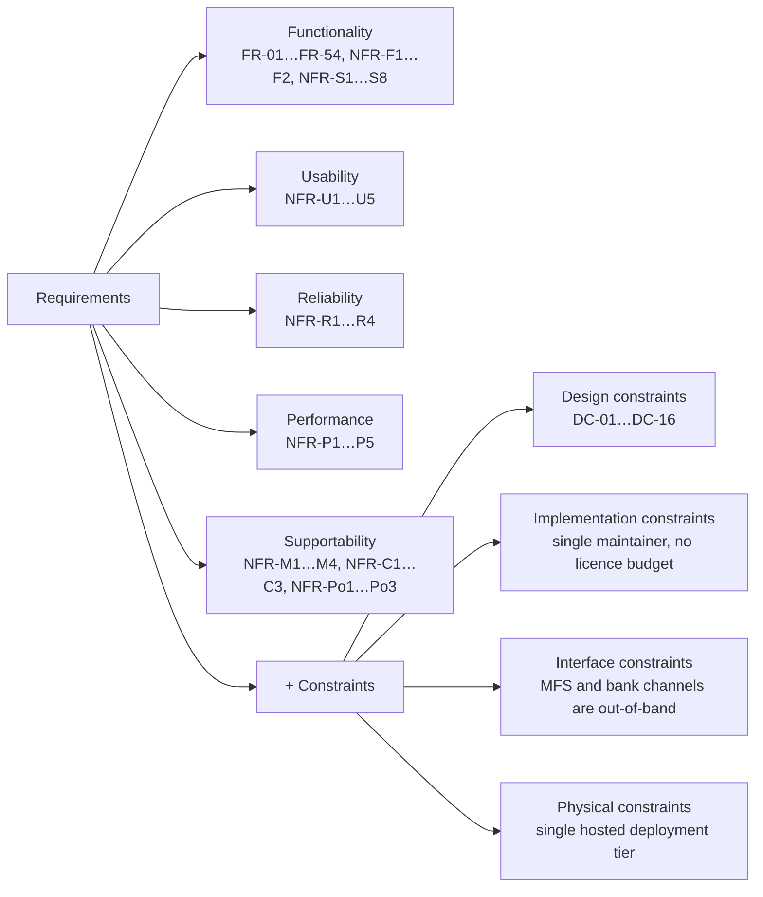

### Figure 3.12 — Goal model

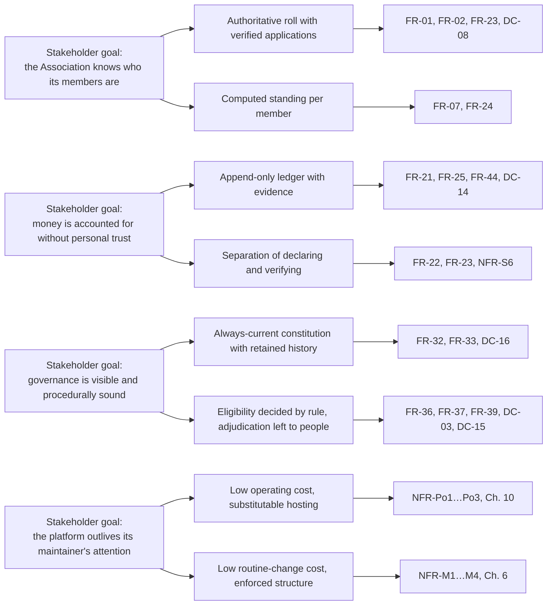

### Table 3.1 — Functional requirement catalogue

The catalogue is given in full in the tables of §3.3, which carry the ID, statement, source and
priority for each of FR-01 to FR-54 grouped by subsystem, and is not repeated here. The RQ linkage
is as follows: FR-01 to FR-31 and FR-41 to FR-54 answer RQ1 as the characterisation of the
requirement set; FR-19 to FR-25 additionally bear on RQ2 through the manual-payment design position;
FR-32 to FR-40 answer RQ3.

### Table 3.2 — Non-functional requirement catalogue

Given in full in §3.4, organised by ISO/IEC 25010 characteristic with the measurable acceptance
criterion stated for each of the thirty-four entries.

### Table 3.3 — Use-case descriptions, ten highest-value cases

**UC-01 Submit membership application** — *Actor:* Guest. *Priority:* M. *Requirements:* FR-01,
FR-02, FR-04. *Preconditions:* none. *Main flow:* the applicant opens the registration wizard;
supplies personal particulars; supplies at least one college academic record; supplies at least one
professional record; uploads a photograph; reviews a summary; submits. The system validates each
step on advance, creates the application in status Applied, records the submission time, and
acknowledges with a reference the applicant can use to track status. *Alternates:* the applicant
saves and resumes later, with entered data retained. *Exceptions:* a duplicate national identity
number, mobile number or email address is refused with the reason stated; a missing mandatory
particular blocks advance from the step concerned; an oversized image is compressed or refused per
FR-50. *Postconditions:* an application exists in Applied status and appears in the administrative
queue of FR-23.

**UC-02 Approve or reject an application** — *Actor:* Admin. *Priority:* M. *Requirements:* FR-19,
FR-23, DC-06, DC-08. *Preconditions:* an application in Applied status. *Main flow:* the
administrator opens the queue, ordered by age with items older than thirty days flagged; examines the
particulars and the uploaded evidence; assigns a membership tier; approves. The system allocates the
next membership number in `GHC-[Year]-[Serial]` form, sets status Active, raises the admission fee
and the first annual subscription as obligations, records the acting administrator and the time, and
notifies the applicant. *Alternates:* rejection with a recorded reason and notification. *Exceptions:*
a tier requiring a committee decision, per DC-06, cannot be assigned by a single administrator.
*Postconditions:* an active member with a membership number and two outstanding obligations, or a
rejected application, with the administrative act logged.

**UC-03 Declare an external payment** — *Actor:* Member. *Priority:* M. *Requirements:* FR-22,
FR-21. *Preconditions:* an authenticated member with at least one outstanding obligation. *Main
flow:* the member selects the obligation, sees the channel particulars and instructions drawn from
configuration, makes the payment outside the platform, then records the amount, channel, date and
transaction reference and uploads the evidence. The system records the declaration as unverified and
places it in the verification queue. *Alternates:* declaration against more than one obligation.
*Exceptions:* invalid or oversized evidence is refused with guidance; a lost connection does not
discard entered data, per FR-52. *Postconditions:* an unverified declaration exists; the member's
standing shows the payment as pending.

**UC-04 Verify a payment declaration** — *Actor:* Treasurer or Admin. *Priority:* M.
*Requirements:* FR-21, FR-23, FR-25, DC-14. *Preconditions:* an unverified declaration. *Main flow:*
the officer opens the queue, examines the evidence and the reference against the channel's own
record, and verifies. The system settles the obligation to the extent of the amount, records the
verifying officer and the time, generates a receipt, and notifies the member. *Alternates:* rejection
with a reason, leaving the obligation outstanding. *Exceptions:* an attempt to amend or delete a
verified record is refused; a correction requires a compensating entry. *Postconditions:* the
obligation is settled or part-settled, a receipt exists, and the verification is attributable.

**UC-05 Register for an event with a waiting list** — *Actor:* Member. *Priority:* M.
*Requirements:* FR-14, FR-15. *Preconditions:* a published event before its deadline. *Main flow:*
the member registers; if capacity remains, the registration is confirmed; otherwise the member is
placed at the tail of the waiting list with his position shown. *Alternates:* cancellation, which
promotes the head of the waiting list and notifies that member. *Exceptions:* the deadline has
passed; the member is already registered. *Postconditions:* the registration is confirmed or
waitlisted, and the counts of FR-18 reflect it.

**UC-06 Record attendance** — *Actor:* Admin. *Priority:* S. *Requirements:* FR-16. *Preconditions:*
an event in progress and a member holding a valid registration. *Main flow:* the administrator scans
the member's identity code; the system resolves it to the member, confirms a valid registration for
that event, records attendance and confirms. *Exceptions:* no registration for this event; already
recorded; unresolvable code. *Postconditions:* attendance recorded once.

**UC-07 Read the constitution in force** — *Actor:* Public or Member. *Priority:* M.
*Requirements:* FR-32, DC-16. *Preconditions:* at least one ratified version exists. *Main flow:*
the reader opens the constitution page; the system resolves the version in force by effective date
and presents it with its version identifier and effective date, together with a link to the retained
history and to the authoritative document file. *Exceptions:* the document file is unavailable, in
which case the stored text is presented and the condition is reported. *Postconditions:* none; the
read is stateless and no page names a version.

**UC-08 Open an amendment proposal for voting** — *Actor:* EC Member. *Priority:* M.
*Requirements:* FR-35, DC-13. *Preconditions:* a proposal originating from the Executive Committee or
from a petition of twenty percent of voting members. *Main flow:* the officer records the proposal,
its originating route and its circulation date, and sets the voting window. The system refuses a
window opening less than fourteen days after circulation, and on opening makes the proposal visible
to eligible voters. *Exceptions:* insufficient circulation period; an overlapping open proposal on
the same article, which is warned rather than refused. *Postconditions:* an open proposal with a
recorded circulation date and window.

**UC-09 Cast an amendment vote** — *Actor:* Voting Member. *Priority:* M. *Requirements:* FR-36,
DC-03. *Preconditions:* an open proposal within its window. *Main flow:* the member opens the
proposal; the system evaluates eligibility from tier and standing at that moment; an eligible member
records for or against; the system stores the vote together with the basis on which eligibility was
established. *Exceptions:* a non-voting tier is refused with the constitutional ground stated; a
member in arrears is refused with the standing stated; a second vote by the same member is refused.
*Postconditions:* exactly one vote per eligible member, each carrying its eligibility basis.

**UC-10 Produce the voter roll** — *Actor:* Election Commission. *Priority:* M. *Requirements:*
FR-38, DC-03, DC-12, DC-15. *Preconditions:* an election has been called. *Main flow:* the
Commission requests the roll as at a stated date; the system derives it from tier and standing,
including for each entry the membership number, name, tier and the basis of inclusion, and produces
it in a form that can be published and challenged. *Alternates:* a challenge is resolved by
correcting the underlying membership or payment record and reissuing the roll, with both versions
retained. *Exceptions:* none. *Postconditions:* a published roll; the ballot itself proceeds under
the election documents and outside this system.

The remaining use cases are in `docs/SRS.md`.

### Table 3.4 — Requirements traceability matrix

The columns are requirement, constitutional source where applicable, use case, design element,
implementation artefact and test case. A representative extract follows; the full matrix appears as
Appendix B and is closed in §12.2. It is maintained by hand, with the consequence stated in §3.9.

| Req | DC / clause | Use case | Design element (Ch. 5–6) | Implementation artefact (Ch. 7) | Test (Ch. 9) |
| --- | --- | --- | --- | --- | --- |
| FR-01 | — | UC-01 | Registration sequence, §5.5 | Registration endpoint and application service | Wizard validation and duplicate-identity tests |
| FR-02 | DC-08 | UC-01, UC-02 | Membership state machine, §5.3 | Membership status transitions | State-transition suite |
| FR-03 | — | UC-04 (profile) | Masking projection, §8.7 | Field-visibility model and directory projection | Masked-projection tests |
| FR-19 | DC-14 | UC-02 | Approval flow, §5.5 | Obligation raising on approval | Approval-side-effect tests |
| FR-21 | DC-14 | UC-04 | Ledger model, §5.4 | Payment and verification records | Attribution and immutability tests |
| FR-25 | DC-14 | UC-04 | Append-only rule, §5.6 | Receipt generation; amendment refusal | Compensating-entry tests |
| FR-32 | DC-16 | UC-07 | Version resolution, §5.6 | Always-current reader | Effective-date resolution tests |
| FR-33 | DC-16 | UC-07 | Supersede-not-delete rule, §5.6 | Version synchronisation at start-up | History-retention tests |
| FR-36 | DC-03 | UC-09 | Eligibility rule, §5.6 | Voting eligibility guard | Tier and standing refusal tests |
| FR-37 | DC-13 | UC-08, UC-09 | Threshold reporting, §5.6 | Count and threshold report | Two-thirds computation tests |
| FR-38 | DC-03, DC-12 | UC-10 | Roll derivation, §5.4 | Voter-roll query | Roll composition tests |
| FR-44 | DC-14 | UC-02, UC-04 | Archival deletion, §6.9 | Global filter on archived records | Exclusion and recovery tests |
| NFR-M1 | — | — | Dependency rule, §6.4 | Layer boundaries | Architecture test, §9.4 |
| NFR-S5 | DC-07 | UC-02 | Session invalidation, §8.5 | Security-stamp check per request | Revocation timing test |

### Table 3.5 — MoSCoW prioritisation and negotiation outcome

Given in §3.8, with the count per priority band, the basis on which the band was assigned, the
enumerated Won't set, and the two contested reclassifications recorded with their reasons. The three
negotiated conflicts and their resolutions are in §3.2.

### Table 3.6 — Domain constraints, their class and their constitutional article

Given in §3.10, with the sixteen DC entries, each stating the constraint, its source article and
section, and the requirement or design element by which it is enforced.

### Table 3.7 — Feasibility summary

| Dimension | Principal finding | Verdict | Residual concern | Treated in |
| --- | --- | --- | --- | --- |
| Technical | No requirement exceeds a conventional transactional web system; the maintainer already held the necessary platform competence | Feasible | None material | §6.2 |
| Economic | Operating cost of the order of tens of dollars a year against a commercial licence exceeding the Association's annual income | Feasible | Cost is borne personally until the Association holds an account | §10.10 |
| Operational | The binding constraint is officer time spent verifying payments, not the software | Feasible with reservation | Permanent administrative burden, quantified rather than assumed | §12.6, §13.4 |
| Schedule | Incremental delivery, so schedule risk reduces scope rather than removing the system | Feasible | Two increments slipped | Ch. 11 |
| Legal | Bangladesh's data protection statute was in draft; no compliance claim is made | Feasible | Obligations may change on enactment | §8.11 |
| Ethical | Live personal data handled under a stated declaration; college identity used per DC-01 | Feasible | Sole-maintainer access to production data is an unresolved structural risk | Front matter, §8.11, §13.4 |

### Table 3.8 — Specification defects found by the formal technical review

Log identifiers refer to the findings record at `docs/BUSINESS_FINDINGS.md`. Severity as recorded
there. Classes follow the set stated in §3.12.

| Log ID | Class | Defect in the specification | Disposition |
| --- | --- | --- | --- |
| COV-002 | Inconsistency | FR-04 requires a Govt. Haraganga College record before submission but did not say at which layer the rule binds. The rule was implemented in the application service and omitted from the request validator, so a violating submission surfaced as an internal error rather than a rejected field | FR-04 restated to make the rule a submission precondition, binding at the boundary; validator gap logged as still open |
| COV-001 | Omission | The same rule was specified for the profile-update path only. Nothing in the specification said whether it also governed the registration path, and no falsifying condition had been stated for that path | Scope of FR-04 made explicit across both paths; the missing test is recorded as an open coverage gap, not as a passing check |
| COV-003 | Omission | FR-01's thirteen mandatory particulars were specified as a completeness rule, but the specification did not state what should happen on an attempt to approve an incomplete application | Approval precondition stated explicitly; negative case remains untested and is logged as such |
| COV-004 | Omission | The registration fee was specified as payable before approval without stating the effect of its absence at the moment of approval | Same treatment as COV-003; gate specified, negative case logged as open |
| P3-F2 | Omission | Idle-session expiry was implemented in both clients and in neither the specification nor the API. No requirement stated whether inactivity is a client concern or a server one | Not resolved. Carried as a known gap for the reason given in §3.12 |
