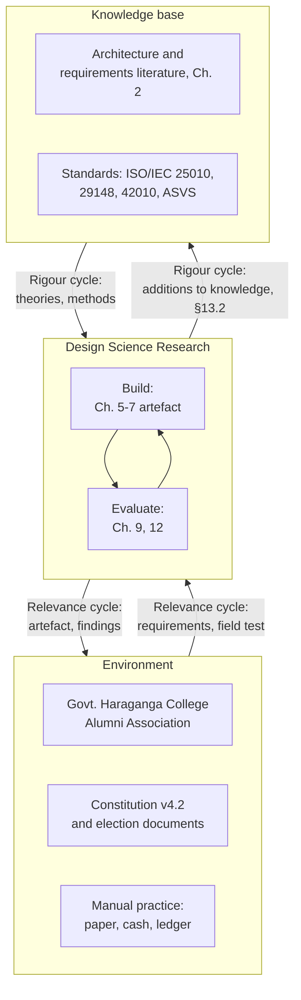
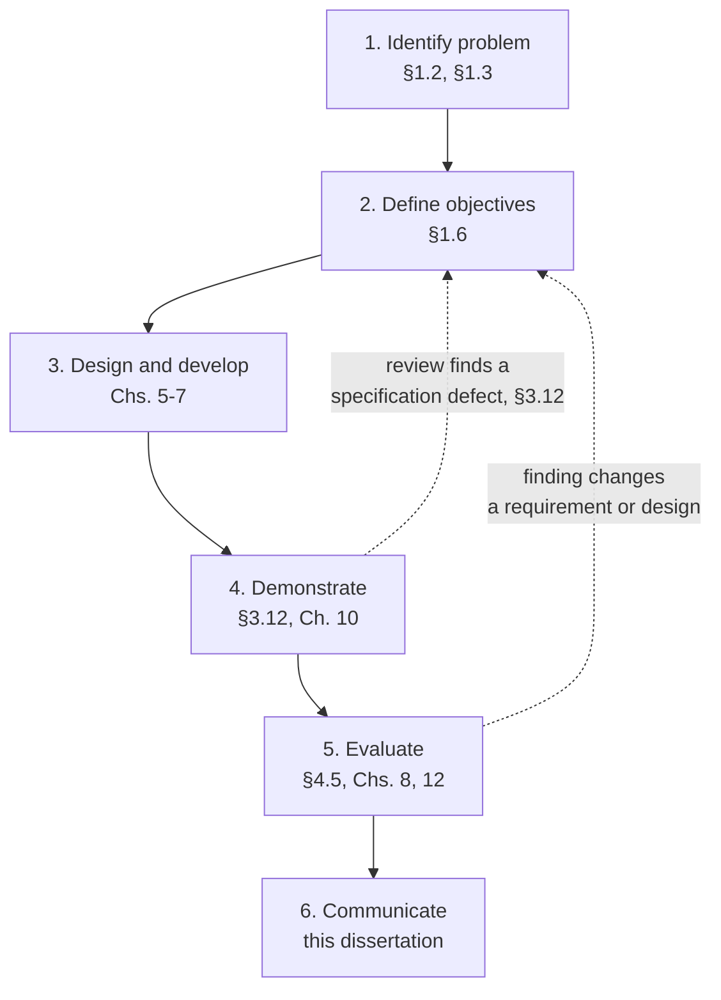
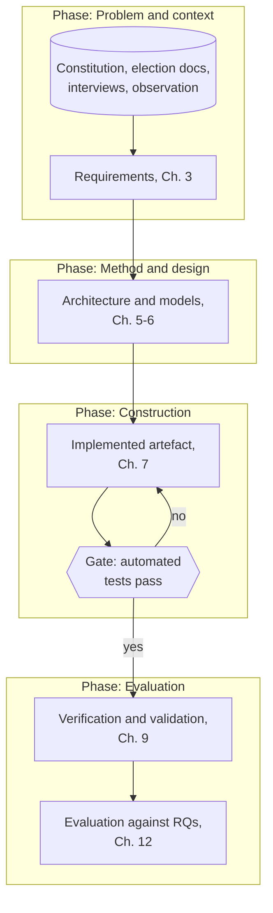
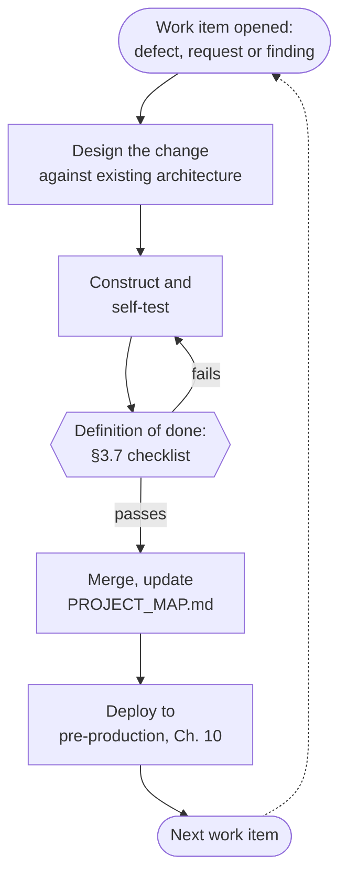
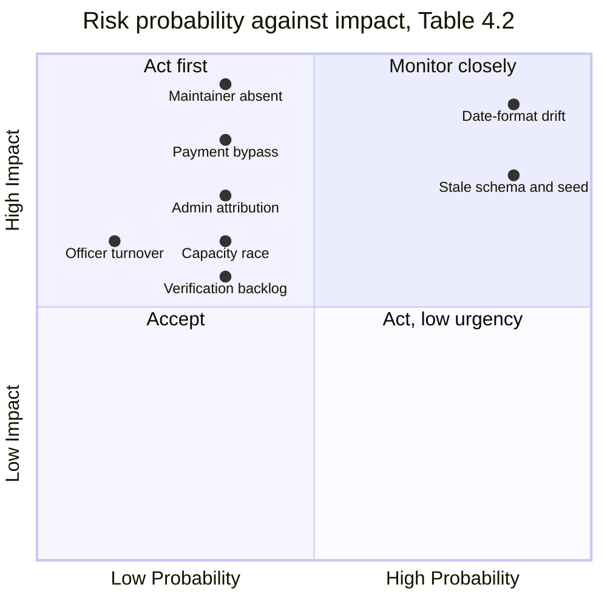

# PART II — METHOD AND DESIGN

# Chapter 4 — Research Methodology

This chapter does two things a conventional methodology chapter often does not. It states the
method, and it commits in advance to what will count as success, so that Chapter 12 has no room to
choose its evidence after the fact. Everything measured later in this document is measured against
a criterion fixed here.

## 4.1 Research Paradigm and Philosophical Position

The work sits in the pragmatist tradition rather than the positivist or interpretivist ones. The
question that drove it was not "what is universally true of alumni platforms" but "what artefact,
built and evaluated in this setting, resolves the problem stated in §1.3, and what does building it
teach". Pragmatism measures an idea's worth by what it lets you do, which is the right test for a
piece of software: a requirement, an architectural choice or a business rule is warranted here if it
produces a working, checkable consequence, not because it follows from a prior theory of alumni
engagement.

This has a direct consequence for how claims in this dissertation are read. A statement such as "the
manual payment path is the correct design for this institution" is not offered as a general
proposition about payment systems. It is offered as a proposition that held, for this Association,
under the constraints of §1.7, and that is defended by the evidence Chapter 12 assembles. Where the
literature review of Chapter 2 disagrees with a choice made here, §12.9 says so rather than quietly
picking a side.

The researcher and the builder are the same person, which pragmatism does not treat as a defect to
apologise for but as a fact to disclose and manage. §4.10 and §12.11 return to what that dual role
costs the evaluation.

## 4.2 Design Science Research as the Governing Method

Design science research treats the artefact itself as the unit of contribution: a design science
study must produce something built, not only something argued, and must evaluate what was built
against stated criteria [4]. Hevner et al. organise this around three cycles that must all close before
the work is complete [4].

The **relevance cycle** connects the environment, meaning the Association, its constitution and its
current practice, to the research. It supplies the requirements of Chapter 3 and receives the
artefact back for field testing; Figure 4.1 labels the three cycles with what each carried in this
project, and Figure 4.2 shows the process as it was actually executed rather than as the model
prescribes it; the formal technical review session of 3 July 2026, recorded
in §3.12 with an officer of the Association acting as domain reviewer, is this cycle closing partway
through the project rather than only at the end.

The **rigour cycle** connects the research to the existing knowledge base: the architecture,
requirements-engineering, security and governance literature surveyed in Chapter 2, and the standards
listed in the front matter. Every architectural and design choice in Chapter 6 is checked against this
literature before it is treated as settled, and §6.2 records where the literature's default advice
was rejected and why.

The **design cycle** is the inner loop of building and evaluating, repeated across the increments
Chapter 7 reports and gated, in every increment, by the verification discipline described in §4.4.
This is the cycle that ran most often. It is also the cycle for which the repository itself is the
clearest evidence, since every one of the two hundred and fifty-eight commits between 9 February and 7
September 2026 is a turn of it.

## 4.3 Mapping Design Science Activities to the Work Performed

Peffers et al. resolve the design cycle into six activities, and the table below states, for each
one, what was actually done and where it is reported [5]. The sixth activity, communication, is this
document.

| DSR activity | What was done | Evidence and chapter |
| --- | --- | --- |
| Problem identification and motivation | Observation of the paper-based application, cash-and-ledger collection and Facebook-circulated constitution described in §1.2 | §1.2, §1.3 |
| Definition of objectives for a solution | The eight objectives of §1.6, each traced to a research question | §1.6 |
| Design and development | Eighty-two numbered work packages recorded as they were opened, most of them triggered by a stakeholder request rather than by the author's own plan; forty-nine mapped entities, thirty-six API controllers and two client applications delivered across them | `docs/TODO.md`; Chs. 5–7 |
| Demonstration | The artefact running against a seeded database, exercised in the formal technical review sessions of §3.12 and deployed to the pre-production environment of Chapter 10 | §3.12, Ch. 10 |
| Evaluation | Executed against the plan declared in §4.5 | Ch. 9, Ch. 12 |
| Communication | This dissertation, and the documentation corpus in `docs/` that a successor maintainer would read first | Whole document |

The "design and development" row understates nothing by omission and nothing by exaggeration: the
eighty-two work packages are `docs/TODO.md`'s own numbering, several of them opened explicitly "raised by
user" on a dated request, which is the clearest documentary evidence available that the relevance
cycle kept running throughout construction rather than only at the requirements stage. This chapter
and Chapter 11 count the same project by five different units — commit, tracker task, work package,
WBS activity, feature — and a number that looks inconsistent between them usually means the unit
changed, not the fact; §11.2, where the schedule and effort figures are built, defines all five once
so neither chapter has to repeat the definition.

## 4.4 Software Process Model and its Justification

Three conventional alternatives were considered and rejected, each for a reason specific to this
project's constraints rather than as a general criticism of the alternative. Figure 4.3 sets out the
research design that resulted, phase by phase, with its inputs, outputs and evaluation points.

**Waterfall** requires a requirements specification to be frozen before design begins. Section 3.12
shows that the specification itself changed on formal technical review, after code already existed
for the flows concerned; a waterfall commitment would have forced a choice between reopening a closed
phase or shipping a specification known to be wrong. Given a single maintainer working unpaid and
irregular hours, a long single-pass cycle also carries a schedule risk waterfall does not price
well: any interruption of months, which the maintainer's other obligations made a real possibility,
would have left no working system at all.

**Spiral development** [Boehm's risk-driven prototyping, 31] fits a setting with the analytic capacity
to run a formal risk assessment before each cycle. That apparatus is disproportionate to a
single-developer project; the risk identification that spiral development would have scheduled as a
distinct activity happened here as an ordinary part of reading the constitution and testing the
software, and is reported honestly as such in §4.8 rather than dressed up as a formal spiral.

**Named agile methods** such as Scrum presuppose a team, and most of their machinery, being sprint
ceremonies, a product owner distinct from the developer, and story-point estimation for the purpose
of team capacity planning, has no referent when the team is one person who is also the sole
stakeholder for every technical decision. What survived from the agile literature was the principle
behind it rather than its ceremonies: working software after every increment, and requirements that
change in response to what the working software reveals [53], [54].

What was actually followed is incremental and evolutionary delivery in the sense Lehman describes
software's continuing growth and increasing complexity as inherent to a live system rather than as a
process failure [55]: eighty-two work packages, opened as problems were found or requested, each closed
against a gate rather than against a date. The gate is stated plainly in `docs/TODO.md`'s own
verification standard: "no task marked done until its test passes", and the phased remediation plans
in `docs/FORUM_PLAN_2026-05.md` end each phase with an explicit gate line, for example `dotnet test` (API),
`flutter analyze` and `ng build` all green before Phase 1 of the July 2026 review remediation could be
considered closed. That is a borrowed piece of the V-model, verification tied to the unit of work
that produced the thing being verified, grafted onto an otherwise incremental lifecycle. Figure 4.4
draws the loop as it actually ran.

The rest of the project's software-engineering standards, being architectural conformance, coding
convention and definition of done, are stated once in §3.7 and enforced at every increment rather
than only at a phase boundary; this is what the incremental choice cost in process overhead and what
it bought in resilience to interruption.

## 4.5 Evaluation Strategy

This is the point of the chapter. Everything below is a commitment made before any measurement in
Chapters 8 and 12 was taken, so that a result reported later can be checked against what was promised
here rather than against a criterion chosen to fit the result. Table 4.3 collects the commitments in
one place: instrument, what it measures, and where the result is reported.

Two of those commitments were later reduced, and the reduction is recorded here rather than removed.
The performance commitment was written as a concurrent-load measurement and is delivered as a
single-client latency measurement, for the reason given in §4.5.3 below, which is the shared pre-production tier. The security commitment was
written as conformance against OWASP ASVS and is delivered as a self-assessment against it, for the
reason given in §4.5.4 below, which is that no independent assessor was available. A third, mutation testing, was planned and is reported as not run in §9.14.5, the
test-adequacy section.
Editing this section to promise only what was achieved would have made the chapter tidier and would
have destroyed the property that makes it worth writing, which is that a reader can hold the plan
against the outcome. The gap between them is a result and is discussed in §12.11, threats to validity.

### 4.5.1 Functional evaluation

Requirement coverage is read off the traceability matrix established in §3.9 as Table 3.4. A
requirement of priority Must is scored as covered only if it traces to a passing automated test; a
requirement traced to code with no test is reported as uncovered, not as covered by inspection. The
matrix is closed, meaning every requirement given a final verdict, in §12.2.

### 4.5.2 Quality evaluation

Quality is read against ISO/IEC 25010's characteristics [6], each evidenced by a static product
metric or a test result defined in §4.6, computed over the delivered solution and reported per layer
rather than as a single blended figure, because a blended figure would hide exactly the
domain-versus-presentation distinction the risk-weighted coverage targets of §4.6 depend on.

### 4.5.3 Performance evaluation

The workload model is the one implied by the quality-attribute scenarios QAS-01 and QAS-02 of §3.5:
concurrent reads against the directory and event listings, and a cold page load on a mid-range
handset profile. What is measured against that model is less than the model describes, and the
reduction is stated here rather than left for the reader to notice in Chapter 12.

Latency is measured from a single client against the pre-production deployment described in
Chapter 10, which runs the same container image as production on a smaller instance tier, and is
reported per endpoint at the ninety-fifth percentile over a fixed count of sequential requests.
That is a latency measurement and not a load test. It cannot show how the platform behaves under the
concurrent use QAS-01 assumes, §9.11, the performance-testing section, reports it under that limit, and §12.11,
threats to validity, carries what follows from it. The reason is the deployment rather than the instrument: the pre-production
tier is a shared instance whose throughput is set by the hosting plan, so a concurrency figure taken
from it would be a measurement of the plan.

### 4.5.4 Security evaluation

Two instruments, run together rather than as alternatives. The threat model of Chapter 8, built by
STRIDE walk-through of the data-flow diagrams of §5.2, gives coverage of *attack classes*. The
OWASP ASVS level 2 checklist [7] gives coverage of *control families*. The edition used is 4.0.3 of
2021, which is the edition the security work of Chapter 8 was carried out against; ASVS 5.0.0 was
released in May 2025 [75] and restructures the standard into seventeen chapters, so a conformance
claim under 4.0.3 does not transfer to it and is not presented as though it did. Section 9.10 reports
the testing and §8.13 the control-by-control assessment, and a control is scored conformant only
where a specific code location or configuration enforces it, in the same style as the
design-principle evidence table of §6.11.

The assessment is the author's own, carried out against the checklist by the person who wrote the
code. It is not an audit, no independent assessor saw it, and no penetration test was commissioned.
Self-assessment is weakest exactly where it matters most, on the controls whose absence the author
never considered, so the claim made in §8.13 is conformance as assessed rather than conformance
verified, and §12.11, threats to validity, records the difference.

### 4.5.5 Usability evaluation

Three instruments: task-based testing against the completion criterion of NFR-U2, the System
Usability Scale against the published benchmark of 68 [33] per NFR-U3, and a heuristic walkthrough
against Nielsen's heuristics [35] for the flows the task sessions do not reach.

The task script is not one script. The Association's work divides by office, so there are four: one
for ordinary members covering registration, profile, payment declaration, event registration, the
directory and the constitution; and one each for the Treasurer, the General Secretary and the
President, built from what those offices actually do rather than from the platform's menus. Each
session ends with the same SUS form and a set of open questions for the office, which is where the
stakeholder evidence of §12.7 comes from. The instruments are delivered beside this dissertation, in
`docs/book/instruments/`, so that the criterion can be checked against what participants saw.

Two properties of the design are stated here because they bound what Chapter 12 may claim. Sessions
are run by the author, who is known to every participant and is the platform's sole maintainer, which
is an acquiescence pressure the procedure reduces but does not remove. There is no control condition
and no comparison system, so the study can report whether people completed a task and what obstructed
them, and cannot report that the platform is better than any alternative.

### 4.5.6 Expert and stakeholder evaluation

This is not a separate activity invented for the evaluation chapter; it is the formal technical
review already reported in §3.12, and its findings log at `docs/BUSINESS_FINDINGS.md` is read a
second time in §12.7 for what it says about the delivered system rather than about the specification.
The reviewer's role, an officer of the Association acting as domain reviewer rather than as a
software professional, is unchanged between the two readings.

## 4.6 Metrics Definition

Each metric is given here in Table 4.1 with its formula, the tool that computes it and the threshold
that will be compared against it, so that §9.14 and Chapter 12 apply rather than choose these
numbers.

### Table 4.1 — Metric definitions

| Metric | Formula / method | Tool | Target |
| --- | --- | --- | --- |
| Statement and branch coverage | Lines and branches exercised ÷ total, per test run | `coverlet.collector` 6.0.2 via `dotnet test`, per NUnit 4.2.2 project | Risk-weighted by module criticality; see §9.14.5 |
| Mutation score | Mutants killed ÷ mutants generated | Planned, not run; §9.14.5 states why | Not reported |
| Cyclomatic complexity | McCabe's independent-path count per method [57] | Static analysis over the solution | Flagged above 10 per method |
| Coupling between objects (CBO), afferent/efferent coupling, instability | Chidamber and Kemerer's suite [56]; instability = efferent ÷ (afferent + efferent) | Static analysis over the solution | Plotted against Martin's main sequence, §9.14.3 |
| Maintainability index | Oman and Hagemeister's composite of volume, complexity and comment ratio [58] | Static analysis over the solution | No fixed target; trended across the increments recorded in `docs/TODO.md` |
| Response latency | Wall-clock time from request to first byte, 95th percentile | Sequential requests from one client against pre-production, §9.11; not a load test | Per NFR-P1, NFR-P2, NFR-P5 |
| System Usability Scale | Ten-item questionnaire, Brooke's scoring [33] | Form in `docs/book/instruments/`, one per participant after their tasks | ≥ 68 |
| ASVS conformance | Control satisfied / not satisfied / not applicable, by control family | Author's self-assessment against ASVS 4.0.3 [7]; not an audit | Full level 2 coverage of applicable families |
| Requirement coverage | Requirements traced to a passing test ÷ total Must requirements | Traceability matrix, Table 3.4 | 100% of Must |

## 4.7 Data Collection and Analysis Procedures

Elicitation is reported here rather than in Chapter 3 because it is method: Chapter 3 states what
the requirements are, and this section states how they were obtained and how each kind of data
gathered during the project was analysed.

### 4.7.1 Elicitation techniques

Four techniques were used, in the order given, each chosen for what the previous one could not
reach.

**Document analysis** came first and carried the most weight, which is unusual and is a consequence
of the domain. The Association had already written down most of its rules before any software
existed. The corpus analysed comprised the constitution at version 4.2, effective 1 July 2026,
consisting of twelve articles; the seven documents of the election code, namely the election
regulations, the operational manual, the code of conduct, the manual balloting procedure, the forms
set, the ballot-box sealing and poll-integrity certificate, and the counting authorisation; and such
records of prior practice as existed, principally the treasurer's ledger pages and the paper
application forms. Analysis proceeded clause by clause. Each normative clause was classified as
imposing a domain constraint, implying a functional requirement, implying a quality requirement, or
having no software consequence. That pass produced the DC set of §3.10 and seeded roughly a third of
the functional requirements directly.

**Stakeholder interviews** were used second, to establish current practice, pain and priority, since
the documents state what should happen rather than what does. Interviews were semi-structured, with
an instrument organised around the respondent's own tasks rather than around candidate features, on
the reasoning that asking a volunteer treasurer what functions he wants tends to produce a
description of whatever software he has last used.

**Observation of current practice** followed, because two of the most consequential findings could
not have been obtained by asking. The first was that application forms were routinely accepted with
the certificate field unfilled, on the strength of an officer recognising the applicant, which is the
recognition gateway visible in Figure 2.3 and the origin of the thirty-day verification requirement
in FR-23. The second was that the treasurer's ledger recorded receipts but not the identity of the
receiving officer, so a discrepancy could not be attributed. That produced FR-21 and the
separation-of-duty property in §8.9.

**Competitor analysis**, reported in §2.9, closed the set by surfacing capabilities nobody thought
to ask for, of which the waitlist behaviour in FR-15 and the bulk communication segmentation in
FR-29 are the two that survived prioritisation.

### 4.7.2 Participants, sampling and instruments

Sampling was purposive rather than representative. The population of people who hold operational
knowledge of the Association's processes is small and largely identified by office, so the sampling
frame was the office holders themselves plus a convenience sample of ordinary members drawn from
those attending the reunion at which registration was being collected.

Ten people were interviewed. They included all three of the officers whose work the platform most
directly changes, being the President, the Treasurer and the General Secretary, with the remainder
ordinary members. Participants are not named here. They are identifiable members of a small
association, they agreed to take part verbally rather than in writing, and naming them would put
identifiable personal information into a public document to no analytical purpose; §4.9 states the
consent position in full.

The author is one of the ten. He is also the Association's Information and Technology Secretary and
the platform's sole maintainer, so his own account of current practice is not independent evidence,
and it is not treated as such: every requirement traced to interview in the Source column of §3.3 was
stated by at least one participant other than the author.

Sessions ran thirty to forty minutes each. Recruitment was direct: every participant was already a
member of the Association, and each was approached as one member to another rather than through any
formal call for volunteers. That is the recruitment route a single-maintainer study in a small
association actually has, and it carries the selection bias that goes with it, since the people
easiest to approach are the people already engaged.

The period over which the sessions ran was not recorded, and is not reconstructed here. No
participant-derived figure is quoted anywhere in this dissertation, so nothing downstream depends on
it; saying that it was not recorded is preferable to producing a date range from memory. The
interview guides per role are held with the evaluation instruments delivered beside this
dissertation, not bound into it.

Instruments used: an interview guide per role, with an opening account of current task flow, a
probe set on failure and workaround, and a closing prioritisation exercise; an observation checklist
covering the application, payment and recording steps; and a document-analysis coding sheet mapping
each constitutional clause to its classification and to the identifier it produced.

### 4.7.3 Analysis procedures

Four kinds of data are collected, and each has a different analysis treatment. Automated test results
and coverage reports are quantitative and are aggregated directly; no sampling is involved since the
population is the whole test run. Static-analysis output, being complexity and coupling figures, is
quantitative and is analysed by threshold and by distribution, per §9.14.2 and §9.14.3, rather than by
a single mean that would hide the worst offenders the maintainability argument actually depends on.
Formal-technical-review findings, held in `docs/BUSINESS_FINDINGS.md`, are qualitative records
classified by module, layer and severity as the log itself already tags them; §3.12 and §12.7 read
that classification rather than re-coding it, so that the analysis is traceable to the artefact rather
than to a scheme invented after the fact. Usability data, being task completion, time on task and SUS
responses, is quantitative on a small purposive sample and is reported descriptively, with the sample
size stated alongside every figure so that no percentage is read as more precise than the sample
supports.

## 4.8 Risk Management: the RMMM Plan

The structure of this section, being risk identification, projection by probability and impact,
mitigation, monitoring and management, follows Pressman and Maxim's RMMM plan [54], and Table 4.2
uses their columns.

Risk was not managed through a separate formal apparatus running alongside development. It was
managed through the same mechanism that managed everything else: a numbered, dated work item in
`docs/TODO.md`, closed against a test. That is disclosed here rather than dressed up, and Table 4.2
is built from the actual severity classifications the project used at the time, not reconstructed
after the fact to look tidier than the record. Figure 4.5 plots the same risks by probability against
impact. The two the project scored at high probability, date-format drift and stale schema and seed
data, are also the two that went on to happen.

### Table 4.2 — RMMM table

| Risk | Category | Probability | Impact | Mitigation | Monitoring signal | Outcome |
| --- | --- | --- | --- | --- | --- | --- |
| Single maintainer unavailable for an extended period | Project | Medium | High | Documentation corpus (`PROJECT_MAP.md`, `TODO.md`, `ARCHITECTURE.md`) written to let a successor start without the author present | Elapsed time since last commit | Open; mitigated, not eliminated |
| Payment amount not verified against the originating record before crediting membership (TODO 29-B.2) | Technical, security | Medium | High | Removed the `amount > 0` short-circuit; callback amount always compared to the originating `PaymentHistory` amount | Payment and approval integration tests | Closed, Phase 2 of the July 2026 remediation |
| Administrative action attributed to a hardcoded admin identifier rather than the acting user (TODO 29-F.1) | Technical, audit integrity | Medium | High | Acting admin read from the JWT `MemberId` claim on every approval and rejection path | Code review; audit-log spot check | Closed, Phase 2 |
| Event capacity exceeded under concurrent registration (TODO 29-A.4) | Technical | Medium | Medium | Occupying-status count corrected to include all statuses that hold a place, cap enforced even when waitlisting is off, insert guarded against concurrent overfill | Concurrent-registration test | Closed, Phase 1 |
| Date format inconsistency between `dd-MM-yyyy` display and ISO-8601 wire format risking silent data corruption across clients (TODO Work Package 23, 29-F.3) | Technical | High (had already caused defects) | High | ISO-8601 fixed as the canonical wire format; `DateFormatConverter` and client parsers reconciled to it | `DateFormatConverterTests.cs`, 20 pinning tests | Closed and test-pinned, 2026-08-22 |
| `Database.EnsureCreated()` no-op on a non-empty database leaving seeded data, and later the schema itself, stale after a change | Technical | High | High | Two mechanisms, added a year apart: `ConstitutionSeeder.SyncAsync` at boot for revisable data, and `MigrationBootstrapper.EnsureMigratedAsync` for the schema once the same no-op was found to have withheld twenty-one migrations from preprod | Boot log; constitution version shown in the public reader; HTTP 500 rate on newly shipped endpoints | Closed twice, §6.5.6. The impact rating was raised from Medium to High after 27 August 2026, when the schema half surfaced as 500s from `/api/jobs` and `/api/gallery` |
| Manual payment verification backlog exceeding officer capacity as membership grows | Operational | Medium | Medium | Administrative queue ordered by age with a thirty-day flag (FR-23, DC-08); workload quantified rather than assumed away | Age of oldest unverified item in the queue | Open; monitored, not solved, §12.6 |
| Volunteer officer turnover losing institutional knowledge of platform operation | Organisational | Medium | Medium | Administration console designed to be operable without developer involvement (NFR-M4); documentation corpus | Handover interval, three-year committee term (DC-09) | Open; structural mitigation only |

Two things about this table are worth stating plainly. First, every closed row closed because a test
was written that would fail if the defect recurred, which is the definition-of-done requirement of
§3.7 applied to risk rather than to features. Second, the three rows left open are left open
honestly: none of them has a technical fix waiting to be applied, and each is a property of the
Association's size and volunteer structure rather than of the software.

## 4.9 Research Ethics

Two distinct ethical questions arise in this project, and they are kept separate rather than
answered by one paragraph that quietly covers both.

The first concerns the people who took part in the elicitation reported in §4.7. That study was not
reviewed by a university ethics committee. Permission to conduct it, to use the
Association's records and governing documents, and to work with its members was given by the
Government Haraganga College Alumni Association itself. No written approval was issued, no reference
number exists, and no date of approval was recorded. That is stated rather than presented as an
equivalent to institutional review, because it is not one.

Consent from interview participants was verbal and was not documented. Participation was voluntary
and unpaid, and participants were told what the material would be used for. No written consent form
was signed, no consent record was retained, and no participant is named in this dissertation or its
appendices. Consent from the members whose real records the live system holds was obtained the same
way, verbally, at Association gatherings, with no written record and no formal notice.

Three consequences follow, and they are limitations of this work rather than features of it. A
participant who wished to withdraw consent has no documented statement to withdraw. Because consent
was never recorded, its scope cannot be demonstrated to a reader, only asserted by the author. And a
future study reusing this material could not establish that the people concerned had agreed to that
reuse. §4.10 carries this forward as a limitation of the method, and the recommendation in §13.4
that the Association adopt a written consent line in its registration form comes directly from this
gap.

The second concerns the personal data of the Association's real members, which the platform holds in
production and which the maintainer necessarily saw during development and testing. That question is
answered, not deferred, in the front matter's Ethics Statement and Data-Protection Declaration and
expanded in §8.11: the principles applied are purpose limitation, minimisation, default
non-disclosure and a stated retention position, applied because Bangladesh's data-protection statute
was in draft rather than in force at the time of writing, and because no third-party ethics body
governs a single volunteer's handling of his own association's data. No production member data
appears anywhere in this dissertation; every figure, screenshot and test fixture quoted from this
point forward is synthesised. In the running system that data sits behind the access controls of
§8.4.

## 4.10 Limitations of the Chosen Method

The dual role of researcher and sole developer is the limitation that most affects how the rest of
this document should be read. Every finding in Chapter 9, and every judgement in §12.9 about whether
this project's answer to RQ3 is the right one, was reached by the same person who wrote the code
being judged. The formal technical review of §3.12 is the one point at which an independent party,
an officer of the Association, checked the work against something other than the author's own
standard, and its five specification defects and the pattern among them, that a walkthrough catches
what a re-reading does not, are reported for that reason rather than suppressed as evidence the
author's judgement was imperfect.

The incremental process, chosen for the reasons of §4.4, also means the requirement set of Chapter 3
and the architecture of Chapter 6 were not fixed before construction began in the sense a waterfall
study would fix them; the version presented in this dissertation is the state reached by 28 August
2026, and §11.8 records the changes of scope that occurred on the way there rather than presenting
the final state as though it had been the plan from the start.

Finally, this is a single-case design science study in Runeson and Höst's sense [10]. The evaluation
plan of §4.5 is thorough for this case, but generalising its results to another association requires
the argument of §12.13 about what transfers, not an assumption that it transfers automatically.

## 4.11 Summary

The method is design science research, run as Hevner's three cycles and Peffers' six activities,
delivered through eighty-two incrementally opened work packages gated by an automated test rather than by
a calendar date. The evaluation plan is fixed in this chapter across six dimensions, each with a
named metric, tool and threshold, before Chapter 9 measures anything. Risk was managed through the
same gated work-item mechanism as everything else, and the RMMM table of §4.8 is built from the
project's own severity record rather than reconstructed for presentation. Two ethical questions are
kept distinct, one of them still open and recorded as such. Chapter 5 now turns from method to the
system itself, modelling its behaviour and extracting the business rules the constitution imposes.

---

## Figures and Tables

### Figure 4.1 — Design Science Research framework with this project's instantiation labelled

### Figure 4.2 — Design Science process model as executed

### Figure 4.3 — Research design overview: phases, inputs, outputs, evaluation points

### Figure 4.4 — Process model diagram of the adopted incremental lifecycle

### Figure 4.5 — Risk exposure matrix

### Table 4.3 — Evaluation plan

| Research question | Criterion | Metric | Instrument | Threshold |
| --- | --- | --- | --- | --- |
| RQ1 | Requirement set fit for the domain | Requirement coverage; FTR defect count | Traceability matrix, Table 3.4; findings log | 100% of Must traced; FTR defects resolved or recorded |
| RQ2 | Architecture satisfies quality-attribute scenarios at bounded cost | Coupling, cohesion, maintainability index; operating cost | Static analysis, §9.14; cost model, §10.10 | Thresholds of Table 4.1; cost within Association's stated means |
| RQ3 | Governance rules encoded without loss of procedural legitimacy | DC-to-code trace completeness; ASVS conformance on governance endpoints | Table 3.4 DC column; §8.13 | Every DC of priority M traced and enforced |
| RQ4 | Measured quality against ISO/IEC 25010 | All metrics of Table 4.1 | As listed | As listed |
