# Chapter 5 — System Analysis and Behavioural Modelling

Chapter 3 said what the system must do and what it must not violate. This chapter says how those
statements turn into a model that can be built from. Two notations are used side by side rather than
one being chosen over the other, and §5.1 explains why. The chapter's centre of gravity is §5.6: the
business rules catalogue is where the constitution's clauses stop being prose and become named,
locatable checks in the code, and it is the artefact Chapter 9 tests against and Chapter 8 audits.

## 5.1 Analysis Approach

Structured analysis, meaning data-flow diagrams and process specifications, answers a question
object-oriented analysis answers badly: what moves through the system and where it is stored. A
data-flow diagram of the payment process is the clearest way to show a member's declaration and its
evidence arriving, sitting in a store, and leaving as a verified ledger entry, and §5.2 uses it for
exactly that.

Object-oriented analysis answers a different question well: what the persistent things in the system
are, what they are responsible for, and how they collaborate. A CRC card for `Member` or
`GovernanceService` says something a data-flow diagram cannot, namely who else has to be involved
before an operation can complete. The two views are kept complementary rather than merged into one
notation, because the literature on this point is itself divided [46], and forcing a single diagram to
answer both questions tends to produce a diagram that answers neither well.

A third view, state modelling, is needed because three of this system's central objects, being the
member, the payment, and the constitution, are long-lived and pass through official states that the
constitution itself names. Neither a data-flow diagram nor a class diagram makes a state machine
explicit, so §5.5 draws it separately.

## 5.2 Structured Analysis: Data-Flow Modelling

### 5.2.1 Context level

Figure 5.1 is the same boundary as Figure 1.1, redrawn here because this chapter, not Chapter 1, is
where the boundary starts to be decomposed.

### 5.2.2 Level 1 decomposition

Figure 5.2 decomposes the platform into seven processes, each corresponding to a subsystem named in
the use-case model of §3.6, and four persistent data stores. The stores are drawn at the level a
data-flow diagram uses them, which is coarser than the forty-nine mapped entities of §5.7; D1 Member
Records, for instance, stands for the member, academic-record, professional-record and
membership-history tables together, because at this level of analysis they are read and written as a
unit.

### 5.2.3 Level 2 decompositions of the critical processes

Three processes are decomposed to Level 2 here: payment processing in Figure 5.3, membership
approval in Figure 5.4, and constitution publication in Figure 5.5. These were chosen because each hides a decision inside it that the Level 1
diagram cannot show and that later chapters depend on. Authentication and OTP verification is
represented instead as the sequence diagram of Figure 5.15, and the election-administration process
as the BPMN diagram of Figure 5.10, because in both cases the property that matters is the ordering
and timing of an interaction across roles rather than the transformation of data, which a data-flow
diagram is not the right notation to carry. Table 5.3 gives the process specification for each
numbered process in those three diagrams, and Table 5.4 the data stores they read and write.

## 5.3 Object-Oriented Analysis

### 5.3.1 Noun and verb analysis

Reading the requirement statements of §3.3 as sentences rather than as a specification produces a
short list of recurring nouns: member, application, payment, event, post, constitution, committee,
vote. Each survived as a persistence-bearing analysis class. Verbs attached to those nouns, being
apply, approve, declare, verify, register, publish, vote and supersede, became the operations
attached to the services of §5.3.2 rather than to the domain objects themselves in every case; a
`Member` does not approve itself, an administrator does, acting through `MemberService`. That
division, of state living on the domain object and the decision to change it living on a service, is
the reason the design pattern discussion of §6.12.4 calls the model anaemic rather than rich, and
§6.12.7 records that this was noticed and deliberately not corrected everywhere, because a richer
domain model would have moved authorisation logic out of the layer where the API can enforce it
uniformly.

### 5.3.2 CRC Modelling

Table 5.2 gives the CRC card set for the analysis classes with the widest collaboration surface.
`Member` collaborates with almost everything, which is expected of the entity the whole domain
orbits; `GovernanceService`'s collaborator list is the direct analysis-level evidence for the
DC-03 enforcement discussed in §5.6.

### 5.3.3 Analysis class relationships

The relationships among these classes, at the level appropriate to analysis rather than to design,
are drawn in Figure 3.8 already and are not repeated here; §6.3 and Figure 6.7 give the design-level
version once persistence and DTO boundaries are added.

## 5.4 Behavioural Modelling

Three activity diagrams cover the flows where a decision is taken by a person rather than by code:
registration and administrative approval in Figure 5.6, payment declaration and verification in
Figure 5.7, and event registration with its waitlist in Figure 5.8. Figure 5.9 redraws the amendment
vote as a swimlane diagram, because there the interesting property is which role may act at which
point rather than the sequence itself, and Figure 5.10 gives the election cycle in BPMN, whose
audience is the Association's officers rather than engineers. Four sequence diagrams follow: login
with one-time password and token issue in Figure 5.15, event registration in Figure 5.16, payment
declaration and verification in Figure 5.17, and real-time notification over SignalR in Figure 5.18.
Figure 5.19 draws token lifetime and the refresh window to scale. Each is discussed at the point it
is first needed in §5.5 and §5.6 rather than in a separate narrative here, so that a diagram sits
next to the rule it illustrates.

## 5.5 State Modelling of Long-Lived Entities

Four state machines are drawn, and all four are read directly from an enumeration already defined in
the code rather than invented for the diagram; `Enums.cs` is authoritative and the diagrams follow
it, not the reverse.

**Member** (Figure 5.11) moves through `MembershipStatus`: `Applied`, `Active`,
`InactivePayment`, `InactiveResigned`, `Terminated`, `Rejected`. Every transition away from `Applied`
or `Active` is guarded, and DC-07's disciplinary procedure means the transition to `Terminated`
carries a reason recorded in `MembershipHistory`, whose `ChangedFrom`, `ChangedTo`, `ChangedByAdminId`
and `Reason` fields exist for exactly this purpose. There is no transition directly from `Applied` to
`Terminated` in the enumeration; a rejected application is `Rejected`, a discontinued membership is
`Terminated`, and the two are kept distinct because DC-07's appeal right attaches to the second and
not obviously to the first.

**Event lifecycle and registration** (Figure 5.14 draws the event's own states; the registration
states below are modelled alongside because the transition rule is identical in shape) moves through `EventRegistrationStatus`: `Pending`, `Approved`, `Rejected`,
`Waitlisted`. The waitlist promotion this diagram implies is FIFO by registration time, read directly
from `EventService`'s `.OrderBy(r => r.RegisteredAt)` when a place is released, which is FR-15 as
executable code rather than as a description of intended behaviour.

**Constitution** (Figure 5.13) has only two states in the persisted model, `IsActive = true` and
`IsActive = false` with a `SupersededDate` set, but the invariant DC-16 depends on, that exactly one
row is active at any time, is not a state a diagram can show by itself; it is enforced procedurally
by `ConstitutionSeeder.SyncAsync` at boot, which supersedes rather than deletes a prior version so
that its `AmendmentVote` rows survive. The diagram is drawn with three labelled states, Draft,
Active and Superseded, because that is the vocabulary DC-16 and FR-33 use, and the mapping from that
vocabulary to the two-column persisted representation is stated in the diagram's note rather than
left implicit.

**Payment** moves through `PaymentStatus`: `Pending`, `Completed`, `Failed`, `Refunded`, which is the
gateway-facing state; the member-facing declaration described in FR-22 is a separate, simpler
unverified-to-verified transition recorded on `PaymentHistory` rather than on this enumeration, and
Figure 5.12 draws both because the two are easy to conflate and the ledger rule of FR-25 depends on
keeping them apart: an unverified declaration is not yet a `FinancialRecord`, and once a
`FinancialRecord` exists it is not edited, only corrected by a compensating entry.

## 5.6 Business Rules Catalogue

Table 5.1 is the same sixteen domain constraints Table 3.6 stated, restated here with the actual
enforcement location rather than the requirement identifier, because a rule catalogue that a reviewer
cannot use to find the code is not doing the job the honesty rule in the front matter requires.

### Table 5.1 — Business rules catalogue

| Rule | Statement | Source | Enforcement point |
| --- | --- | --- | --- |
| BR-01 | Only Founding, Executive and General members may vote on an amendment | Art. III §K | `GovernanceService.VoteOnConstitutionAsync`, membership-type check |
| BR-02 | A member may cast at most one vote per constitution version | Art. VIII | `GovernanceService.VoteOnConstitutionAsync`, `AmendmentVotes.AnyAsync` prior-vote check |
| BR-03 | A notice is an official act and may not be created by a member submission | Art. IV | `NewsController`, member `submit` action returns `Forbid()` when `PostType == Notice` |
| BR-04 | The constitution in force is always the latest ratified version; no page names a version | Art. VIII | `GovernanceService.GetActiveConstitutionAsync` reads the single `IsActive` row; `ConstitutionSeeder.SyncAsync` maintains the invariant at boot |
| BR-05 | A superseded constitution version is retained, not deleted, so votes tied to it survive | Art. VIII | `ConstitutionSeeder.SyncAsync` supersedes by setting `SupersededDate`, never deletes a version with votes attached |
| BR-06 | Membership status changes to Terminated require a recorded reason | Art. X | `MembershipHistory.ChangedFrom` / `ChangedTo` / `Reason`, written by `MemberService` alongside every status change |
| BR-07 | A verified financial record cannot be amended or deleted; correction is by compensating entry | Art. VI | `FinancialRecord` exposed through no update or delete endpoint; `FinancialLedgerController` is append-only |
| BR-08 | Event capacity is enforced across every status that occupies a place, not only Approved | Constitution silent; officer requirement, §3.2 | `EventService`, occupying-status count corrected under TODO 29-A.4 |
| BR-09 | Waitlist promotion is first-in, first-out by registration time | Officer requirement, FR-15 | `EventService`, `.OrderBy(r => r.RegisteredAt)` |
| BR-10 | A public directory entry discloses a field only if the owning member has opted in | Officer/member negotiation, §3.2 | `MemberService` masking projection; unmasked only through privileged `admin/members/{id}` |
| BR-11 | A change of credentials, role or status invalidates every outstanding session immediately | Design position, §8.5 | `SecurityStampMiddleware` |
| BR-12 | Every mutating request is attributed to the acting user, not to a default identifier | Audit integrity, TODO 29-F.1 | Acting admin id read from the JWT `MemberId` claim in every approval and rejection path |
| BR-13 | A payment declaration is not credited until the callback or officer-verified amount matches the originating record | Financial integrity, TODO 29-B.2 | Amount comparison against the originating `PaymentHistory` row before crediting |
| BR-14 | Advisory members are excluded from the Executive Committee quorum computation | Art. IV, Art. III | Formal-technical-review finding, §3.12; enforcement recorded against `GovernanceService`'s committee-membership query |
| BR-15 | Wire-format dates are ISO-8601; `dd-MM-yyyy` is display and input only | Data-integrity finding, TODO Area 23 | `DateFormatConverter`; pinned by twenty tests in `DateFormatConverterTests.cs` |
| BR-16 | The Association's name, crest and motto are used only as the constitution prescribes | Art. I §5 | Public site content sourced from `OrgConfig.branding`, not hardcoded per environment |

One rule in this table is enforced less completely than its source requirement states, and it is
recorded here rather than silently corrected in the retelling. FR-36 requires a vote to be admitted
only from "a voting member in good standing". `GovernanceService.VoteOnConstitutionAsync` checks
`MembershipType` against the three eligible tiers and checks for a prior vote; it does not check
arrears status before admitting the vote. A voting member with an outstanding subscription can
therefore still vote on an amendment, which BR-01 as coded does not prevent. This is the same class
of finding as the idle-timeout gap recorded in §3.12: a requirement the specification stated
correctly and the implementation only partially closed. It is carried forward to §9.9 as an open
item rather than corrected in this chapter, since correcting the prose here would misrepresent what
the shipped code actually checks.

## 5.7 Data Modelling

### 5.7.1 Conceptual to logical progression

The conceptual model is the domain class diagram of Figure 3.8; the logical model is the
forty-nine `DbSet` properties on `ApplicationDbContext`, one per mapped entity, defined at analysis
level in Table 5.4, which Chapter 6's
data design and entity-relationship diagram take as their starting point. Nothing in that progression
introduces a table that does not correspond to an analysis-level noun from §5.3.1; the nearest
exceptions are the join and history tables, being `AmendmentVote`, `MembershipHistory`,
`EventRegistration` and similar, which are relationships promoted to entities because they carry
their own attributes, principally a timestamp and, in three cases, a reason.

### 5.7.2 Multiplicities worth stating explicitly

A `Member` has exactly one `User` account, zero or more `AcademicRecord` and `ProfessionalRecord`
entries with at least one academic record required by FR-04, zero or more `ECMember` appointments
across different `ECPeriod` rows, and zero or more `PaymentHistory` and `EventRegistration` entries.
A `Constitution` has zero or more `AmendmentVote` rows, and exactly one `Constitution` row across the
whole table has `IsActive = true`, which is an invariant enforced by procedure rather than by a
database constraint, a decision revisited critically in §6.5.2.

## 5.8 Analysis Model Review and Validation

The analysis model was checked the same way the requirement set was checked in §3.12: against the
constitution clause by clause, and against the shipped code rule by rule. The clause-by-clause pass
is the source of BR-14 above, an enforcement gap the specification review had already surfaced. The
rule-by-rule pass against the code is the source of the FR-36 gap recorded in §5.6, which the
specification review did not surface because §3.12 checked the specification's wording, not the
implementation's behaviour; finding it required reading `GovernanceService` directly. Both gaps are
carried forward rather than resolved in this document, and both are named again in §9.9 and §8.14 so
that a reader working from either chapter alone still encounters them.

## 5.9 Summary

Structured and object-oriented analysis were used side by side because they answer different
questions about the same system. Four state machines were drawn directly from the code's own
enumerations rather than from a separate design exercise, and the business rules catalogue of §5.6
gives sixteen constitutional and operational rules a named location in the code, with one honestly
reported as only partly enforced. Chapter 6 now takes this analysis model forward into the
architecture and design that realise it.

---

## Figures and Tables

### Figure 5.1 — DFD Level 0 (context). In and out are relative to the platform

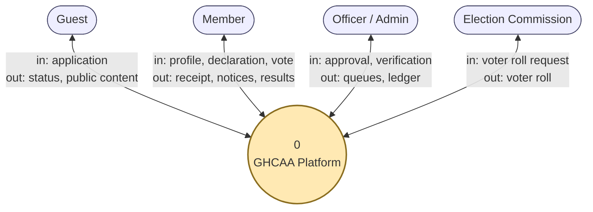
```mermaid
flowchart TB
    G([Guest]):::ext
    M([Member]):::ext
    A([Officer / Admin]):::ext
    EC([Election Commission]):::ext
    P((0<br/>GHCAA Platform)):::sys
    G <-->|"in: application<br/>out: status, public content"| P
    M <-->|"in: profile, declaration, vote<br/>out: receipt, notices, results"| P
    A <-->|"in: approval, verification<br/>out: queues, ledger"| P
    EC <-->|"in: voter roll request<br/>out: voter roll"| P
    classDef ext fill:#eef,stroke:#446
    classDef sys fill:#ffe9b3,stroke:#8a6d1f,stroke-width:2px
```

### Figure 5.2 — DFD Level 1

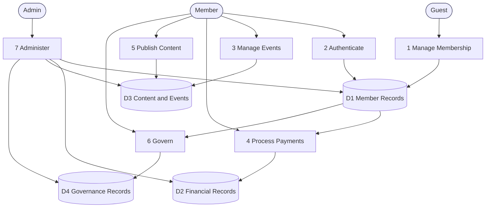
```mermaid
flowchart TB
    G([Guest]):::ext
    M([Member]):::ext
    A([Admin]):::ext

    P1[1 Manage Membership]
    P2[2 Authenticate]
    P3[3 Manage Events]
    P4[4 Process Payments]
    P5[5 Publish Content]
    P6[6 Govern]
    P7[7 Administer]

    D1[(D1 Member Records)]
    D2[(D2 Financial Records)]
    D3[(D3 Content and Events)]
    D4[(D4 Governance Records)]

    G --> P1 --> D1
    M --> P2 --> D1
    M --> P3 --> D3
    M --> P4 --> D2
    M --> P5 --> D3
    M --> P6 --> D4
    A --> P7
    P7 --> D1
    P7 --> D2
    P7 --> D3
    P7 --> D4
    D1 --> P4
    D1 --> P6
    classDef ext fill:#eef,stroke:#446
```

### Figure 5.3 — DFD Level 2: Payment processing

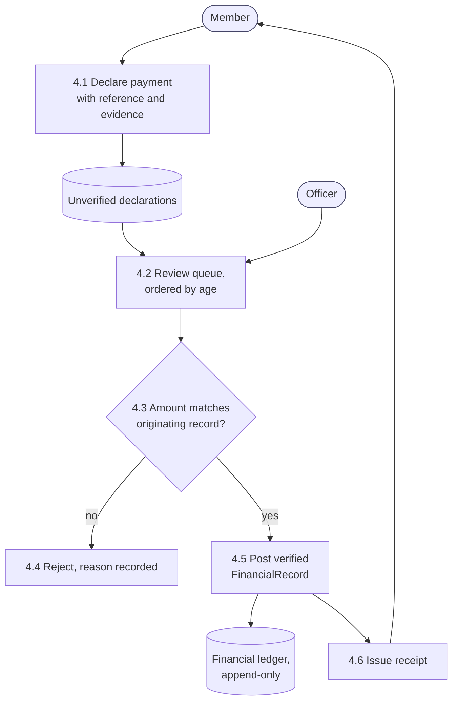
```mermaid
flowchart TB
    M([Member]):::ext --> P41[4.1 Declare payment<br/>with reference and evidence]
    P41 --> D21[(Unverified declarations)]
    D21 --> P42[4.2 Review queue,<br/>ordered by age]
    A([Officer]):::ext --> P42
    P42 --> P43{4.3 Amount matches<br/>originating record?}
    P43 -->|no| P44[4.4 Reject, reason recorded]
    P43 -->|yes| P45[4.5 Post verified<br/>FinancialRecord]
    P45 --> D22[(Financial ledger,<br/>append-only)]
    P45 --> P46[4.6 Issue receipt]
    P46 --> M
    classDef ext fill:#eef,stroke:#446
```

### Figure 5.4 — DFD Level 2: Membership approval

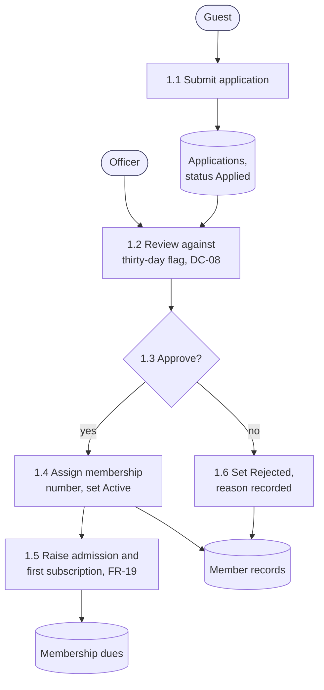
```mermaid
flowchart TB
    G([Guest]):::ext --> P11[1.1 Submit application]
    P11 --> D11[(Applications,<br/>status Applied)]
    A([Officer]):::ext --> P12[1.2 Review against<br/>thirty-day flag, DC-08]
    D11 --> P12
    P12 --> P13{1.3 Approve?}
    P13 -->|yes| P14[1.4 Assign membership<br/>number, set Active]
    P14 --> P15[1.5 Raise admission and<br/>first subscription, FR-19]
    P15 --> D12[(Membership dues)]
    P13 -->|no| P16[1.6 Set Rejected,<br/>reason recorded]
    P14 --> D13[(Member records)]
    P16 --> D13
    classDef ext fill:#eef,stroke:#446
```

### Figure 5.5 — DFD Level 2: Constitution publication

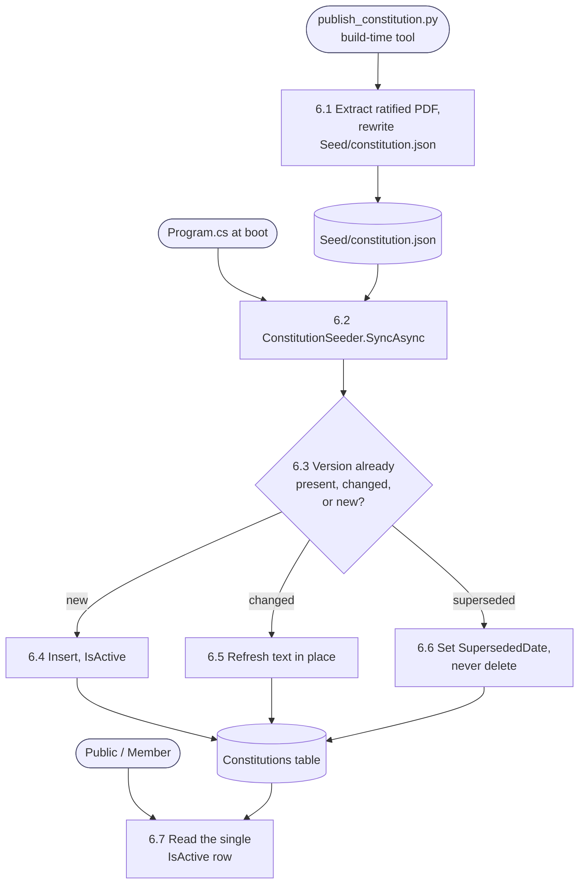
```mermaid
flowchart TB
    T([publish_constitution.py<br/>build-time tool]):::ext --> P61[6.1 Extract ratified PDF,<br/>rewrite Seed/constitution.json]
    P61 --> D61[(Seed/constitution.json)]
    B([Program.cs at boot]):::ext --> P62[6.2 ConstitutionSeeder.SyncAsync]
    D61 --> P62
    P62 --> P63{6.3 Version already<br/>present, changed,<br/>or new?}
    P63 -->|new| P64[6.4 Insert, IsActive]
    P63 -->|changed| P65[6.5 Refresh text in place]
    P63 -->|superseded| P66[6.6 Set SupersededDate,<br/>never delete]
    P64 --> D62[(Constitutions table)]
    P65 --> D62
    P66 --> D62
    R([Public / Member]):::ext --> P67[6.7 Read the single<br/>IsActive row]
    D62 --> P67
    classDef ext fill:#eef,stroke:#446
```

### Table 5.2 — CRC card set for the analysis classes with the widest collaboration surface

| Class | Responsibilities | Collaborators |
| --- | --- | --- |
| `Member` | Hold identity, standing and per-field disclosure settings | `User`, `AcademicRecord`, `ProfessionalRecord`, `PaymentHistory`, `ECMember`, `EventRegistration` |
| `MemberService` | Apply, approve, reject, and change status with a recorded reason | `Member`, `MembershipHistory`, `IFileStorageService` |
| `FinancialService` | Raise dues, record declarations, post verified entries | `PaymentHistory`, `FinancialRecord`, `Member` |
| `GovernanceService` | Publish the constitution, admit eligible votes, keep the committee record | `Constitution`, `AmendmentVote`, `ECMember`, `ECPeriod`, `Member` |
| `EventService` | Publish events, register, waitlist, promote from the waitlist, check in | `AlumniEvent`, `EventRegistration`, `Member` |

### Figure 5.6 — Activity diagram: registration and administrative approval

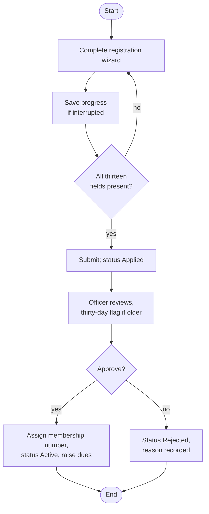
```mermaid
flowchart TB
    S([Start]) --> A1[Complete registration wizard]
    A1 --> A2[Save progress<br/>if interrupted]
    A2 --> A3{All thirteen<br/>fields present?}
    A3 -->|no| A1
    A3 -->|yes| A4[Submit; status Applied]
    A4 --> A5[Officer reviews,<br/>thirty-day flag if older]
    A5 --> A6{Approve?}
    A6 -->|yes| A7[Assign membership number,<br/>status Active, raise dues]
    A6 -->|no| A8[Status Rejected,<br/>reason recorded]
    A7 --> E([End])
    A8 --> E
```

### Figure 5.7 — Activity diagram: payment declaration and verification

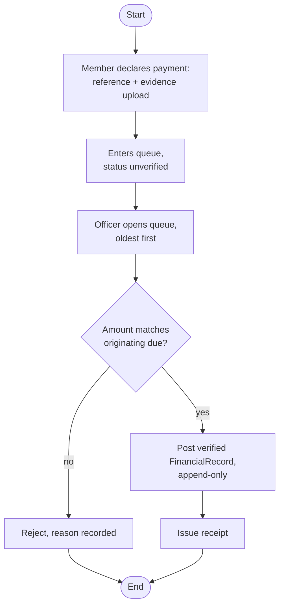
```mermaid
flowchart TB
    S([Start]) --> B1[Member declares payment:<br/>reference + evidence upload]
    B1 --> B2[Enters queue,<br/>status unverified]
    B2 --> B3[Officer opens queue,<br/>oldest first]
    B3 --> B4{Amount matches<br/>originating due?}
    B4 -->|no| B5[Reject, reason recorded]
    B4 -->|yes| B6[Post verified FinancialRecord,<br/>append-only]
    B6 --> B7[Issue receipt]
    B5 --> E([End])
    B7 --> E
```

### Figure 5.8 — Activity diagram: event registration with waitlist

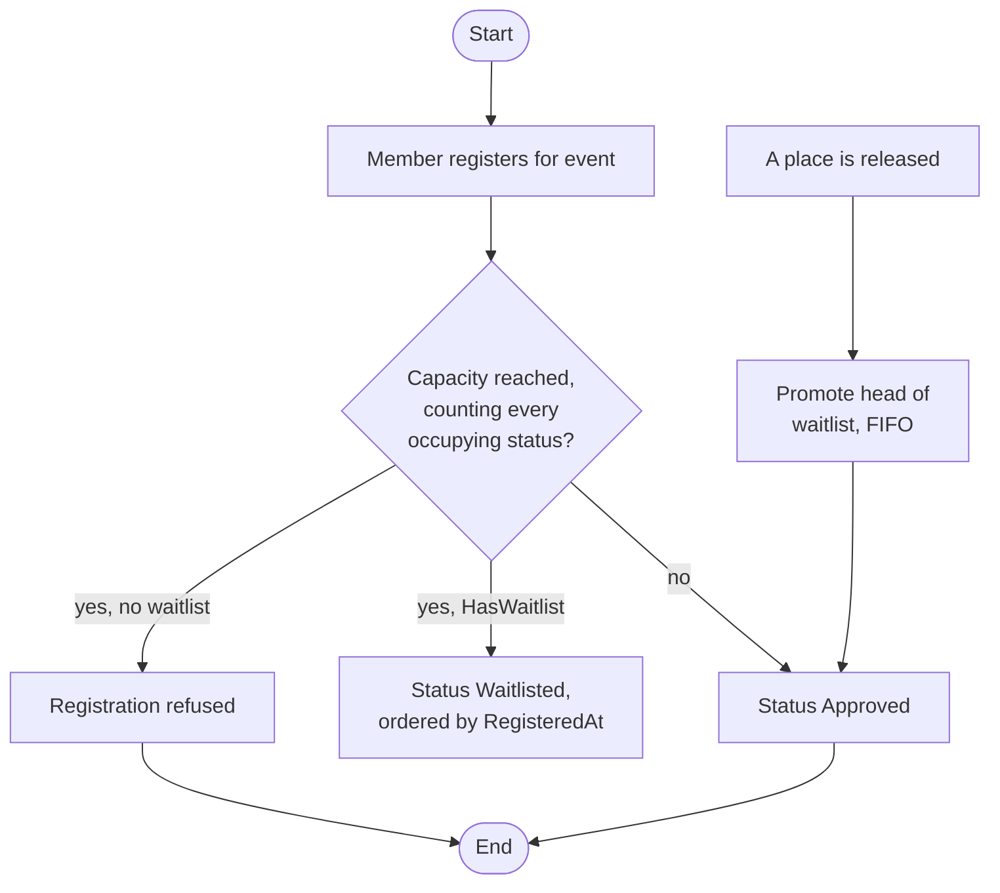
```mermaid
flowchart TB
    S([Start]) --> C1[Member registers for event]
    C1 --> C2{Capacity reached,<br/>counting every<br/>occupying status?}
    C2 -->|no| C3[Status Approved]
    C2 -->|yes, HasWaitlist| C4[Status Waitlisted,<br/>ordered by RegisteredAt]
    C2 -->|yes, no waitlist| C5[Registration refused]
    C6[A place is released] --> C7[Promote head of<br/>waitlist, FIFO]
    C7 --> C3
    C3 --> E([End])
    C5 --> E
```

### Figure 5.9 — Swimlane activity diagram: constitution amendment vote

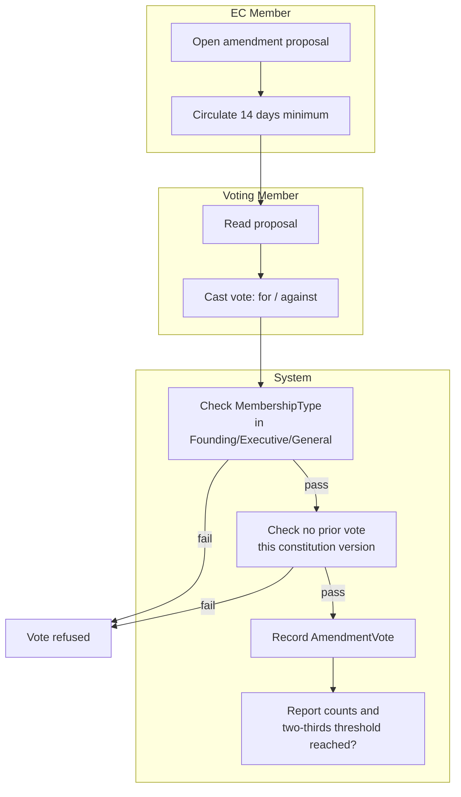
```mermaid
flowchart TB
    subgraph EC["EC Member"]
      L1[Open amendment proposal]
      L2[Circulate 14 days minimum]
    end
    subgraph MEM["Voting Member"]
      L3[Read proposal]
      L4[Cast vote: for / against]
    end
    subgraph SYS["System"]
      L5[Check MembershipType<br/>in Founding/Executive/General]
      L6[Check no prior vote<br/>this constitution version]
      L7[Record AmendmentVote]
      L8[Report counts and<br/>two-thirds threshold reached?]
    end
    L1 --> L2 --> L3 --> L4 --> L5
    L5 -->|fail| REFUSE[Vote refused]
    L5 -->|pass| L6
    L6 -->|fail| REFUSE
    L6 -->|pass| L7 --> L8
```

### Figure 5.10 — BPMN process diagram of the election cycle

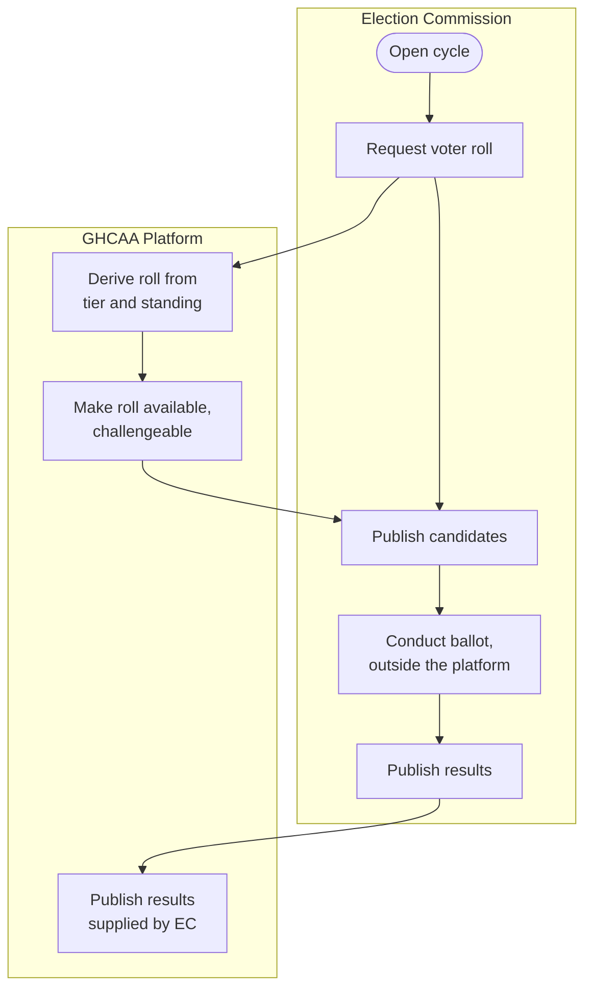
```mermaid
flowchart TB
    subgraph EComm["Election Commission"]
      direction TB
      B1([Open cycle]) --> B2[Request voter roll]
      B2 --> B5[Publish candidates]
      B5 --> B6[Conduct ballot,<br/>outside the platform]
      B6 --> B7[Publish results]
    end
    subgraph Sys["GHCAA Platform"]
      direction TB
      B3[Derive roll from<br/>tier and standing]
      B4[Make roll available,<br/>challengeable]
      B8[Publish results<br/>supplied by EC]
    end
    B2 --> B3 --> B4 --> B5
    B7 --> B8
```

### Figure 5.11 — State-machine diagram: member lifecycle

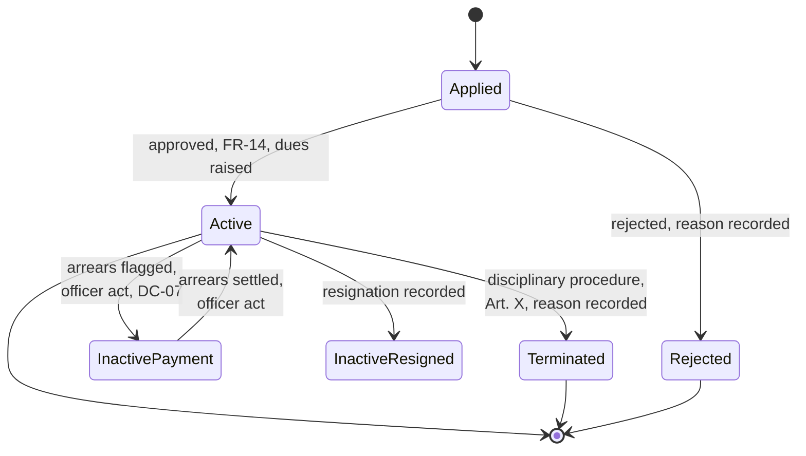
```mermaid
stateDiagram-v2
    [*] --> Applied
    Applied --> Active : approved, FR-14, dues raised
    Applied --> Rejected : rejected, reason recorded
    Active --> InactivePayment : arrears flagged,<br/>officer act, DC-07
    Active --> InactiveResigned : resignation recorded
    Active --> Terminated : disciplinary procedure,<br/>Art. X, reason recorded
    InactivePayment --> Active : arrears settled,<br/>officer act
    Active --> [*]
    Terminated --> [*]
    Rejected --> [*]
```

### Figure 5.12 — State-machine diagram: payment and declaration

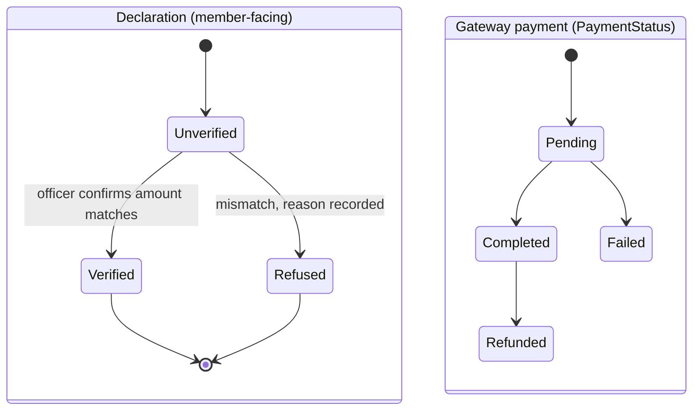
```mermaid
stateDiagram-v2
    state "Declaration (member-facing)" as decl {
        [*] --> Unverified
        Unverified --> Verified : officer confirms amount matches
        Unverified --> Refused : mismatch, reason recorded
        Verified --> [*]
        Refused --> [*]
    }
    state "Gateway payment (PaymentStatus)" as gw {
        [*] --> Pending
        Pending --> Completed
        Pending --> Failed
        Completed --> Refunded
    }
```

### Figure 5.13 — State-machine diagram: constitution version

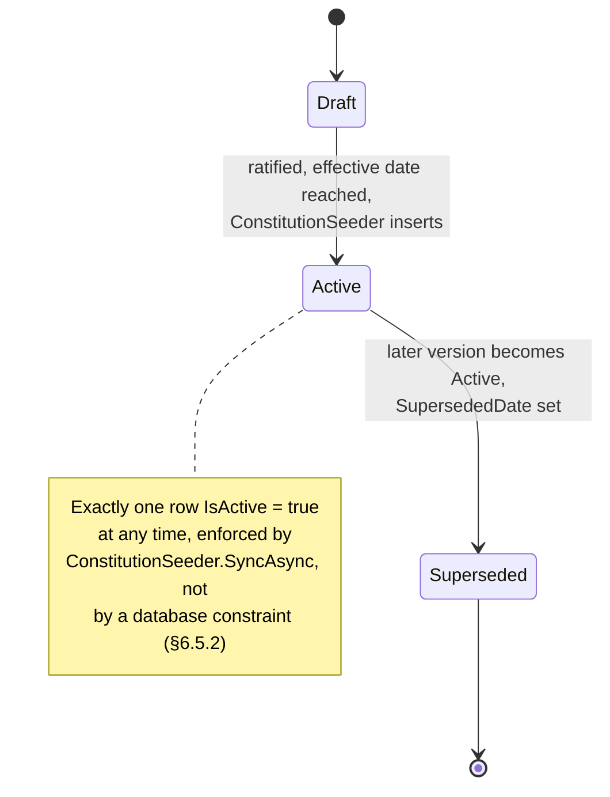
```mermaid
stateDiagram-v2
    [*] --> Draft
    Draft --> Active : ratified, effective date reached,<br/>ConstitutionSeeder inserts
    Active --> Superseded : later version becomes Active,<br/>SupersededDate set
    Superseded --> [*]
    note right of Active
        Exactly one row IsActive = true
        at any time, enforced by
        ConstitutionSeeder.SyncAsync, not
        by a database constraint (§6.5.2)
    end note
```

### Figure 5.14 — State-machine diagram: event lifecycle

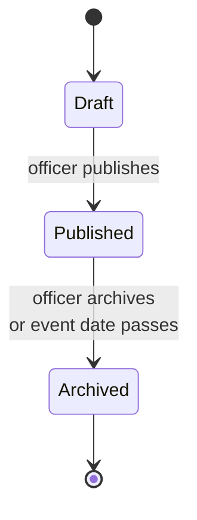
```mermaid
stateDiagram-v2
    [*] --> Draft
    Draft --> Published : officer publishes
    Published --> Archived : officer archives<br/>or event date passes
    Archived --> [*]
```

### Figure 5.15 — Sequence diagram: login with OTP, token issue

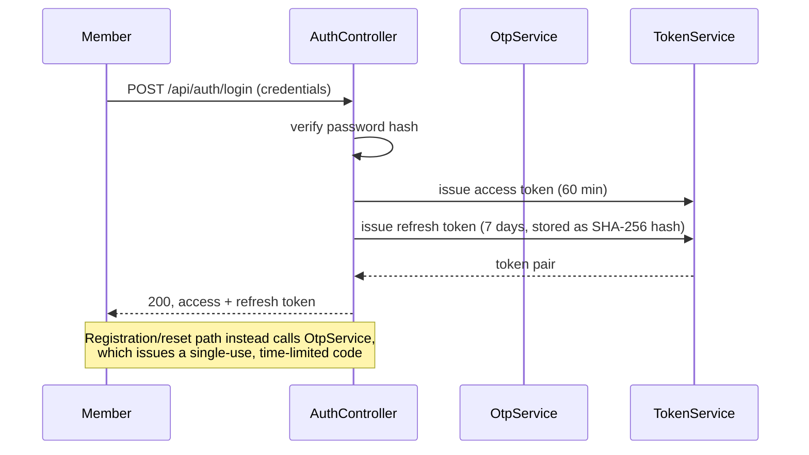
```mermaid
sequenceDiagram
    participant M as Member
    participant API as AuthController
    participant OTP as OtpService
    participant TS as TokenService
    M->>API: POST /api/auth/login (credentials)
    API->>API: verify password hash
    API->>TS: issue access token (60 min)
    API->>TS: issue refresh token (7 days, stored as SHA-256 hash)
    TS-->>API: token pair
    API-->>M: 200, access + refresh token
    Note over M,API: Registration/reset path instead calls OtpService,<br/>which issues a single-use, time-limited code
```

### Figure 5.16 — Sequence diagram: event registration

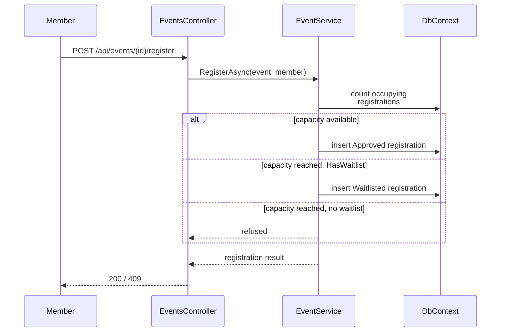
```mermaid
sequenceDiagram
    participant M as Member
    participant C as EventsController
    participant S as EventService
    participant DB as DbContext
    M->>C: POST /api/events/(id)/register
    C->>S: RegisterAsync(event, member)
    S->>DB: count occupying<br/>registrations
    alt capacity available
        S->>DB: insert Approved registration
    else capacity reached, HasWaitlist
        S->>DB: insert Waitlisted registration
    else capacity reached, no waitlist
        S-->>C: refused
    end
    S-->>C: registration result
    C-->>M: 200 / 409
```

### Figure 5.17 — Sequence diagram: payment declaration and verification

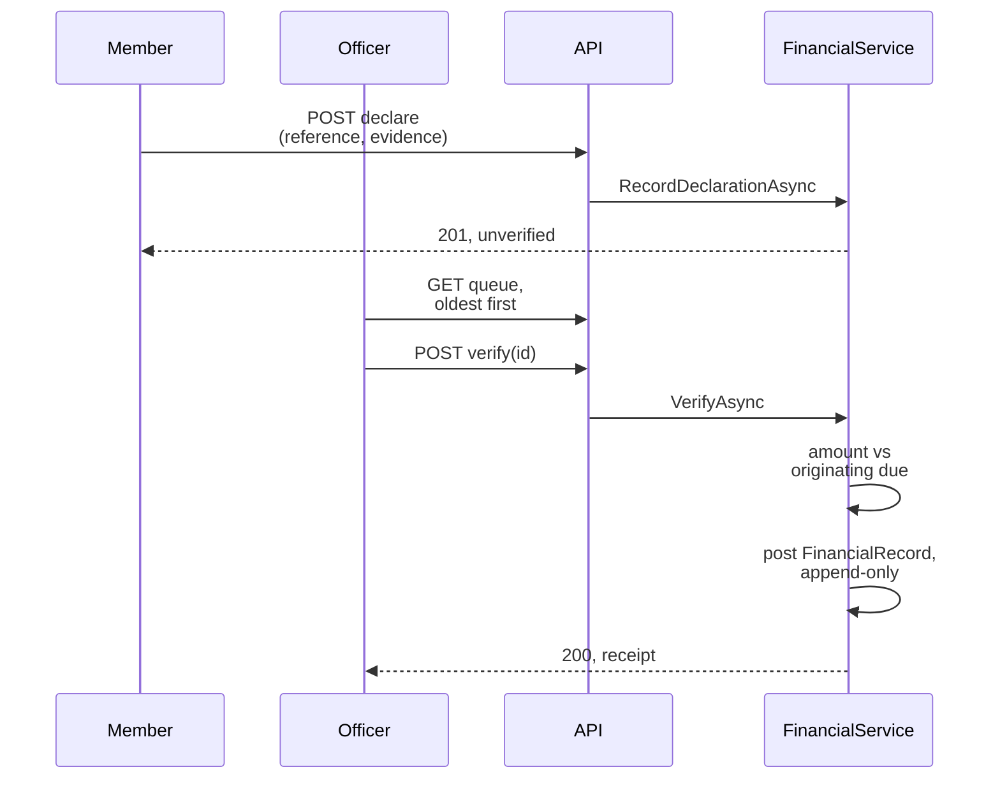
```mermaid
sequenceDiagram
    participant M as Member
    participant A as Officer
    participant C as API
    participant S as FinancialService
    M->>C: POST declare<br/>(reference, evidence)
    C->>S: RecordDeclarationAsync
    S-->>M: 201, unverified
    A->>C: GET queue,<br/>oldest first
    A->>C: POST verify(id)
    C->>S: VerifyAsync
    S->>S: amount vs<br/>originating due
    S->>S: post FinancialRecord,<br/>append-only
    S-->>A: 200, receipt
```

### Figure 5.18 — Sequence diagram: real-time notification over SignalR

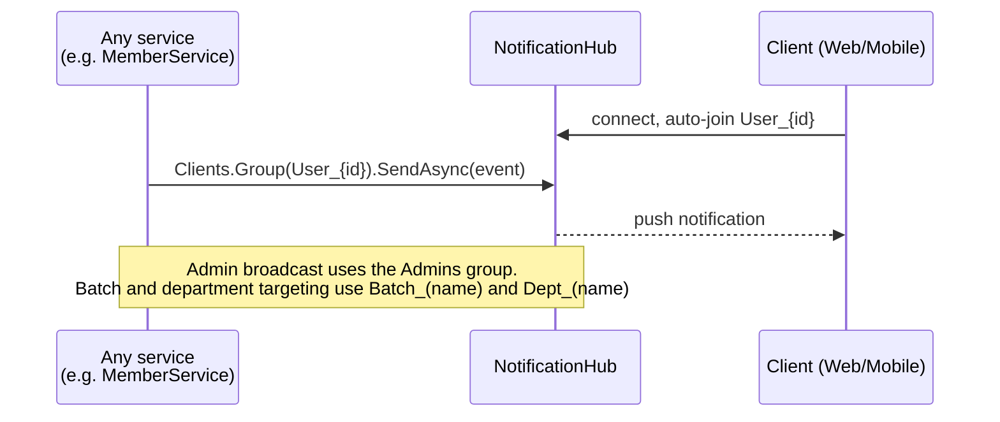
```mermaid
sequenceDiagram
    participant S as Any service<br/>(e.g. MemberService)
    participant H as NotificationHub
    participant C as Client (Web/Mobile)
    C->>H: connect, auto-join User_{id}
    S->>H: Clients.Group(User_{id}).SendAsync(event)
    H-->>C: push notification
    Note over S,H: Admin broadcast uses the Admins group.<br/>Batch and department targeting use Batch_(name) and Dept_(name)
```

### Figure 5.19 — Timing diagram: token lifetime and refresh window

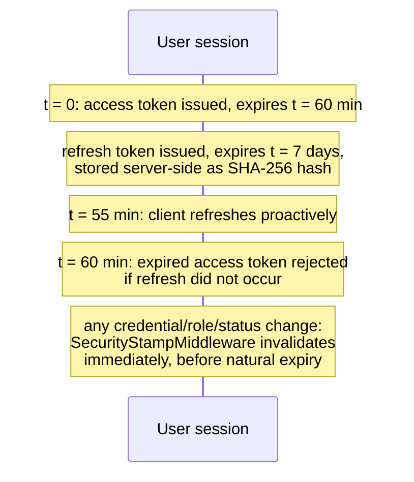
```mermaid
sequenceDiagram
    participant U as User session
    Note over U: t = 0: access token issued, expires t = 60 min
    Note over U: refresh token issued, expires t = 7 days,<br/>stored server-side as SHA-256 hash
    Note over U: t = 55 min: client refreshes proactively
    Note over U: t = 60 min: expired access token rejected<br/>if refresh did not occur
    Note over U: any credential/role/status change:<br/>SecurityStampMiddleware invalidates<br/>immediately, before natural expiry
```

### Table 5.3 — Process specifications for the Level-2 processes

| Process | Input | Logic | Output |
| --- | --- | --- | --- |
| 4.1 Declare payment | Reference, evidence file | Validate file type/size (NFR-P4); create unverified `PaymentHistory` row | Declaration in verification queue |
| 4.3 Amount match | Declared amount, originating `MembershipDue` | Equality comparison; no short-circuit on `amount > 0` (BR-13) | Match / mismatch decision |
| 1.2 Review application | Application record, `AppliedDate` | Flag if `AppliedDate` older than 30 days (DC-08) | Prioritised review queue |
| 6.2 Sync constitution | `Seed/constitution.json`, current `Constitutions` table | Insert unknown version; refresh changed text; supersede prior | Exactly one `IsActive` row |

### Table 5.4 — Data-store definitions (analysis level)

| Store | Represents | Backing entities |
| --- | --- | --- |
| D1 Member Records | Identity, standing, history | `Member`, `AcademicRecord`, `ProfessionalRecord`, `MembershipHistory`, `User` |
| D2 Financial Records | Dues, declarations, ledger | `MembershipDue`, `PaymentHistory`, `FinancialRecord`, `PaymentConfiguration` |
| D3 Content and Events | Public and member content | `AlumniEvent`, `EventRegistration`, `NewsPost`, `EventGallery`, `SiteContent`, `JobOpportunity` |
| D4 Governance Records | Constitution, committee, votes | `Constitution`, `AmendmentVote`, `ECPeriod`, `ECMember`, `Poll`, `PollVote` |
