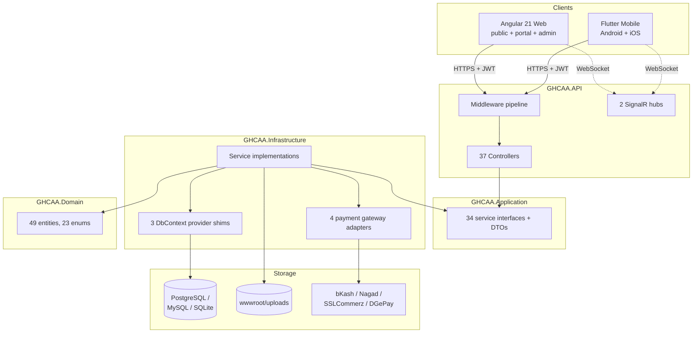
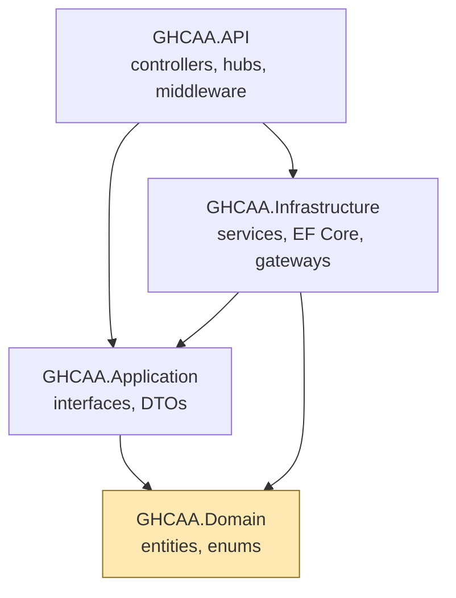
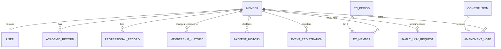
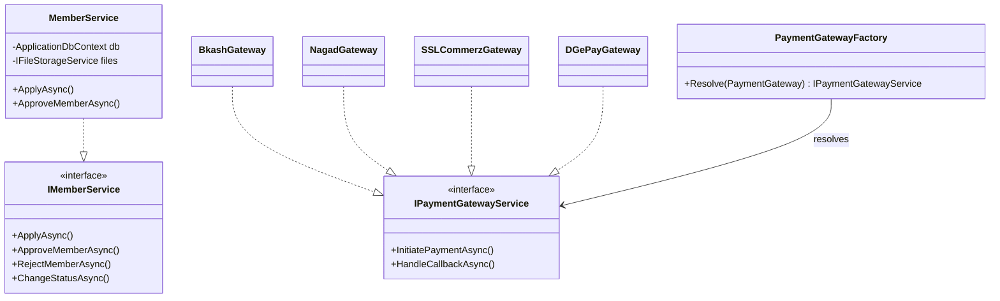
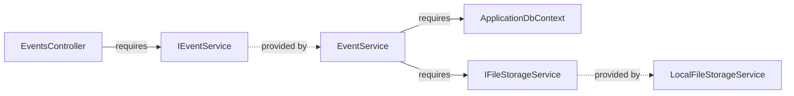

# Chapter 6 — System Architecture and Design

Chapter 5 modelled what the system does. This chapter records how it is built to do it, and, because
§6.2 argues the point in earnest rather than as a formality, why it is built that way rather than one
of the alternatives a reviewer would reasonably ask about. The chapter ends, in §6.11 and §6.12, by
naming every design principle and pattern the codebase actually uses and giving each one a place a
reader can go and check.

## 6.1 Design Goals, Principles and Constraints

Four goals governed every decision in this chapter, ranked in the order they were actually traded off
against each other when they conflicted. The system must be operable by one volunteer with no
on-call obligation (NFR-M4); it must run within an operating cost the Association can sustain
indefinitely from subscription income (§10.10); it must satisfy the quality-attribute scenarios of
§3.5, most of which concern correctness and auditability rather than throughput; and only after those
three does raw performance matter, because the workload, being at most a few hundred members, does
not stress a conventional web stack. Where a textbook recommendation would have improved a quality
attribute the Association does not need at the cost of one it does, the textbook recommendation lost;
§6.2 records the clearest instance of that trade.

## 6.2 Architectural Alternatives Considered and the Decision Taken

Four alternatives were assessed against the quality-attribute scenarios of §3.5 and the sustainability
constraint of §6.1: a conventional layered architecture without an explicit dependency rule, clean
architecture with the dependency rule enforced [1], a modular monolith with service-style internal
boundaries but a single deployable, and a microservices decomposition [17]. Full microservices was
rejected first and least controversially: Newman's own case for the style rests on independent
deployability and independent scaling paying for the operational cost of running several services
[17], and neither benefit applies to a single maintainer deploying to a single small container.
Fowler's advice to start monolithic and split later applies here in its strongest form, because there
is no team boundary to relieve by splitting [16]. A conventional layered architecture without a
dependency rule was rejected next, on the evidence of the DI registration comment recorded in §6.13
below: the project has already once let an infrastructure detail (a pooled `DbContext`'s runtime
type) leak into a place that silently broke migrations across every environment, and an
unenforced layering would have made that class of defect ordinary rather than exceptional.

Clean architecture, with the dependency rule enforced by project references so that a violation is a
compile error rather than a code-review finding, was chosen over a modular monolith with only
convention-based internal boundaries because NFR-M1 asks for exactly the property a compiler can
check: "no compile-time dependency shall point from an inner layer to an outer one." A convention
can be violated by mistake; a project reference that does not exist cannot be. The four assemblies of
§6.3, `GHCAA.Domain`, `GHCAA.Application`, `GHCAA.Infrastructure` and `GHCAA.API`, are the mechanism,
and §7.2 shows the reference graph that makes the rule enforceable rather than aspirational.

What this decision cost is stated rather than glossed. Clean architecture's ceremony, meaning an
interface in `GHCAA.Application` for every service implemented in `GHCAA.Infrastructure`, is
overhead when there is exactly one implementation and no plan for a second; §6.11.4 returns to this
as the clearest instance of a principle applied further than its payoff in this project actually
warrants.

## 6.3 Architectural Design — Clean Architecture

Figure 6.2 draws the four layers and the single direction dependencies are permitted to point.

### 6.3.1 Domain layer

`GHCAA.Domain` holds the forty-nine entities enumerated in §5.7, the twenty-three enumerations of
`Enums.cs`, and constants. It references nothing else in the solution, which is the dependency rule's
starting point: if the domain depended on anything, the rule would already be broken at its centre.

### 6.3.2 Application layer

`GHCAA.Application` holds the service interfaces (thirty-four are registered through the DI
mechanism of §6.11.9) and the data transfer objects that cross the API boundary. It depends only on
`GHCAA.Domain`.

### 6.3.3 Infrastructure layer

`GHCAA.Infrastructure` holds the service implementations, the three EF Core provider shims described
in §6.5.4, the payment gateway adapters, and `ApplicationDbContext`. It depends on `GHCAA.Application`
and `GHCAA.Domain`, and is the only layer that depends on Entity Framework Core, on `HttpClient`, and
on the file system.

### 6.3.4 API layer

`GHCAA.API` holds the thirty-seven controllers of Table 6.2, the two SignalR hubs, and the middleware
pipeline of §6.4. It composes the other three layers at startup through `Program.cs` and the
`AddInfrastructure` extension method, and depends on all of them.

### 6.3.5 Presentation layers

Two independent clients consume the API rather than sit inside the solution's dependency graph:
`GHCAA.Web`, an Angular 21 single-page application serving the public site, the member portal and
the admin console from one codebase with route guards separating the three, and `GHCAA.Mobile`, a
Flutter application using Riverpod for state and Dio for HTTP, targeting Android and iOS from one
codebase. Neither client has a compile-time dependency on the API's implementation; both depend only
on its HTTP and SignalR contract.

### 6.3.6 The dependency rule and the mechanism that enforces it

The rule is enforced by `.csproj` project references, which is a compiler-checked mechanism rather
than a linter or a convention: `GHCAA.Domain.csproj` references no other project in the solution, and
no `.csproj` in an inner layer references one in an outer layer. §7.2's dependency structure matrix
is the evidence that this holds for the delivered solution, not only for its intended design.

## 6.4 Component-Level Design

Figure 6.12 draws the request path as a component diagram: a controller depends on a service
interface it does not implement, the concrete service is supplied by the DI container built in
§6.11.9, and the service depends on `ApplicationDbContext` as its persistence port. The middleware
pipeline, drawn in Figure 6.15, is the component boundary a request crosses before it reaches a
controller at all, and its order is significant: `ExceptionMiddleware` wraps everything so that no
unhandled exception below it reaches the client as anything other than a JSON error; rate limiting
runs before authentication so that an unauthenticated flood is rejected before the cost of verifying
a token is paid; `SecurityStampMiddleware` runs after authentication and before authorisation, which
is the ordering that makes BR-11 hold, since a request must be authenticated before its security
stamp can be checked, and must be checked before authorisation decides what it may do.

## 6.5 Data Design

### 6.5.1 Conceptual, logical and physical progression

The conceptual model is Figure 3.8; the logical model is the forty-nine mapped entities of §5.7,
each with a `Fluent API` configuration class under `GHCAA.Infrastructure/Data/Configurations/`
rather than attribute-only mapping, which keeps persistence concerns out of the domain classes
themselves; the physical model is whichever of the three schemas in §6.5.4 the running environment
selects.

### 6.5.2 Normalisation and its deliberate exceptions

Most of the schema sits at third normal form: an `EventRegistration` row does not repeat event
attributes, a `PaymentHistory` row does not repeat member attributes. Two exceptions were made
deliberately rather than found by accident. `OrganizationConfig` stores its entire configuration
document as a single JSON column, `ConfigJson`, rather than as a normalised table of key-value rows;
the reasoning is that the configuration schema, given in full in `docs/CONFIG_DRIVEN_FRAMEWORK.md`,
changes shape as features are added, and a normalised key-value table would have needed a migration
for every new setting where a JSON column needs none, at the cost that the schema inside that column
is enforced by the DTO layer rather than by the database. `NewsPost` merges what could have been two
tables, news articles and official notices, into one, discriminated by a `PostType` column; this was
chosen over two tables because the two kinds share every other attribute and the one place they
differ, being who may create them, is exactly the business rule BR-03 already enforces in the
controller rather than in the schema.

The constitution invariant of DC-16, that exactly one row of `Constitutions` has `IsActive = true`,
is not a database constraint at all; it is a procedural invariant maintained by
`ConstitutionSeeder.SyncAsync`. A partial unique index, in providers that support one, would enforce
it at the database rather than relying on the seeder's discipline, and its absence is recorded here
as a real gap rather than implied to be intentional hardening.

### 6.5.3 Indexing strategy

Every unique business constraint stated as a non-functional requirement is enforced by a database
index, not only by application-level validation, which is what NFR-S4 explicitly demands for national
identity number, mobile number and email address. `MemberConfiguration` places a unique index on
`Email`, `NID` and `MobileNo` individually, plus a composite index on `(Status, IsArchived)` for the
query the administrative queue of FR-23 runs most often. `AmendmentVoteConfiguration` places a unique
composite index on `(ConstitutionId, MemberId)`, which is BR-02's one-vote rule enforced at the
database rather than only in `GovernanceService`; the same shape, a composite unique index preventing
a double insert, recurs in `EventRegistrationConfiguration` on `(EventId, MemberId)`,
`PollVoteConfiguration` on `(PollOptionId, MemberId)`, and `RefreshTokenConfiguration` on `TokenHash`.
`PaymentHistoryConfiguration` uniquely indexes both `TransactionId` and `GatewayPaymentId`, which is
the database-level half of BR-13's amount-matching rule: it cannot prevent a wrong amount, but it can
and does prevent the same gateway transaction being credited twice.

### 6.5.4 Multi-provider portability

`ApplicationDbContext` is abstract in the sense that three concrete subclasses, `PgSqlApplicationDbContext`,
`MySqlApplicationDbContext` and `SqliteApplicationDbContext`, are pooled behind it, selected at
startup by a `DatabaseProvider` configuration value read in `GHCAA.Infrastructure.DependencyInjection`.
Production runs PostgreSQL; the test suite runs against the SQLite provider and, for unit-level
service tests, against EF Core's in-memory provider instead. The cost of this portability is recorded
in the source itself: the migrations assembly must be told which provider-specific shim type a
migration is attributed to, and the DI registration comment explains, in the maintainer's own words,
why pooling the base `ApplicationDbContext` type rather than the shim silently broke migration
detection on every environment until it was found. That comment is treated in this dissertation as
primary evidence, not paraphrased away, because it is a more honest record of the cost than a tidy
retrospective claim would be.

### 6.5.5 Data dictionary

Table 6.1 gives a representative slice of the forty-nine mapped entities; the full dictionary is
Appendix E.

### 6.5.6 Seeding and runtime data-synchronisation strategy

`Database.EnsureCreated()` creates a schema on an empty database and does nothing on a non-empty one,
which means any seed expressed through EF Core's `HasData` mechanism is invisible to every
environment after the first. That constraint is what makes `ConstitutionSeeder.SyncAsync`
load-bearing rather than a convenience: it runs at every boot, from `Program.cs`, and inserts a
version it has not seen before, refreshes the text of a version whose content changed, and
supersedes, without deleting, a version a newer one has replaced, precisely so that a
production database that was created months earlier still receives a constitution amendment shipped
today.

A separate risk sits in `LoadSeed<T>`'s deserialisation step itself rather than in when it runs:
`System.Text.Json.JsonSerializer.Deserialize<List<T>>` silently discards any JSON key that does not
match a public property on `T`, with no exception and no log line. A field renamed on the entity
without the same rename in its seed file therefore reaches production as a quietly wrong default —
confirmed in practice, not hypothetically, when a stale `Category` key (the entity's real property
had been renamed to `ArticleCategory`/`JobCategory`/`FinancialCategory`) left several thousand seeded
records defaulted to the wrong enum value across three unrelated seed files. The mitigation is a
reflection-based regression test (`SeedDataIntegrityTests`) that parses each seed file's raw JSON keys
and asserts every one matches a real property on its target type, turning a silent runtime default
into a build-time failure. A distinct failure mode surfaced later, on a correctly-named key: a path
field holding punctuation-only placeholder text (`"..."`) instead of a real value, which deserialises
without complaint and only surfaces as a broken image in a browser. The same test file was extended
with a second, value-level assertion — every `*Path`/`*Url` string must contain at least one
alphanumeric character — since a correct key name is not by itself evidence of a correct value.

## 6.6 Interface Design

The API resource model follows a `/api/[controller]` convention with sub-resources expressed as path
segments, for example `/api/events/{id}/register`. Errors are returned as JSON with a consistent
shape from `ExceptionMiddleware` rather than as provider stack traces, which is NFR-U4's requirement
enforced at the one place that can guarantee it for every unhandled case. Table 6.2 catalogues every
controller with its route and authorisation level; the full request and response shapes are
Appendix F.

## 6.7 Security Architecture

Summarised here as a design view; the threat model, control mapping and residual risk are Chapter 9's
subject. Four mechanisms are worth naming as architecture rather than as detail, because each is a
structural decision rather than a local check: `SecurityStampMiddleware`, which makes a credential or
role change take effect within one request rather than at token expiry; the query-string token
allowance in the middleware pipeline, which exists only to let a file download authenticate without a
custom header and is scoped, in the pipeline order of Figure 6.15, to run before the ordinary
authentication step rather than replacing it; the payment-gateway posture of §9.9, under which the
platform never stores a payment credential of its own; and step-up authentication for destructive,
financial and identity-changing admin actions, which re-verifies an already-authenticated Admin or
SuperAdmin session by email OTP before it may reach one of five gated endpoints. The verification
result is carried as a claim on the JWT rather than as server-side session state — the API has no
session store to hold it in — so a claim's continued validity across the access token's routine
hourly refresh is established by validating the outgoing token's signature and issuer before its
step-up claim is trusted forward, not by re-running the OTP challenge on every refresh. The grace
period since last verification was originally set to 30 days for admin usability, but a security
review found this let the claim ride along on every hourly refresh for the full window, so a stolen
or left-open session almost always already carried a valid one — defeating the control's own stated
purpose. It was reduced to 30 minutes, the usability trade-off now resting on the claim surviving
several refreshes within one working session rather than on a long calendar window.

A fifth mechanism belongs alongside these for the same reason: which scheme a request arrived over is
not a property Kestrel can observe directly once TLS is terminated at the hosting platform's edge and
the request is forwarded to the container over plain HTTP. `ForwardedHeadersOptions`, registered as
the first middleware in the pipeline — ahead of exception handling, CORS and everything else — trusts
the edge's `X-Forwarded-Proto` header so that `HttpContext.Request.IsHttps` reports correctly for
every later stage: the HSTS header, the HTTPS redirect, and any authorization decision that might
otherwise assume an unencrypted request. Placing this ahead of `UseHsts()`/`UseHttpsRedirection()`
rather than treating it as an unrelated Dockerfile or platform concern is the structural point — three
independent controls share one upstream dependency, and only one of them names it.

## 6.8 User-Interface Design

### 6.8.1 Design principles and information architecture

The public site, the member portal and the admin console are three route trees within one Angular
application, separated by `PublicLayoutComponent`, `PortalLayoutComponent` and
`AdminLayoutComponent` and by the `authGuard` and `adminGuard`/`superAdminGuard` route guards listed
in Table 6.2's companion, the route map of Figure 6.17. A visitor never crosses from the public tree
into a guarded one without authenticating, and the admin tree is itself split by guard between
`Admin` and `SuperAdmin`, matching the role distinction Table 9.2 defines.

### 6.8.2 Design-token system, theming and the single-stylesheet decision

Presentation is governed by one stylesheet, `GHCAA.Web/src/styles.scss`, running to 3,354 lines at
the time of writing. The decision to keep one file rather than a stylesheet per component was made
for a reason specific to this project's constraint of one maintainer: a shared design-token set for
colour, spacing and typography, resolved once and consumed everywhere, is the only way one person can
change a brand colour in one place and have it apply to three route trees without hunting through
forty-nine components. §6.12.7 records what this decision cost as well as what it bought.

### 6.8.3 Shared control library and the duplication it eliminates, and where it does not yet

Some presentation is genuinely shared: `PaginationComponent`, `ToastComponent`, `FooterComponent`
and similar are each written once under `src/app/common/` and used from every route tree that needs
them. Member-specific record editing is not yet shared to the same degree, and this is recorded
honestly rather than smoothed over. `docs/PROFILE_SHARED_COMPONENT_DESIGN.md` is a design document,
explicitly marked "design only — not implemented", written because the member-facing profile page and
the admin member-detail modal render the same `Member` fields, being academic history, professional
history, EC history, emergency contact and address, through two independent templates that had
already drifted apart in section order and labelling by the time the document was written. The
proposed remedy is a set of presentational sub-components, `AcademicHistoryEditor`,
`ProfessionalHistoryEditor`, `EcHistoryView`, `EmergencyContactForm` and `AddressForm`, each taking
the relevant model slice as input and emitting change events rather than making its own HTTP calls.
As of this writing that extraction has not been built, and the two templates still drift
independently; it is listed here as an identified but unresolved duplication rather than as a
completed piece of design, and §13.6.2 carries it forward as a named item of technical debt.

### 6.8.4 Responsive design and accessibility strategy

Accessibility is targeted at WCAG 2.1 level AA per NFR-U1, verified by the audit reported in §8.12
rather than asserted here. Responsive layout follows Marcotte's approach of a fluid grid over fixed
breakpoints [36], necessary because NFR-P3 and the assumption of §1.6 both treat a mobile browser,
not a desktop one, as the primary surface for a member.

### 6.8.5 Web application design pyramid

Reading the site against Pressman and Maxim's design pyramid [54]: interface design is the guard-
separated route trees of §6.8.1; aesthetic design is the token system of §6.8.2; content design is
the admin-editable `SiteContent` blocks described in §5.2.3's public-content data flow, which let an
officer change wording without a deployment (FR-45); navigation design is the route map of Figure
6.17 and the site map of Figure 6.18; architecture design is Figure 6.1; and component design is the
shared control library of §6.8.3, with the gap just recorded.

## 6.9 Mobile Application Design and Platform-Specific Concerns

The Flutter client mirrors the web client's feature set (FR-48) rather than offering a reduced one,
using `Dio` for HTTP against the same API and `flutter_riverpod` for state. Two platform-specific
concerns are worth naming: the identity card is rendered from data cached at first sign-in so it
remains visible without a network connection at the venue where it is presented (FR-49), and payment
evidence images are compressed on the device before upload to the limit stated in NFR-P4, rather than
relying on server-side compression, because the upload itself is the expensive step on the
connections §1.6 assumes.

## 6.10 Configuration-Driven Design

Feature flags and organisation identity are design elements, not afterthoughts, because §1.6's
delimitation to one association does not mean the code should hardcode that association's name.
`OrganizationConfig.ConfigJson`, read through `IOrgConfigService` with a ten-minute in-memory cache
and a fallback chain of cache, then database, then a built-in default so that a missing configuration
row cannot crash the application, holds branding, contact details, currency, feature toggles such as
`enableForum` and `enableMentorship`, and workflow settings such as the membership approval mode.
`GET /api/config` is public and `PUT /api/config` is SuperAdmin-only, which is the interface design
principle of §6.6 applied to configuration itself. One field group is a deliberate exception to the
"database wins" rule: `Localization` (UI copy strings, e.g. per-locale tagline text) is always
overlaid from the built-in defaults on every read, regardless of what a stored config row holds,
because no admin screen edits it directly — a stored row only carries it forward incidentally
(`UpdateConfigAsync` round-trips the whole DTO on any Branding/Workflow save), so trusting a stale
copy there would let a source-code text fix never actually reach production (found and fixed
2026-08-31, a corrected Bengali tagline that had been serving a pre-fix value from an old row). At
the time of writing the Angular and Flutter
clients' consumption of this configuration is only partially complete, which `docs/CONFIG_DRIVEN_FRAMEWORK.md`
itself records as Phase 2 and Phase 3, "TODO"; §13.6.2 carries the remaining wiring forward.

## 6.11 Design Principles: Claim, Mechanism and Evidence

### 6.11.1 Separation of concerns and the layer boundary

The four-assembly split of §6.3 is the mechanism; a controller containing a SQL query, or a domain
class containing an HTTP call, would be the violation, and none exists in the solution.

### 6.11.2 Dependency inversion

The domain depends on abstractions only, in the strong sense that it depends on nothing at all;
`GHCAA.Application` defines the interfaces `GHCAA.Infrastructure` implements. Enforced by the project
reference graph of §6.3.6 and demonstrated in the dependency structure matrix of Figure 7.2.

### 6.11.3 Single responsibility

Service decomposition follows the subsystem boundaries of §3.6: `MemberService` owns membership
lifecycle, `FinancialService` and `FinancialLedgerService` are split apart from each other
specifically so that raising and recording a due is a different responsibility from posting an
append-only ledger entry, which is the separation BR-07 depends on. The cohesion evidence for this
claim is measured, not asserted, in §8.14.3.

### 6.11.4 Open/closed

Where it is achieved: a new payment gateway is added by implementing `IPaymentGatewayService` and
registering it with `PaymentGatewayFactory`, without modifying any existing gateway, which is exactly
how `DGePayGateway` was added alongside `SSLCommerzGateway`, `BkashGateway` and `NagadGateway`. Where
it is not: `IFileStorageService` has exactly one implementation, `LocalFileStorageService`, so the
interface's openness to a cloud-storage adapter is structural rather than demonstrated, and the
abstraction's cost, an interface and a DI registration for a substitution that has never happened, is
real overhead until that day comes.

### 6.11.5 Liskov substitution and interface segregation

Every one of the four `IPaymentGatewayService` implementations is substitutable through
`PaymentGatewayFactory` without the caller testing which one it received, which is the property this
principle names. Interface segregation is visible in the split between `IFileStorageService`, which
callers depend on to store and retrieve a file, and `IFileUploadRepository`, which only
`MemberImportController`'s bulk path and a narrow set of query callers depend on for metadata lookup;
neither interface forces a caller to depend on methods it does not use.

### 6.11.6 Information hiding and encapsulation

A controller never queries `ApplicationDbContext` directly except in the four cases Table 6.2 marks
as depending on it directly, being `AdminSocialAuthController`, `PaymentConfigController`,
`HealthController` and part of `GatewaysController`'s webhook path; those are named rather than
hidden, because a principle applied with undisclosed exceptions is not a principle a reader can trust
elsewhere in the same table.

### 6.11.7 Coupling and cohesion

Measured in §8.14.3 as CBO, afferent and efferent coupling and instability, and plotted against
Martin's main sequence; this section states the claim, that layer boundaries keep coupling
directional, and §8.14.3 is where the claim is checked rather than assumed.

### 6.11.8 Elimination of duplication

The single stylesheet of §6.8.2 and the assembly-scanning registration of §6.11.9 both remove a class
of duplication that would otherwise recur on every new service or every new component. The shared
member-record editors of §6.8.3 are the case where duplication was identified and not yet removed,
and it is counted as a limitation here rather than claimed as a success.

### 6.11.9 Convention over configuration

`GHCAA.Infrastructure.DependencyInjection.AddInfrastructure` scans its own assembly for every
non-abstract class in a namespace containing `Services`, finds the interfaces it implements under
`GHCAA.Application.Interfaces`, and registers each as scoped, automatically. A new service class
that follows the naming convention needs no line added to `Program.cs` to become injectable; only the
nine registrations that do not follow the convention, being file storage, theming, the file-upload
repository, the payment-gateway factory and the four gateways themselves plus the SMS client, are
listed by hand, and the code comments them as exactly that: manual registrations for non-standard
services.

### 6.11.10 Principle of least astonishment

The membership-number format `GHC-[Year]-[Serial]`, the consistent `/api/[controller]` route shape,
and the uniform JSON error envelope from `ExceptionMiddleware` are the three places this principle is
most visible to someone outside the maintainer's own head: an admin who has seen one membership
number can read any other, and a client developer who has called one endpoint successfully can guess
the shape of the next one correctly more often than not.

### 6.11.11 GRASP

Information expert: `Member` exposes its own standing computation from data it holds. Creator:
`MemberService` creates the `MembershipHistory` row alongside the status change that caused it,
because the service that knows the change is the service best placed to create its record.
Controller: each API controller is a thin GRASP controller delegating to a service, not a fat one
absorbing business logic. Pure fabrication: `PaymentGatewayFactory` is a class with no analysis-level
counterpart, invented purely to keep gateway selection out of every controller that needs a gateway.
Indirection and protected variations: the `IPaymentGatewayService` interface is the seam that
protects every caller from which concrete gateway is behind it.

### 6.11.12 Principles deliberately traded away

Deferred generality was chosen over speculative abstraction in the file-storage case of §6.11.4,
where a second adapter is not built until a second requirement for one exists. The modular monolith
alternative to full microservices, argued in §6.2, is itself a principle traded away deliberately:
independent deployability was sacrificed for operability by one person. Data transfer objects at
every API boundary were kept even where they duplicate a domain class field for field, because the
alternative, serialising domain entities directly, would have coupled the wire contract to the
persistence model in a way that failed the compatibility requirement of NFR-C3 the first time a
provider-specific attribute needed adding.

## 6.12 Design Patterns Applied

### 6.12.1 Creational

**Factory.** `PaymentGatewayFactory` resolves an `IPaymentGatewayService` by `Enums.PaymentGateway`
key at the point a payment is initiated, so the caller never names a concrete gateway type. Forces:
the number of gateways was known to grow (four exist; a fifth was added during the project without
touching the factory's callers) and callers should not need to change when it does. Alternative
rejected: a switch statement in `GatewaysController` was the initial shape and was replaced once a
second gateway made the duplication visible.

**Singleton via container lifetime.** The DI container's scoped and singleton lifetimes take the
place of a hand-written Singleton; `IMemoryCache` behind `IOrgConfigService` is registered with
container-managed lifetime rather than a static field, which is the idiomatic .NET substitute for the
classic pattern.

### 6.12.2 Structural

**Adapter.** Each payment gateway class adapts a foreign HTTP API, bKash's, Nagad's, SSLCommerz's or
DGePay's own request and response shapes, to the single `IPaymentGatewayService` contract. Forces:
four incompatible external interfaces, one internal contract. Consequence observed: the callback
controller, `GatewaysController`, is written once against the internal contract and does not vary by
gateway except in its routing.

**Facade.** The service layer as a whole is a facade over `ApplicationDbContext` and EF Core's
change-tracking, so that a controller never composes a LINQ query itself; the exceptions are the four
controllers named in §6.11.6.

**Decorator.** The middleware pipeline of Figure 6.15 is ASP.NET Core's own decorator chain: each
middleware wraps the next and can act before and after it without the inner stages knowing the outer
ones exist.

**Proxy.** EF Core's lazy navigation and the ten-minute `IMemoryCache` wrapper in `OrgConfigService`
both act as a proxy standing in front of an expensive operation, a database round trip in one case, a
configuration read in the other.

### 6.12.3 Behavioural

**Strategy.** The four `IPaymentGatewayService` implementations are interchangeable strategies
selected by `PaymentGatewayFactory`; the three `ApplicationDbContext` provider shims play the same
role for persistence, selected once at startup rather than per request.

**Observer.** SignalR's group-based push, `Clients.Group(User_{id}).SendAsync(...)`, is
publish-observe at the transport level; Angular's signal-based reactivity on the client is the same
pattern applied to UI state.

**Chain of Responsibility.** The eleven-stage middleware pipeline of §6.4, each stage free to short-
circuit the request before it reaches the next.

**Command.** Each controller action is, in effect, a command object implicit in ASP.NET Core's model
binding: a request is bound to a typed DTO, dispatched to exactly one handler method, and the pattern
is used implicitly rather than as an explicit `ICommand` hierarchy, which was judged unnecessary
ceremony for a project of this size.

### 6.12.4 Enterprise application patterns

**Repository.** Applied narrowly and by name to exactly one case, `IFileUploadRepository`, rather
than uniformly across every entity; every other service reaches `ApplicationDbContext` directly.
**Unit of Work.** Not hand-written, because EF Core's `DbContext` already is one: `SaveChangesAsync`
commits every tracked change in a single transaction, which is the property a hand-rolled Unit of
Work would exist to provide. **Service Layer.** The thirty-four services of Table 6.2's companion DI
map are this pattern, named and applied consistently. **Data Transfer Object.** Applied at every
controller boundary, discussed in §6.11.12. **Domain Model.** Present but anaemic in Fowler's sense
[2], as §5.3.1 already noted: state lives on the entity, behaviour that changes it lives on the
service. **Identity Map.** EF Core's change tracker provides this per `DbContext` instance; no
separate implementation exists or is needed at this scale.

### 6.12.5 Architectural patterns

Layered/clean architecture (§6.3), dependency injection as the composition mechanism throughout,
MVC on the API side and a comparable smart/presentational split on the Angular side (§6.12.6),
publish–subscribe for SignalR, and the API itself as the single gateway boundary both clients pass
through.

### 6.12.6 Angular and Flutter presentation patterns

Angular components split, informally, into smart components that own a service dependency and
presentational ones that do not, `PaginationComponent` and `ToastComponent` being the clearest
presentational examples; the profile and admin-member components of §6.8.3 are the case where that
split has been designed but not yet built. Reactive state uses Angular signals on the web side and
Riverpod providers on the mobile side, both observer-pattern variants. `authGuard` and its
`adminGuard`/`superAdminGuard` companions are the guard pattern; an HTTP interceptor attaches the
bearer token and reacts to a 401 by attempting the refresh flow of Figure 5.19 before failing.

### 6.12.7 Anti-patterns identified and remediated during development

**God service, avoided by decomposition rather than discovered as a defect.** Splitting
`FinancialService` from `FinancialLedgerService`, and `IFamilyLinkService` from `IFamilyService`
(project_map.md records both as separate registrations), kept two services from growing into one
that owned both a business workflow and its append-only record of consequence.

**Anaemic domain drift, noticed and knowingly not corrected.** §5.3.1 and §6.12.4 both record this:
correcting it would have moved authorisation logic out of the service layer where every access-control
test of §8.9 currently finds it uniformly.

**Raw-control styling leak, partially remediated.** The shared control library of §6.8.3 remediates
this for cross-cutting UI elements; the member-record duplication in the same section is the instance
where the anti-pattern is named, designed against, and still present in the shipped code.

## 6.13 Architecture Decision Records

### Table 6.5 — ADR index

| ADR | Decision | Context | Consequence |
| --- | --- | --- | --- |
| ADR-01 | Adopt clean architecture with a compiler-enforced dependency rule | §6.2: layering by convention had already once failed silently | NFR-M1 becomes checkable; four-assembly ceremony for a single-maintainer project |
| ADR-02 | Pool provider-specific `ApplicationDbContext` shim types, not the base type | EF's `IMigrationsAssembly` matches migrations to the pooled context's exact runtime type; pooling the base type made `GetMigrations()` return zero migrations on every provider, so the self-healing boot logic was a silent no-op everywhere | Migrations apply correctly on boot across PostgreSQL, MySQL and SQLite |
| ADR-03 | Never write live constitution publication through `EnsureCreated`/`HasData` | `EnsureCreated()` is a no-op on a non-empty database; a seed-only constitution update would never reach a running production database | `ConstitutionSeeder.SyncAsync` runs at every boot instead |
| ADR-04 | Keep the manual payment path primary and leave gateway integration optional | §3.2, §9.9: the Association holds no merchant account and no gateway credentials | Permanent officer verification workload, quantified in §12.6, in exchange for holding no payment credential |
| ADR-05 | Merge news and notices into one table discriminated by `PostType` | §6.5.2: identical shape apart from authorship rule | BR-03 enforced at the controller rather than by two schemas |
| ADR-06 | Defer a second `IFileStorageService` implementation | §6.11.4: no second storage requirement exists yet | Interface segregation is structural, not yet demonstrated |

## 6.14 Design Verification

Table 6.6 checks the architecture against the utility tree of Figure 3.9 by mapping each
quality-attribute scenario to the tactic that addresses it: QAS-01's directory latency to indexed
queries (§6.5.3) and the cache in front of configuration reads (§6.10); QAS-03's session
invalidation to `SecurityStampMiddleware`; QAS-06's maintainability scenario to the dependency rule
and the risk-weighted coverage of §8.14.5; QAS-08's auditability scenario to the business rules
catalogue of §5.6 itself, which is as much an architectural artefact as a requirements one. Nothing
in this verification is new measurement; it is a cross-check that the design of this chapter actually
answers the scenarios Chapter 3 set, which Chapter 8 then measures.

## 6.15 Summary

Clean architecture was chosen over a modular monolith and over microservices for a reason specific
to this project, a compiler-enforced rule where a convention had already failed once, not as a
default best practice. The four layers, three persistence providers, four payment-gateway adapters
and one configuration document give the system the substitutability §6.11.4 and §6.11.5 claim, in
the one case that has actually been exercised and honestly not yet in the other. The pattern catalogue
of §6.12 and the principle evidence of §6.11 are written so that a claim in this chapter can be
checked against a file, not only against this chapter's own prose. Chapter 7 now reports how this
design was actually built.

---

## Figures and Tables

### Figure 6.1 — High-level architecture diagram



### Figure 6.2 — Layered / clean architecture diagram with the dependency-inversion boundary marked



### Figure 6.3 — Entity–relationship diagram, membership sub-model {landscape}



### Figure 6.9 — Design class diagram: application interfaces and infrastructure services



### Figure 6.12 — Component diagram with provided and required interfaces



### Figure 6.15 — Middleware pipeline diagram


### Figure 6.17 — Navigation and route map

```mermaid
flowchart TB
    ROOT[/] --> PUB[Public tree:<br/>landing, login, register,<br/>directory, constitution, elections]
    ROOT --> PORTAL{authGuard}
    PORTAL --> MEM[Member tree:<br/>dashboard, profile, payments,<br/>id-card, messages, assistant]
    ROOT --> ADMINROOT{authGuard + adminGuard}
    ADMINROOT --> ADM[Admin tree:<br/>approvals, members, events,<br/>news, gallery, comm, themes]
    ADMINROOT --> SUPER{+ superAdminGuard}
    SUPER --> SADM[SuperAdmin tree:<br/>ledger, fee config,<br/>payment config, roles, audit]
```

### Figure 6.29 — Architectural trade-off radar

```mermaid
quadrantChart
    title Candidate architectures against operability and scaling headroom
    x-axis Low operability by one maintainer --> High operability by one maintainer
    y-axis Low independent scaling --> High independent scaling
    quadrant-1 Over-engineered for this project
    quadrant-2 Good fit if scaling mattered
    quadrant-3 Poor fit
    quadrant-4 Chosen: clean architecture, modular monolith
    Layered, no dependency rule: [0.55, 0.2]
    Clean architecture, enforced: [0.8, 0.25]
    Modular monolith, convention only: [0.6, 0.3]
    Microservices: [0.25, 0.85]
```

### Table 6.1 — Data dictionary (representative slice; full dictionary in Appendix E)

| Table | Column | Type | Constraint | Description |
| --- | --- | --- | --- | --- |
| Members | Email | string | Unique index | Login identifier alongside membership number |
| Members | NID | string | Unique index | National identity number, 10/13/17 digits |
| Members | MobileNo | string | Unique index | 11-digit mobile number |
| Members | Status | MembershipStatus enum | Composite index with IsArchived | Drives the state machine of Figure 5.15 |
| AmendmentVotes | (ConstitutionId, MemberId) | composite | Unique index | Enforces BR-02, one vote per member per version |
| EventRegistrations | (EventId, MemberId) | composite | Unique index | Prevents duplicate registration |
| PaymentHistories | TransactionId | string | Unique index | Prevents duplicate crediting of one declared payment |
| PaymentHistories | GatewayPaymentId | string | Unique index | Prevents duplicate crediting of one gateway callback |
| RefreshTokens | TokenHash | string(64) | Unique index | SHA-256 hash; plaintext token never persisted |
| OrganizationConfigs | ConfigJson | text/JSONB | — | Whole configuration document, §6.5.2 |
| Constitutions | IsActive | bool | Not database-enforced | Exactly-one invariant maintained procedurally, §6.5.2 |

### Table 6.2 — API endpoint catalogue (by controller; full catalogue in Appendix F)

| Controller | Route | Authorisation | Notes |
| --- | --- | --- | --- |
| AuthController | /api/auth | Public | Login, social login |
| RegistrationController | /api/registration | Public, rate-limited | Registration wizard, OTP |
| MemberImportController | /api/import | SuperAdmin | Bulk import |
| EventsController | /api/events | Public read, Auth register, Admin manage | Capacity and waitlist logic |
| FinancialLedgerController | /api/ledger | SuperAdmin | Append-only ledger |
| GatewaysController | /api/gateways | Auth + public webhook | Callback verification |
| PaymentConfigController | /api/payment-config | SuperAdmin write, Auth read | Depends on ApplicationDbContext directly |
| GovernanceController | /api/governance | Public read, Admin write | Constitution, EC record |
| AdminGovernanceController | /api/admin/governance | Admin | Committee and amendment administration |
| HealthController | /api/health | Public | Depends on ApplicationDbContext directly |

### Table 6.3 — Design pattern catalogue (selected entries; full catalogue is §6.12 in full)

| Pattern | Category | Problem and forces | Participants here | Alternative rejected |
| --- | --- | --- | --- | --- |
| Factory | Creational | Growing set of interchangeable gateways; callers must not name a concrete type | PaymentGatewayFactory, IPaymentGatewayService | Switch statement in the controller |
| Strategy | Behavioural | Same operation, several incompatible implementations | The four gateway classes; the three DbContext shims | A single class with provider-conditional branches |
| Repository | Enterprise | Isolate persistence detail from a caller | IFileUploadRepository only | Uniform repository per entity, rejected as unneeded ceremony given EF Core's own abstraction |

### Table 6.6 — Quality-attribute scenario to architectural tactic mapping

| Scenario | Tactic |
| --- | --- |
| QAS-01 (directory latency) | Composite database index; ten-minute configuration cache keeps unrelated reads off the hot path |
| QAS-03 (session invalidation) | SecurityStampMiddleware, positioned after authentication and before authorisation |
| QAS-06 (maintainability, one field end to end) | Convention-based DI registration; single stylesheet; DTOs isolate the wire contract from schema change |
| QAS-07 (dependency-rule violation caught at build) | Project-reference enforcement of the dependency rule, §6.3.6 |
| QAS-08 (auditability of the vote-eligibility rule) | Business rules catalogue, §5.6, naming the exact method for every constitutional rule |

### Table 6.7 — Anti-patterns detected and remediated

| Symptom | Diagnosis | Refactoring applied | Status |
| --- | --- | --- | --- |
| A service accreting both workflow and ledger-posting responsibility | God service | FinancialService split from FinancialLedgerService | Remediated |
| Two independent templates rendering the same member fields, drifting in order and labelling | Duplication across presentation layer | AcademicHistoryEditor, EcHistoryView and related sub-components designed | Designed, not yet built (§6.8.3) |
| Business state and behaviour split across entity and service | Anaemic domain model | Not corrected; kept for uniform authorisation, §6.12.4 | Accepted, not remediated |
