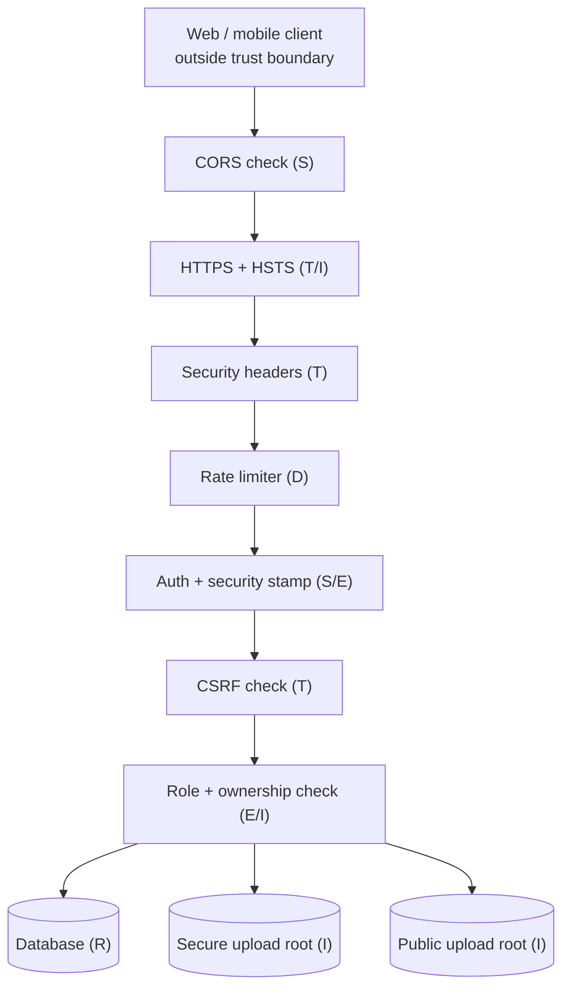
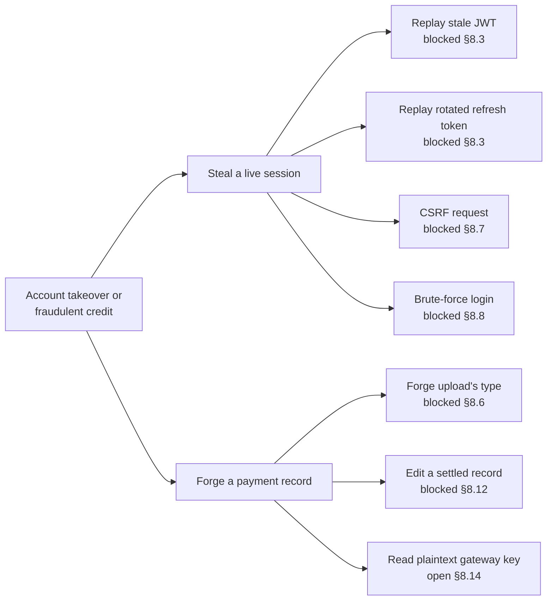
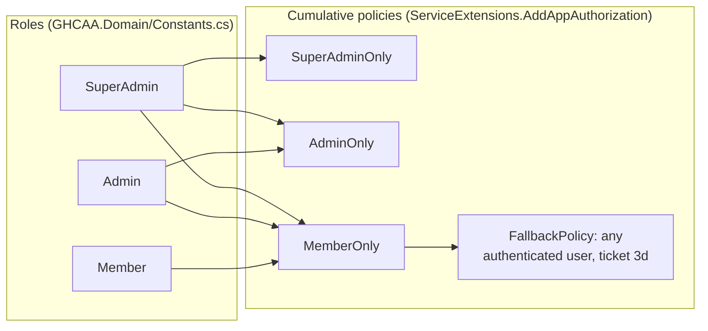
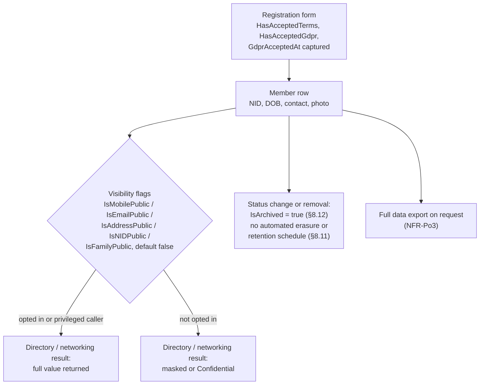
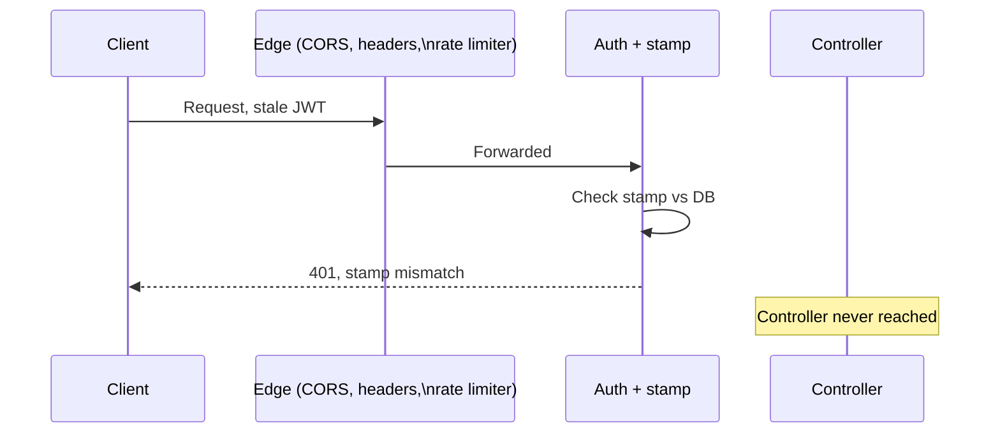
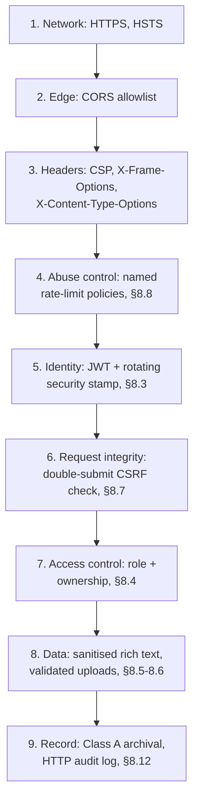

# Chapter 8 — Security, Privacy and Trust

**What this chapter owns.** The threat model, the controls that answer each threat, where each
control is enforced in the code, and the risk left over.

**What it must not repeat.** The security architecture's rationale, which is §6.7. The
implementation narrative of the security code, which is §7.10. The execution of security tests,
which is §9.10. Every control here names the threat it mitigates; a control that names no threat does
not belong in the chapter.

## 8.1 Security Objectives and Assumptions

The security work in this system answers to NFR-S1 through NFR-S8 of §3.4: ASVS level 2 conformance
with every gap recorded rather than hidden (NFR-S1), adaptive password hashing (NFR-S2), rate limiting
on authentication and API traffic (NFR-S3), uniqueness of national identity number, mobile number and
email enforced at the database (NFR-S4), session invalidation within one request of a credential or
status change (NFR-S5), no cross-member disclosure by role or ownership (NFR-S6), validated and
isolated file uploads (NFR-S7), and server-side sanitisation of member-supplied rich text (NFR-S8).
Chapter 9's security testing, §9.10, is what checks these were met; this chapter states what was
built to meet them and what was not.

Three assumptions bound the threat model and are stated here so the rest of the chapter can be read
against them rather than argued afresh in each section:

**One maintainer, one production account.** The system is operated by a single maintainer with
administrative access to the database, the file store and the deployment pipeline. There is no
separation of duties between the person who writes the code and the person who could, in principle,
alter data directly. The security posture therefore protects the system against outside attackers and
against a compromised member or officer account; it does not protect against the maintainer acting in
bad faith, which is a governance question, not a control this chapter can supply.

**The Association holds no payment-processor relationship.** No merchant account, no gateway
credential and no cardholder data touch the system in production. §8.9 gives the security reasoning
this assumption rests on.

**The platform is not the returning officer.** §2.7 sets out why the system supports governance —
publishing the constitution, maintaining the voter roll, running amendment votes and member polls —
without conducting a binding election with the evidentiary guarantees Bernhard et al. require of one
[27]. §8.10 restates the boundary this draws for security purposes specifically: what a poll result
here is trusted to mean, and what it is not.

## 8.2 Threat Modelling (STRIDE)

The model in Table 8.1 follows Shostack's STRIDE decomposition [26]: each row names a threat category,
the asset and entry point it applies to, and the control that answers it, with a pointer to where that
control lives in the code. The assets are member personal data (NID, date of birth, contact details,
photographs), financial records (dues, payment history, payment-proof images), governance records
(the constitution, amendment votes, member polls), and session credentials (access and refresh
tokens). The entry points are the public and authenticated HTTP API, the two SignalR hubs, the static
file server, and the two upload roots described in §8.6.

Figure 8.1 draws the same boundaries as a data-flow diagram: the browser and mobile clients outside
the trust boundary, the middleware pipeline as the checkpoint every request crosses before reaching a
controller, and the database and file store as the two stores an attacker who defeats the pipeline
would reach. Figure 8.5 later in this chapter shows one path through that pipeline in sequence form,
for the specific case of a request that is rejected. Figure 8.2 traces the same threats to a concrete
goal, an attacker after account takeover or a fraudulent payment credit, as an attack tree rather than
a data-flow diagram. Figure 8.6 lays the controls answering these threats out as the layers a request
must pass through in order, from the network up to the audit record.

Two entries in Table 8.1 are marked partial rather than closed. Repudiation of governance actions
carried out through `GovernanceService` — ending a committee member's term, recording a poll result —
relies on the acting admin id being recorded on the row (§8.12's Class A discipline), not on a
cryptographic signature over the action, so a compromised admin account can repudiate less
convincingly than it could forge. Denial of service against the two SignalR hubs has no rate limit of
its own; the `Api` rate-limiting policy of §8.8 covers the HTTP surface, and the hubs are reachable
only to an authenticated connection, but no per-connection message-rate cap exists at the time of
writing. Both are carried into Table 8.5, the residual risk register.

## 8.3 Authentication and Session Security

Three threats against the session model are named here; §7.10 has the mechanism and the code for each.

A JWT normally stays valid until it expires, so the threat is a token that should be dead — because
the account was disabled, the password changed, or a security response demanded it — but is not,
simply because it has not yet reached its expiry. The control is `SecurityStampMiddleware`
(§7.10), which checks a rotating stamp against the database on every request and rejects the token the
moment the two disagree, so revocation does not wait on token lifetime.

A refresh token is redeemed once and replaced, but rotation alone does not tell the legitimate holder
and a thief apart if the thief redeems a copy first. The threat is that theft going undetected while
the stolen token is still used. The control, in `TokenService.RotateRefreshTokenAsync` (§7.10, ticket
82.18), treats a revoked token being presented again as the signal that a copy was stolen and revokes
every refresh token belonging to that user, not only the one presented.

A session that authenticates a user for ordinary use is not the same guarantee that the person at the
keyboard right now is still them, and an admin session left open at a shared desk is the concrete case.
The threat is a destructive or financial action carried out on someone else's authority through a
session that was never re-confirmed. The control is `RequireStepUpAttribute` (§7.10), applied to 15
actions across six controllers, which requires a re-authentication claim no older than thirty minutes
before it lets the request through.

## 8.4 Authorisation Model and the Role–Permission Matrix

Authorisation has two independent layers, and NFR-S6 is met only where both agree: a request must
carry a permitted role, and, for anything scoped to one member's own data, the caller must own the
resource it names.

**Role layer.** `GHCAA.Domain/Constants.cs` (lines 7-9) declares three roles: `SuperAdmin`, `Admin`
and `Member`. `ServiceExtensions.AddAppAuthorization` (`GHCAA.API/Extensions/ServiceExtensions.cs`,
lines 73-91) registers three cumulative policies from them — `SuperAdminOnly` accepts only
`SuperAdmin`; `AdminOnly` accepts `SuperAdmin` or `Admin`; `MemberOnly` accepts any of the three roles
— so an officer inherits an ordinary member's access rather than the two being separate grants that
could drift apart. The same method sets a `FallbackPolicy` requiring an authenticated user for any
endpoint that names no policy of its own (ticket 3d), so a controller action added without an explicit
`[Authorize]` attribute is rejected by default rather than left open by omission. Figure 8.3 draws the
three roles against the capability groups they reach; Table 8.2 gives the same mapping as a checklist.

**Ownership layer.** A role check alone would let any `Member` read any other member's payment
history or profile fields, which NFR-S6 forbids. Endpoints that return or modify one member's data
compare the resource's owning member id against the id carried in the caller's own token as well,
independently of role, before either masking the response (§8.11) or refusing it outright.
§9.9's authorisation test suite is what exercises this against an unentitled principal; this section
states that the check exists and where the two roles it depends on are defined, not that it has been
measured — that measurement belongs to Chapter 9.

**Communication history is scoped the same way.** `EmailLog` carries a `RecipientMemberId`, added
alongside `Channel` and `DeliveryScope` in the migration
`20260921032243_AddCommunicationVisibility.cs`, so that every logged email or SMS names the member it
was sent to. `MemberCommunicationsController.GetMine` (`GHCAA.API/Controllers/MemberCommunicationsController.cs`,
lines 13-21) never takes a member id from the request: it reads the caller's own id off the
authenticated token through `CurrentMemberIdRaw()` and passes that value into
`CommunicationService.GetLogsForMemberAsync` (`GHCAA.Infrastructure/Services/CommunicationService.cs`,
lines 212-235), whose query filters `EmailLogs` on `RecipientMemberId == memberId` before it ever
reaches the database. A member therefore has no parameter to alter to reach another member's
communications, and the endpoint the mobile and web history screens call is `GET
/api/communications/me`, not a member-id route. The one place a communication log can be fetched by an
arbitrary member id is `CommunicationController.GetMemberLogs`
(`GHCAA.API/Controllers/CommunicationController.cs`, lines 42-46), which sits under the controller's
`[Authorize(Policy = Constants.Policies.AdminOnly)]` attribute and is unreachable by a plain `Member`
token. The two facts together, own-identity scoping on the member route and role gating on the admin
route, are what NFR-S9 requires and what makes a member's outbound-communication history a
member-only view rather than a membership-wide one.

**Design consequence.** Two roles rather than a finer-grained permission table is a deliberate choice
recorded as one of the anti-patterns considered and remediated in §6.12.7: a permission-per-feature
matrix was judged unnecessary complexity for an association run by one maintainer, at the cost that a
future need to grant a narrower administrative capability — treasurer access without member-approval
access, for instance — would currently require a new role rather than a new permission flag.

## 8.5 Input Validation and Output Sanitisation

NFR-S8 requires member-supplied rich text to be sanitised on the server before storage, not only
filtered on the client, because a client-side filter protects nothing against a request sent directly
to the API. Three services hold a shared, statically-constructed `HtmlSanitizer` instance and run
every rich-text field through it before the value reaches the database: `NewsService` (news article
bodies), `SiteContentService` (editable site content blocks) and `ForumService` (forum posts and
replies) — the three surfaces in the system where a member or officer supplies HTML rather than plain
text. The sanitisation calls in `NewsService` and `SiteContentService` are tagged to ticket 24.42; the
`ForumService` call is tagged "1d". A static, shared instance rather than one constructed per call was
a deliberate choice: `HtmlSanitizer`'s allowed-tag configuration is fixed once and cannot drift between
call sites.

This closes the stored-XSS threat for the three rich-text surfaces named above. It does not, by
itself, cover every field in the system: plain-text fields (names, addresses, messages) are not passed
through `HtmlSanitizer`, on the reasoning that a plain-text field rendered as plain text in Angular's
templates is not a script-injection vector the same way rich HTML is — Angular escapes interpolated
text by default. That reasoning has not been independently verified against every template in
`GHCAA.Web` for this chapter, so it is recorded as a gap in Table 8.5 rather than assumed closed.

## 8.6 File Upload Security

NFR-S7 requires an uploaded file to be validated by declared type, actual content, and size, and
stored outside the web root, served only through an endpoint that authorises the request. Two
services divide that work.

`FileValidationService` (`GHCAA.Infrastructure/Services/FileValidationService.cs`) runs four checks
before a file is accepted: the file is non-empty and under the configured size limit; its declared
`Content-Type` is on an allowlist that differs by category (images only for photographs, images plus
PDF for documents, only the OOXML spreadsheet type for spreadsheets); its filename extension is on a
matching allowlist, checked independently of the declared content type (lines 34-38 record the reason
— a genuine JPEG uploaded as `x.html` with `Content-Type: image/jpeg` would otherwise pass every
earlier check and be served back as `text/html` from the application's own origin, an HTML-injection
route); and its first bytes match the magic-byte signature for the type it claims to be (JPEG, PNG,
WEBP, PDF and the XLSX zip-container signature are each checked explicitly in `MatchesSignature`,
lines 64-84). A file that passes the content-type and extension checks but whose bytes do not match
either is rejected regardless of what its name or header claim.

`LocalFileStorageService` (`GHCAA.Infrastructure/Services/LocalFileStorageService.cs`) then decides
where the accepted file is written. `IsSecureType` (lines 66-73, ticket 29B.6) routes `Certificate`,
`PaymentProof` and `Signature` uploads to a separate secure root outside the publicly served uploads
tree, on the reasoning that a certificate, a payment receipt or a signature image is either sensitive
or forgeable and neither belongs behind an unauthenticated static-file route; every other upload type
goes to the public root. The constructor (lines 36-55, ticket 82.51) checks at startup that the secure
root does not resolve inside the web root and throws `InvalidOperationException` if it does, so a
future configuration change that would silently expose Certificate/PaymentProof/Signature files
through the static-files route fails loudly at boot rather than exposing them in production. Stored
filenames are randomised with `Guid.NewGuid():N` rather than kept from the original upload (line 115),
and files are nested by member id and upload type on disk.

`IsCompressibleImageType` (lines 79-84) recompresses only `Photo`, `GalleryPhoto` and `NewsImage`
uploads; `Certificate`, `PaymentProof` and `Signature` are never re-encoded regardless of their actual
file content, because a payment-proof image or a signature is evidence and legal record respectively,
and re-encoding it would alter the file being kept as proof.

## 8.7 Transport, Header and Browser-Policy Security

`SecurityHeadersMiddleware` (`GHCAA.API/Middleware/SecurityHeadersMiddleware.cs`, lines 1-56) sets
`X-Content-Type-Options: nosniff`, `X-Frame-Options: DENY`, a `Referrer-Policy`, and, only when the
connection is HTTPS, `Strict-Transport-Security`. It also sets a Content-Security-Policy header, with
an in-code comment recording why the policy allows script and style from `cdnjs.cloudflare.com` and
fonts from Google Fonts specifically, rather than a blanket allowance. In `Program.cs` (lines 130-177)
this middleware sits after HTTPS redirection is enforced and before the request reaches
`AuditLogMiddleware` and the rate limiter, so a request that has not yet been upgraded to HTTPS in a
non-development environment never reaches it.

Authentication cookies are set by a single shared helper, `AuthCookieExtensions.SetAuthCookie`
(`GHCAA.API/Extensions/AuthCookieExtensions.cs`, lines 12-22, ticket 82.97), introduced after
`AuthController` and `ProfileController` had each carried their own copy of the same cookie-setting
logic. Every cookie it writes is `HttpOnly`, `Secure` outside Development, and `SameSite=Strict`. The
CSRF-token cookie, `SetXsrfCookie` (lines 27-38), is deliberately not `HttpOnly` — Angular's
`HttpClient` reads it and echoes it back as the `X-XSRF-TOKEN` header — and `XsrfMiddleware`
(`GHCAA.API/Middleware/XsrfMiddleware.cs`) then checks the cookie value against that header on every
state-changing request, rejecting a mismatch. The check runs only when an `access_token` cookie is
present, so an unauthenticated request carries no double-submit obligation, and safe methods (`GET`,
`HEAD`, `OPTIONS`) are exempted from it.

CORS is configured as a single named policy, `AngularApp`, in `Program.cs` (lines 88-107): allowed
origins come from configuration, credentials are permitted, and the application throws at startup if
`AllowedOrigins` is empty outside Development — an empty allowlist in production is treated as a
misconfiguration to fail on, not a default to fall back from. A development-only branch adds
`localhost` origins so the Angular dev server can reach the API without a configuration change.

## 8.8 Rate Limiting and Abuse Prevention

`RateLimitingExtensions` (`GHCAA.API/Extensions/RateLimitingExtensions.cs`) registers five named
fixed-window policies on `System.Threading.RateLimiting`: `Auth` (per source IP, one-minute window,
10 requests in production, 500 under test), `Refresh` (per IP, one minute, 20 in production, 500 under
test), `Registration` (five minutes, 10 in production, 1000 under test), `PasswordReset` (per IP,
fifteen minutes, 5 in production, 1000 under test, ticket 80.16), and `Api` (one minute, 100 in
production, 10000 under test, with a queue of 2 requests processed oldest-first rather than an
immediate rejection at the boundary). `UseRateLimiter` sits in the middleware pipeline (`Program.cs`,
line 155) after `AuditLogMiddleware` and before authentication, so a request that is rejected for rate
is rejected before the authentication and authorisation checks run. A comment dated 29 August 2026
in the same file records a prior audit finding: the relaxed test-environment limits must depend only
on `Development`, never on the `ASP_SEED_PROFILE` variable alone, after a review found that condition
could be satisfied unintentionally outside a development environment.

One figure does not match across the two sources. NFR-S3 in §3.4 states that authentication attempts
"shall be limited to 5 per minute per source." The `Auth` policy actually enforces a `PermitLimit` of
10 per minute in production. The requirement and the implementation disagree, and this chapter records
the disagreement rather than repeating the requirement's figure as fact: whichever number is correct,
one of the two documents needs to change, and that correction is entered as an open item in Table 8.5
rather than silently resolved here.

## 8.9 Payment-Related Risk and the No-Gateway-Keys Posture

The system's payment model is manual by design: a member uploads proof of payment, and an officer
verifies it against the Association's own bank or mobile-money record before the payment is recorded
as received. This is the primary and only configured path in production. A gateway abstraction exists
in code — `GHCAA.Domain/Enums.cs` declares a `PaymentGateway` enum including `Stripe`, `PayPal`,
`SSLCommerz`, `BkashGateway`, `NagadGateway`, `RocketGateway`, `BankTransferGateway` and `DGePay`
alongside `Manual`, and `GHCAA.Infrastructure/Gateways/` contains real, non-stub adapter classes
(`BkashGateway`, `NagadGateway`, `SSLCommerzGateway`, `DGePayGateway`, built on a shared
`BasePaymentGateway`, with `docs/PAYMENT_GATEWAY_WORKFLOW.md` documenting how a new one is wired in) —
but none of these adapters is configured with live credentials, and none is reachable from the
production system as it stands.

The security reasoning, recorded here per ADR-04 of §6.13, is that a gateway credential is itself an
asset worth protecting, and the Association currently has none to protect: it holds no merchant
account and cannot yet supply the banking relationship a gateway requires. Configuring a gateway
without one would mean routing collections through an individual's personal account instead, which is
the arrangement the manual, officer-verified path exists to end. The manual path therefore holds no
gateway secret at all, at the accepted cost — quantified in §12.6 — of a permanent administrative
workload of some minutes per payment for officer verification, rather than the workload disappearing
into an unverified automated credit.

The residual risk is not in the manual path itself but in the schema that waits for the gateway path
to be switched on. `docs/ARCHITECTURE_AUDIT_2026-09.md`, Finding 9, records that `PaymentConfiguration`
carries `GatewayPublicKey` and `GatewaySecretKey` as plain `[MaxLength(500)]` string columns with no
column-level encryption or protection marker. The finding's own disposition lowers its severity today
— the columns are empty because no live gateway is configured — but states plainly that the schema
invites a secret to be stored in plaintext the moment the Association does obtain gateway credentials.
That item is carried into Table 8.5 rather than treated as closed, because the schema, not the current
data, is what a future integration would inherit unless it is changed first.

## 8.10 Governance Integrity

§2.7 sets the boundary this section enforces in the code: the platform supports governance and now
contains a persisted election workflow, but it does not claim that the software alone makes an
institutional election legally binding. It maintains the authoritative voter roll, publishes the
constitution and its amendment history, and runs constitutional amendment voting and non-binding
member polls. Work Package 37.1 also stores election phases, seats, officers, nominations, secret
ballots, counts and declarations. Legal form wording and institutional adoption remain under the
Election Commission's election documents.

The code matches that stated scope rather than exceeding it. `PollVote`
(`GHCAA.Domain/Models/PollVote.cs`) records a member id, a poll option id and a timestamp against each
vote — the vote is attributable to the member who cast it, not anonymous, which is appropriate for an
internal poll of sentiment but would not by itself meet the secrecy a binding ballot requires. Neither
`Poll` nor `PollVote` carries a cryptographic commitment, a hash chain, or any other tamper-evidence
mechanism over the vote record: a poll result rests on the same protection as any other Class A row
(§8.12) — an authorised, audited administrative account rather than a mathematically verifiable
count. Under the single-maintainer, single-database-account assumption of §8.1, that is a real
limitation, and it is the reason §2.7 gives for keeping these features as sentiment and internal
decision-making tools rather than presenting them as a secure-election system. The election engine adds phase checks, frozen-roll eligibility, conditional one-vote updates and
serializable transaction handling. It still has no cryptographic receipt, independent tally
verification, or proof that would make the software a secure-election system on its own.

Communication history follows the same minimisation rule. Member history is filtered from the
authenticated member claim, while administrators use the protected per-member route. The log stores
the intended recipient member, channel, scope and outcome so delivery can be audited. Successful
rows do not return failure details. Direct OTP SMS remains a separate provider path and is not yet
included in member communication history.

## 8.11 Personal Data: Lawful Basis, Minimisation, Consent, Retention and Subject Rights

§3.11 records that Bangladesh's data protection statute was in draft at the time of writing, so the
system does not claim compliance with a specific law; instead it applies purpose limitation,
minimisation, default non-disclosure and stated retention as design obligations, and this section
records what that means concretely rather than leaving the claim abstract. Table 8.4 inventories the
personal-data elements held, their purpose and their retention; Figure 8.4 traces the same elements
from capture at registration through to the retention and disclosure points named below.

**Minimisation and default non-disclosure.** `Member` (`GHCAA.Domain/Models/Member.cs`, lines 41-45)
carries five independent visibility flags — `IsMobilePublic`, `IsEmailPublic`, `IsAddressPublic`,
`IsNIDPublic` and `IsFamilyPublic` — each defaulting to `false`. `MemberService_Search.cs` (lines
179-192) and `NetworkingService.cs` (lines 161-162, 203-204, 224-254, 300-303) apply these flags at
the point a directory or networking result is built: a field is returned in full only if the owning
member opted in or the caller holds a privileged role, and is otherwise returned masked
(`MaskPii`, partially redacting the value) or replaced outright with the literal string
`"Confidential"`, depending on the endpoint. `NetworkingService.cs` (line 52) carries a comment
recording a specific enumeration risk that was checked for and avoided: a directory search that
behaved differently for a public versus a masked field regardless of `IsEmailPublic` would let an
unprivileged caller infer a member's contact details existed even when they were not disclosed, so the
search predicate itself, not only the returned value, respects the visibility flag.

**Consent.** `Member` also carries `HasAcceptedTerms`, `HasAcceptedGdpr` and `GdprAcceptedAt`. The
public registration form (`GHCAA.Web/src/app/public/register/register.html`, lines 396-413) presents
these as two required checkboxes before submission: acceptance of the Association's registration
terms, and an explicit statement of consent to processing personal information under the
"Data Privacy & GDPR" heading the form uses — a label chosen for the form's own wording rather than a
claim that GDPR itself applies to the Association. Both are recorded with a timestamp rather than only
a boolean, so a consent event has a date attached to it.

**Retention and subject rights.** No automated retention or erasure schedule exists in the codebase at
the time of writing: a member's personal data persists for as long as the `Member` row exists, subject
only to the archival (not deletion) discipline §8.12 describes for Class A entities. NFR-Po3 gives
members a right to a full export of the Association's data on demand, but no corresponding right to
erasure is implemented — deleting a Class A row is, by the same §8.12 discipline, deliberately not
offered through the interface at all, which protects financial and governance integrity at the direct
cost of a subject-erasure capability. This is recorded here as an open gap rather than an omission: a
retention policy and an erasure path for personal data that is not evidentiary (a rejected applicant's
record, for instance, which currently uses the same `IsArchived` mechanism as a settled financial
record) is entered in Table 8.5.

## 8.12 Audit Logging and Non-Repudiation

Two separate mechanisms answer this, not one. `AuditLogMiddleware` (`GHCAA.API/Middleware/AuditLogMiddleware.cs`,
lines 20-56) is a generic HTTP-level log: it records any non-GET request, and any request under
`/api/admin`, as an activity row through `IActivityService.LogActivityAsync` once the response
succeeds and the caller's user id can be read from the token. It does not know or care what kind of
data a request touched — that distinction is made separately, per entity.

`docs/ARCHITECTURE.md` (lines 118-149) sets that distinction as Class A and Class B. An entity is
Class A "if a row of it is evidence: money received or spent, a governance decision, a membership
status, or anything a member could later dispute" — currently `FinancialRecord`, `PaymentHistory`,
`MembershipDue`, `MembershipHistory`, `Member`, `User`, `ECMember`, `Constitution` and `Poll`. A Class
A row is never hard-deleted: it carries `HasQueryFilter(x => !x.IsArchived)` so an ordinary read
already excludes it once archived, a caller that genuinely needs the archived rows back asks for them
explicitly with `IgnoreQueryFilters()`, and a service method that archives a Class A row takes the
acting admin's id as a required argument — the controller returns `Unauthorized()` rather than record
the act as done by nobody when it cannot identify the caller. Everything else is Class B: content and
configuration that can be recreated if lost, which carries only a creation timestamp and can be hard-deleted
without the same argument for keeping it. The `IsArchived` name was chosen deliberately: three
Class A entities (`FinancialRecord`, `PaymentHistory`, `ECMember`) had used `IsDeleted` for the same
soft-delete behaviour before the naming was unified under ticket 82.30.

Non-repudiation for a Class A row therefore rests on the row itself — who archived it and when, kept
rather than erased — and audit logging rests on `AuditLogMiddleware`'s separate, undifferentiated
request log. Neither is aware of the other, and no test exercises `AuditLogMiddleware` directly; its
coverage today is incidental, through the controller tests that call the endpoints it wraps.

## 8.13 Conformance Assessment against OWASP ASVS

NFR-S1 commits the system to OWASP ASVS level 2 for the control families that apply to it [7], with
every non-conformance recorded rather than omitted. The edition cited throughout this dissertation is
ASVS 4.0.3, the version current when the work reported here was carried out; ASVS was revised to
5.0.0 in May 2025, after that point, and §2.8 states why a conformance claim is not carried across a
revision it was not assessed against. No formal, independently-audited ASVS assessment has been
performed on this codebase — what follows is a self-assessment mapping the controls found elsewhere in
this chapter against ASVS 4.0.3's chapter structure, level 2, recorded honestly as a mapping rather
than a certification. Table 8.3 gives the full mapping; the pattern is summarised here.

Authentication (V2) and session management (V3) are substantially met: adaptive password hashing with
a documented username-enumeration countermeasure (§7.10, the dummy-verify timing equalisation at
`AuthService.cs`, lines 88-89), rate-limited authentication endpoints (§8.8), and immediate session
invalidation on a credential or status change (§8.3) are all present. Access control (V4) is met at
the role level and, for owned resources, at the ownership level (§8.4), though not through a
fine-grained permission model. Validation, sanitisation and encoding (V5) is met for the three
rich-text surfaces identified in §8.5 and is an open question for plain-text fields, which is recorded
rather than assumed. File and resource handling (V12) is met by the validation and storage-separation
controls of §8.6. Communications security (V9) is met through the transport and header controls of
§8.7. API and web-service security (V13) is met through the rate-limiting policies of §8.8. Malicious
code (V10) and business-logic (V11) verification have not been separately assessed for this
dissertation and are recorded as not conformed rather than assumed conformed.

## 8.14 Residual Risks and Recommendations

Table 8.5 lists what remains open. The largest items, in descending order of how directly they touch
an asset named in Table 8.1:

**Gateway-credential schema.** `PaymentConfiguration.GatewayPublicKey` and `GatewaySecretKey` are
plain string columns with no encryption at rest (`docs/ARCHITECTURE_AUDIT_2026-09.md`, Finding 9).
Empty today because no gateway is configured (§8.9), but the schema itself is the risk, and it should
be closed before, not after, a gateway is switched on.

**No retention or erasure path for non-evidentiary personal data.** §8.11 records that a member's
personal data has no automated retention schedule and no subject-erasure right distinct from the
archival mechanism built for financial integrity. A rejected applicant's record is retained under the
same discipline as a settled financial transaction, which was not the discipline's original purpose.

**Governance records carry no tamper-evidence beyond the audit discipline of §8.12.** §8.10 records
that a poll or amendment vote result rests on an authorised administrative account, not on a
cryptographic guarantee, which is why these features are scoped as internal governance tools rather
than a secure-election system.

**Supply-chain hardening is incomplete.** `docs/ARCHITECTURE_AUDIT_2026-09.md` records that only one
of five CI workflows pins its third-party actions by commit hash rather than by mutable tag (Finding
14, item 48.19), and that no automated dependency or container vulnerability scan runs in CI at all
(Finding 16, item 82.26). Neither is a control this chapter has described as present, and both remain
open.

**The rate-limit figure mismatch of §8.8** between NFR-S3's five-per-minute figure and the `Auth`
policy's actual ten-per-minute limit is an open documentation-versus-implementation disagreement, not
yet resolved in either direction.

**Denial of service against the SignalR hubs** and **repudiation of governance actions by a
compromised admin account**, both named in §8.2's Table 8.1 as partial rather than closed, remain
open for the reasons given there.

None of these six items is disqualifying on its own; together they describe a system whose
authentication, session and transport controls are comparatively mature and whose data-retention and
supply-chain controls are the areas where the next security effort should go.

## 8.15 Summary

The controls in this chapter answer specific threats named against specific assets, not a generic
security posture: session revocation and refresh-token reuse detection against a stale or stolen
token (§8.3), role-and-ownership authorisation against cross-member disclosure (§8.4), server-side
sanitisation against stored XSS in the three rich-text surfaces that carry it (§8.5), validated and
separated file storage against a disguised or forged upload (§8.6), transport and header policy
against network-level and browser-level attacks (§8.7), and rate limiting against credential-stuffing
and abuse (§8.8). The payment model avoids holding a gateway credential at all by keeping manual
verification primary (§8.9), and the governance features are scoped deliberately short of a binding
election under a threat model that could not prove one honest (§8.10). Personal data is minimised and
masked by default, with explicit, timestamped consent capture (§8.11), and Class A records are
archived rather than erased so that a dispute always has a row to point to (§8.12). Measured against
ASVS 4.0.3 level 2, the system is strong on authentication, session and transport, and has recorded
rather than closed gaps in a fine-grained permission model, plain-text field sanitisation, malicious-code
and business-logic verification, and — outside the ASVS mapping itself — retention, supply-chain
hardening and the gateway-credential schema (§8.13, §8.14). Chapter 9 measures the controls this
chapter describes; Chapter 12 revisits, in §12.8, whether the governance boundary was drawn in the
right place.

---

## Figures and Tables

### Figure 8.1 — Threat model data-flow diagram with trust boundaries, STRIDE-annotated

### Figure 8.2 — Attack tree: member account takeover or fraudulent payment credit

### Figure 8.3 — Role–permission matrix diagram

### Figure 8.4 — Personal-data classification and flow diagram, with retention points

### Figure 8.5 — Sequence diagram: an unauthorised request rejected through the middleware chain

### Figure 8.6 — Defence-in-depth layer diagram

### Table 8.1 — STRIDE threat enumeration with mitigations and their implementation location

| STRIDE category | Threat | Asset / entry point | Mitigation | Implementation location |
|---|---|---|---|---|
| Spoofing | Stale or forged session token accepted | Session / API | Rotating security stamp checked every request | `SecurityStampMiddleware`, §8.3 |
| Spoofing | Credential stuffing against login | Authentication endpoint | Per-IP rate limit | `Auth` policy, §8.8 |
| Tampering | Cross-site request forgery on a state-changing request | Authenticated API | Double-submit cookie check | `XsrfMiddleware`, §8.7 |
| Tampering | Uploaded file's real content does not match its declared type | File upload endpoints | Extension + content-type + magic-byte check | `FileValidationService`, §8.6 |
| Tampering | Stored XSS via rich-text fields | News, site content, forum posts | Server-side HTML sanitisation | Shared `HtmlSanitizer`, §8.5 |
| Repudiation | Financial or membership record altered or deleted with no trace | Financial, membership, governance data | Archive-only deletion, admin id required | Class A discipline, §8.12 |
| Repudiation | Governance action repudiated by a compromised admin account | Poll, Constitution, ECMember | Acting-admin id recorded on the row | §8.12; **partial** — no cryptographic signature, §8.2 |
| Information disclosure | Member reads another member's contact or financial data | Directory, networking, financial endpoints | Ownership check independent of role; default-masked visibility flags | §8.4, §8.11 |
| Information disclosure | Certificate/payment-proof/signature files served through the public static-file route | Secure file store | Separate secure root, fail-loud startup guard | `LocalFileStorageService`, §8.6 |
| Denial of service | Stolen refresh token used repeatedly after theft | Refresh-token endpoint | Reuse detection revokes the token family | `TokenService.RotateRefreshTokenAsync`, §8.3 |
| Denial of service | Excess connections or messages against the SignalR hubs | Real-time hubs | Authenticated connection required | **Partial** — no per-connection rate cap, §8.2 |
| Elevation of privilege | Member-level account performs an admin-only action | Admin-scoped endpoints | Cumulative role policies, secure-by-default fallback policy | `ServiceExtensions.AddAppAuthorization`, §8.4 |

### Table 8.2 — Role × capability matrix

| Capability | SuperAdmin | Admin | Member |
|---|---|---|---|
| Sign in, manage own profile, view masked directory | Yes | Yes | Yes |
| View unmasked directory fields (subject to owning member's opt-in) | Yes | Yes | No |
| Approve membership applications, record dues and payments | Yes | Yes | No |
| Archive a Class A record (financial, membership, governance) | Yes | Yes | No |
| Create or resolve constitutional amendments, EC membership, member polls | Yes | Yes | No |
| Manage other admin accounts | Yes | No | No |
| Any endpoint carrying no explicit policy | Rejected by `FallbackPolicy` unless authenticated as any role above | | |

### Table 8.3 — OWASP ASVS conformance checklist (self-assessment, ASVS 4.0.3, level 2)

| ASVS chapter | Verdict | Evidence |
|---|---|---|
| V2 Authentication | Met | Adaptive hashing, rate-limited endpoints, timing-equalised verification (§7.10, §8.8) |
| V3 Session management | Met | Rotating security stamp, refresh-token reuse detection (§8.3) |
| V4 Access control | Met, coarse-grained | Role policies plus ownership checks; no fine-grained permission model (§8.4) |
| V5 Validation, sanitisation, encoding | Partial | Rich-text fields sanitised; plain-text field handling not independently assessed (§8.5) |
| V7 Error handling and logging | Not assessed | Outside this chapter's evidence base |
| V8 Data protection | Partial | Class A archival protects records from erasure; no encryption at rest for gateway-credential columns (§8.9, §8.12) |
| V9 Communications | Met | HTTPS enforced outside development, HSTS, security headers (§8.7) |
| V10 Malicious code | Not assessed | No dependency or container scanning in CI (`docs/ARCHITECTURE_AUDIT_2026-09.md`, Finding 16) |
| V11 Business logic | Not assessed | Outside this chapter's evidence base |
| V12 Files and resources | Met | Type, extension and content validation; secure/public root separation (§8.6) |
| V13 API and web service | Met | Named rate-limit policies on every endpoint class (§8.8) |
| V14 Configuration | Partial | CORS misconfiguration fails startup; supply-chain action pinning incomplete (§8.7, §8.14) |

### Table 8.4 — Personal-data inventory: element, purpose, lawful basis, retention

| Data element | Purpose | Lawful basis (design principle, §8.11) | Retention |
|---|---|---|---|
| National identity number (NID) | Uniqueness and identity verification (NFR-S4) | Necessary for membership eligibility | Held for the life of the `Member` row; no automated erasure |
| Date of birth, gender, blood group | Membership record, emergency use | Necessary for membership eligibility | Held for the life of the `Member` row |
| Mobile number, email | Contact, sign-in, directory | Consent for directory disclosure (`IsMobilePublic`/`IsEmailPublic`); necessary for account otherwise | Held for the life of the `Member` row |
| Present/permanent address | Directory, correspondence | Consent for disclosure (`IsAddressPublic`); necessary otherwise | Held for the life of the `Member` row |
| Photograph, signature | ID card, certificate, verification | Necessary for the credential it appears on | Held for the life of the `Member` row |
| Payment-proof image | Evidence of a payment claim | Necessary for financial verification (§8.6) | Archived, never hard-deleted (§8.12) |
| Terms/GDPR consent flags and timestamp | Record of consent given | Consent, recorded at capture | Held for the life of the `Member` row |

### Table 8.5 — Residual risk register

| ID | Risk | Evidence | Status |
|---|---|---|---|
| RR-1 | `PaymentConfiguration` gateway-credential columns are plaintext with no encryption at rest | `docs/ARCHITECTURE_AUDIT_2026-09.md`, Finding 9 | Open |
| RR-2 | No automated retention schedule or subject-erasure path for non-evidentiary personal data | §8.11 | Open |
| RR-3 | Governance records (`Poll`, `Constitution`, `ECMember`) carry no cryptographic tamper-evidence beyond admin-id attribution | §8.10, §8.12 | Open, scoped deliberately per §2.7 |
| RR-4 | Four of five CI workflows reference third-party actions by mutable tag, not commit hash | `docs/ARCHITECTURE_AUDIT_2026-09.md`, Finding 14 | Open |
| RR-5 | No automated dependency or container vulnerability scan runs in CI | `docs/ARCHITECTURE_AUDIT_2026-09.md`, Finding 16 | Open |
| RR-6 | NFR-S3 (5 requests/minute) and the `Auth` rate-limit policy (10 requests/minute in production) disagree | §3.4, §8.8 | Open |
| RR-7 | No per-connection rate limit on the two SignalR hubs | §8.2 | Open |
| RR-8 | Plain-text fields outside the three rich-text surfaces have not been independently assessed for injection risk | §8.5 | Open |
